# Establish Connection with Open Connectors Instance
<!-- description --> Connect your open connectors instance.

## Prerequisites
  - You need a Slack account. If you don't have, you can create it using this [link](https://slack.com/get-started#/create).
  - You have logged in to both your **Open Connectors** and **Slack** accounts.
  - You have logged into your Slack workspace using the same browser window where you are logged into Open Connectors.

## You will learn
  - How to establish a connection between Slack using Open connectors

---

### Set up Slack in Open Connectors application

1. Select the **Connectors** tab in your Open Connectors application.

    <!-- border -->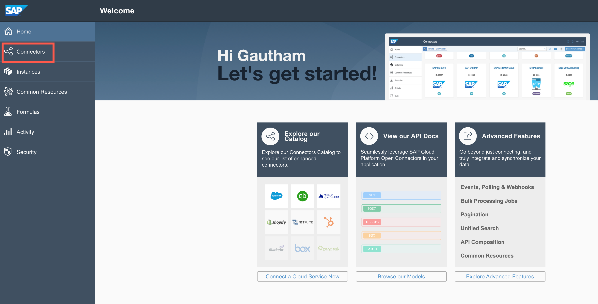

2. Use the search bar to find the **Slack** connector.

    <!-- border -->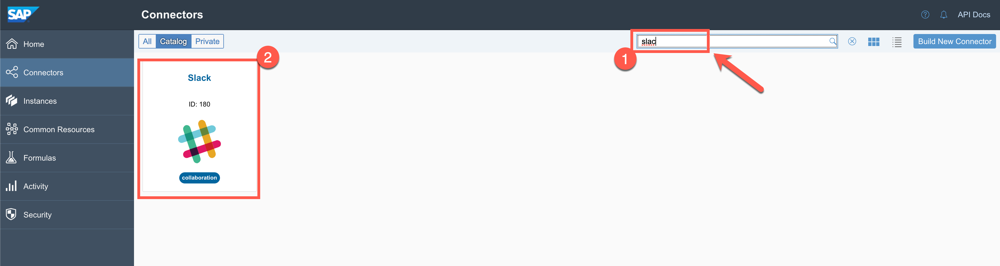

3. Mouse-over the **Slack** connector and click on **Authenticate**.

    <!-- border -->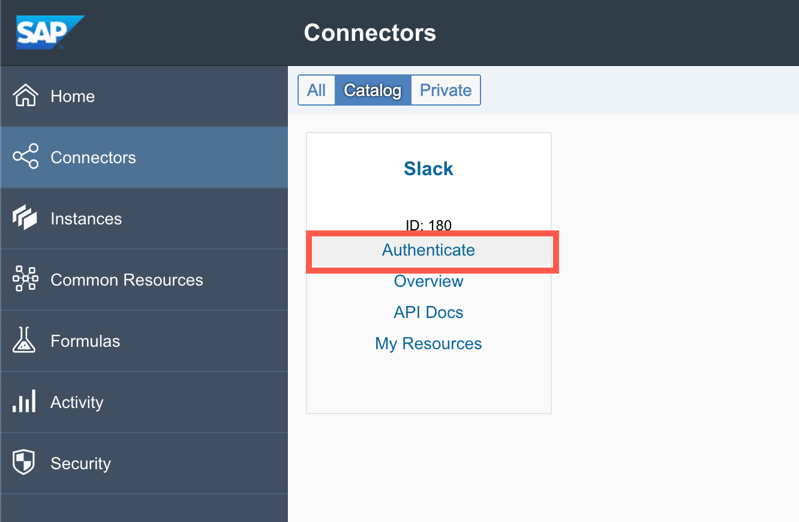

4. Enter a name for your **Slack** connector instance and click **Create Instance**.

    <!-- border -->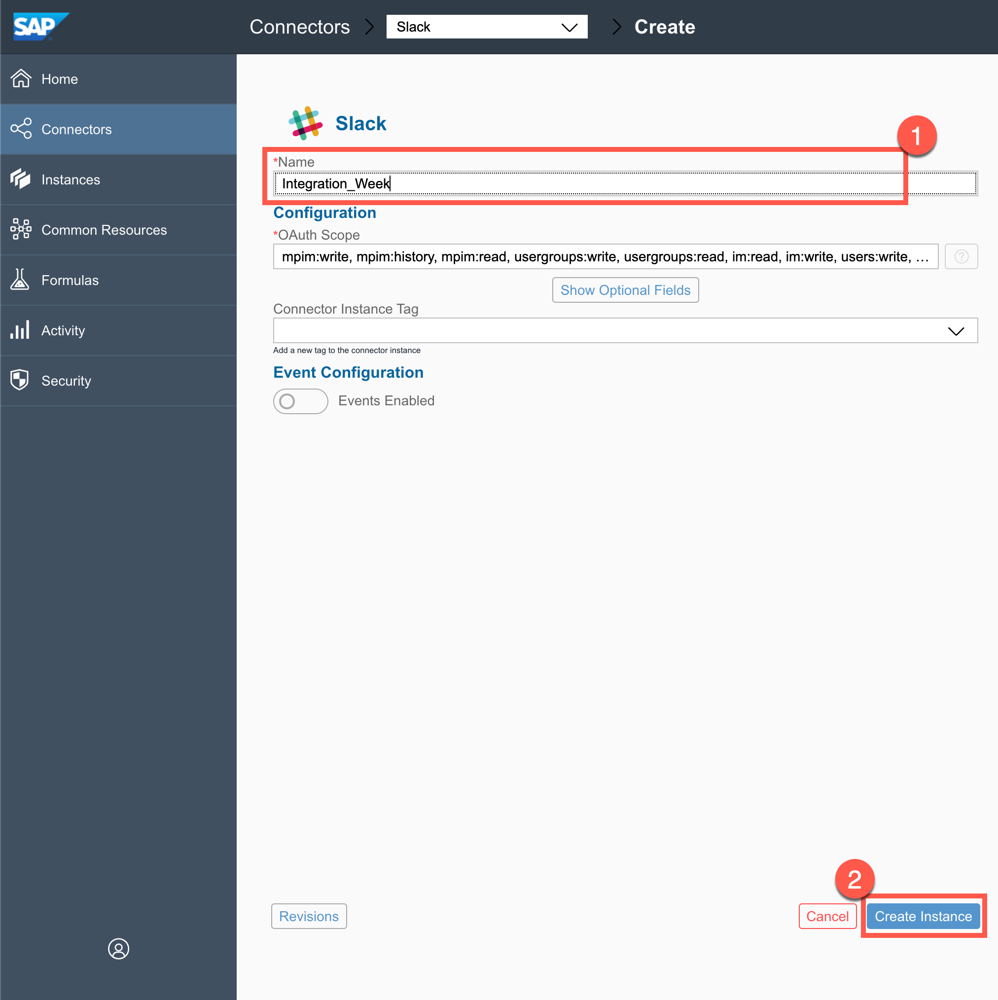

5. You will be redirected to a new browser tab where your **Open Connectors** Slack instance will request permission to access your **Slack** workspace. Click on **Allow**.

    <!-- border -->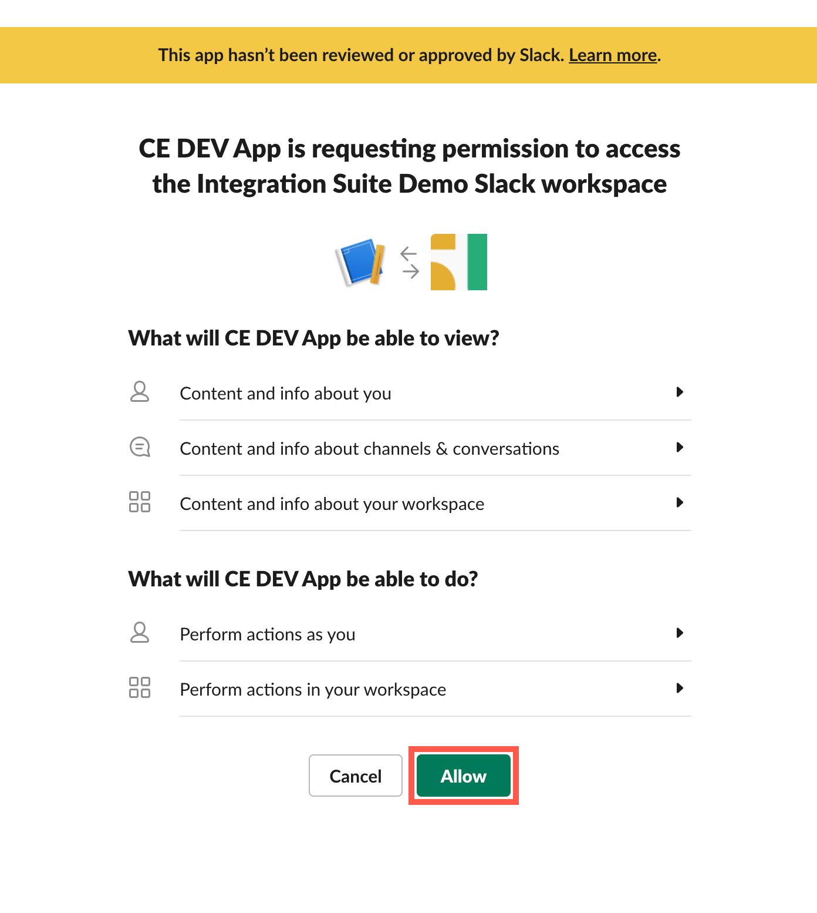

6. The browser tab will automatically close and you will be redirected to your **Open Connectors** application where you will see a success message that the connector instance has been authenticated.

    Click the **Test in the API docs** link to do a quick ping test to verify the connectivity.

    <!-- border -->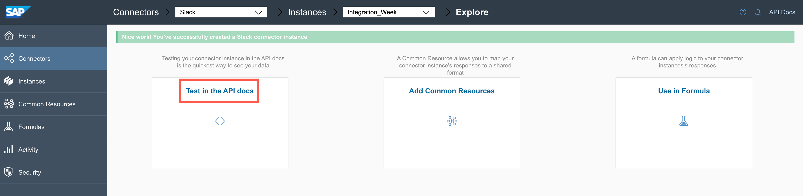

7. In the API docs, scroll down to find the **`ping`** API.

    <!-- border -->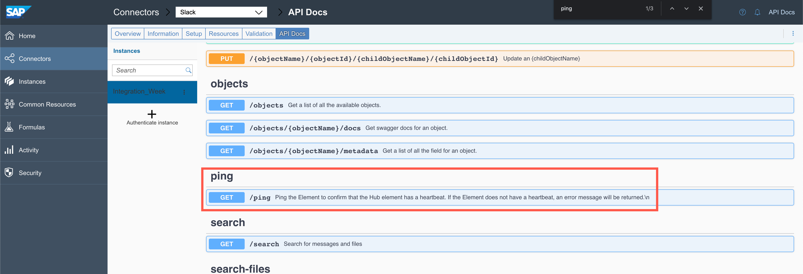

8. Click the **`ping`** API and then click **Try it out**.

    <!-- border -->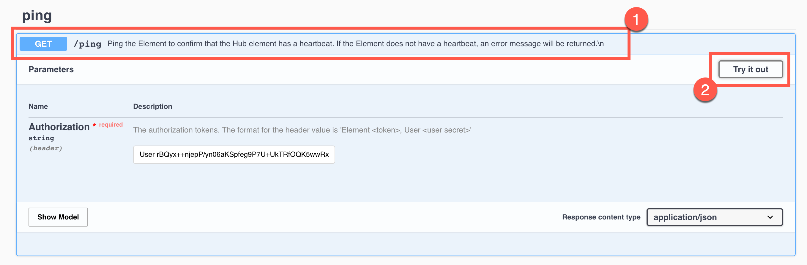

9. Click **Execute**.

    <!-- border -->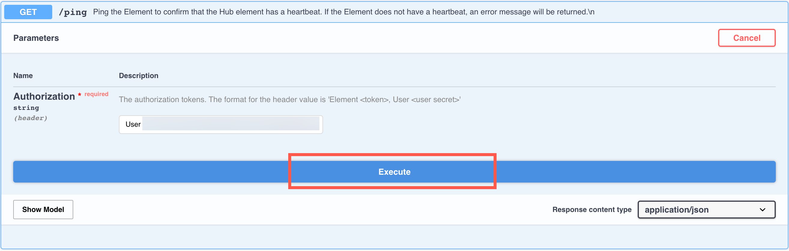

    You should see response code 200. This indicates a successful response from your Slack account. Copy the **User, Organization**, and **Element** from the Curl. These parameters have to be deployed in your Cloud Integration tenant as credentials.

    <!-- border -->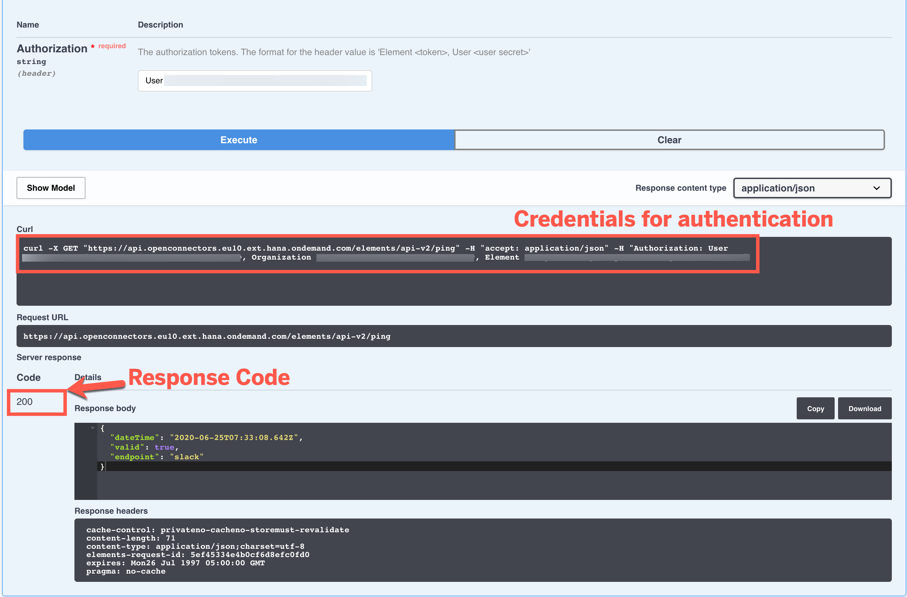

### Deploy user credentials to Cloud Integration tenant

1. Log in to your **Cloud Integration** tenant and access the **Operations View**.

    <!-- border -->

2. Scroll down to find **Security Material** under **Manage Security**.

    <!-- border -->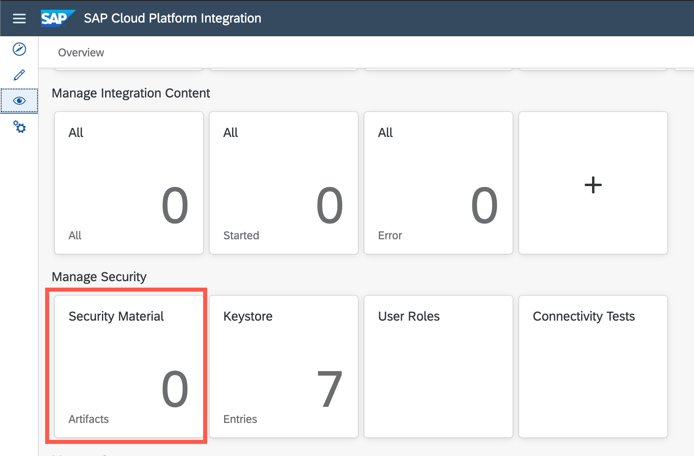

3. Select **Add** > **User Credentials**.

    <!-- border -->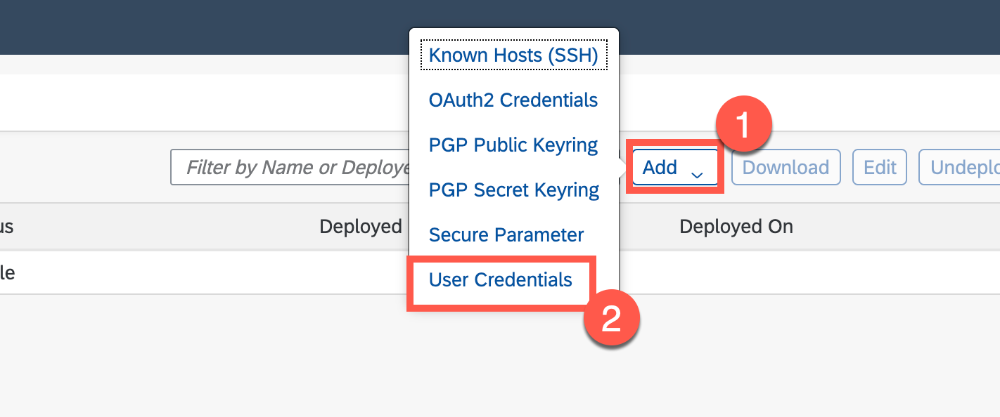

4. In the **Type** dropdown, select **Open Connectors**.

    <!-- border -->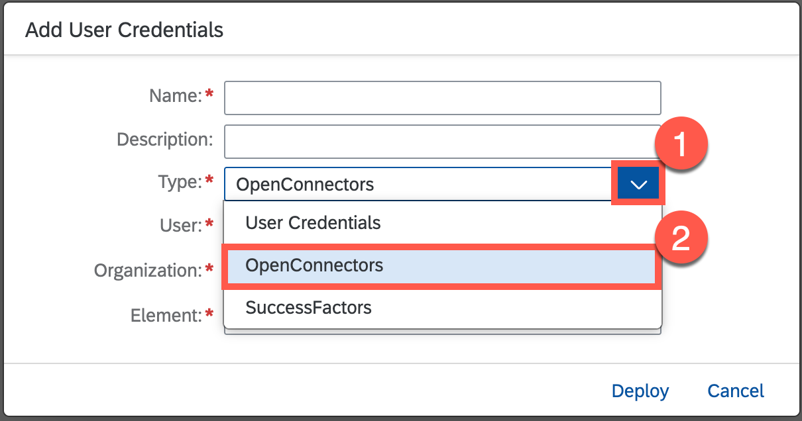

5. Enter a name and description that indicates this is your Slack Open Connectors credentials. Enter the **User, Organization**, and **Element** that you copied in **step 1.10**.  

    <!-- border -->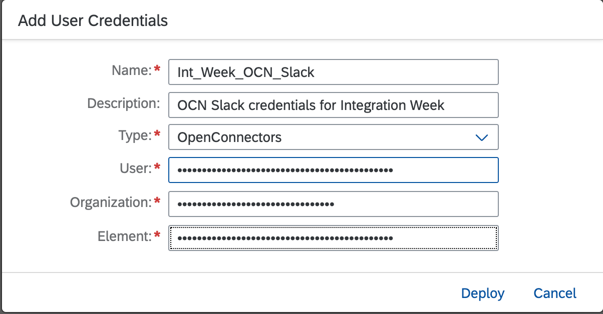

    > Do not include the comma (,) or equals (=) symbols in the Curl.

6. Click on **Deploy**.

  You are now ready to use the Slack connector instance in Open Connectors in your Cloud Integration tenant.

  <!-- border -->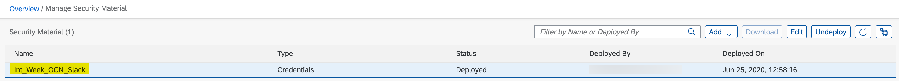

---
