# Establish Connectivity Between Cloud Integration and Gmail.
<!-- description --> Configure your Cloud Integration tenant to be able to connect to your Gmail account and your Slack account through Open Connectors.

## Prerequisites
 - You have created a Gmail account.
 - Disable 2-step verification on your Gmail account by visiting this [link](http://www.google.com/accounts/DisplayUnlockCaptcha). If required, sign-in with your Gmail username and password and follow the instructions.
 - After logging in to your Gmail account, allow it to **Allow access to less secure apps**. For the detailed steps, see [Support link](https://support.google.com/accounts/answer/6010255?hl=en).
    <!-- border -->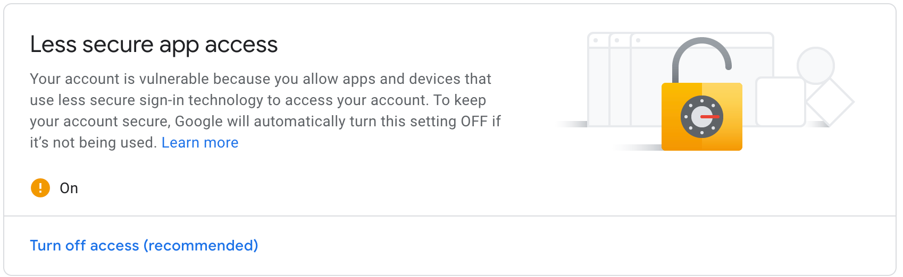

## Intro
>**IMPORTANT**: Because a personal Gmail account has some specific security features, this workaround will enable "technical" access to your Gmail account.

>If you are using your personal Gmail account and have not created a new one specifically for this tutorial, it is recommended that you turn-off access to less secure apps after completing this tutorial.

## You will learn
  - How to manage user credentials in Integration Suite
  - How to add Gmail server certificate and perform connectivity test

---

### Deploy Gmail credentials on Cloud Integration tenant

1. Log in to your **Cloud Integration** tenant and access **Operations View**.

    <!-- border -->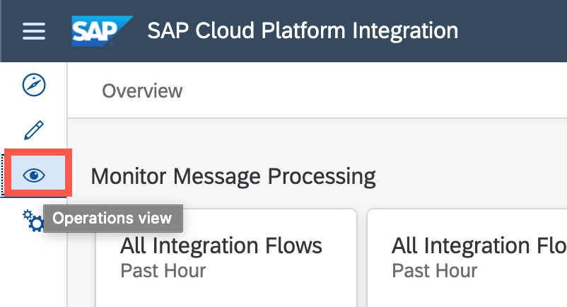

2. Select **Add** > **User Credentials**.

    <!-- border -->

3. Enter a name and description that indicates that this is the credentials for your Gmail account.

    Enter your email ID in the **User** field and enter the **password** in the relevant fields.

    <!-- border -->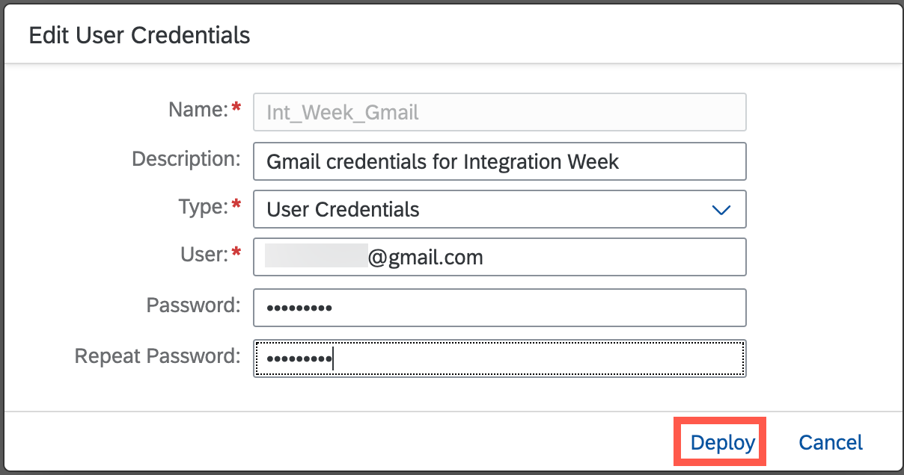

4. Click **Deploy**.

    <!-- border -->

    You are now ready to use the Slack connector instance in Open Connectors in your Cloud Integration tenant.

    <!-- border -->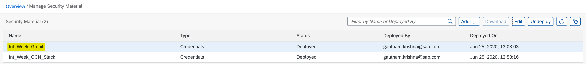

5. Scroll down to **Connectivity Tests** under **Manage Security** and select it.

    <!-- border -->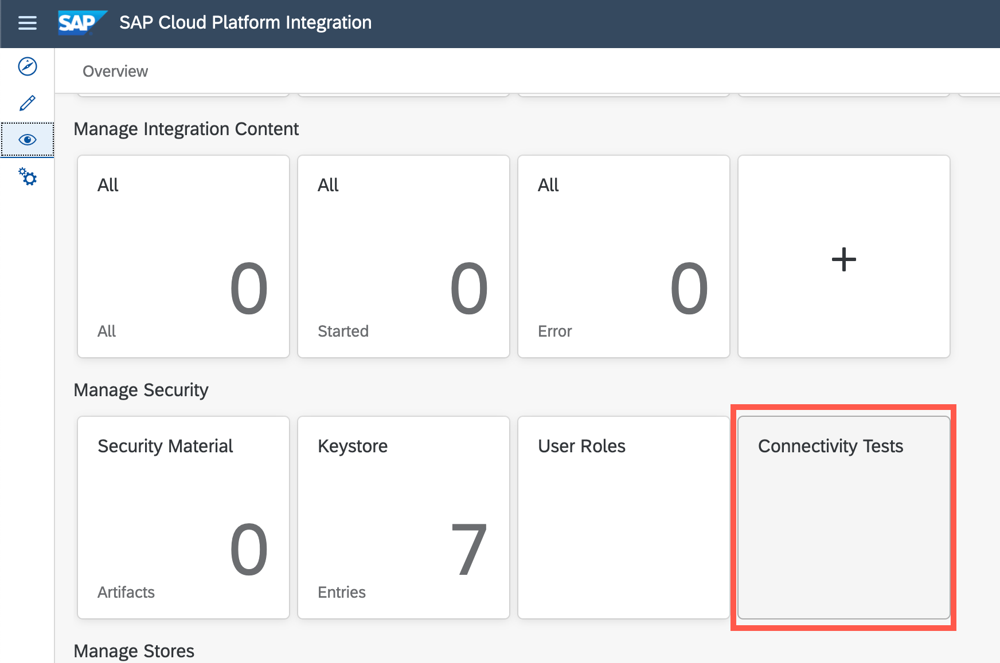

### Add Gmail server certificate to Cloud Integration tenant

1. Select the **SMTP** tab. and enter the following

    |  Field Name     | Value
    |  :------------- | :-------------
    |  **Host**           | **`smtp.gmail.com`**
    |  **Protection**           | **`STARTTLS Mandatory`**
    |  **Authentication**    | **Plain User/Password**
    |  **Credential Name**          | The Gmail credentials that you added in **Step 1.3**
    |  **Valid Server Certificate Required**   | Uncheck

    Click **Send**.

    <!-- border -->

2. You will see a success message if there are no issues in your credentials.

    Click the download icon (indicated in red) to download the server certificate chain.

    <!-- border -->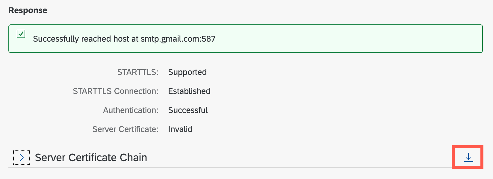

    >This downloads the Gmail server certificate on your local file system. You now have to upload it to your Cloud Integration tenant.

    >Navigate to the folder where the certificates are downloaded and extract them from the ZIP folder.

3. Click **Operations View > Keystore**.

    <!-- border -->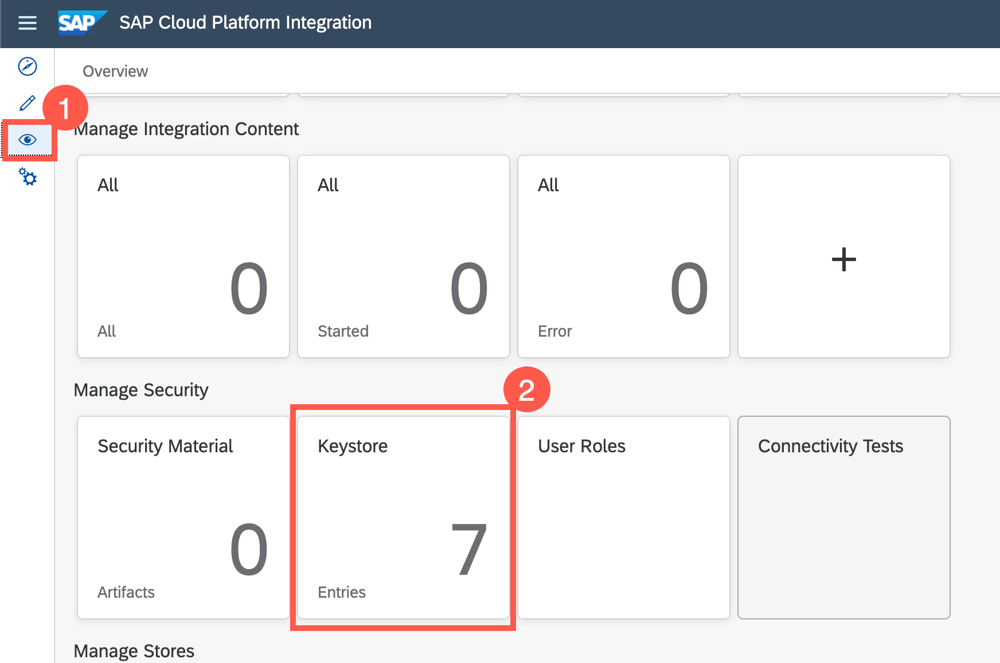

4. Select **Add** > **Certificate**.

    <!-- border -->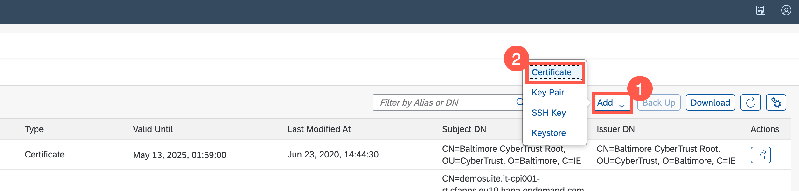

5. Enter an **Alias** for the certificate that indicates it is a Gmail server certificate and choose **Browse**.

    <!-- border -->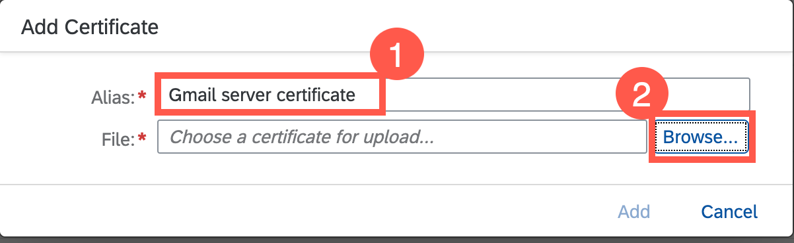

6. Navigate to the local folder where the certificate in **Step 2.2** was downloaded. If you did not change the name during download, the folder will have the name certificates.

    Select **`smtp.gmail.com.cer`** and choose **Open**.

    <!-- border -->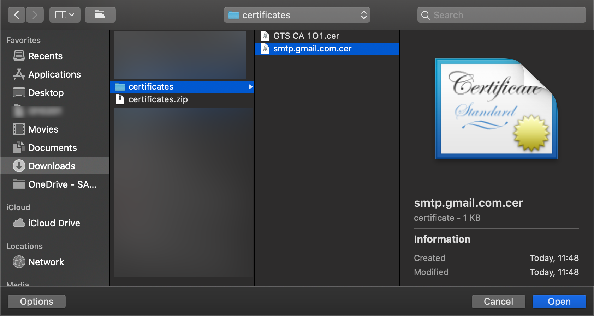

7. Choose **Confirm** to add the certificates to the **keystore**.

    <!-- border -->

8. Repeat steps 4 to 7 to add the other certificate **`GTS CA 101.cer`** to the keystore as well.

    <!-- border -->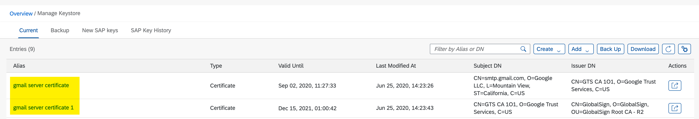

---
