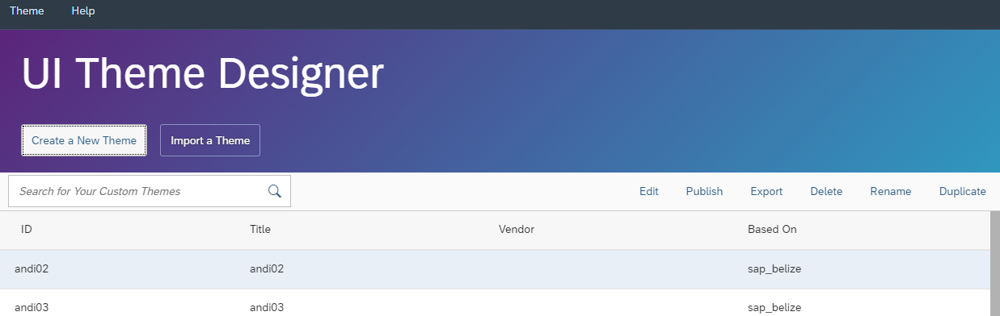

# Create a Theme for SAPUI5 Desktop Applications
<!-- description --> Create a theme for SAPUI5 desktop applications in UI theme designer.

## Prerequisites
 - Prerequisite 1
 - Prerequisite 2

## You will learn
  - How to do something
  - Why this technology is helpful

## Intro
Add additional information: Background information, longer prerequisites

---

### Start the UI theme designer

Go to your UI theme designer account **Portal > Cloud Foundry > UI theme designer**.

Select the theme **SAP Belize** and choose **Open**.

> SAP Belize is the current recommended theme.

### Add preview application for the UX3 Shell

Click on the link **UI5 Control Previews**.

Mark the **Shell** Checkbox in the **UX3Controls** section.

Select the control preview you just added in the **Target Pages** panel.

This is a Test List

* `@Lisa Monshausen`
* `:rocket:`
    * Item 2a
    * Item 2b

    First Header | Second Header
    ------------ | -------------
    Content cell 1 | Content cell 2
    Content column 1 | Content column 2

### Change color

In the **Quick** tab, enter a color \(for example \"green\"\) or a color code \(for example \#00bb00\) for the **Brand Color** input field.

> You can also select the value help and use the color picker to define the color value.

### Change the background color

Change the background color to white.

### Change the header color

Change the **Shell Header Color** to \#1C4A21.

### Change the highlight color

Change the highlight color to green \(\#00bb00\).

### Insert your company logo

1. Open the value help for the **Company Logo** input field.
2. Drag and drop an image file from you local files to the **Assign Image** dialog box or choose to call up a file browser.
3. Confirm the dialog box.

> If you know the URL of the image you want to use, you can specify this directly as the value of the input field.

### Change link color

Change the link color to \#068A06.

### Change field border color

Change the field border color to green \(\#068A06\)

1. Switch to the **Expert** tab.
2. Choose that to switch to the tag view.
3. From the list of toggle links, choose **Field**.
4. Change the value of the `sapField_BorderColor` parameter to a shade of green.

---
