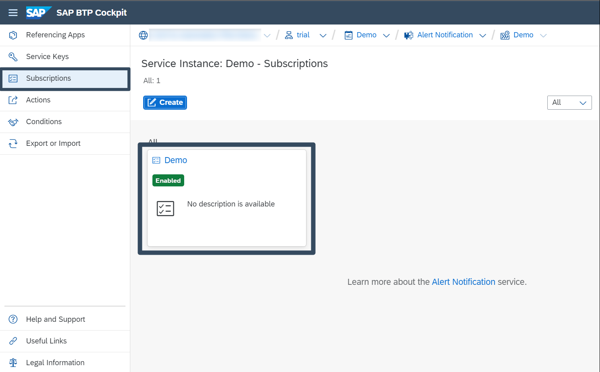

## Prerequisites
- Tutorial: You have activated **Alert Notification** in a trial account as described in [Set Up SAP Alert Notification service for SAP BTP for Initial Use](set-up-alert-notification)
- Tutorial: You have created an action as described in [Create an Action of a Type Email](create-action-email)
- Tutorial: You have created a condition as described in [Create a Condition to Catch All Notifications](create-condition-notifications)

## You will learn
- How to create a subscription using already created actions and conditions 

## Intro

### Create a Subscription

1. Open the **Subscriptions** menu of the Alert Notification cockpit page and click on the **Create** button to open the dialog box. 

    

2. Once the **Create Subscription** dialog box opens, enter the following:
    * A unique name for your subscription in the **Name** field.
    * [Optional] You can add additional details about the subscription in the **Description** field and assign one or more labels to your subscription in the **Labels** field. 
    * [Optional] If you want to delay the matching of events on the subscription, set a period in the **Snooze by** field. Leave the field blank if delay is not required.
    * Click on the **Create** button.

        

3. In the second dialog box you will be presented with the available conditions. Select a condition and click on the **Assign** button.

    

4. In the next dialog box you will be presented with the available actions. Select an action and click on the **Assign** button once again. 

    

5. You will be notified your subscription was created via summary dialog box.

    

6. Close the dialog. Your newly created subscription is now available in the **Subscriptions** menu in the left pane.

    