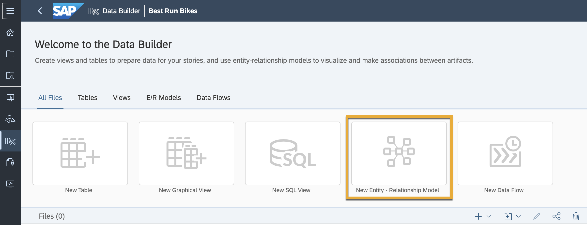
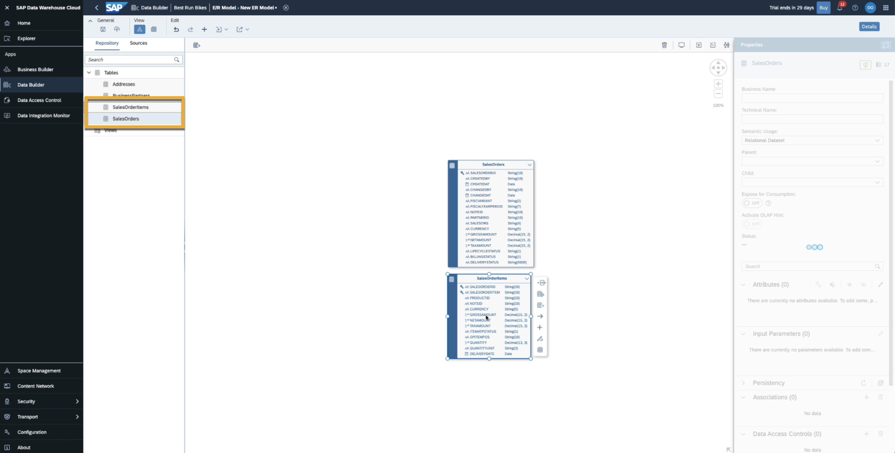
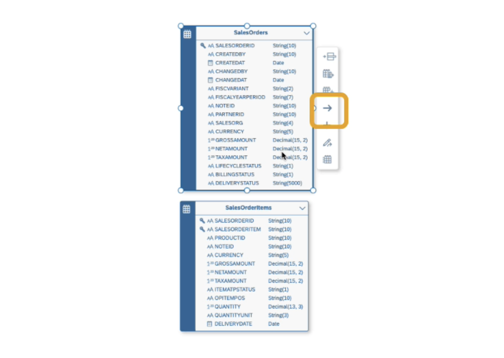
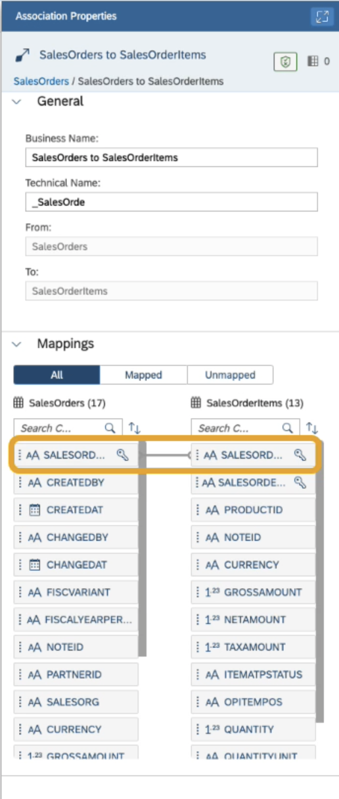
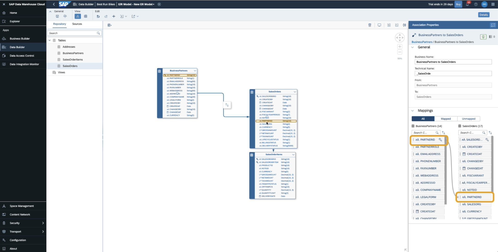
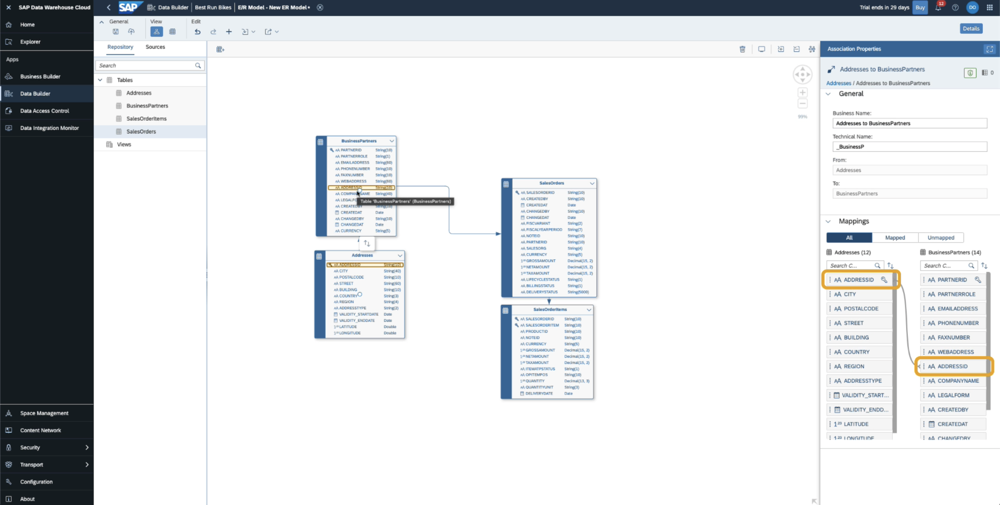

# Create an Entity Relationship Model in SAP Data Warehouse Cloud
<!-- description --> An entity-relationship model (or E/R model) describes interrelated things of interest in a specific domain of knowledge. You can use an E/R model to better understand a subset of the entities in your space, and to communicate this information to other stakeholders.

## Prerequisites
 - You have [imported your dataset into your Space.](data-warehouse-cloud-import-dataset-csv)

## You will learn
  - Overview of E/R Models
  - How to create an E/R Model
  - How to associate data columns
  - Finalise an E/R Model and deploy

## Intro
Add additional information: Background information, longer prerequisites

---

### Overview of an E/R Model

An E/R model provides a diagram for organising your data entities (tables and views) in relation to one another. You can:

•	Add entities from the repository or import them from a connection or a CSN file, as well as creating new entities directly.

•	Modify the properties of your entities including adding human-readable business names and creating associations directly in the diagram.

•	Save and deploy all the contents of your model with a single action.

The work that you do in an E/R model benefits all the users in your Space as they can use the entities that you import or enhance as sources in their views.

A data model is a way to organise the data and define the relationship between the data elements you have, to give it a structure. This structure must be aligned with your team's needs to generate reports and queries.

### Create an E/R Model

1.	Go to the Data Builder and click on the New Entity-Relationship Model button.

    

2.	This takes you into the graphical modelling interface. Since you imported the sample data manually via CSV, then your data can be found under the Repository.
3.	Click and drag the table `SalesOrders` onto the canvas. This table holds information about customer orders.
4.	Next, click and drag the table `SalesOrderItems` to add more detailed information about your orders.

    

5.	With the data tables now in your modeling interface, you are now ready to create the relevant associations and deploy your E/R model.

### Associate Data Columns

After including the `SalesOrder` table and the `SalesOrderItems` tables from your Best Run Bikes dataset into the model, they must now be associated to each other.

1.	Click on the `SalesOrders` table and then click on the Create Association arrow icon.

2.	Drag it over to the `SalesOrderItems` table to create an association between the two tables.

    

3.	Ensure that the created association is between the columns `SalesOrderID` in the Association Properties panel.

4.	Drag and drop to connect the sales column from one table to the other if it's not done already.

    

5.	Next, click and drag the `BusinessPartners` table. This table contains information on Best-Run Bikes customers, which is useful when connected to the sales data. We'll go ahead and create an association to the `SalesOrders` table using the `PartnerID` column.

    

6.	Now add some geographical location information to the model. Drag the Addresses table onto the canvas.

7.	And now create an association between the `Addresses` and `BusinessPartners` tables using the `AddressID` column.

    

### Save and Deploy

You've now joined all the tables we will be using in this model. Type a name into the Model Properties panel and click on Save. And once that's completed, you can click on the deploy icon.

You have now created associations between the tables by creating an Entity-Relationship model. You can now use this model to create Graphical or SQL views and model your data accordingly.

---
