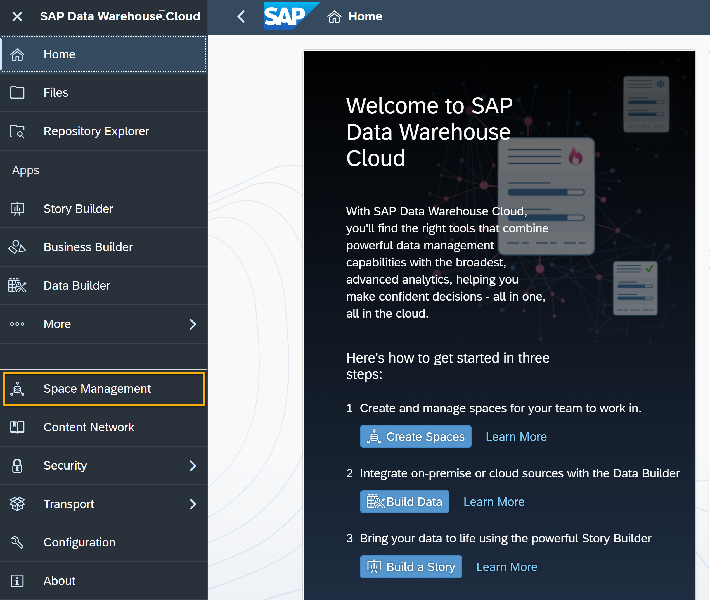
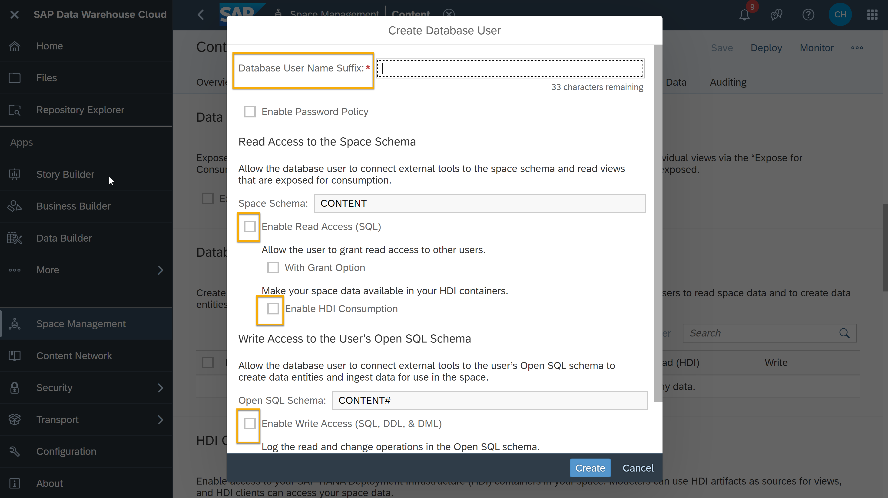
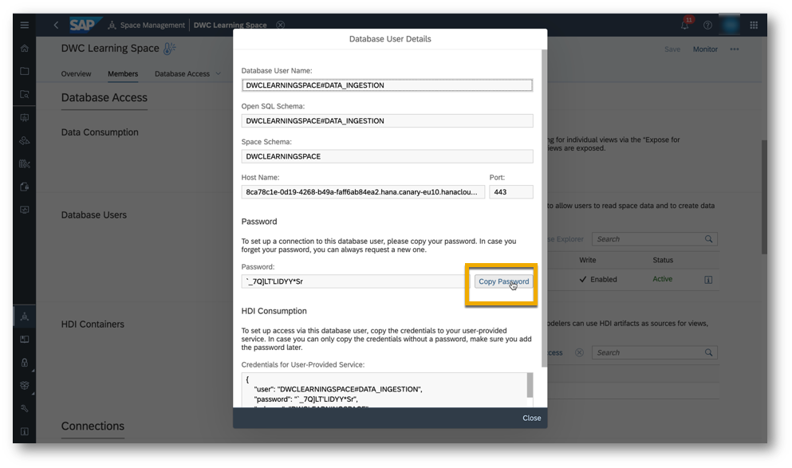
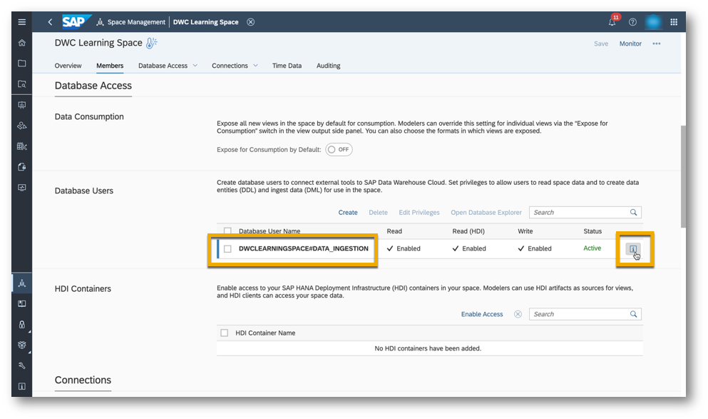

# Connect to a Third Party ETL Tool from SAP Data Warehouse Cloud
<!-- description --> Load your already transformed data into SAP Data Warehouse Cloud by connecting to a third-party ETL tool

## Prerequisites
- You have your SAP Data Warehouse Cloud tenant or a [trial account](https://www.sap.com/products/data-warehouse-cloud/trial.html)

## You will learn
- How to create a database user
- How to connect a third party ETL tool to SAP Data Warehouse Cloud

## Intro
<iframe width="560" height="315" src="https://www.youtube.com/embed/Y0QBLbngAnc" title="YouTube video player" frameborder="0" allow="accelerometer; autoplay; clipboard-write; encrypted-media; gyroscope; picture-in-picture" allowfullscreen></iframe>requisites

In the video above, you can see an example of how to create a database user access and connect to a third party ETL tool in SAP Data Warehouse Cloud. You can then see the same steps in detail here below.

---

### Create database user access

1.	Go to the **Space Management** in the menu of left-hand side of the SAP Data Warehouse Cloud welcome page and select the Space in which you want to create a new database user access to load a transformed data into it by using a third-party ETL tool.

    <!-- border -->

2.	Now, go to the **Database Access** tab and click on the **Create** option.

    <!-- border -->

3.	Enter the database username suffix and then enable required check boxes to give required privileges to the new user. The required privileges are as follows: Read access, HDI Consumption and Write access.

    <!-- border -->

4.	While enabling the **HDI Consumption** check box, you may see a pop up. Click on `Ok`. Once you are satisfied with the privileges you enabled, click on **Create**:

    

5.	You will see a window appearing with all the details related to the new user. Copy the password and save it somewhere safe, since you will need it later. If you lose the password or lock the database user by giving wrong password several time, you can easily go to the**i** icon and request a new password.

    

6.	You can see that the database user is created and added in the user list when you look at the details of the space.

### Connect your third party ETL tool

You can now establish a connection with your third-party ETL tool with the username and password created in step 1.

1.	Open your third-party ETL tool and connect to the specific space in DWC using the host name and password that were generated during the creation of the database user.

2.	If the connection is successful, you will see your local schema in your ETL tool, and – vice versa – you will see the connected ETL tool databases in the Space in SAP Data Warehouse Cloud. From here on, you can now use the connected external data from your third-party tool to build data models using the **Data Builder**.

> **Well done!**
>
> You have completed the **Connect to a third-party ETL tool ** tutorial in SAP Data Warehouse Cloud. Now it is time to continue learning. Please check out the other [SAP Data Warehouse Cloud tutorials available here] (https://developers.sap.com/tutorial-navigator.html?tag=products:technology-platform/sap-data-warehouse-cloud), and do not forget to follow the [SAP Data Warehouse Cloud tag] (https://blogs.sap.com/tags/73555000100800002141/) in the SAP Community to hear about the most up to date product news.

### Test yourself

---
