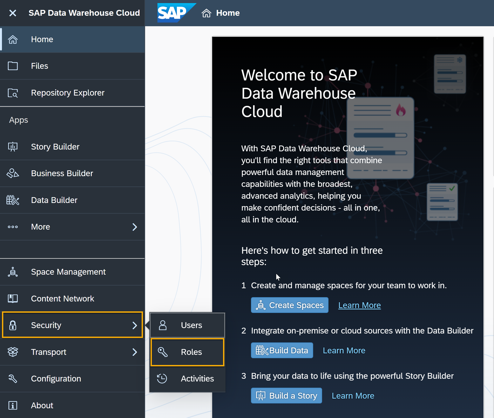
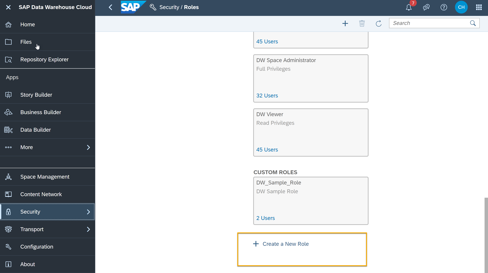
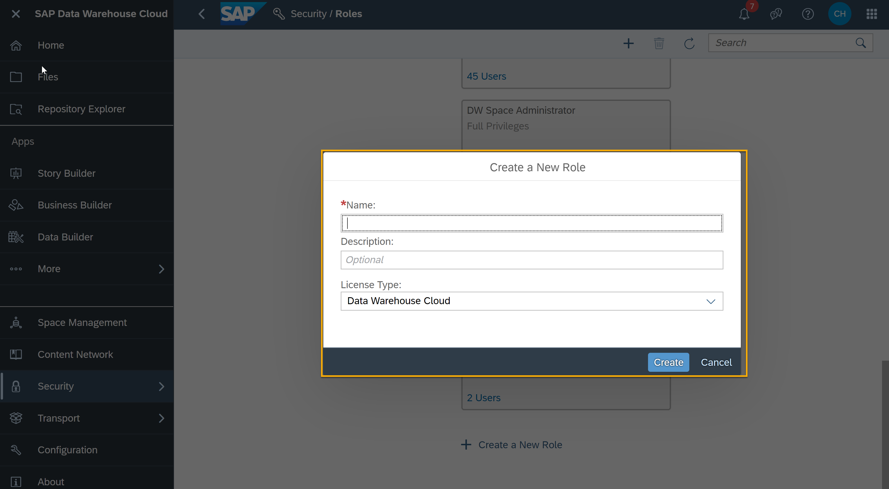
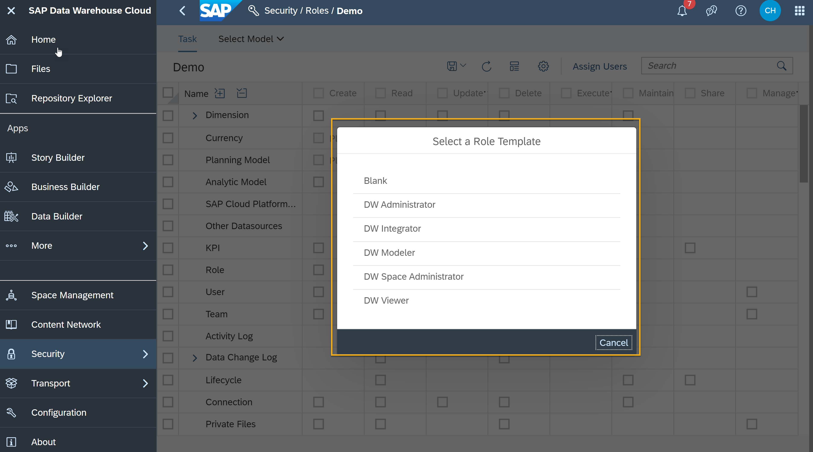
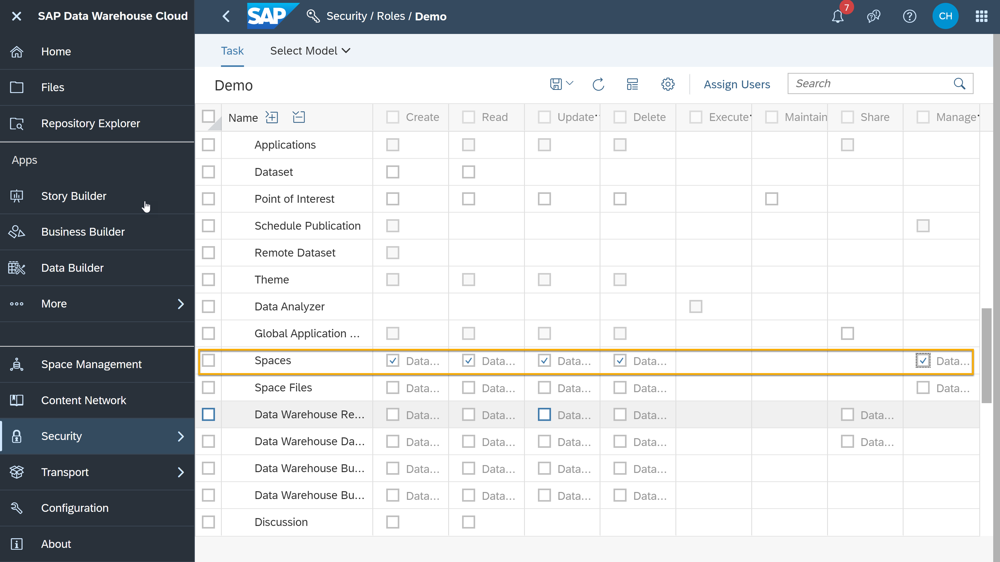
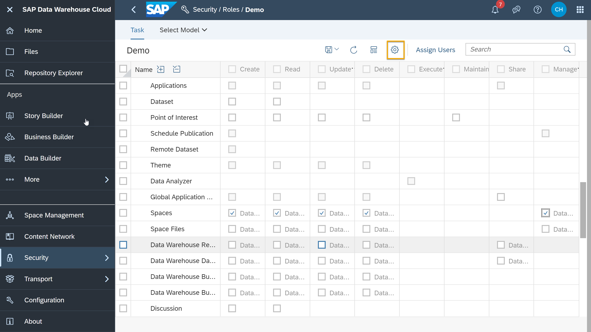
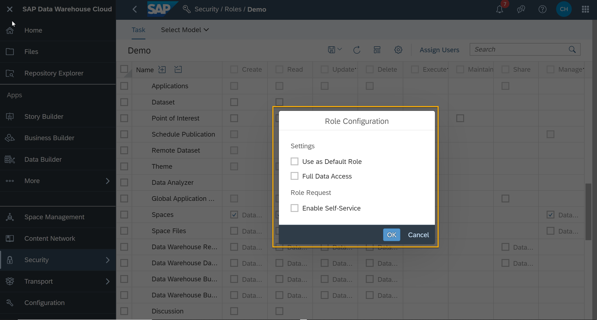

# Create Custom Roles in SAP Data Warehouse Cloud
<!-- description --> Understand roles, role templates and role configuration in SAP Data Warehouse Cloud and use them to create custom roles.

## Prerequisites
- You have your SAP Data Warehouse Cloud tenant or a [trial account](https://www.sap.com/products/data-warehouse-cloud/trial.html)

## You will learn
- How to access security and roles in SAP Data Warehouse Cloud
- How to create custom roles in security
- How to change role configurations
- How to give access to user specific data

## Intro
<iframe width="560" height="315" src="https://www.youtube.com/embed/MnDsj8RYEVg" title="YouTube video player" frameborder="0" allow="accelerometer; autoplay; clipboard-write; encrypted-media; gyroscope; picture-in-picture" allowfullscreen></iframe>

In the video above, you can see an example of how to create a custom role in SAP Data Warehouse Cloud. You can then see the same steps in detail here below.

---

### Access Security and Roles

1.	In the SAP Data Warehouse Cloud welcome page, click on **Security** on the menu on the left-hand side.

    <!-- border -->

2.	Select **Roles** from the dropdown menu

    <!-- border -->

3.	You can now see a list of Data Warehouse Cloud Roles. DW Administrator role has the complete set of privileges in the tenant.

### Create custom role

When you want to provide a user with admin-like role and at the same time want to prevent them from creating new users and roles like a limited admin access, creating a custom role is the best option.

1.	In the **Roles** landing page, scroll down and click on the plus icon to create a new role.

    <!-- border -->

2.	In the next dialog, give a meaningful name to the custom role you want to create.

    <!-- border -->

3.	You can also select a template for the new role for example a template of DW Modeler in the next dialog, in the video above, you can see an example of blank template role being selected.

    <!-- border -->

4.	Now you can give **Create**, **Read**, **Update**, **Execute**, **Maintain**, **Share** and **Manage** access. In the video above, you can see an example of **Space Management** access in SAP Data Warehouse Cloud given to the sample role created.

    <!-- border -->

5.	Once the required access privileges are assigned, you can save the role by clicking the *Save** icon.

    <!-- border -->

### Change role configuration

1.	In the role assign menu (Item 4 of Step 2), you can configure the newly created custom roles according to the requirements.

2.	Click on the settings icon to access the **Role Configuration**.

    <!-- border -->

3.	You can now see the option to mark the newly created custom role to be assigned as default or full data access role. You can also enable a self-service which the user can use to request for access themselves.

    <!-- border -->

### Access to user specific data

Data Access Control helps you to fine-tune data access for each user in a view. No need to create additional Spaces or duplicate data models – simply define access rights based on the username and the row content.

You will see in detail on how to achieve this in the below video.

<iframe width="560" height="315" src="https://www.youtube.com/embed/gH0G5NatE9s" title="YouTube video player" frameborder="0" allow="accelerometer; autoplay; clipboard-write; encrypted-media; gyroscope; picture-in-picture" allowfullscreen></iframe>

> **Well done!**
> You have completed the first tutorial of this group! Now you know how to create custom roles in SAP Data Warehouse Cloud.
>
> Learn in the next tutorial about the activities log in SAP Data Warehouse Cloud.

### Test yourself

---
