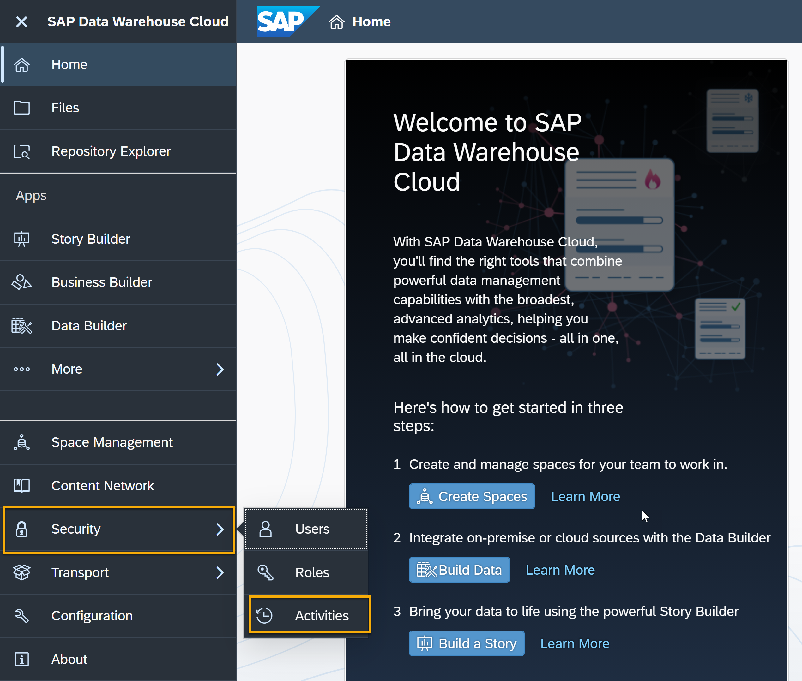
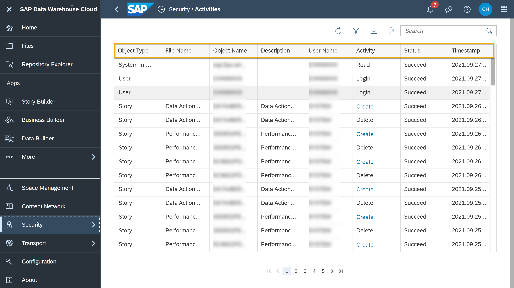
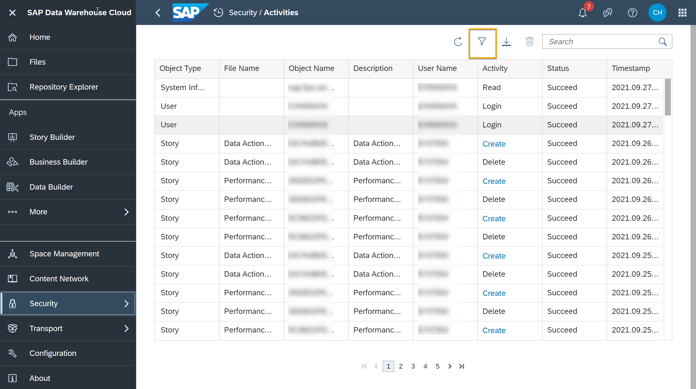
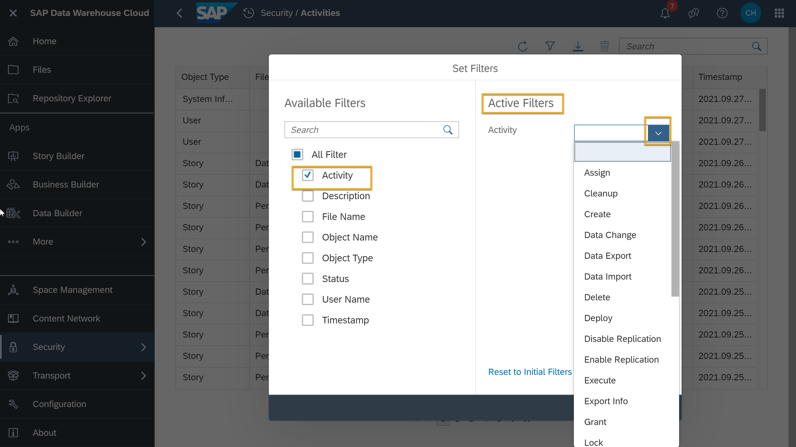
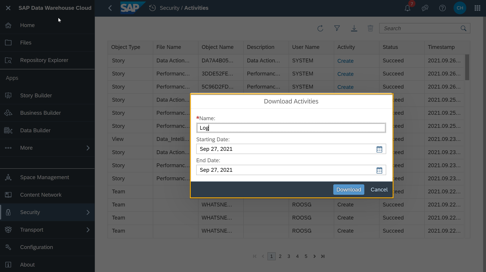

# Track Activities in SAP Data Warehouse Cloud
<!-- description --> Filter and export activities log in SAP Data Warehouse Cloud for documentation or reporting purposes.

## Prerequisites
 - You have your SAP Data Warehouse Cloud tenant or a [trial account](https://www.sap.com/products/data-warehouse-cloud/trial.html)

## You will learn
- How to access the **Activities** log in SAP Data Warehouse Cloud
- How to filter activities
- How to download a log as flat file

## Intro
<iframe width="560" height="315" src="https://www.youtube.com/embed/1EieNA-3PXE" title="YouTube video player" frameborder="0" allow="accelerometer; autoplay; clipboard-write; encrypted-media; gyroscope; picture-in-picture" allowfullscreen></iframe>

In the video above, you can see an overview of **Activities** in SAP Data Warehouse Cloud. You can then see the same steps in detail here below.

---

### Access activities log

1.	In the SAP Data Warehouse Cloud welcome page, click on **Security** on the menu on the left-hand side.

    <!-- border -->

2.	Select **Activities** from the dropdown menu.

    <!-- border -->

3.	You can now see the log which shows object type, file name, object name, description, username, activity, status, and the timestamp of the registered activity.

    

### Filter activities

If you want to know who has logged into the system, you can simply filter by clicking the filter icon for the activity and receive a log of everyone who has signed into the system.

The filter lets you choose from a larger variety of activities. For example, if you want to filter based on activity, mark the activity box and select the dropdown on the right to see the right activity type for your filter. Then click `ok`. If you want to filter based on the username, you can do so by marking the username box and writing a username you want to filter on username box provided in the active filters.

### Download activities log

You can download the activities log of the filtered activity as a flat file suitable to your reporting needs.

1.	Click on the download icon next to the filter icon.

    

2.	Add a name to the activity to be downloaded and select the starting and ending date of the activity.

3.	Click on **Download**.

> **Well done!**
>
> You have completed the second tutorial of this group! Now you know how to access, filter and download activities log in SAP Data Warehouse Cloud.

> Learn in the next tutorial how to share objects across Spaces in SAP Data Warehouse Cloud.

### Test yourself

---
