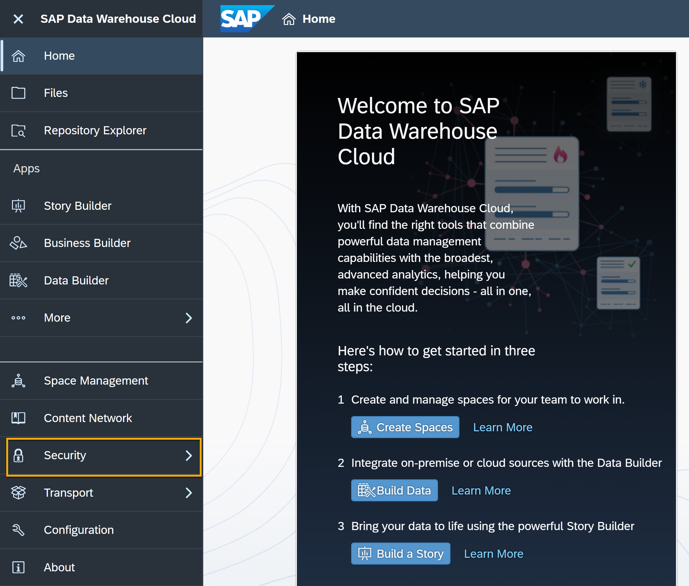
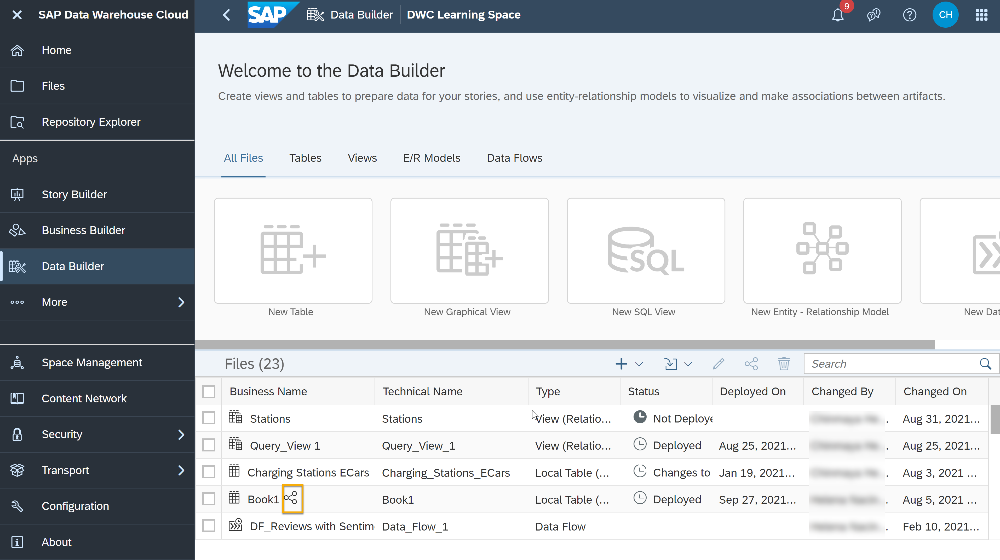
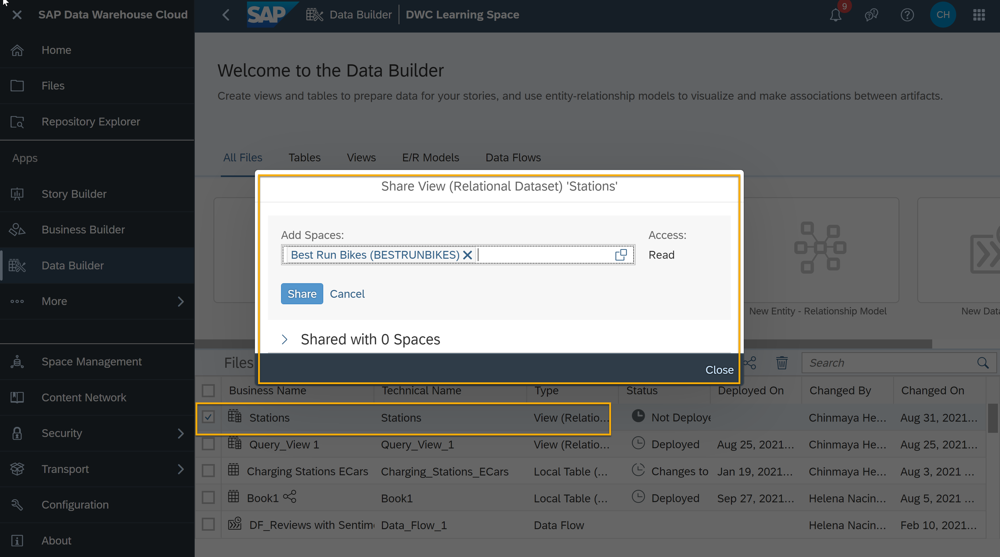
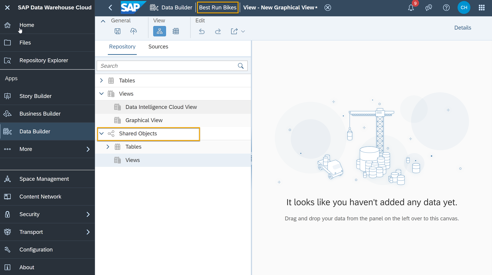

# Share Objects Across Spaces in SAP Data Warehouse Cloud
<!-- description --> Share artifacts across Spaces and collaborate with different teams without interfering in each others Spaces.

## Prerequisites
- You have your SAP Data Warehouse Cloud tenant or a [trial account](https://www.sap.com/products/data-warehouse-cloud/trial.html)

## You will learn
- How can you see shared objects in Spaces
- How to share a view across Spaces
- How to use shared objects in the Data Builder

## Intro
<iframe width="560" height="315" src="https://www.youtube.com/embed/R3gLJHCpDfk" title="YouTube video player" frameborder="0" allow="accelerometer; autoplay; clipboard-write; encrypted-media; gyroscope; picture-in-picture" allowfullscreen></iframe>

In the video above, you can see an example of how to share and use a view in SAP Data Warehouse Cloud. You can then see the same steps in detail here below.

---

### Understand shared objects

1.	Go to the **Data Builder** in the menu of left-hand side of the SAP Data Warehouse Cloud welcome page and select the Space in which you have your tables, views and models.

    <!-- border -->

2.	The shared objects will have a shared icon next to it if it is being shared from the other Space. In the example below you can see that the local table has the share icon.

    

3.	You can now select the shared icon by marking the box and then click on the share icon as shown in the below example.

    

4.	In the next dialog, you can see the original space from which the object was shared, and the type of access given.

### Share a view across Spaces

An object to shared can be a table, view and data models created using the graphical view builder, the SQL view builder, and the ER modeler in SAP Data Warehouse Cloud to other Spaces.

1.	In the Data Builder under your Space, choose an object which you want to share to another Space. You can do this by selecting the box of your object and clicking the share icon. In the below example you can see an example of stations view.

    

2.	In the pop-up window once you click on the share icon, you can select the space which you want to share it to. In the above example, the stations view is being shared with Best Run Bikes Space.

### Use a shared object in Data Builder

Once an object has been shared to some other Space, you can then use that in the Space which it was sent to for data modeling. In the below example you can see the Stations view which was shared in the previous step to Best Run Bikes.

Once inside Best Run Bikes Space, you can create a **New Graphical View** in the Data Builder and start using the Stations view in the shared objects section of the source on the left-hand side of the modelling canvas.

    

    > **Well done!**
    >
    > You have completed the **Security and Access in SAP Data Warehouse Cloud ** tutorial. Now it is time to continue learning. Please check out the other [SAP Data Warehouse Cloud tutorials available here] (https://developers.sap.com/tutorial-navigator.html?tag=products:technology-platform/sap-data-warehouse-cloud), and do not forget to follow the [SAP Data Warehouse Cloud tag] (https://blogs.sap.com/tags/73555000100800002141/) in the SAP Community to hear about the most up to date product news.

### Test yourself

---
