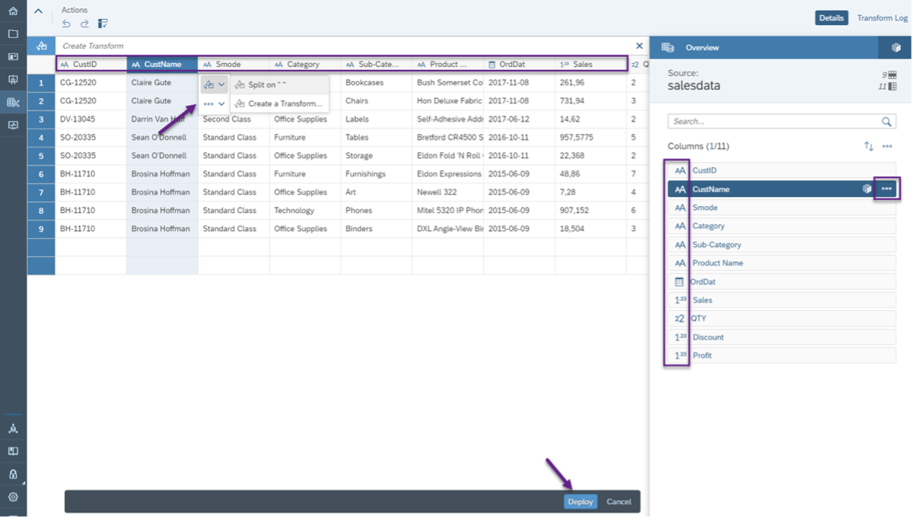
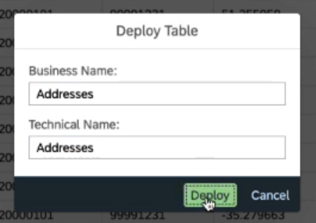

# Wrangle data in SAP Data Warehouse Cloud
<!-- description --> It is important to ensure your data tables are of the proper format and have the right nomenclature. Make sure to wrangle your data to meet your modelling requirements before deploying.

## Prerequisites
 - You have [created your Space in SAP Data Warehouse Cloud.](data-warehouse-cloud-creating-spaces)
 - You have [imported flat files into your Space.](data-warehouse-cloud-import-dataset-csv)

## You will learn
  - How to wrangle your data and deploy

## Intro
Add additional information: Background information, longer prerequisites

---

### Wrangle your data

After uploading your dataset, you will see a preview of the same before deploying the dataset to the underlying database. You may want to adjust the data type for some of your content, in case this is not automatically identified.

In SAP Data Warehouse Cloud, you can wrangle your data in the following ways:

•	Change the names of columns

•	Split any columns

•	Transform any column with attributes such as Concatenate, Split, Extract, Replace, Change, Filter

•	Duplicate any column or delete any column

•	Set or remove any column as a key column

### Deploy

Once you have made all the required changes to your dataset, go ahead and deploy your data to the underlying database. When you deploy an object, you are creating a run-time version for use in the SAP Data Warehouse Cloud database.

Before the data is fully deployed, you need to provide a meaningful name for the local table that you are about to create. You will see the prompt below.

After a successful deployment, you should then be able to see a local table in your repository. This table contains the dataset from the flat file you uploaded, and you can view this in the Data Builder.

---
