# Publish Files and Tables in the Catalog and Use their Metadata
<!-- description --> Publish files and tables in the catalog and use different functionalities like tagging, search and other metadata.

## You will learn
 - What the Catalog in SAP Data Intelligence is.
 - How to publish files and tables in the Catalog.
 - How to interpret the information shown in the Catalog.

---

### Get to know the Catalog in SAP Data Intelligence

This step serves only as an introduction so that you can familiarize yourself with the concept of the **Catalog** and its functionalities. It is not a pre-requisite for the following steps but will help you understand the respective activities better.

Navigate to the Catalog by starting Metadata Explorer from the launchpad and then click on the drop-down menu on the top left of Data Intelligence Metadata Explorer.

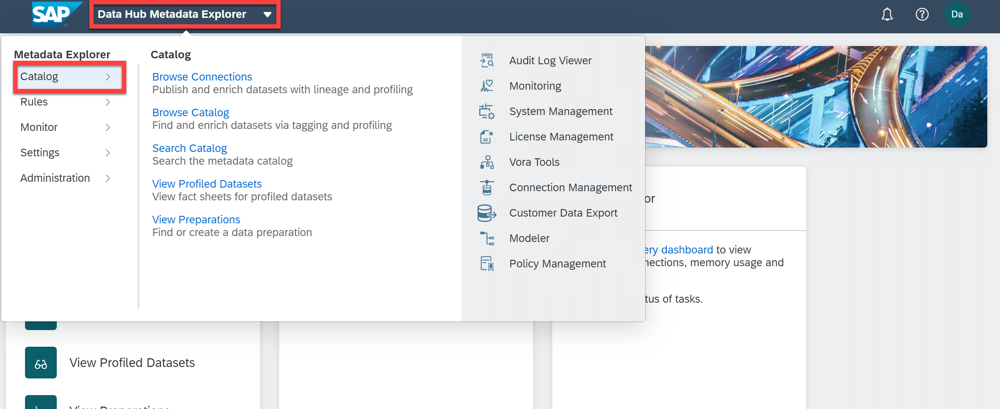

The Catalog does not store any datasets that are published here. It only serves as a **reference catalog** to the files that are physically stored elsewhere. However, in the Catalog you can store and access **meta data** of published files from the whole landscape. For each object in the landscape, be it a file, table, view, pipeline, the metadata can be published to the Catalog, to access it more easily. More specifically, as soon as the data is published to the Catalog you can label it, search it, access the data preview, etc..

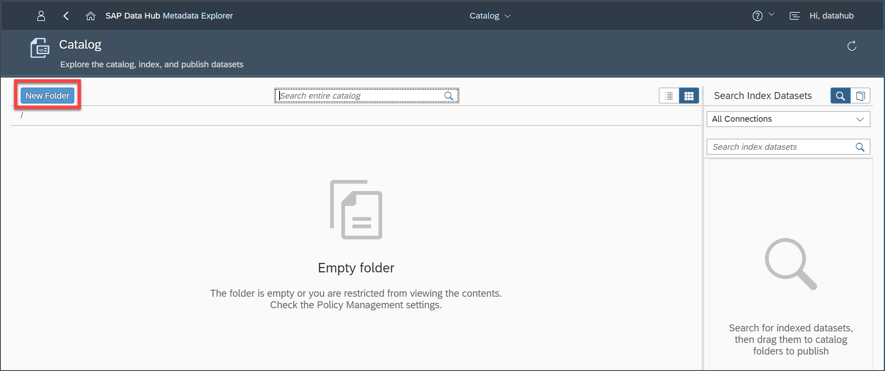

For example, a first step in a data discovery process could be that you

 - publish the data to the catalog,
 - check the data quality,
 - find that the data quality is not sufficient,
 - label the data set respectively, e.g. with "check data" and
 - mark it (in that way or with another label) as not to be used in graphs.

In the Catalog, you can create and administrate a new folder structure that encompasses all available data  in your connected systems. In that way, you can assign data sets from different sources (connections) to one folder or distribute data from one source to different folders. A logical folder structure is applied that reflects the main idea behind SAP Data Intelligence: Using, managing and combining your data regardless of their original source.  

The Catalog serves as a main entrance point for all expert-levels of users working with the data, since data quality, content and data status can be easily accessed. Also, the labelling helps (multiple) users to take note about data characteristics and last but not least the search functionality facilitates finding the right data set for a specific purpose or task.

In the follow up tutorial, you will also get to know the data lineage functionality of the Catalog. With data lineage, you can more easily see:

  - What will happen if you change a data definition (e.g. SQL script)?

  - Where does the data in your data lake come from?

  - Where is your data consumed?

### Publish files and tables in the Catalog

In this step you will learn how to publish files and SAP Vora tables to the Catalog.

Each publication needs to be assigned to a specific folder in the Catalog, i.e. without a folder structure, you won't be able to publish. Therefore, you first have to create a new folder for the publications.

>As an alternative, there is also an option to create a new folder during the publication process.

Navigate to **Metadata Explorer** > **Catalog**. Click on the button **New Folder** on the upper left hand side.

Enter a name (e.g. **`Weather_Data`**) and click on **Save**.

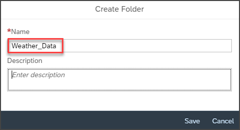

Go back to the **Metadata Explorer** and navigate to **Browse Connections**. Check the connection `CLOUD_STORAGE`. You should see (among others) the following csv-files:

-	`Devices.csv`

-	`Customers.csv`

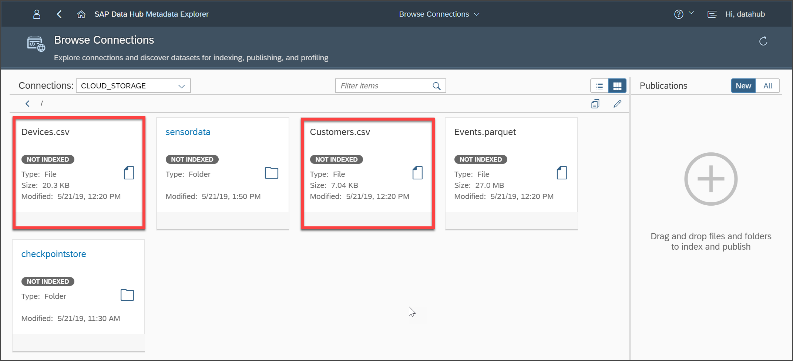

Start with `Devices.csv`. Click on the **More Actions** button and choose **New Publication Action**.

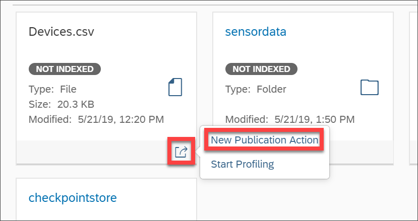

Now, on the right hand side you will find the parameters for the publication. Edit the **Target Folder** (by clicking on the pen symbol under **Target Folder**) and choose the folder that you just created for this purpose.

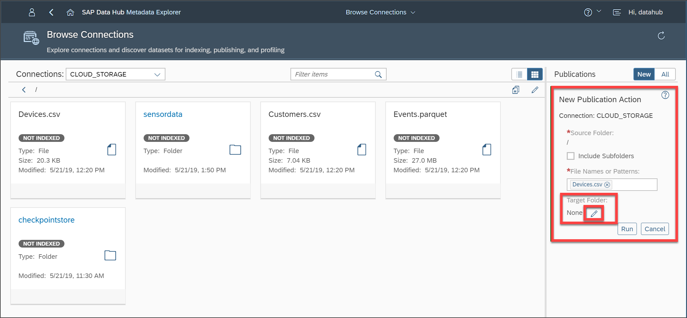
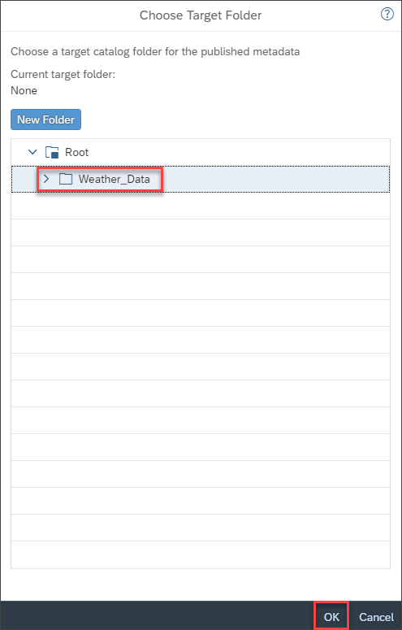

Click on **OK**. As mentioned earlier, if you would not add a **Target Folder**, the file would not be published but only indexed. Finally, click on **Run**.

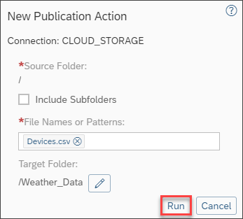

You will get a notification that the publication process has started. This might take a couple of minutes. You will receive a second notification when the publication is finished.

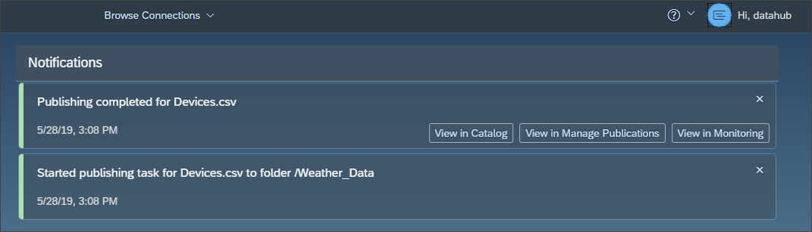

Repeat the same process for publishing `Customers.csv`.

Next, we want to publish an SAP Vora table. Stay in **Browse Connections** and choose the SAP Vora connection in the drop down menu in the upper left hand corner.

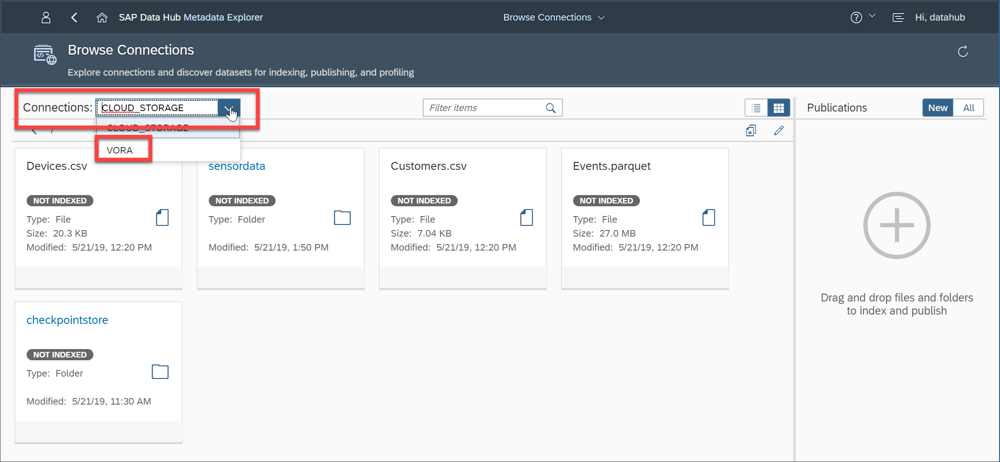

In the folder default, you should find the table `SENSORDATA`. Publish it analogously to the two csv-files before. However, note that you now have an additional option in the publication menu called **Data Lineage**. You will get to know this feature in the follow up tutorial. For now, leave the default value of 0 and publish the table.

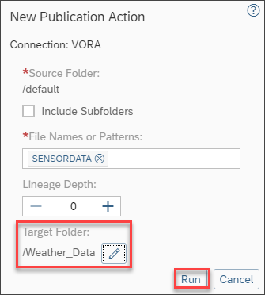
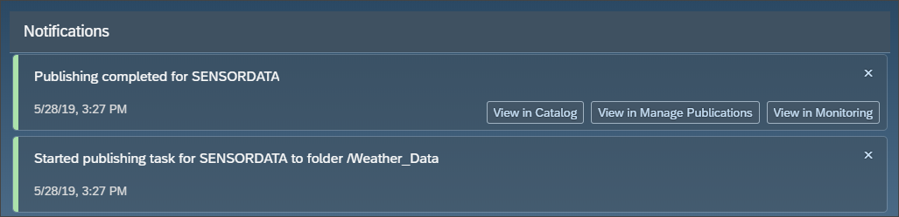

### Check the functionalities in the Catalog

Navigate to **Search Catalog** in the drop-down menu of Metadata Explorer. Use the search bar at the top to enter search terms for the whole Catalog. First, look for **`customer`**. You should see both csv-files, `Customers.csv` and `Devices.csv`, because of a column with the same name (`Customers.csv` also because the file name matches).

From the search result, you can access the fact sheet for the result files. Try this out by selecting **View Fact Sheet**.

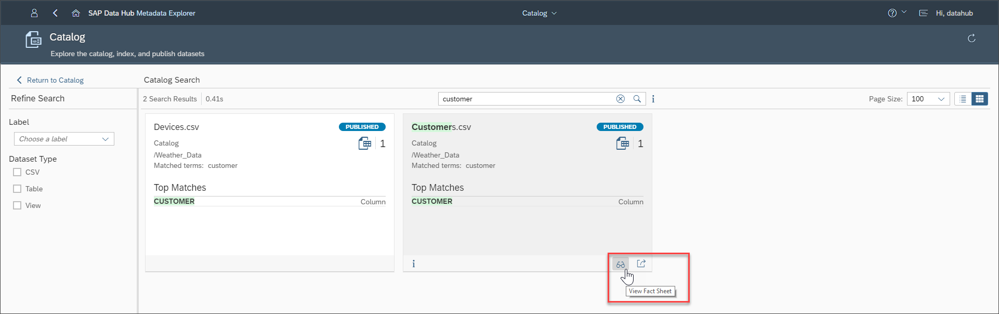

When you're done with the Fact Sheet navigate back to the search results. Clicking on **More Actions** offers you more interaction options with the file, e.g. navigating to the **Browse Connections** to find the original file.

When you search for **`device`**, you will at the moment only see the `Devices.csv`.

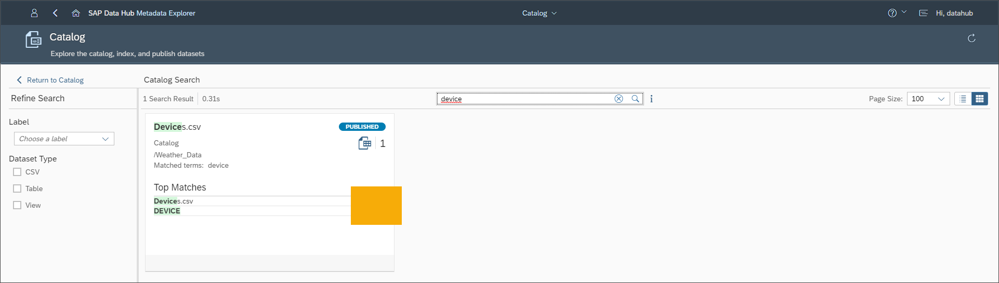

However, you might want to also find the `SENSORDATA` table from the SAP Vora connection that you published earlier. In order to do that, you can add tags to the publication which will also be used in the search.

Navigate to the published `SENSORDATA` table (e.g. by navigating to the Catalog and selecting the folder `Weather_Data`), then click on **More Actions** and select **Edit Labels**.

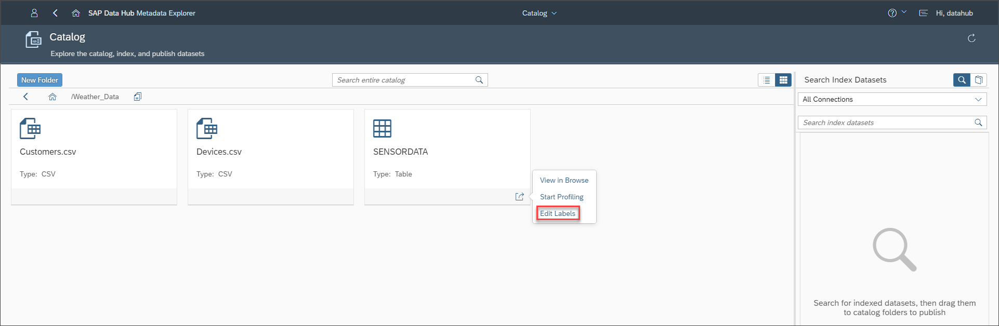

Add the labels **`device`** and **`weather data`**.

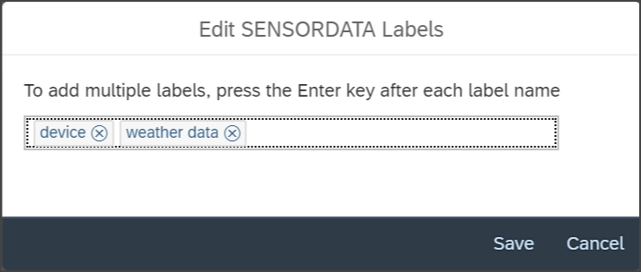

Of course, you could think of any labels and possible usages. While we now focused on a semantic labelling, you could also use the labels to organize your data for processing like described at the end of Step 1.

When you're finished with editing the labels you can try them out by using the search bar just as you did before.

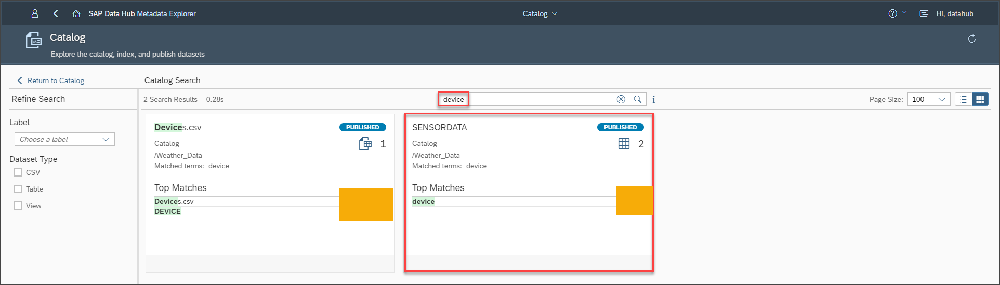

---
