# Create an SAP Vora View and Check Data Lineage
<!-- description --> Create an SAP VORA table and view based on the existing data in the cloud storage, publish both and check the data lineage.

## You will learn
- How to create tables and views in SAP Vora Tools
- How to publish a view with data lineage option
- How to view & interpret data lineage

---

### Create an SAP Vora View

In this tutorial, you will learn about the **data lineage** functionality in SAP Data Hub. Therefore, you will first have to create a SAP Vora View on which you can test this functionality.

The SAP Vora View will be based on the table `CUSTOMERS`. Therefore, if you haven't done that specific tutorial yet, please do so before continuing with this tutorial.

To create the SAP Vora View:

1.  Go to the **Welcome Page** of the **SAP Vora Tools**.

2.  Create a new view in the schema `default`: Click on **Create View**, enter a name (e.g. **`V_CUSTOMERS`**) and select `default` as schema. When you're done, click on **OK**.

    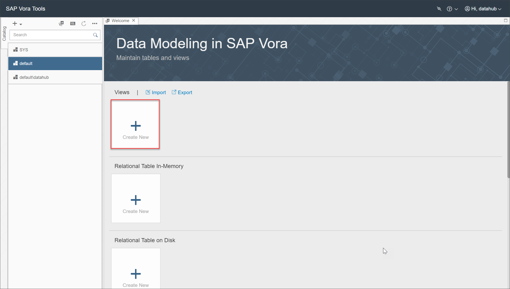

    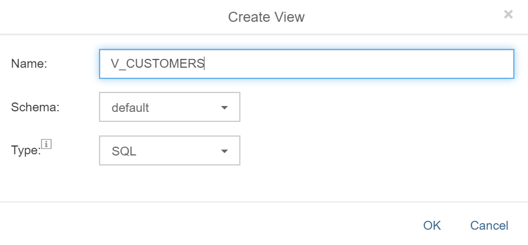

3. In the next screen, add the table created in the previous tutorial as a data source for the view. Click on the plus sign next to **Data Source** in the upper right corner.

    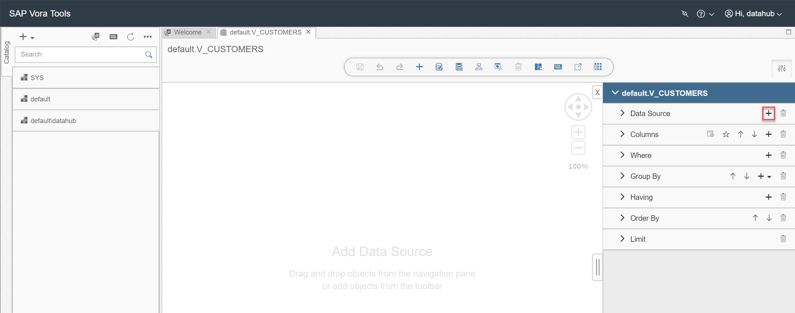

    In the name field, start typing **`CU`**. The table `CUSTOMERS` should appear in the result set. Select it and click **OK**.

    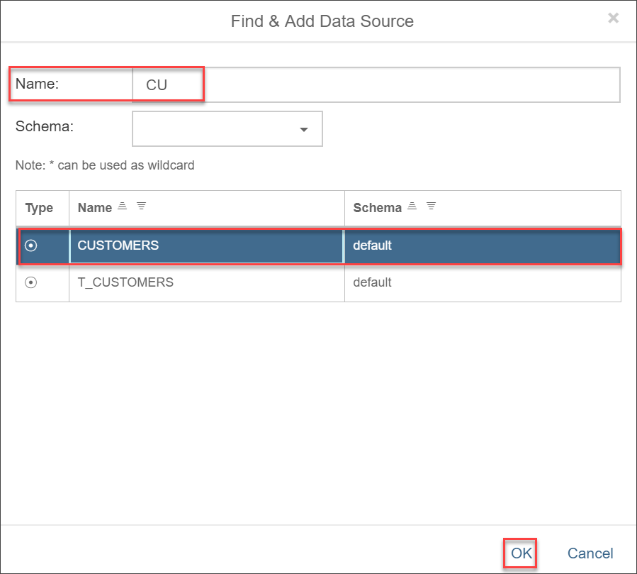

4. Add all columns to the output by selecting the dots on the left hand side of the shown table.

    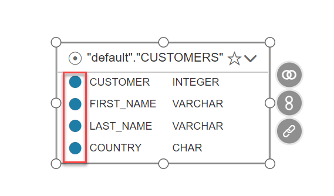

5. Let's create the new view in such a way that it only displays the devices in the US. This you can achieve with a respective where-statement. Click on the plus sign next to the where option on the right hand side. Select **More Options** for help with the input of the where-statement. From the column list, select **`COUNTRY`**. Use the equal operator and then type `'US'`.

    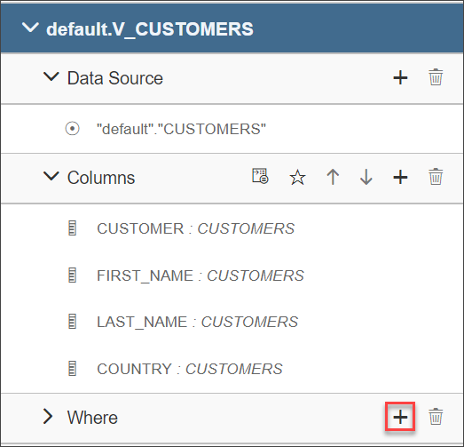
    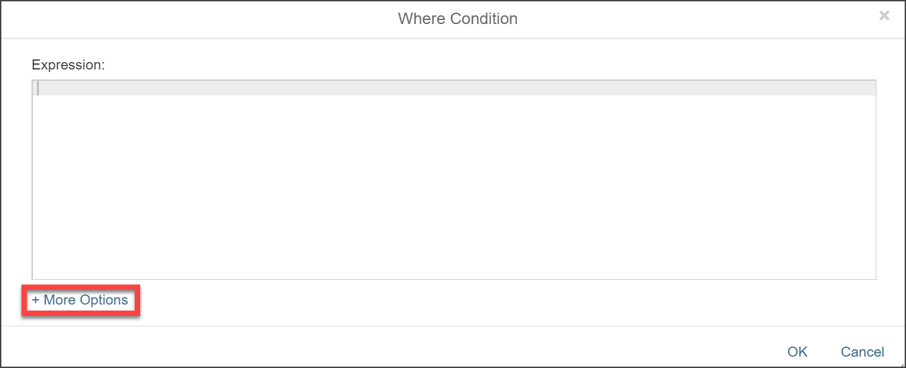
    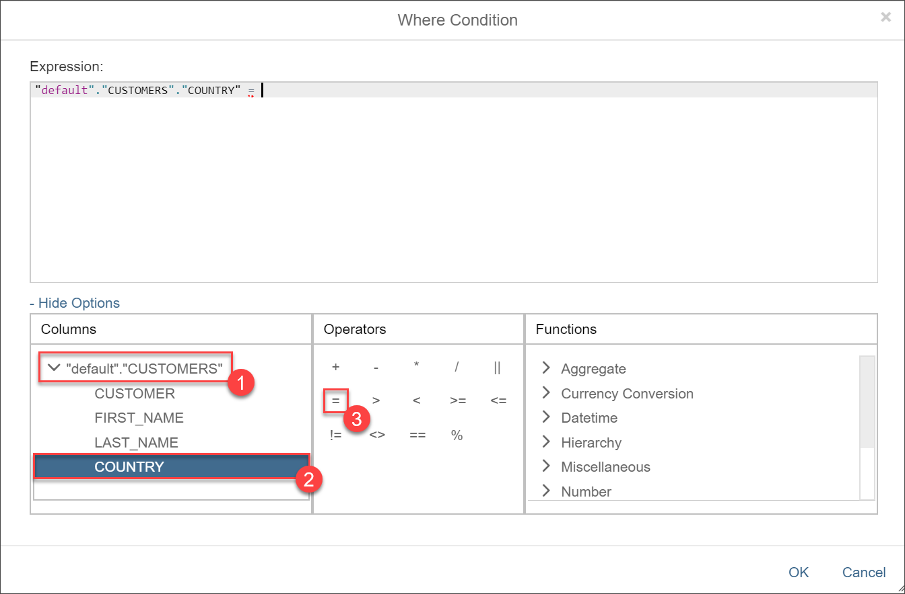

    The final where-statement should read: `"default"."CUSTOMERS"."COUNTRY" = 'US'`

    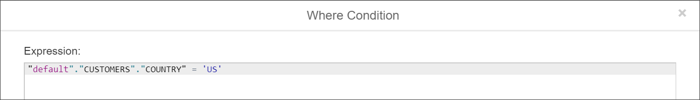

6. Let's check if the resulting data set is correct. Click on the **Data Preview** button and use the **Order** button in the preview to verify that only US customers are shown.

    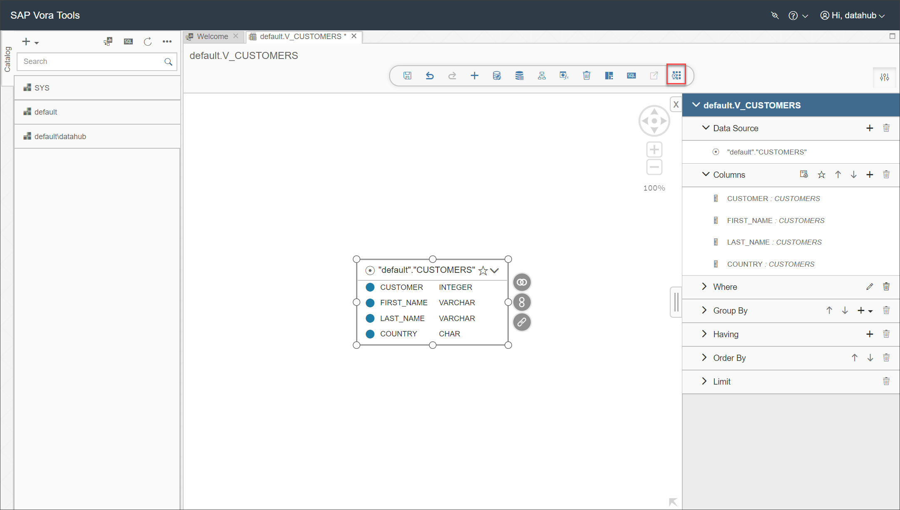
    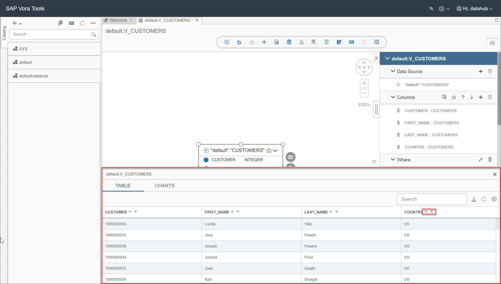

    >If you have already saved the view, you can also preview the data by right-clicking on the view on the left hand side and selecting **Data Preview**:
    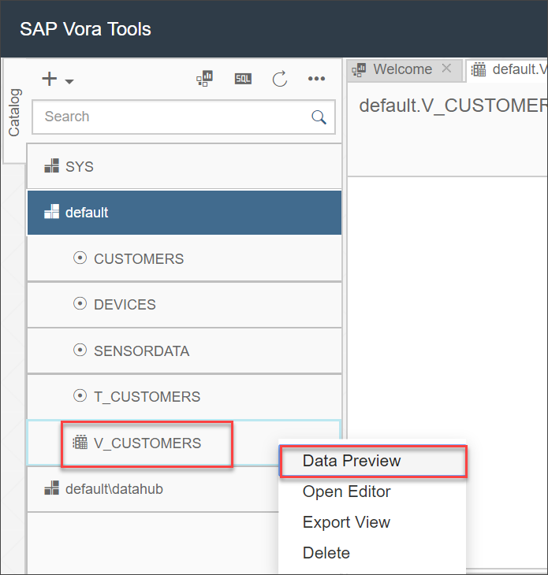

7. When you're satisfied with the result, hit the save button on the upper left hand side.

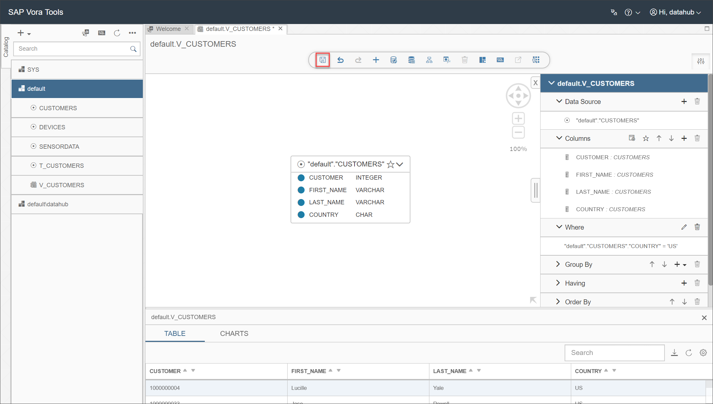

### Publish an SAP Vora view with data lineage

Navigate to **Metadata Explorer** > **Browse Connections**.
Choose connection Vora. Click on the **More Actions** button of the view `V_CUSTOMERS` and select **New Publication Action**.

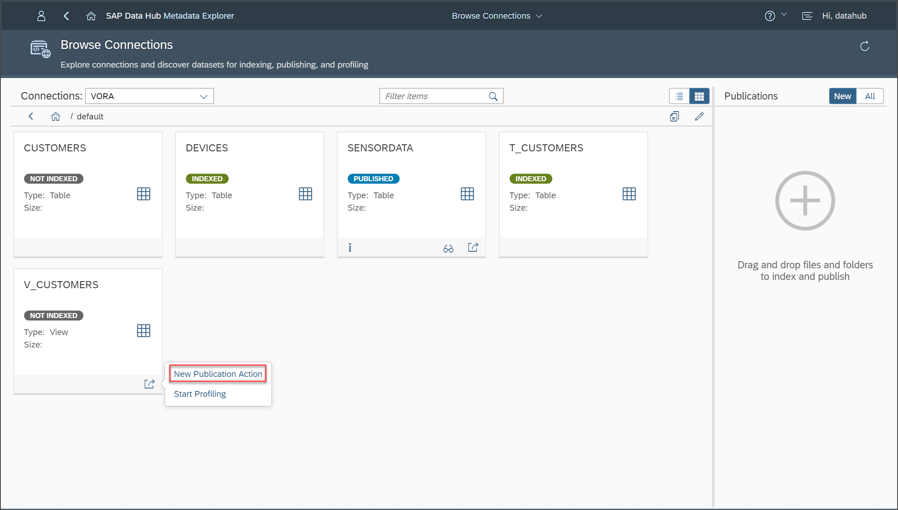

The parameter **Lineage Depth** determines how far the lineage should be tracked in the publication process. The value can range between 0 and 100, whereas the default value of 0 means that no lineage will be tracked. Change the parameter value to **`5`**. Also change the target folder as explained in the previous tutorial and then click on **Run**.

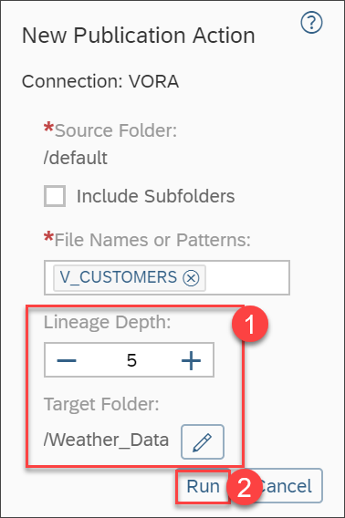

You will receive a notification that the publication action has started and another one as soon as it has finished.

### Check the data lineage for an SAP Vora view

You will now find the tags **indexed** and **lineage** on the tile for `V_CUSTOMERS` (you might need to hit refresh on the upper right hand side for it to appear). Click on the **More Actions** button on the tile for the view `V_CUSTOMERS` and select **View Lineage**.

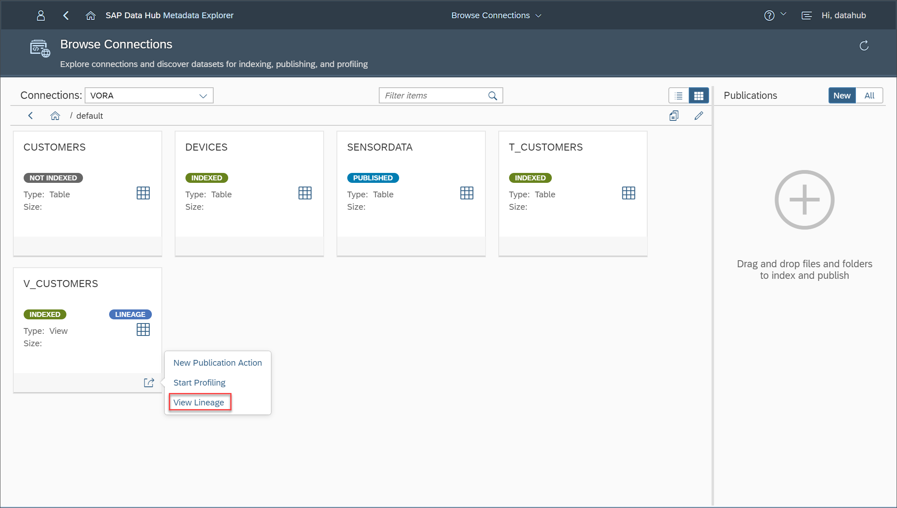

Now you can see the data lineage of the SAP Vora View, i.e. you will see which data is used in the view. In our case, we can see that table `CUSTOMERS` is used as input source. At the bottom, you can find more details for the source, so please mark the table in the graph on the upper left and click on **Dataset Locations** at the bottom left. You can now find the detailed location of the table. This is especially useful if you're using views created by others and want to be sure about the original data source.

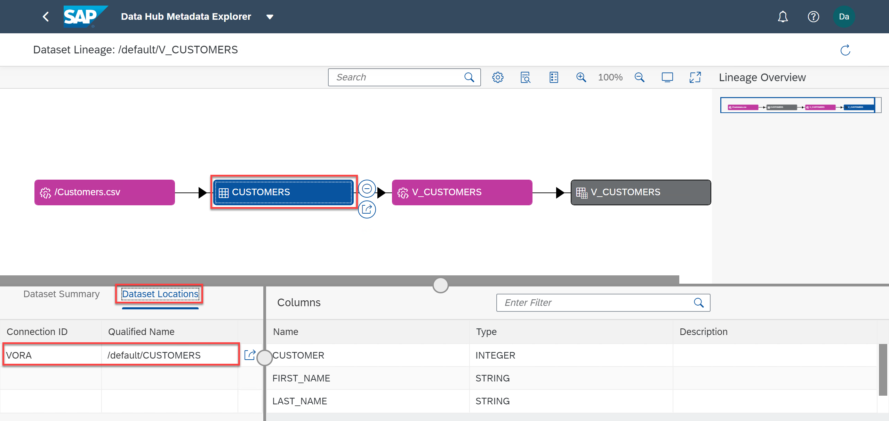

---
