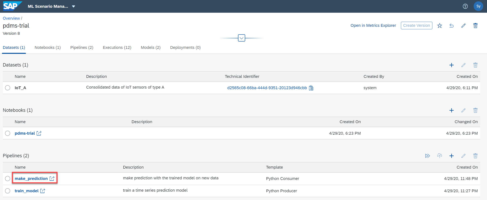
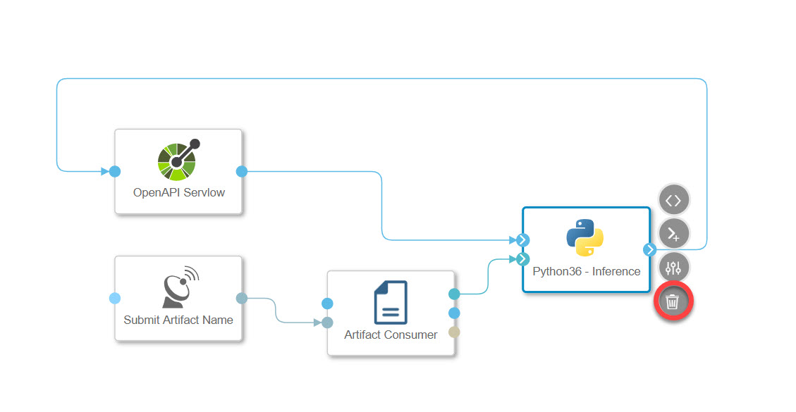
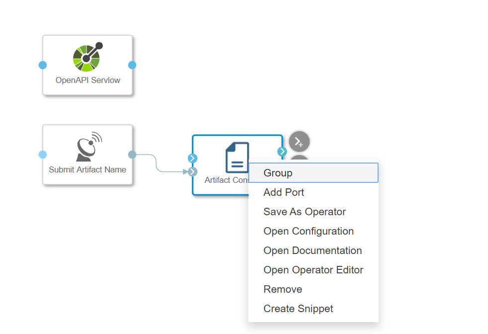
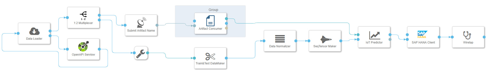
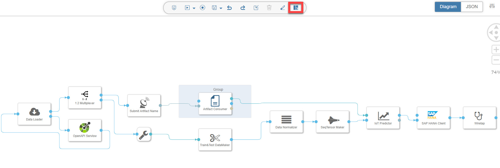
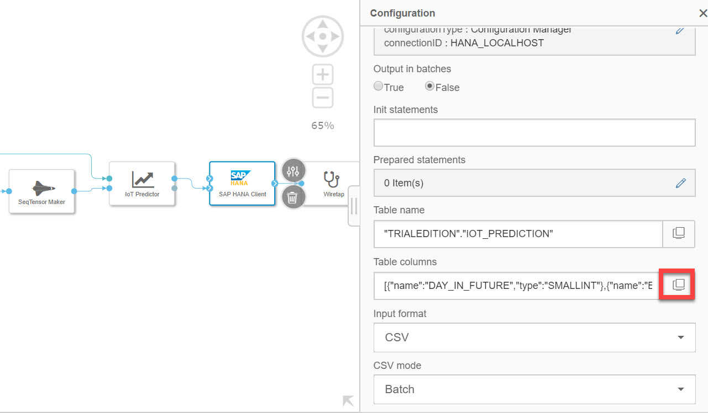
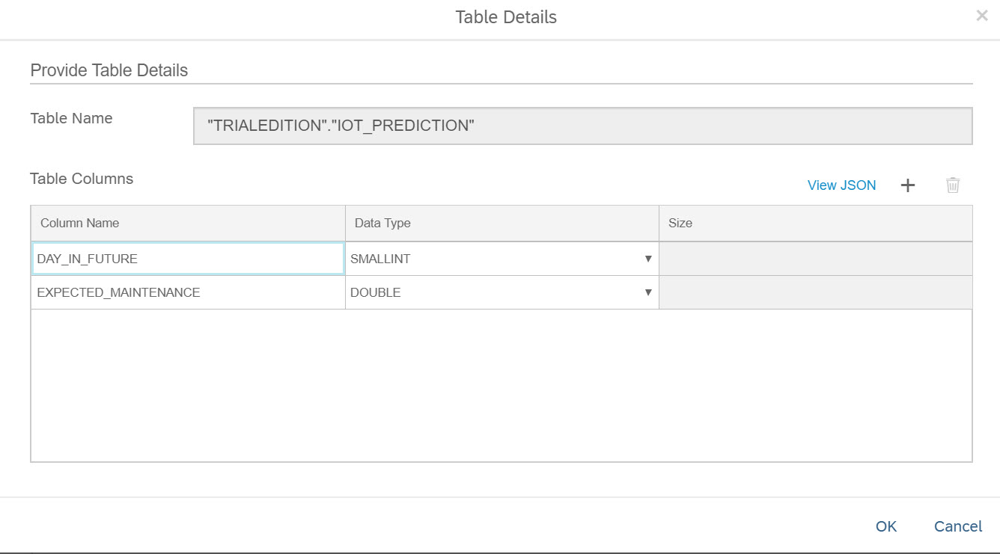
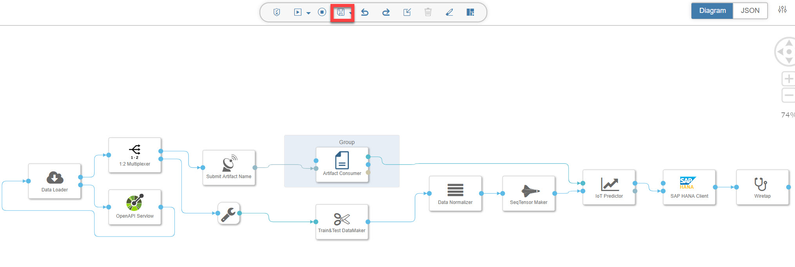
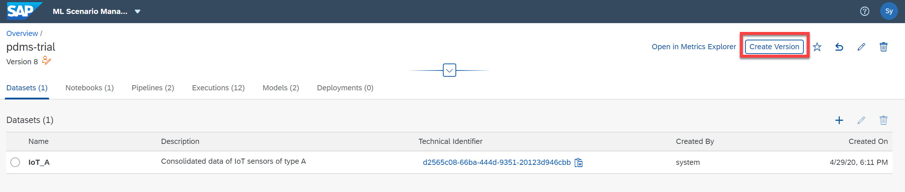

# Deploy Pipeline in ML Scenario Manager part 01 - Asim
<!-- description --> Modify and extend the Python Consumer template pipeline

## Prerequisites
 - Completed tutorials for beginner
 - Basic Python programming knowledge[Basic Python programming knowledge](https://www.python.org/about/gettingstarted/)
 - Completed tutorial **Execute Pipelines in the ML Scenario Manager**

## You will learn
  - How to configure operators such as `OpenAPI Servlow` and `SAP HANA Client`
  - How to prepare a pipeline for deployment

---

### Extend the "make_prediction" pipeline

In the previous tutorial **Execute Pipelines in the ML Scenario Manager**, you have executed the pipeline **`train_model`** and successfully obtained a TensorFlow model. In this tutorial, you will modify and configure the inference pipeline **`make_prediction`**.

Open `ML Scenario Manager` from the launchpad, scroll down to the pipelines section, click on the **`make_prediction`** to open the pipeline in `Modeler`.

In the graph, delete the **`Python36 Inference`** operator, add **`Artifact Consumer`** to a group by right clicking on the respective operator as indicated in the screenshots below.

To extend the pipeline you will need following operators. You have uploaded some of them in the tutorial **Customize Python Operators Part 03** and used in the training pipeline already.

-	**`ToBlob Converter`**: It converts message into blob.
- **`Multiplexer`**: It duplicates the input data stream into several identical data streams.
-	**`Data Loader`**: It forwards data from the `OpenAPI Servlow` and returns feedback
-	**`Train&Test DataMaker`**: It splits data into training and testing datasets.
-	**`Data Normalizer`**: It normalizes data based on the metrics derived from training data to avoid bias caused by different scalars.
-	**`SeqTensor Maker`**: It transforms data into Tensorflow-friendly data formats.
-	**`IoT Predictor`**: It makes predictions with the trained model on new incoming data.
- **`SAP HANA Client`**: It stores incoming data into HANA Database.

You can see the connecting sequence in the screenshot below. The workflow in brief explanation: First, new data arrives at the **`RestAPI Servlow`** operator, which listens on a specified URL. The data will then be forwarded by the **`Data Loader`** operator to the **`Multiplexer`** operator, where the data is replicated into two parallel data streams. The upper stream triggers the loading of `Tensorflow` model and the lower stream will prepare the ingested new data. Both streams are then fed to the operator **`IoT Predictor`**, where `Tensorflow` model is rebuilt and predictions are made. In the end, the predictions are stored in the HANA Data Base via the **`SAP HANA Client`** Operator.

**To note**: a few operators have different input and output ports, the exact port connection is described in the table below.

|  Operator    | Input Ports: Operators | Output Ports: Operators
|  :------------- | :-------------
|  **`Data Loader`**| **`input`**: `OpenAPI Servlow` |**`output`**: Multiplexer, **`feedback`**: `OpenAPI Servlow`
|  **`Artifact Consumer`**| **`inArtifactID`**: Submit Artifact Name| **`outArtifact`**: IoT Predictor
|**`IoT Predictor`**|**`model`**: Artifact Consumer, **`data`**: `SeqTensor Maker`|  **`predictions`**: SAP HANA Client
|  **`SAP HANA Client`**   | **`data`**: IoT Predictor| **`result`**: Wiretap

After connecting all operators, you can click on **`Auto Layout`** to automatically align the operators.

### Configure operators

With the pipeline graph built, you can now configure the parameters for each operators like you have done in the previous tutorial **Create pipelines in ML Scenario Manager**. Configurations are listed in the tables of each operator below:

**`OpenAPI Servlow`** operator

|  Field Name     | Value
|  :------------- | :-------------
|  Base Path      | **`${deployment}`**
|  Swagger Specification | no change
|  One-Way   | **`False`**
|  Websocket      | **`True`**

---

**`Data Loader`** operator

No specification

**`Submit Artifact Name`** operator

|  Field Name     | Value
|  :------------- | :-------------
|  Content           | **`${ARTIFACT:MODEL}`**
|  Counter         | **`0`**
|  Mode    | **`trigger`**

---

**`Artifact Consumer`** operator

|  Field Name     | Value
|  :------------- | :-------------
|  Operation Mode | **`input`**

---

**`Train&Test DataMaker`** operator

|  Field Name     | Value
|  :------------- | :-------------
|  days of predicting data | **`${days_of_predicting_data}`**
|  days of prediction | **`${days_of_prediction}`**
|  test data proportion    | **`1`**

---

**`Data Normalizer`** operator

No specification

---

**`SeqTensor Maker`** operator

|  Field Name     | Value
|  :------------- | :-------------
|  `shuffel` | **`False`**

---

**`IoT Predictor`** operator

No specification

---

**`SAP HANA Client`** operator

Many of the settings in the table are by default, which you do not need to change. They are simply listed for your reference. You only need to configure those, that are not default values (bold).

|  Field Name     | Value
|  :------------- | :-------------
|  Configuration Type (Connection) | **`Connection Management`**
|  `ConnectionID` (Connection) | **`HANA LOCALHOST`**
|  Init Statements| empty (default)
|  Table name | **`"TRIALEDITION"."IOT_PREDICTION"`**
|  Table columns | see the table below
|  Input Format | **`CSV`**
|  CSV mode | **`Batch`** (default)
|  CSV empty field value (text columns only) | Empty string (default)
|  CSV record delimiter | \n (default)
|  CSV field delimiter | , (default)
|  CSV quote character | " (default)
|  CSV lazy quotes | True (default)
|  CSV comment character | empty (default)
|  CSV header | **`Use as schema`**
|  Insert Mode | **`Insert`**
|  Table initialization | **`Drop (Cascade)`**
|  Table type | **`Row`**
|  Decimal output format | Fraction (string) (default)
|  Transaction level | Per Statement (default)
|  Network batch size (rows) | 512 (default)
|  Connection timeout (ms) | 10000 (default)
|  Terminate on error | True (default)

Definition of the Table:

|  Column Name   | Data Type
|  :------------- | :-------------
|  `DAY_IN_FUTURE` | **`SMALLINT`**
|  `EXPECTED_MAINTENANCE` | **`DOUBLE`**

To open the table column setting, click on the `window` button in the filed.

In the pop-up window you can specify the column names and data types.

---

Now you have the graph built and parameters set. Click on the save button of the graph.

Go back to the ML Scenario Manager and create a new version of your `pdms_trial` scenario.

You will learn how to deploy the pipeline and send data to the pipeline via Rest API in the next tutorial **Deploy Pipeline in ML Scenario Manager part 02**

---
