# Deploy Pipeline in ML Scenario Manager part 02 - Asim
<!-- description --> Deploy pipeline and send new data to the running pipeline via Rest API

## Prerequisites
 - Completed tutorials for beginner
 - Basic Python programming knowledge[Basic Python programming knowledge](https://www.python.org/about/gettingstarted/)
 - Completed tutorial **Deploy Pipeline in ML Scenario Manager part 01**
 - **Postman installed on your local machine**

## You will learn
  - How to deploy a pipeline in ML Scenario Manager
  - How to configure your Postman to send data to the pipelines

---

### Deploy the "make_prediction" pipeline

In the previous tutorial **Deploy Pipeline in ML Scenario Manager part 01**, you have extended and configured the pipeline **`make_prediction`**. In this tutorial you are going to deploy the inference pipeline and get predictions.

Open `ML Scenario Manager` from the launchpad, scroll down to the pipelines section, check the box left to **`make_prediCtions`** and then click on **`Deploy`** as indicated in the screenshot below.

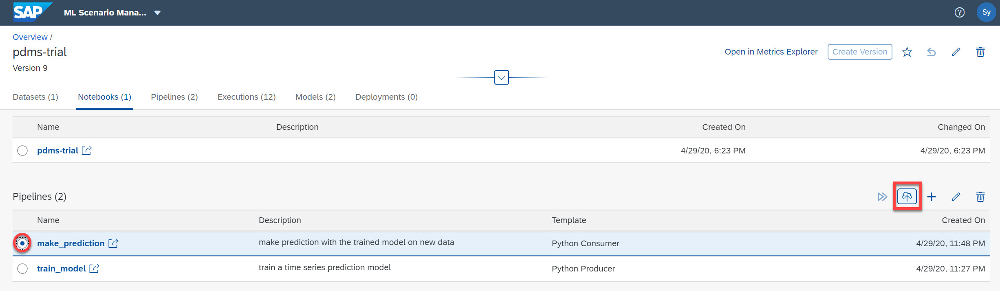

In the following window you see four steps to deploy the pipeline. The first step provides with basic information about the pipeline and you can further describe the pipeline in the second step. If you have deployed this pipeline already in this ML scenario version, you can select previous settings, otherwise you can enter them in the fourth step.

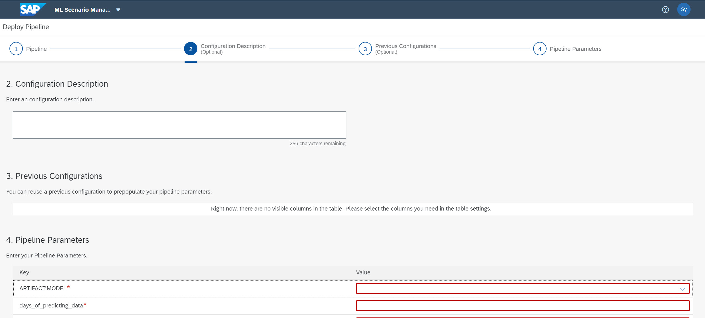

In the fourth step you can select the model you created with the training pipeline. Set the **`days_of_predicting_data`** to 60 and **`days_of_prediction`** to 10.

**To note**: The values of `days_of_predicting_data` and `days_of_prediction` must be the same as you have set for your training pipeline. If you have used different values, please adjust the above values  accordingly.

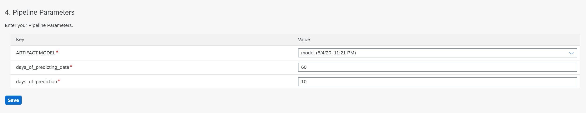

With the values entered, click on the `save` button to deploy the pipeline.
After the successful deployment you should see a screen as below.

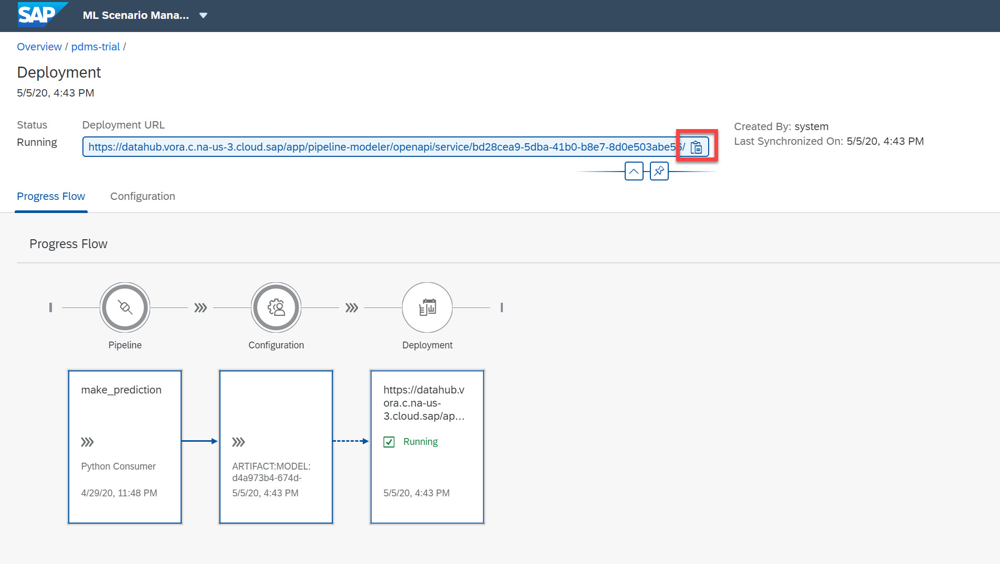

If you want to monitor the results created during the deployment, you can open the `make_prediction` pipeline in `Modeler`, click on `Wiretap` and open the UI.

**To note**: the UI of Wiretap is only accessible when the pipeline is running.

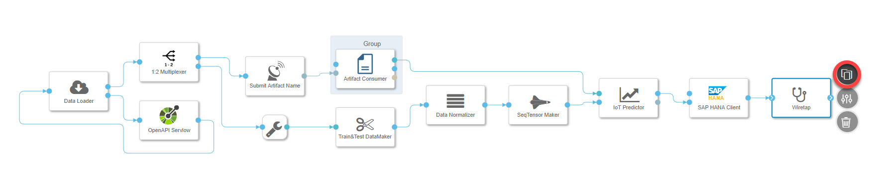

### Set up the Postman to send new data

In this step, you use **`Postman`** to simulate a system or an application that can send data to your deployed (running) pipeline on Data Intelligence. First, download the data to be sent by postman here

Launch your `Postman`, create a new **`GET`** request, enter the URL to your Data Intelligence instance and add **`/auth/login`** to the URL end. Then go to the **`Auth`** tab, select **`Basic Auth`** and then enter your credentials in the following fields.

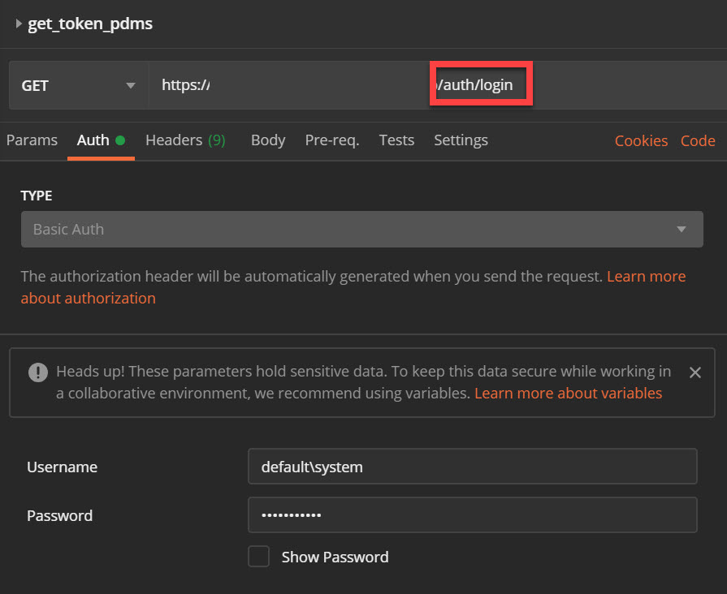

Now click on `send` to get **`Bearer Token`**, which you can retrieve from the ``Headers`` under `Set-Cookie` after a successful inquiry to your Data Intelligence Instance. Copy the bearer Token.

**To note**:  As user name, you can enter **`tenant\user`** to specify tenant and user at the same time. The `Bearer Token` starts after the word **`Bearer`** and there is some irrelevant characters in the end of the string that should be removed.

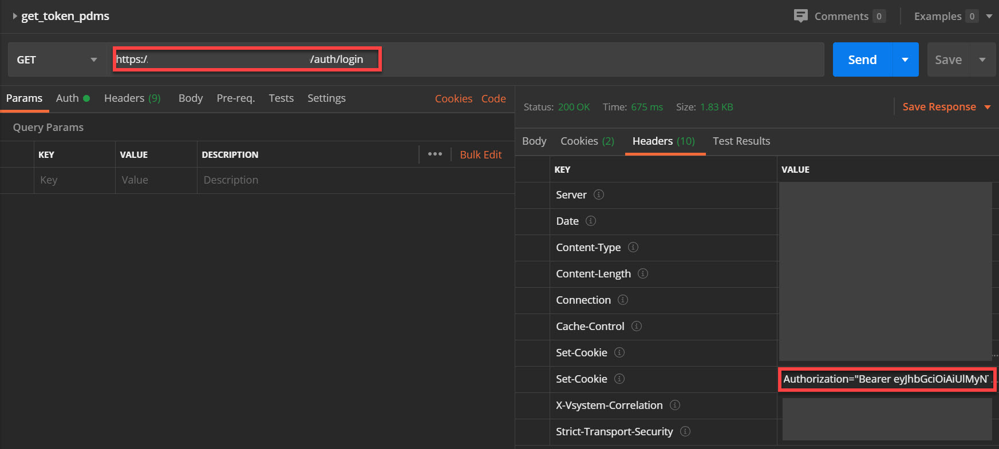

Now create a new **`POST`** request. Go to the **`Auth`** tab, paste the Token you just copied into the `Token` field.

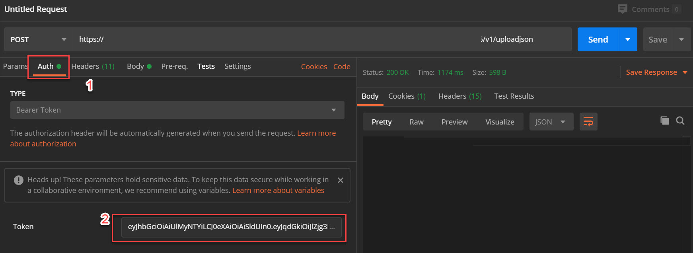

Now go to the deployment page on your ML Scenario Manager, copy the URL of deployment by clicking on the red marked `copy` button right to the URL.

Paste the copied link into your newly created `Post` request in Postman, and add **`v1/uploadjson`** in the end. (This ending is defined in the **`Swagger`** of the operator `OpenAPI Servlow`).

After setting up the credentials, go to the `Body` tab, choose `raw` and `json` format. Then open the `new_data_postman.json` file you downloaded at the beginning of this step (e.g. in a Notepad). Copy&paste the content into the editor in ``Postman``.

Now you can click on the `Send` button to send out the new data. In case of success, your Postman will receive a confirmation message as response.

**To note**: You may sometimes encounter `Forbidden cross-site request` error. When this happens, you need to clean your cookies as indicated below.

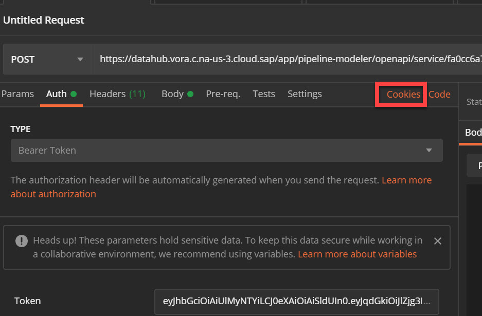

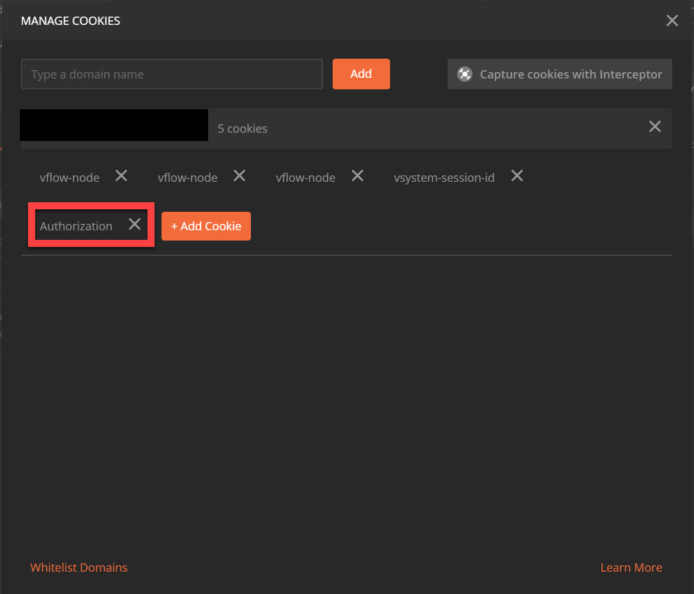

---

If predictions are successfully generated and stored into HANA Data Base, you can see the following message in the UI of **`Wiretap`** you have opened in the last step.

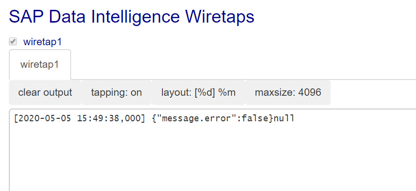

And then you can open `Metadata Explorer` from the dropdown menu in Modeler (or from Launchpad). Navigate through the steps/path: `Browse Connection --> HANA_LOCALHOST --> TRIALEDITION`. Then you can see the table **`IOT_PREDICTION`**. Click on the **`View Fact Sheet`** button to preview the table, in which you can see the expected number of maintenance events for the next 10 days.

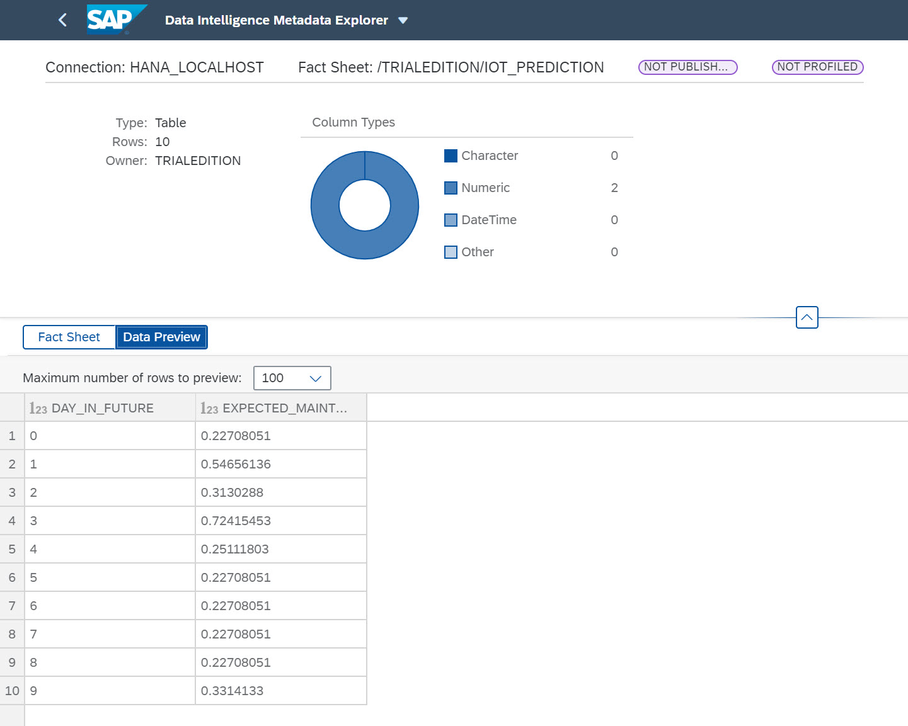

---
