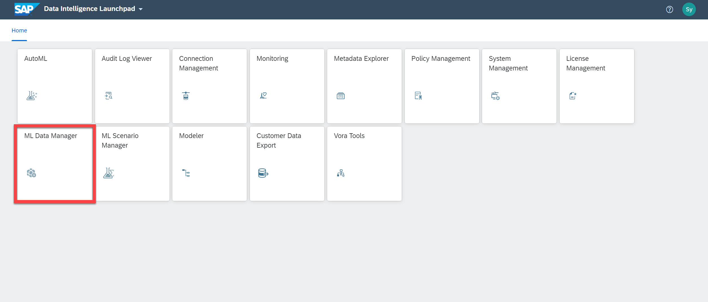
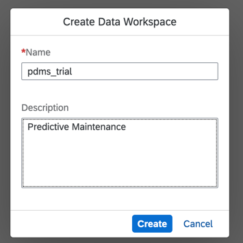
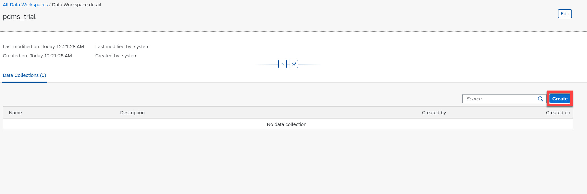
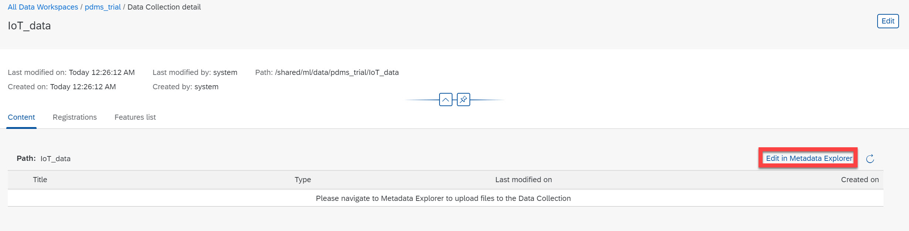
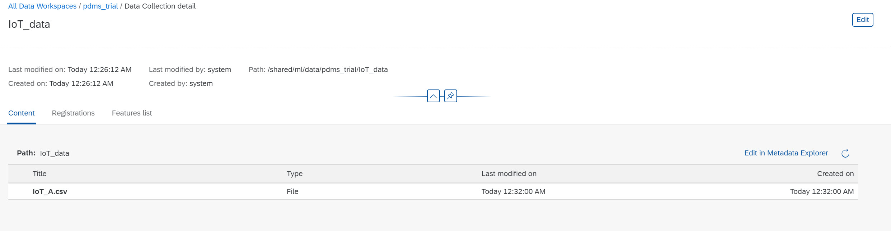
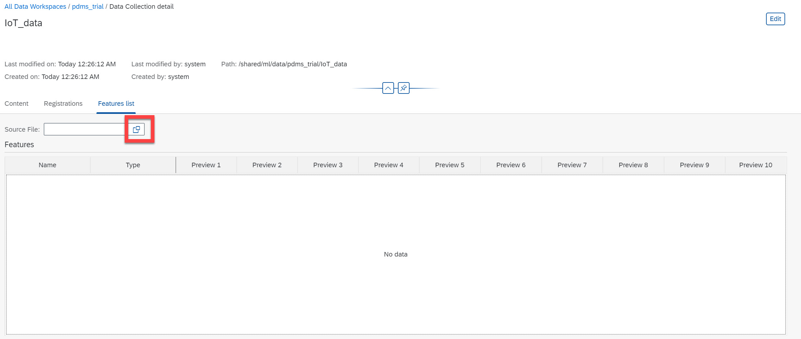
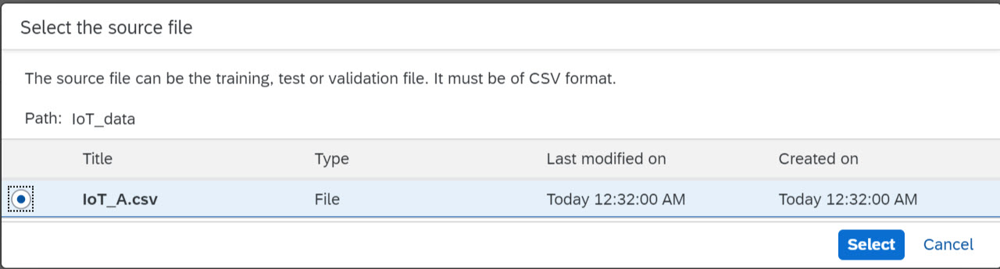
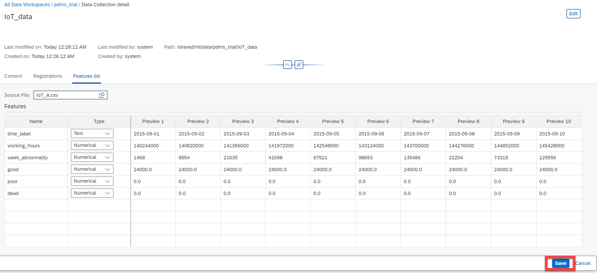

# Organize Data In ML Data Manager - Pam2
<!-- description --> Utilize functionalities of ML Data Manager to organize data

## Prerequisites
 - Completed tutorials for beginner

## You will learn
  - How to create workspaces in ML Data Manager
  - How to upload your data in ML Data Manager

---

### Create a new workspace in ML Data Manager

1. Click [here](https://raw.githubusercontent.com/SAPDocuments/Tutorials-Contribution/tutorials/dataintelligence-trial-v3-train-model-01/IoT_A.csv) to **download** the `.csv` file `IoT_A.csv` to your local machine.

2. Login as the **`system`** user on the **`default`** tenant and click on the tile of **ML Data Manager**.

    

3. On the launch page of ML Data Manager you will find the **Create** button in the upper right corner. Click on it and type **`pdms_trial`** in the pop-up window to create a new workspace.

    

    

4. Create a new `Data Collection` by clicking on the button **Create**. In the pop-up window type `IoT_data` as the name of the collection.

    

5. Click on **Edit in Metadata Explorer** which will launch the `Metadata Explorer` application in a new browser tab.

    

### Upload your data to the data lake

In the **Metadata Explorer** you can upload the `.csv` file `IoT_A.csv`(which you downloaded in Step 1) to this folder by clicking on the upload symbol.

After uploading the data you can switch back to the browser tab of **ML Data Manager**, where you should now see the `IoT_A.csv` in the content tab. If not, please click on **refresh button** of your browser.

### Extract features

1. Click on the row with the title `IoT_A.csv`.  

2. Select **Features List** tab.

3. Click on the **Source File** icon.

    <!-- border -->

4. In the pop up window below select the `IoT_A.csv` file.

    <!-- border -->

5. A preview of the dataset will appear where you can customize the data type of each column. In this case the default data types are correct, click on **Save** in the bottom right corner to save the feature list.

Great! Your dataset is now ready for use in the `ML Scenario` application which we will use in the next section of this tutorial.

---
