# Create ML Scenarios and Jupyter Notebooks - Pam3
<!-- description --> Learn to create ML Scenarios and use Jupyter Notebook to work with data on different connections

## Prerequisites
 - Completed tutorials for beginner
 - Completed tutorials for ML Data Manager
 - Basic knowledge in coding (e.g. Python)
 - Basic knowledge in IDE (e.g. Jupyter Notebook)
---
## You will learn
  - How to create ML Learning Scenarios
  - How to register your data in ML Scenario Manager
  - How to create a Jupyter Notebook and preview your data
---

### Create a new ML scenario

Login to the Data Intelligence Launchpad as the `system` user on `default` tenant. Click on the **ML Scenario Manager** tile.

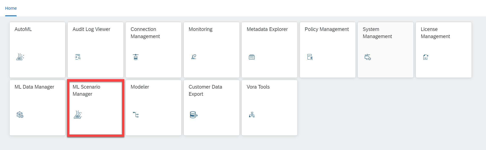

The ML Scenario Manager application helps you to organize your data science artifacts and manage all tasks related to your work in a central location. As a multi-faceted data science application, it is built around the key concept of the machine learning (ML) scenario, which may contain datasets, pipelines, and Jupyter Notebooks.

You can use it to create your machine learning scenarios and add artifacts. You can also manage your model performance metrics and deployment history. If necessary, you can version an ML scenario as a part of your end-to-end workflow, and create a new branch from a previous version.

1. Create a new scenario by clicking on the **+** button in the upper right corner. In the pop-up window enter **`pdms_trial`** as the name. Optionally, you can also briefly describe the business question you have for this scenario. In this and following tutorials, you are going to solve the business question `Predictive Maintenance`

<!-- border -->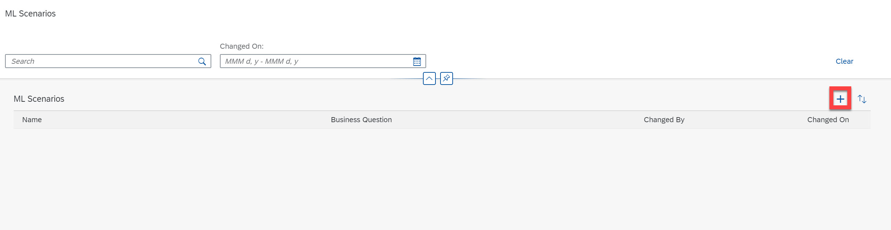
<!-- border -->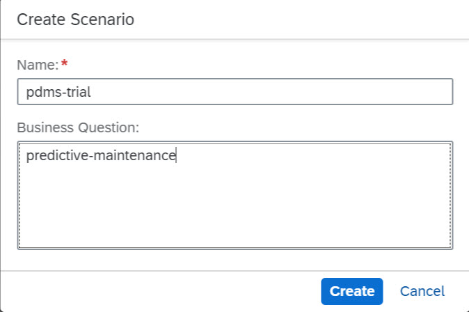

After the creation of the scenario `pdms-trial` you will be led to the next screen, where you can see the overview of all associated datasets, notebooks, pipelines, execution results, models, and deployment of pipeline tasks. Since this is a new scenario, there are none listed.

2. Select the **Datasets** tab and click on the **+** sign to register your data.

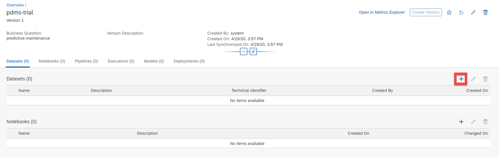
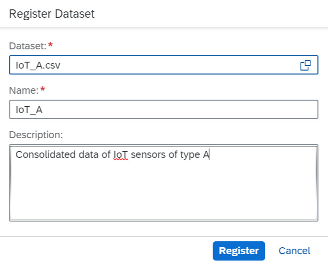

In the pop-up window you can navigate to the workspace->dataset->data where you  previously uploaded `IoT_A.csv` in the ML Data Manager Tutorial using ML Data Manager. The registration completes with a unique `Technical Identifier` assigned to the data set.

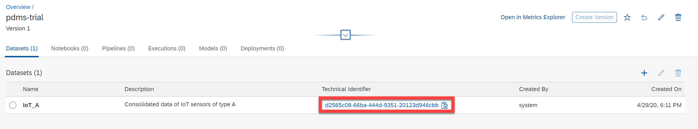

Datasets that are registered for use with an ML scenario are shown in this scenario details page. Each dataset is listed in the table with its name and description, a unique ID (Technical Identifier), and information about who registered the dataset and when.

### Create a Jupyter Notebook

Beneath the `Datasets` sections is the `Notebooks` section. You can create a Jupyter Notebook to experiment with your models or to perform other tasks such as feature engineering.

1. Create a new notebook by clicking on the **+** button and name it **`pdms_trial`**.

    <!-- border -->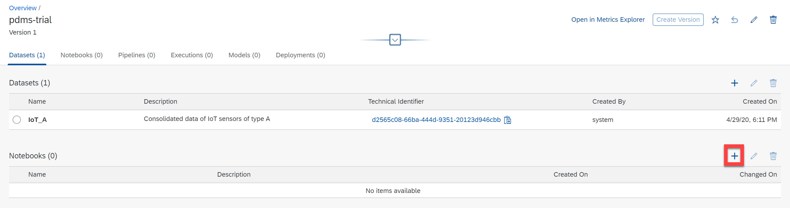

    <!-- border -->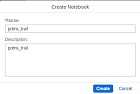

2. The JupyterLab application opens in a new window. Since the Notebook is opened for the first time, you will be prompted to select your kernel. Choose **`Python 3`** as the kernel.

    <!-- border -->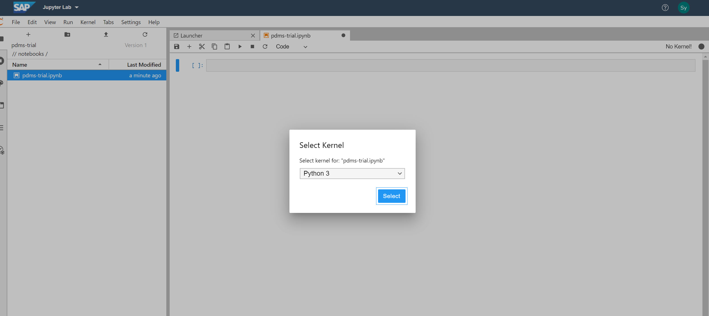

    Now you have a new Jupyter Notebook created within the JupyterLab application. In the JupyterLab environment, you can work on your data science experiments by leveraging the power of built-in libraries and extensions. Available libraries and extensions include SAP HANA Python Client API for Machine Learning and Predictive Analytics for OEM.

3. On the left sidebar, you can see the **Data Browser** add-on as the last button. After clicking on it, you will see three tabs on the top: **METADATA CATALOG**, **CONNECTIONS**, and **DATA MANAGER**.

    <!-- border -->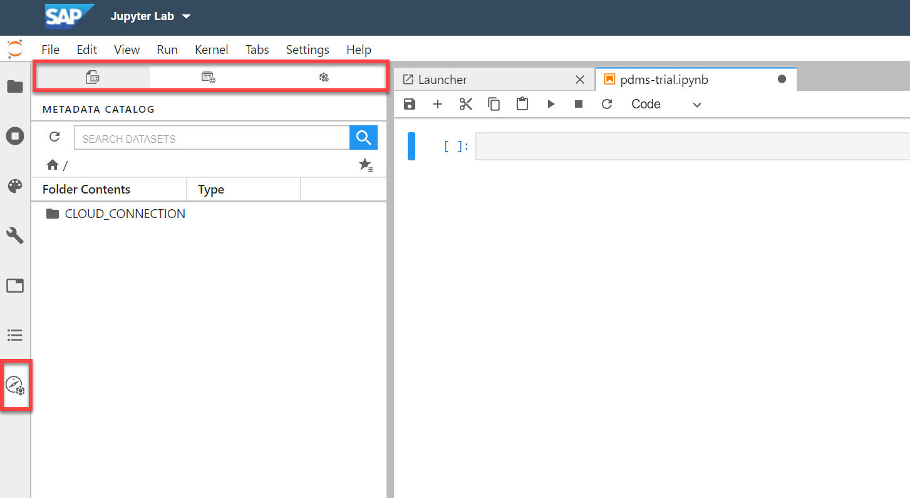

    * In the **METATDATA CATALOG** tab, you can browse the data you have published in the catalog (analog to the Catalog of Metadata Explorer).

    * In the **CONNECTIONS** tab, you can browse connections that support metadata management (analog to the Connections of Metadata Explorer).

    * In the **DATA MANAGER** tab, you can browse the data you have uploaded and organized with ML Data Manager.

4. Taking the **DATA MANAGER** tab as an example, you can see `pdms_trial` displayed in the `Data Workspaces`. After clicking through the folder `IoT_data` you can see the file `IoT_A.csv`.

    <!-- border -->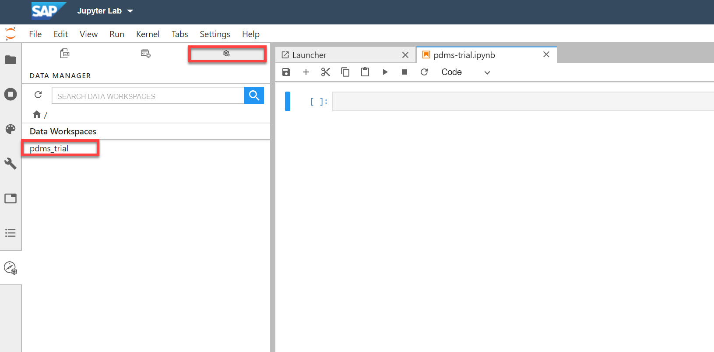

5. In the right end of the row of `IoT_A.csv` click on the **clipboard** icon. A Snippet of code is generated and copied. Paste the **'code'** (CTRL/CMD + V) into the first cell of Jupyter Notebook, then click on the **Execute** button.

    <!-- border -->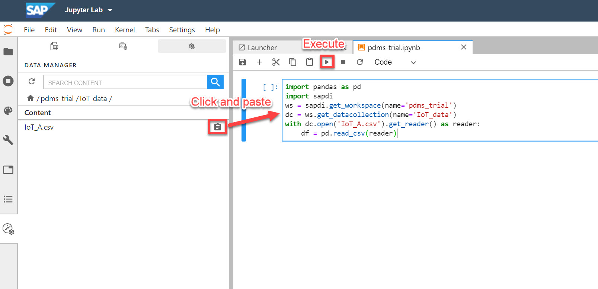

6. After the execution of the code, a new cell is automatically created. Type in the variable **`df`** into the new cell and execute the code again. This generates a data preview of `df`.

    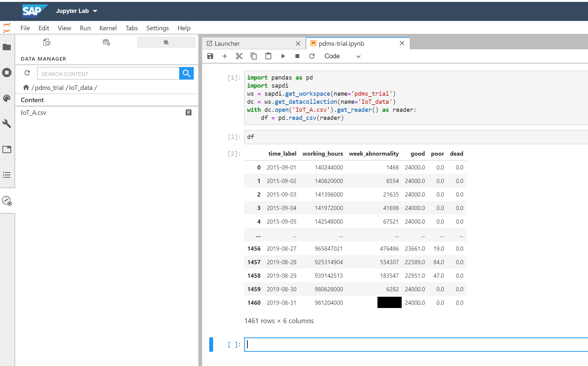

7. **Switch** from the JupyterLab window to the ML Scenario Manager window in your web browser. When you first create your ML scenario, ML Scenario Manager assigns it version number 1. The first version of every scenario is always 'blank', meaning that it doesn't contain any artifacts such as notebooks or pipelines.  Whenever you make a change to your scenario you will see an orange icon under the name of your ML scenario (in the upper left corner) indicating changes. You may want to save the scenario as a new version. By doing so, you can return to a previous version of your scenario and make further modifications from there.

    To save your scenario click on the **Create Version** button in the right upper corner of the ML Scenario Manager.

  <!-- border -->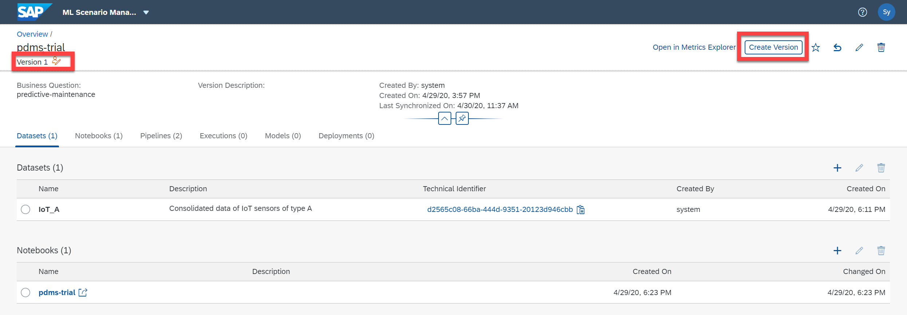

In this section you have seen how data scientists can retrieve data from various data sources connected to SAP Data Intelligence using their familiar Jupyter Notebook environment.

---
