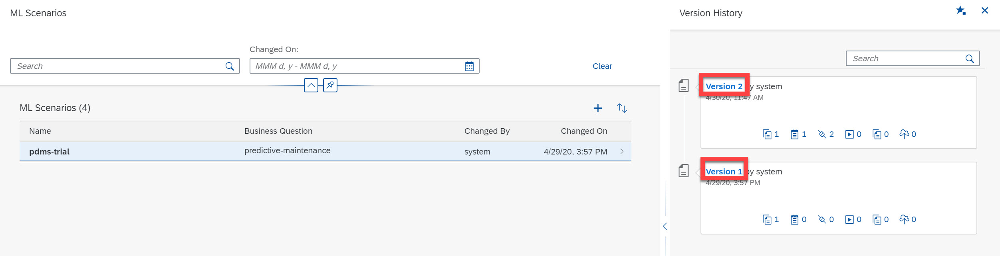
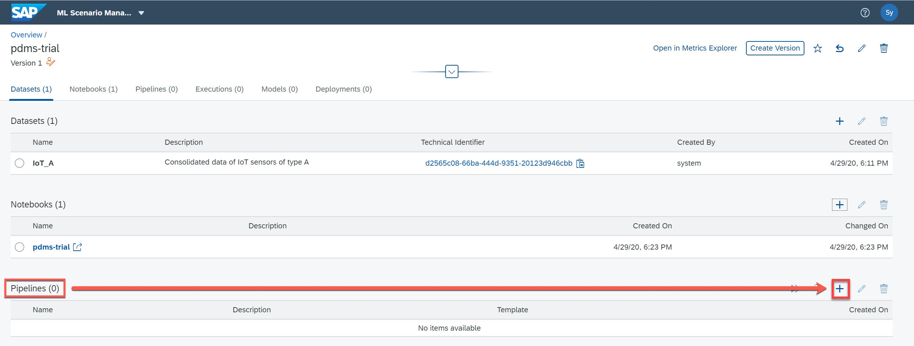
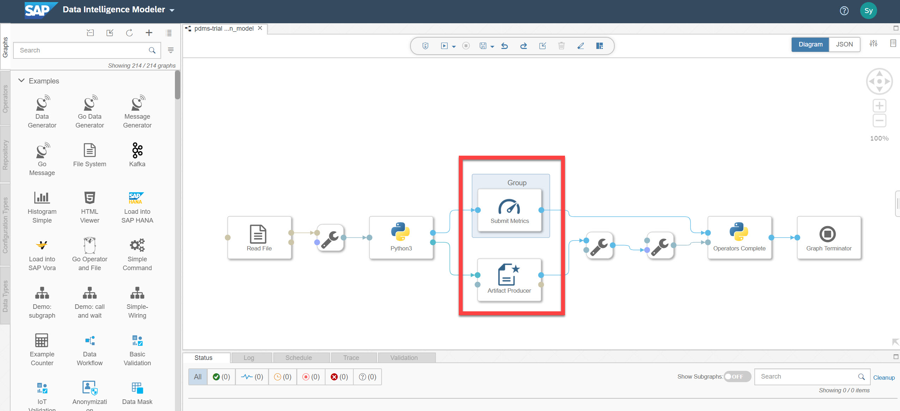
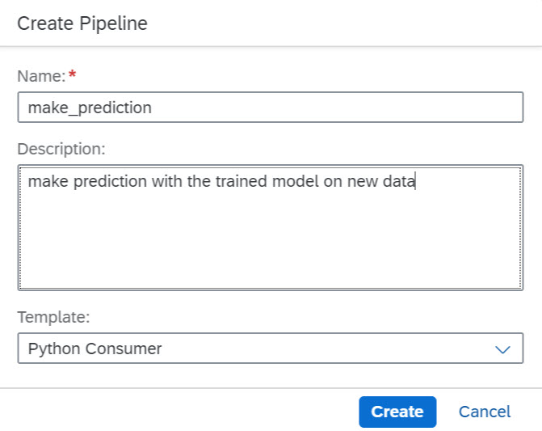
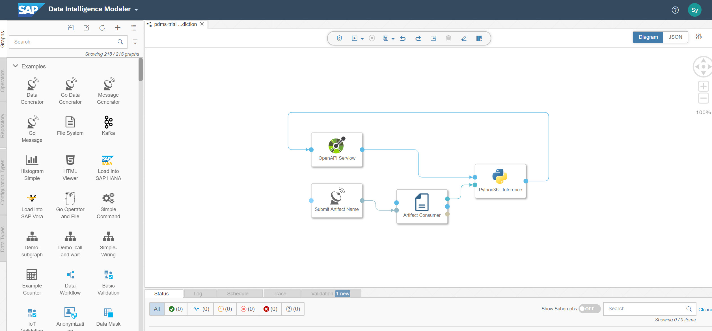

# Create pipelines in ML Scenario Manager - Pam2
<!-- description --> Integrate ML Scenario with Modeler

## Prerequisites
 - Completed tutorials for beginner
 - Completed tutorial Create ML Scenarios and Jupyter Notebooks

## You will learn
  - How to create pipelines within ML Scenario Manager
  - Understand the difference between *Execution* and *Deployment* of pipelines

---

### Create a new Python Producer pipeline in ML Data Manager

In the previous tutorial Create ML Scenarios and Jupyter Notebooks you created the ML scenario `pdms_trial` which is associated with an IoT dataset and a Jupyter Notebook. These were collectively saved as 'Version 2' of your scenario.

1. To continue with the tutorial choose the newest (or desired) version of the ML scenario `pdms_trial`

    <!-- border -->

2. In this tutorial you are going to create new pipelines with predefined templates. Scroll down to the `Pipelines` section and click on the **+** button. You can also navigate  by clicking the **Pipelines** tab on top.

    <!-- border -->

3. In the pop-up window type **`train_model`** as the name of the new pipeline, optionally you can describe the function and purpose of this pipeline. Then choose the template **`Python Producer`** and click on **Create**.

    <!-- border -->

    Upon creating the pipeline you will be led to a new browser tab of the `Pipeline Modeler` which you were introduced to in the beginner-level tutorial Build your first pipeline with SAP Data Intelligence.

4. The Pipeline Modeler comes delivered with a number of graph templates, also referred to as patterns. When creating a pipeline with `Python Producer` template in `ML Scenario Manager` you will be automatically directed to the `Python producer` pattern in `Pipeline Modeler`. This pattern is composed of several standard operators. Two of them are specifically configured for this ML Scenario: `Artifact Producer` and `Submit Metrics`. The generated metrics and artifacts will be automatically registered in the `ML Scenario Manager` which you can check out after successful pipeline execution.

    <!-- border -->

5.  In the following tutorial you will customize and extend your pipelines based on these fundamental constructs. Return to the previous browser tab of  **ML Scenario Manager**.

### Create a Python Consumer pipeline in ML Data Manager

1.  Scroll down to the section of `Pipelines` and click on the **+** button to create a new pipeline as you did in Step 1. Type **`make_prediction`** as the name of the new pipeline and select the **`Python Consumer`** pattern and click on **Create**.

2.  Now you will be returned to `Pipeline Modeler` again where you can see the `Python Consumer` pattern. It includes the `OpenAPI Servlow` and `Artifact Consumer` operators to ingest new data and consume trained model, respectively.

In the following tutorials, you will learn how to create customized operators to extend those two basic pipelines that were generated from the ML patterns.

---
