# Customize Python Operators Part 01 - Asim2
<!-- description --> Extend basic Python Operator with further packages and configurations

## Prerequisites
 - Completed tutorials for beginner
 - [Basic Python programming knowledge](https://www.python.org/about/gettingstarted/)
 - Completed tutorial Create pipelines in ML Scenario Manager

## You will learn
  - How to create a docker file in the Modeler
  - What are the basic components of a customized operator

---

### Build a docker image with docker file


You have created two pipelines in the last tutorial Create pipelines in ML Scenario Manager. Go to the **ML Scenario Manager**. Open your scenario and  click on the pipeline `train_model` to open it in `Data Intelligence Modeler` for further extension with customized operators.


Operators in a pipeline are running in containers (dockers) and those running containers are instances of docker images. Therefore, you need to first specify a docker file to create a docker image that can be assigned to an operator later.

Go to the **Repository** tab of the panel on your left-hand side, choose the folder `dockerfiles`. Then go to the toolbar at the top and click on the **+** button. Choose **`Create Docker File`** in the drop-down menu.

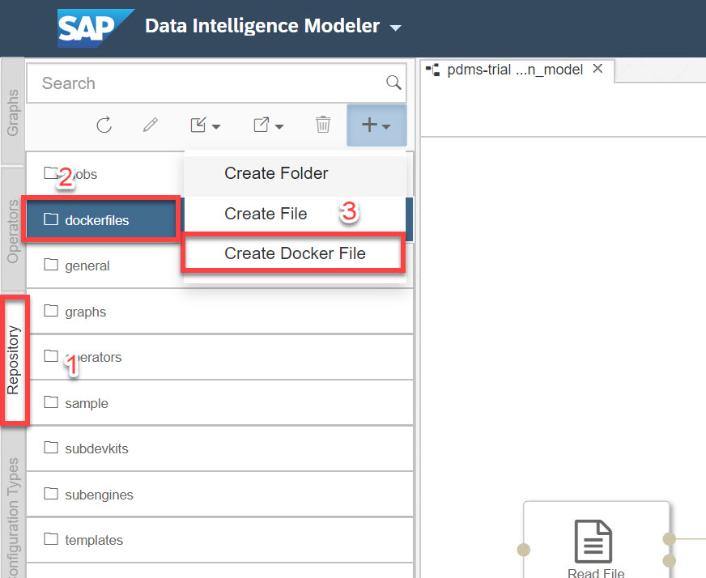

In the pop-up window you enter the name **`pdms_trial`** and click on **OK**.

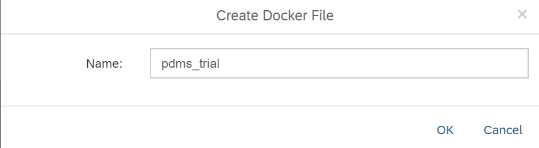

Copy the following code into the **`file editor`** of the docker file.

```Docker
FROM $com.sap.sles.base
RUN pip3.6 install --upgrade --user pip
RUN pip3.6 install --user numpy pandas sklearn tensorflow
```

> The first command line is to inherit from a base image that is preconfigured by SAP. The second command line is to extend the base image by installing additional Python packages. If your instance is not connected to internet, you can also use pip to install local packages you have downloaded, by specifying the local path to the location where you have the installation files stored.

Now, click on the button in the right upper corner of docker file editor as indicated by the label `1` in the following screenshot to open the side
panel where you can add tags for the docker image. Then input three tags as shown below using the **+** button. For the tag **`tornado`** also enter the version **`5.0.2`** as indicated by the label `2` in the screenshot.

|  Tag name     | Version
|  :------------- | :-------------
|  **`pdms_trial`**   | |
|  **`python36`**      | |
|  **`tornado`**        | **`5.0.2`**

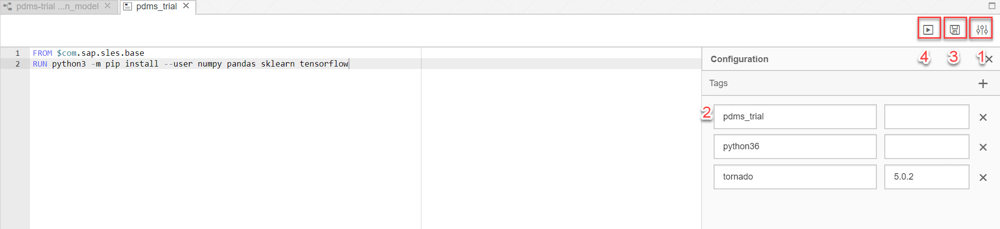

After filling in the tags, click on the **Save** and then **Build** button (labels `3` and `4`). Now you will see a message beside the buttons saying that the docker image is being built. It will take several minutes for the process to finish. Once complete you will see a message with build status as completed.


### Create a new operator


After the successful build of a docker image, you are ready to create a new operator. First go to the tab **Operators** on the left-hand side panel, then click on the **+** button to create a new operator.


In the pop-up window, type the information from the table below. Then click on **OK**.

|  Field Name     | Value
|  :------------- | :-------------
|  Name           | **`com.sap.trial.pdms.TrainTestDataMaker`**
|  Display Name   | **`Train&Test DataMaker`**
|  Base Operator  | **`Python3 Operator`**
|  Category       | **`pdms_trial`**

> A `fully qualified name` refers to the folder structure in the repository. In this case, the name **`com.sap.trial.pdms.TrainTestDataMaker`** will generate the folder structure: com-->sap-->trial-->`pdms`--`TrainTestDataMaker`, and if the folders already exist, the new operator will be placed in the target folder. The Python Operator can be found in the folder of `Subengines` in the **Repository**.

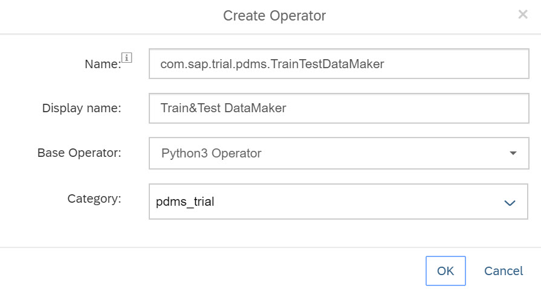


### Configure ports and docker image


After the initialization of the new operator, you are landed in the `Operator Editor`, where you can further specify the attributes of the operator.

You can change the icon of your operator by clicking on the **puzzle symbol**. In the pop-up window you can type **`scissor`** to find the icon shown in the screenshot. It is also possible to upload your customized icon file in SVG. Click **OK** to save your changes.
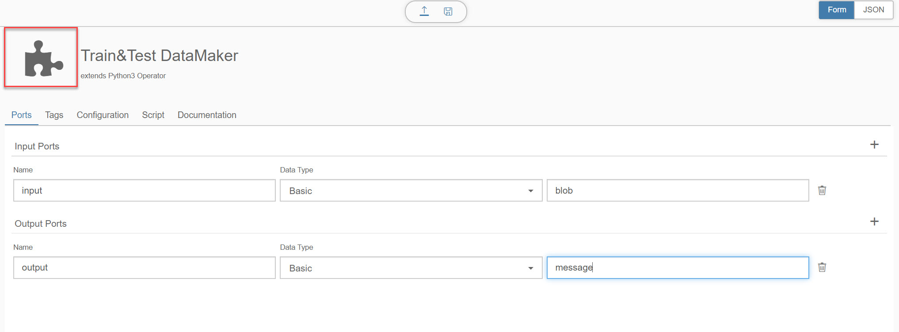
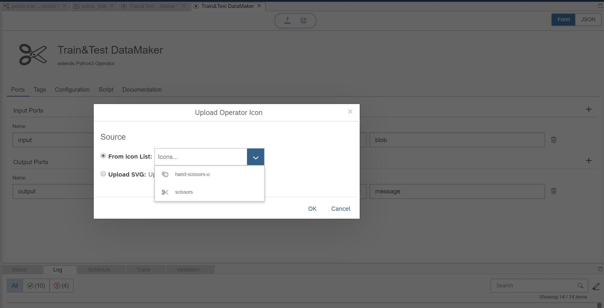

In the first tab **Ports** you can define the in and out ports for your operator. Please click on the **+** button to add new ports and configure them as described in the following table.

> The name of ports are case sensitive!

|  Port    | Name      | Basic Data Type | Extended Data Type|
|  :-------| :------   | :----------------------|
|  Input | **`input`**   | **`Basic`**| **`blob`**    |
|  Output | **`output`** | **`Basic`**| **`message`** |

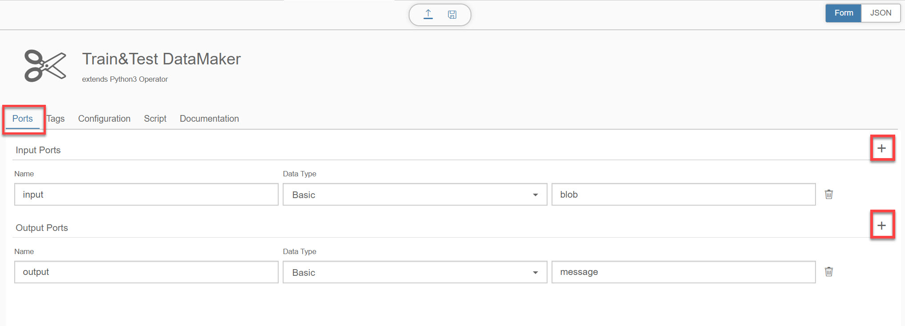

After setting up ports you can save the changes by clicking on the **Save** icon. (It is a good practice to save your changes before switching to other tabs.)

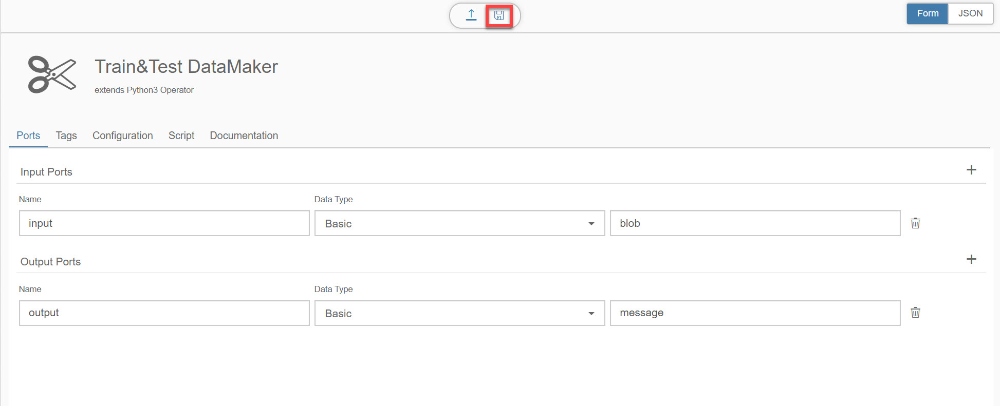

 Now switch to the tab **Tags**. Click the **+** to add a tag. Find the tag **`pdms_trial`** in the dropdown menu. Leave the Version to `No version`. Save the changes by clicking on the **Save** icon. With this being done, you have assigned the newly created docker image to this operator.

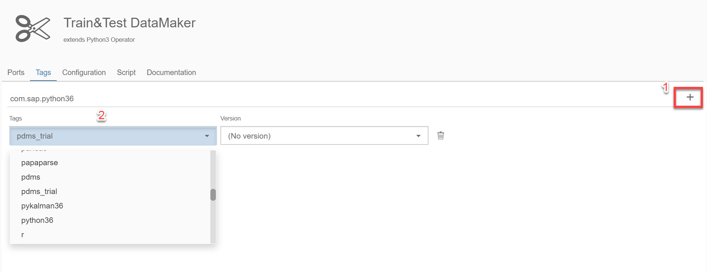


### Set configurations and script


Now switch to the third tab **Configuration** and click on the **pen** icon on the right.

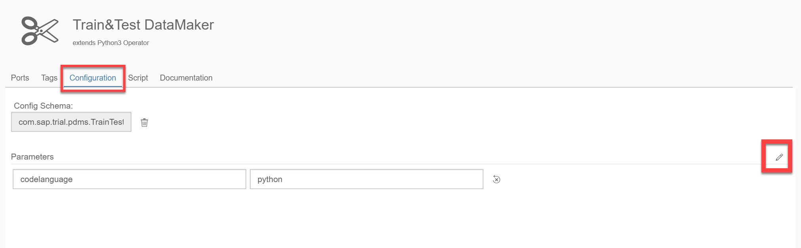

In the pop-up window, you can click on **+** button to add properties to your operator. For the sake of simplicity, in this tutorial click on **JSON** and switch to the `JSON editor` view, delete the initial codes and copy and paste the following code into it. When you switch back to **Form** you will be able to browse and edit each property in the UI.

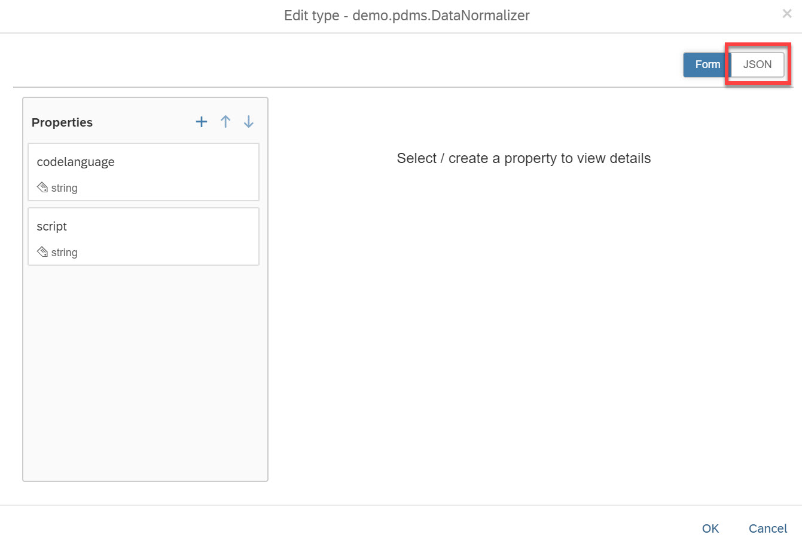

```JSON
{
	"$schema": "http://json-schema.org/draft-06/schema#",
	"$id": "http://sap.com/vflow/com.sap.trial.pdms.TrainTestDataMaker.configSchema.json",
	"type": "object",
	"properties": {
		"codelanguage": {
			"type": "string"
		},
		"script": {
			"type": "string"
		},
		"seq_len": {
			"title": "days of predicting data",
			"type": "string"
		},
		"future_predict_period": {
			"title": "days of prediction",
			"type": "string"
		},
		"vali_per": {
			"title": "test data proportion",
			"type": "number"
		}
	},
	"required": [
		"seq_len",
		"future_predict_period",
		"vali_per"
	]
}
```

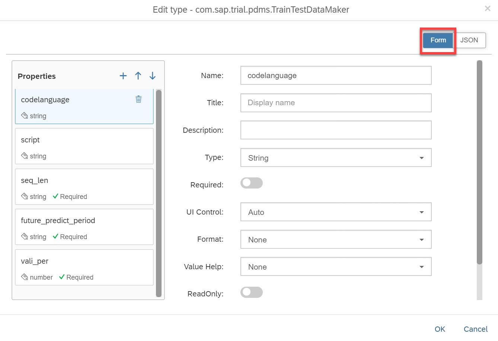
Click **OK** and **Save**


### Edit Python code


When you switch to the fourth tab **Script**, you can write your Python code in the editor. Copy and paste the following code into the editor. Frequently used Python objects and methods will be introduced and explained in the next tutorial [Customize Python Operators Part 02].

```Python
import numpy as np
import pandas as pd
import pickle
import io

class XY_Maker():

    def __init__(self):
        self.vali_per = float(api.config.vali_per)
        self.seq_len = int(api.config.seq_len)
        self.future_predict_period = int(api.config.future_predict_period)
        self.new_message = {}

    def get_message(self, blob):
        df_io = io.StringIO(blob.decode('utf-8'))
        self.df = pd.read_csv(df_io)

    def split_data(self):

        if self.vali_per < 1:
            for day in range(1, self.future_predict_period+1):
                self.df[f'future_poor{day}'] = self.df['poor'].shift(-day)

            self.df.dropna(inplace = True)
            to_row = int(self.df.shape[0]*(1-self.vali_per))

            self.new_message['train_df'] = self.df.iloc[:to_row]
            self.new_message['vali_df'] = self.df.iloc[-to_row:]

        else:
            self.new_message['train_df'] = ''
            self.new_message['vali_df'] = self.df

    def create_metadata(self):
        meta_data = {'seq_len': self.seq_len,
                        'future_predict_period': self.future_predict_period,
                        'vali_per': self.vali_per}
        self.new_message['meta_data'] = meta_data

    def send_message(self):
        new_message = api.Message(pickle.dumps(self.new_message))
        api.send('output', new_message)

m = XY_Maker()
def on_input(message):
    m.get_message(message)
    m.split_data()
    m.create_metadata()
    m.send_message()

api.set_port_callback('input', on_input)
```
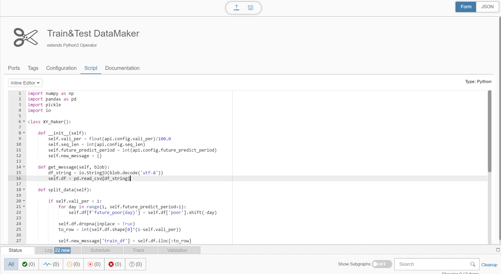

Make sure you **Save** your changes by clicking on the save icon at the top.


---
