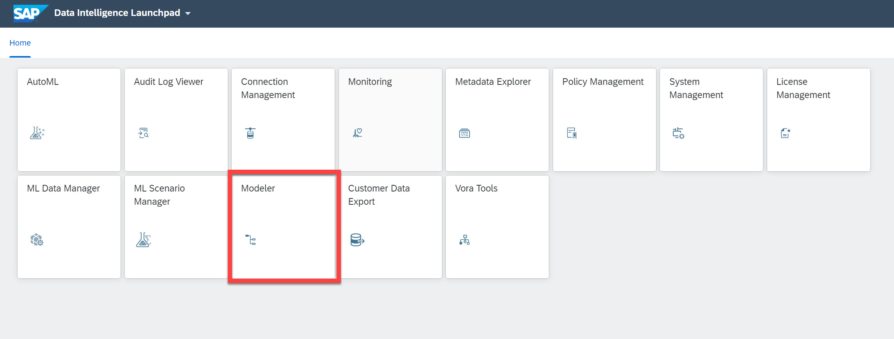
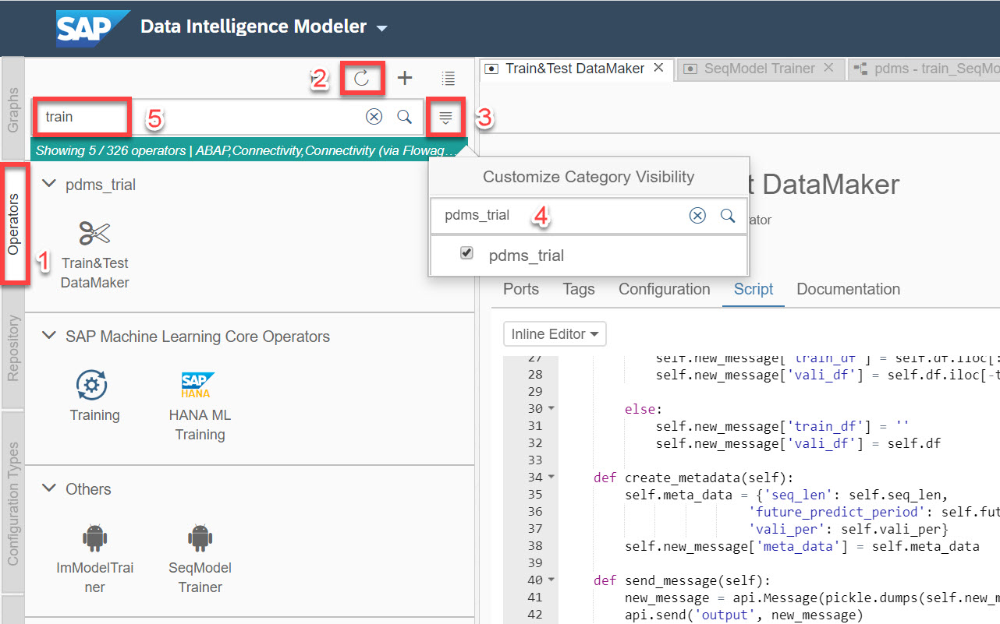
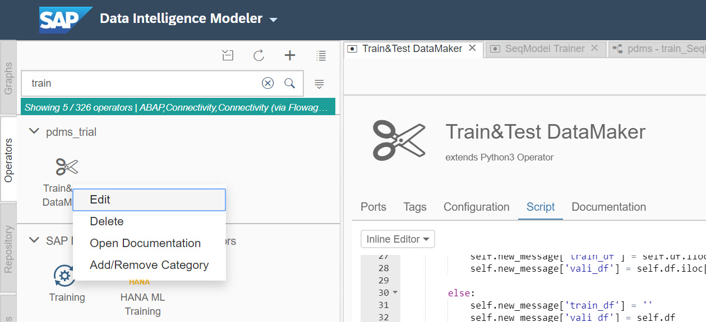
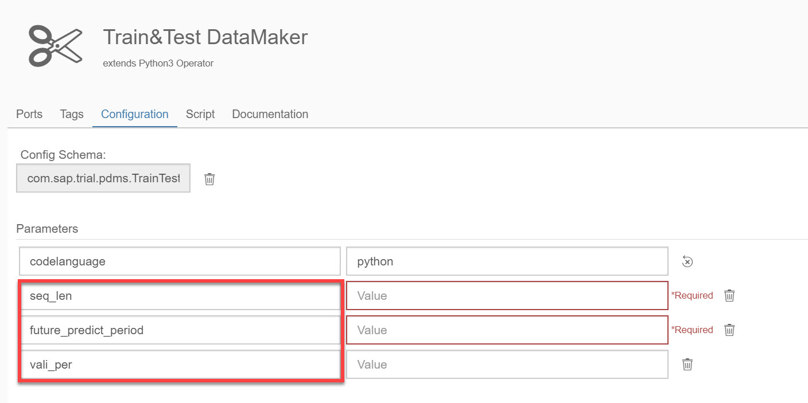

# Customize Python Operators Part 02 - Pam2
<!-- description --> Define the behavior of operators with basic built-in Python objects and methods.

## Prerequisites
 - Completed tutorials for beginner
 - [Basic Python programming knowledge](https://www.python.org/about/gettingstarted/)
 - Completed tutorial Customize Python Operators Part 01

## You will learn
  - How to receive binary `csv` data from input ports.
  - How to send data via output ports.
  - How to trigger functions in the operator.

---
### Read parameters and data in Python script

You have learned how to create and customize a new Python operator in the previous tutorial Customize Python Operators Part 01. In this tutorial, you will learn the basic built-in Python objects and methods for your development in Modeler by going through the script you have attached to the operator **`Train&Test DataMaker`**.

Go to the launchpad of your Data Intelligence and open **Modeler**.



Then select **Operator** tab in the left panel, click on the **Refresh** button. After the operators are updated, open the categories and look for the category `pdms_trial`, check the **box** and then type **`Train&Test DataMaker`** in the search bar of operators.



Right-click on the icon of the operator and choose **`Edit`** to open the operator editor. In the editor, choose the tab **Script** to view the Python Script.



You see the first lines of the code, a few libraries are imported and a class is created. In the construct `__init__()` of the class, three parameters are read from the fields of the `api.config` object.

> The `api` object is defined in the global environment and you do not need to import it.

```Python
import numpy as np
import pandas as pd
import pickle
import io

class XY_Maker():

    def __init__(self):
        self.vali_per = float(api.config.vali_per)
        self.seq_len = int(api.config.seq_len)
        self.future_predict_period = int(api.config.future_predict_period)
        self.new_message = {}
```

-	`vali_per`: proportion of data used as testing data in decimal.
-	`seq_len`: number of days that are used to make predictions.
-	`future_predict_period`: number of days to be forecasted.

Those three fields are defined in the `Configuration` of the operator, you can check them out by clicking on the tab **Configuration**.

 

The field `self.new_message` is set to an empty dictionary, which you will fill with data later.

The second method of the class is to get data from the input port. The input port itself receives blob (binary) data from the preceding operator. So the data should be decoded (default with `utf-8`). And the data is a `csv` file as you have previewed in ML Data Manger and `Juypter` Notebook. Therefore, you can use `pandas` to read the decoded data after it is transformed into `io` streaming data.

```Python
def get_message(self, blob):
    df_io = io.StringIO(blob.decode('utf-8'))
    self.df = pd.read_csv(df_io)
```


### Send data and define the trigger of action


After reading in the parameters and data, you can now split them into parts. The attribute **`poor`** is set as target value for the predictions. Parameters from the `Configuration` will be passed on in a dictionary of `meta_data`.

```Python
def split_data(self):

    if self.vali_per < 1:
        for day in range(1, self.future_predict_period+1):
            self.df[f'future_poor{day}'] = self.df['poor'].shift(-day)

        self.df.dropna(inplace = True)
        to_row = int(self.df.shape[0]*(1-self.vali_per))

        self.new_message['train_df'] = self.df.iloc[:to_row]
        self.new_message['vali_df'] = self.df.iloc[-to_row:]

    else:
        self.new_message['train_df'] = ''
        self.new_message['vali_df'] = self.df

def create_metadata(self):
    meta_data = {'seq_len': self.seq_len,
                    'future_predict_period': self.future_predict_period,
                    'vali_per': self.vali_per}
    self.new_message['meta_data'] = meta_data
```

With the creation of training and testing datasets, as well as meta data, you can now send them out with the `api.send()` method. Two positional parameters are required: **name of the port** and **name of the data**. Not all Python objects can be sent, but only those that are serialized data. Therefore, you can use the module `pickle` to transform the data into binary, which is compatible with the data type `message` of the export port.

```Python
def send_message(self):
    new_message = api.Message(pickle.dumps(self.new_message))
    api.send('output', new_message)
```

By default, operators will run indefinitely and independently from other operators. If this behavior is not desired, you need to specify otherwise. A common scenario is that you use input data or signal to trigger the functions and methods. In the last block of the Python script, you initialize the class and define a function `on_input` that delineates the workflow of the operator. In the end, this function will be called via the method `api.set_port_callback()` when any data arrives at the input port `input`.

> The method `api.set_port_callback()` requires two parameters: **`name of input port`** and **`name of function`**, while the function must take the exact number of input parameters as input ports. You can use rectangle brackets `[]` to include several input ports, e.g.  **`api.set_port_callback(['input1', 'input2'], name_of_function)`**. And in this way, the function will only be called when all specified input ports have received data.

```Python
m = XY_Maker()
def on_input(message):
    m.get_message(message)
    m.split_data()
    m.create_metadata()
    m.send_message()

api.set_port_callback('input', on_input)
```

In this tutorial you have learned three built-in methods that help you customize a functional Python operator. You will get to learn further functions in subsequent tutorials.


--
