# Customize Python Operators Part 03 - Pam
<!-- description --> Import operators as a solution and integrate operators/pipelines into ML Scenario Manager

## Prerequisites
 - Completed tutorials for beginner
 - [Basic Python programming knowledge](https://www.python.org/about/gettingstarted/)
 - Completed tutorial Customize Python Operators Part 01
 - Completed tutorial Customize Python Operators Part 02

## You will learn
  - How to import solution into your workspace
  - How to integrate the parameter setting into ML Scenario Manager

---

### Import operators as solution

You have learned how to create and customize a new Python operator in the previous tutorials, e.g. Customize Python Operators Part 01. In this tutorial, you can directly upload a solution that contains another five operators for the pipelines.

First, download the solution `pdms_trial_operators` from [here](https://raw.githubusercontent.com/SAPDocuments/Tutorials-Contribution/tutorials/dataintelligence-trial-v3-train-model-06/pdms_trial_operators-0.0.1.zip/) to your local machine. Launch **ML Scenario Manager**. Click on your scenario and choose the appropriate version. Scroll down to the pipeline-section, click on the `train_model` to open the pipeline in **Modeler**.

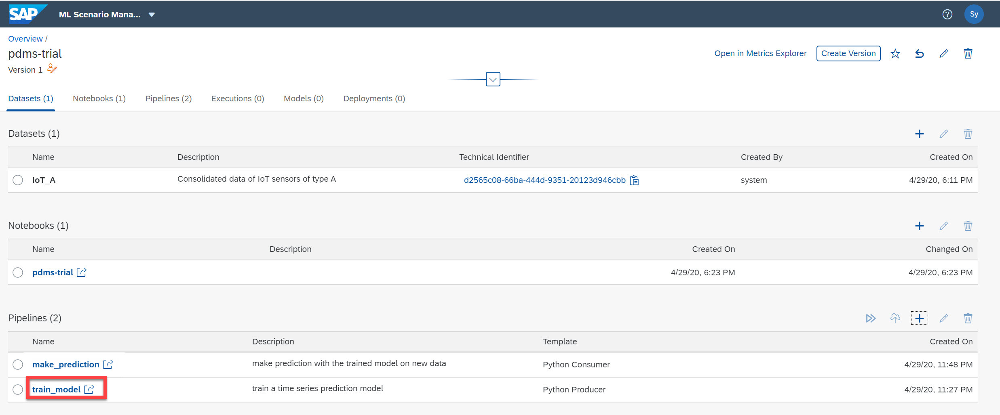

Then select the tab titled **Repository** on the left hand bar,choose the folder `Operators` click on the import icon and choose **`Import Solution`**.

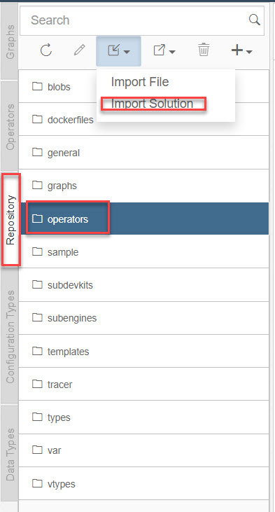

In the pop-up window select the downloaded solution file `pdms_trial_operators-0.0.1.zip` and click **OK** in the following window.

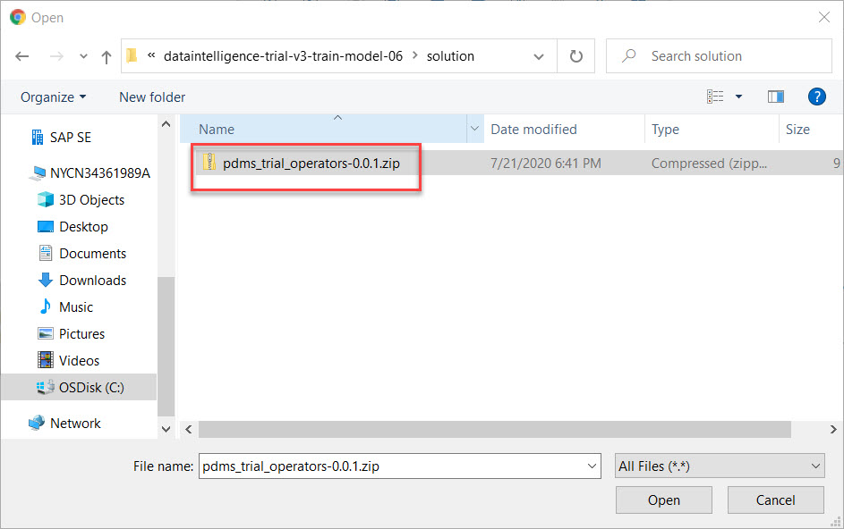

After the successful import of the solution into your repository, you can now go the tab **Operators**, click on **Refresh** and check the category **`pdms_trial`**. Now you can see the imported operators under the category of **`pdms_trial`**.

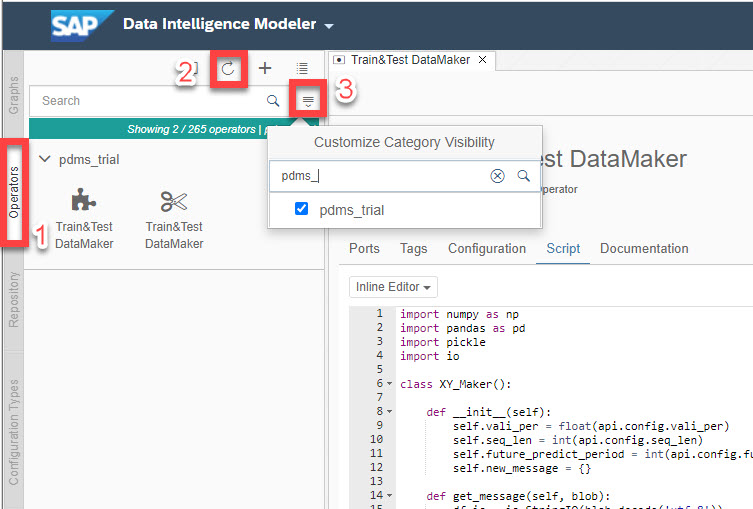

List of imported operators:

-	`Data Normalizer`: it normalizes data based with metrics derived from training data, so that bias due to different scales can be avoided.
-	`SeqTensor Maker`: it transforms data into `Tensorflow Model` friendly format.
-	`SeqModel Trainer`: it builds `Tensorflow Graph` and trains the model.
- `IoT Predictor`: it uses the trained model and new ingested data to make predictions.
-	`Data Loader`: it forwards data from `OpenAPI Servlow` to further operators and returns feedback.

> If you cannot find operators specified above, you can select all categories and search for the name of each operator. Or select the **`Others`** category

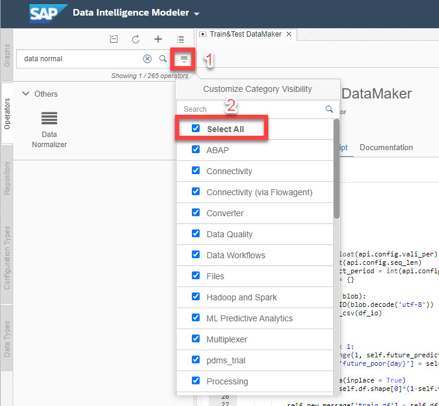

### Modify your model training pipeline

With the imported operators you are now ready to modify your pipelines. First delete the `Python3` operator by clicking on the operator, then select the **Remove** icon in the pop-up menu as indicated in the screenshot below. In the same way you will delete the operator `ToString Converter` before the `Python3` operator.

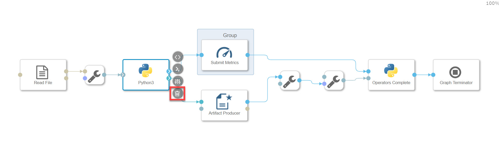

Then you **right-click** on the operator `Artifact Producer` and select **`Group`** in the pop-up menu. In this way, you can have the grouped operators running in a different pod with a different docker image.

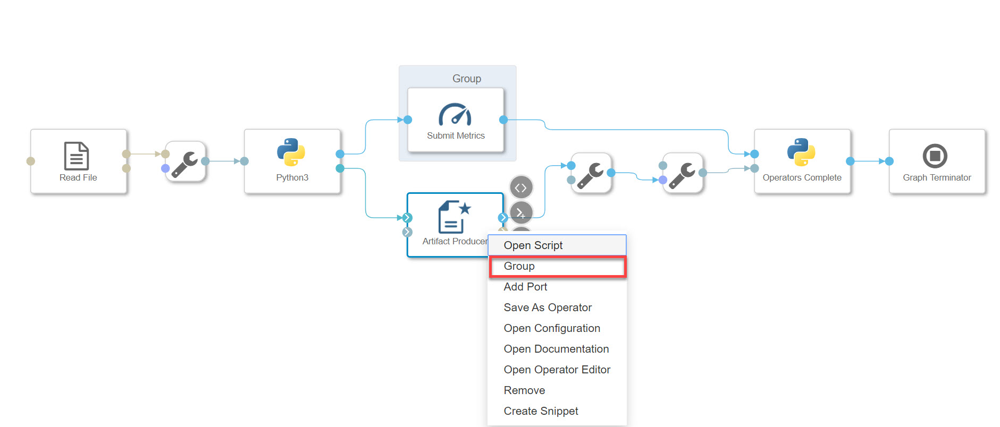

Now you can drag operators from the left-hand panel to the graph to add them into the pipeline and connect them as shown in the screenshot below. Those six operators are:

- `ToBlob Converter`
- `Train&Test DataMaker`
-	`Data Normalizer`
-	`SeqTensor Maker`
-	`SeqModel Trainer`
- `Wiretap`

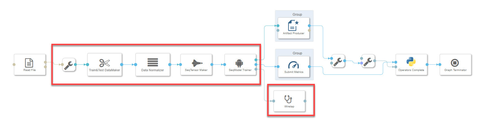

> The port of `SeqModel Trainer` connected to `Artifact Producer` is **`model`** and the port connected to `Submit Metrics` is **`history`**.

In order to monitor the training process, you can also connect the built-in operator `Wiretap` to the third port **`log`** to receive logging data from the `SeqModel Trainer` operator.

When you have completed connecting operators, you can click on **Auto Layout** to automatically align operators.

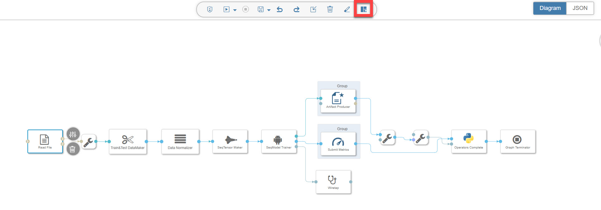

### Configure operators

In this step, you will configure each operator to and integrate them into the ML Scenario Manager. To open the configuration panel of operators, first click on the operator, then select the configuration icon as indicated in the screenshot below.

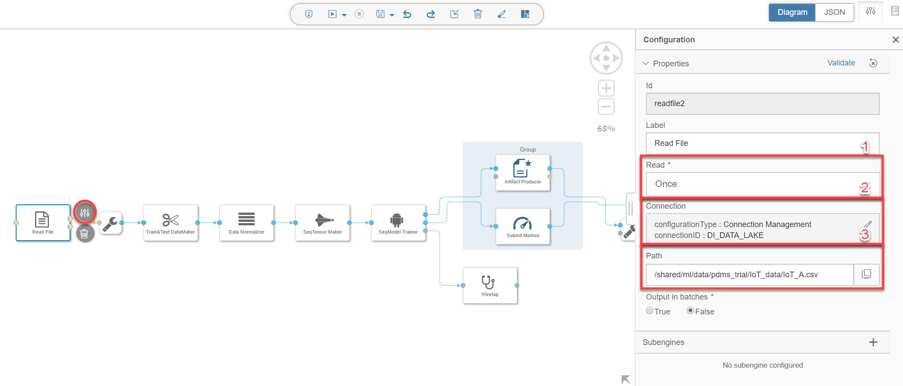

**Read File Operator**

In the configuration panel, set relevant fields with data from the table below.

|  Field Name     | Value
|  :------------- | :-------------
|  Read           | **`once`**
|  `configurationType` | **`Connection Management`**
|  `connectionID`   | **`DI_DATA_LAKE`**
|  path           | **`/shared/ml/data/pdms_trial/IoT_data/IoT_A.csv`**

---

**`Train&Test DataMaker Operator`**

In the configuration panel, set relevant fields with data from the table below.

> The `${place_holder}` is a method to bind the field to the configuration panel in the ML Scenario Manager, so that all fields of different operators can be viewed and filled on one page.

|  Field Name     | Value
|  :------------- | :-------------
|  `days_of_predicting_data`| **`${days_of_predicting_data}`**
|  `days_of_prediction`     | **`${days_of_prediction}`**
|  `test data proportion`   | **`0.1`**

---

**`Data Normalizer Operator`**

No configuration required.

**`SeqTensor Maker Operator`**

In the configuration panel, set relevant fields with data from the table below.

|  Field Name     | Value
|  :------------- | :-------------
|  shuffle         | **`True`**

---

**`SeqModel Trainer Operator`**

In the configuration panel, set relevant fields with data from the table below.

|  Field Name     | Value
|  :------------- | :-------------
|  epochs         | **`${epochs}`**
|  early stopping | **`True`**
|  patience    | **`3`**

---

**Artifact Producer Operator**

In the configuration panel, set relevant fields with data from the table below.

|  Field Name     | Value
|  :------------- | :-------------
|  Artifact Name  | **`${model}`**
|  Artifact Kind  | **`model`**

---

**Submit Metrics Operator**

No configuration required.

---

**Operators Complete Operator**

No configuration required.

---

Now you have your model training pipeline all set. Go back to the overview of your ML Scenario Manager and **Create Version**.

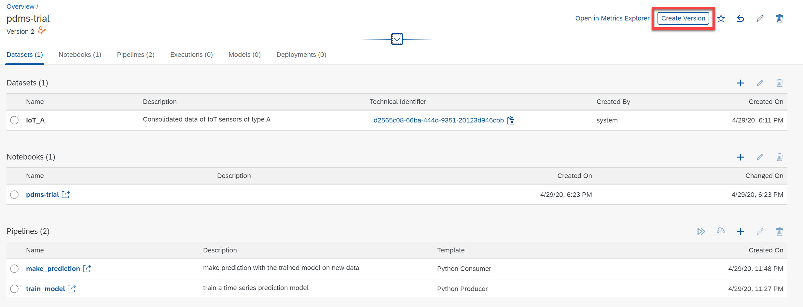

---
