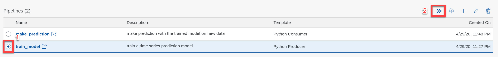
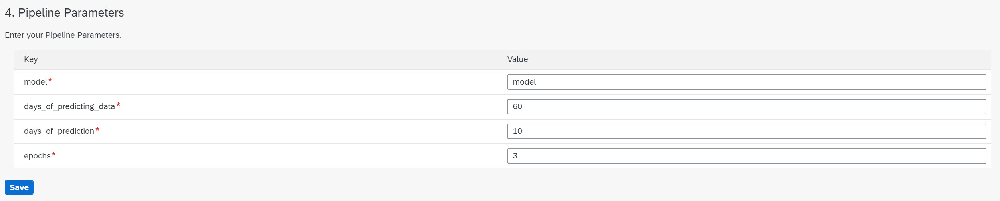
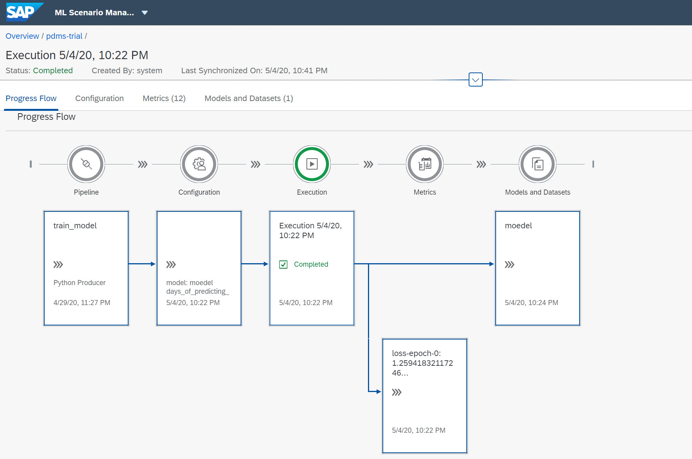
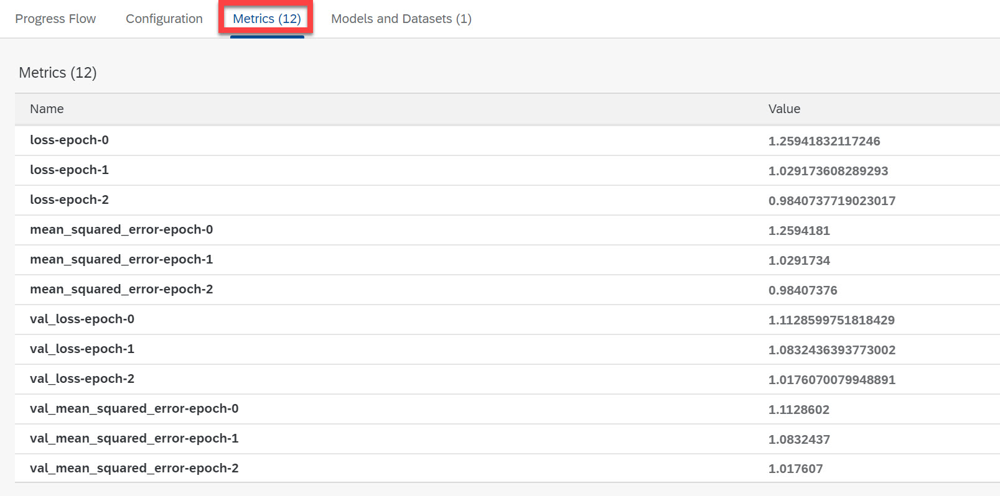
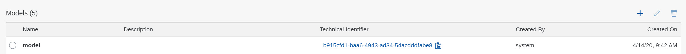

# Execute Pipelines in the ML Scenario Manager - Asim
<!-- description --> Configure parameters and execute pipelines in ML Scenario Manager

## Prerequisites
 - Completed tutorials for beginner
 - Completed tutorial **Customize Python Operators Part 03**

## You will learn
  - How to configure and execute pipelines in ML Scenario Manager.
  - How to review results of the execution.

---

### Configure and execute pipelines

You have modified and configured the model training pipeline in the last tutorial **Customize Python Operators Part 03**. Now you can check box left to the **`train_model`** pipeline and click on **`execute`** as indicated in the screenshot below.

**Note**: It is recommended you create a new version of your ML Scenario if you have made any changes on the pipeline.

In the next screen you see four steps to prepare the execution of the pipeline. In the first step you can review of the basic information of the pipeline; In the second step you can add a brief description about your pipeline (its purpose, construct etc.). And if you have previously executed the pipeline in the **`same version`**, you can select the old settings in the third step. Otherwise you can enter values in the fourth step as indicated in table and screenshots below.

|  Field Name     | Value
|  :------------- | :-------------
|  model        | **`model`**
|  `days_of_predicting_data`  | **`60`**
|  `days_of_prediction`    | **`10`**
|  epochs        | **`3`**

**Explanation of the values**: With the values above, you are going to create a `Tensorflow` model with the name of **`model`**. The training is utilizing the data of **``every past 60``** days to predict the value of **`every next 10`** days. The number of training epochs is set to **3**, and it is obviously not a reasonable number for such training task and very likely it will not return any useful results. But in this tutorial, such a small number saves time and yet fulfils the demonstration purpose.

After clicking on the `save` button, the pipeline is sent for execution. You can monitor the running status both in the `ML Scenario Manager` and `Modeler`.

### Review the execution of pipelines

After the successful execution, you will obtain both metrics and model from the pipeline. You can either scroll down the page to the corresponding sections or click on the blocks of metrics and model in the workflow graph.

In the metrics, you can view the **`loss`** and **`accuracy`** of each epoch in both training and validation (testing) datasets.

In the model section, you will find the created `Tensorflow` model which is saved as an artifact, and a unique technical id is assigned to it.

With the model being created, you can now make prediction once new data comes in. In the following tutorials, you will learn how to deploy a prediction service with ML Scenario Manager.

---
