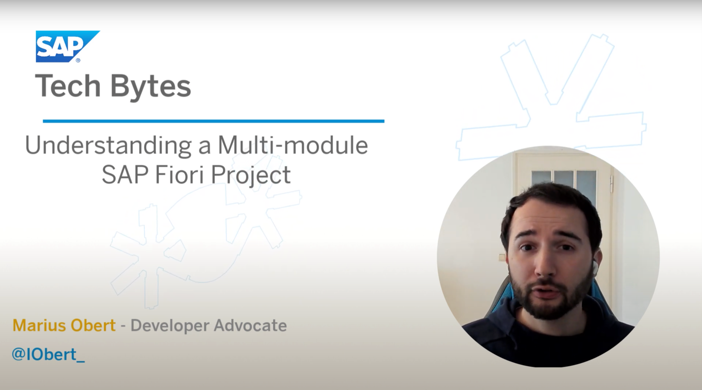

# Micro Frontend Architecture
<!-- description -->  Building an Extensible User-Interface

## Prerequisites
 - Watch the SAP Tech Bytes Video [Creating a Multi-module SAP Fiori Project](https://github.com/SAP-samples/sap-tech-bytes/tree/2021-02-17-multi-module-fiori-project)

## You will learn
 - How to embed web apps in the SAP Fiori Launchpad
 - How to use the site management UI of the SAP Launchpad service
 - About the differences between the destination types `OAuth2UserTokenExchange` and `OAuth2Password`

---

### Watch the video

Click [here](https://www.youtube.com/watch?v=2Czqs6zQV5c) to watch the video

### First, simple question

Don't worry if you don't know the answer after watching the video. Feel free to watch it again or to ask for help in the forum.

### Second, harder question

Don't worry if you don't know the answer after watching the video. Feel free to watch it again or to ask for help in the forum.

---
