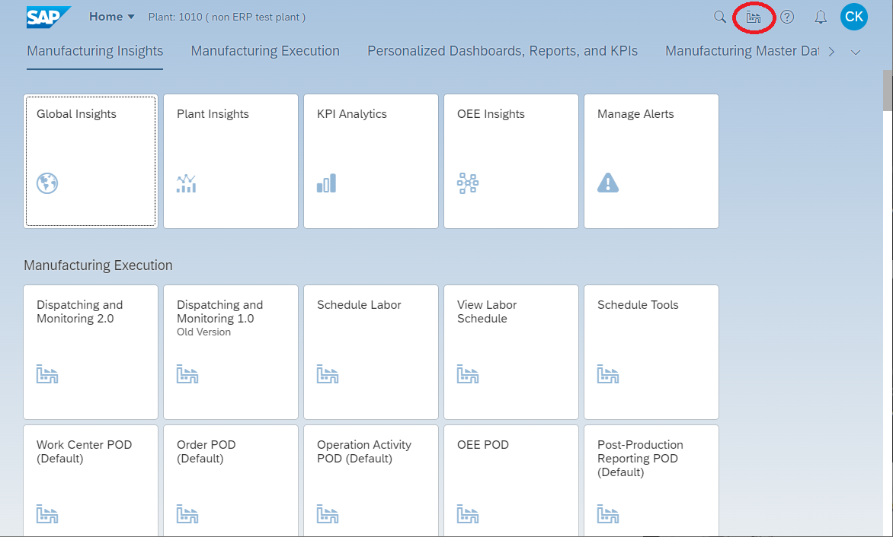
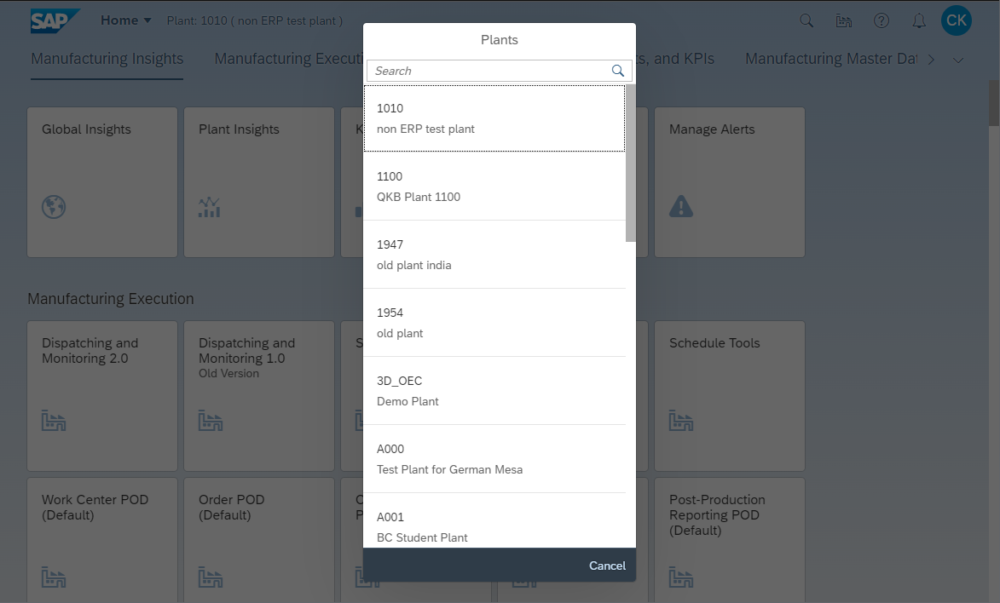
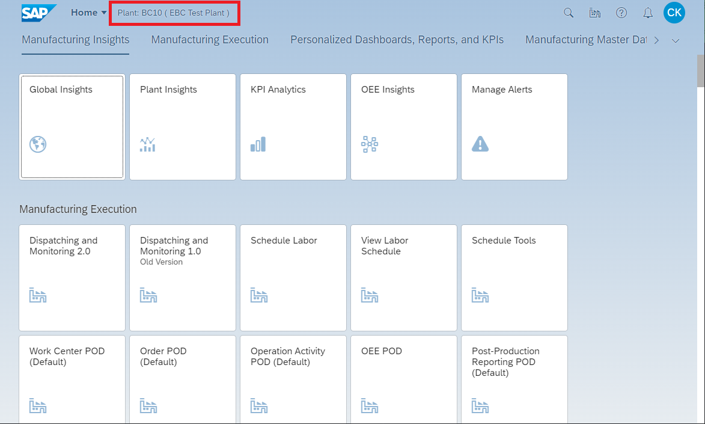

# Set the plant in SAP DMC
<!-- description --> How to assign the plant to your user in SAP DMC

## Prerequisites
 - Access to your SAP DMC tenant
 - Knowledge of the plant code to use

## You will learn
  - How to change or set the plant code that is assigned to your user

## Intro
When logging in to SAP DMC for the first time, you will need to set the plant code for the plant you will work in.

This process also applies if you work in multiple plants and need to change between them.

---

### Log in to SAP DMC

In your browser, enter the URL to your SAP DMC tenant, and enter your log in information.

You will be brought to your home page in SAP DMC.

### Browse for a Plant

The top of the Fiori Launchpad shows the plant that your user is currently assigned to.

If it is your first time logging in to SAP DMC and you have not set a plant code before, it will be blank.

Click on the **factory icon** on the top right of the screen.

### Select the Plant Code

A list of defined plant codes in your SAP DMC system is displayed.

Select the plant code that you would like your user to work in.

### Verify the Plant Assignment to Your User

Check to see that the new plant code is displayed at the top of your Fiori Launchpad to indicate that you are now working in that plant.

### Check Your Knowledge

---
