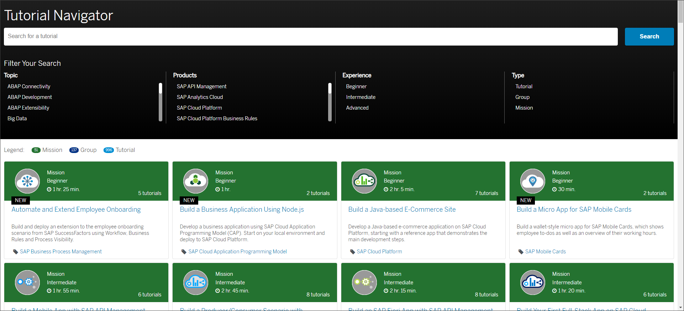
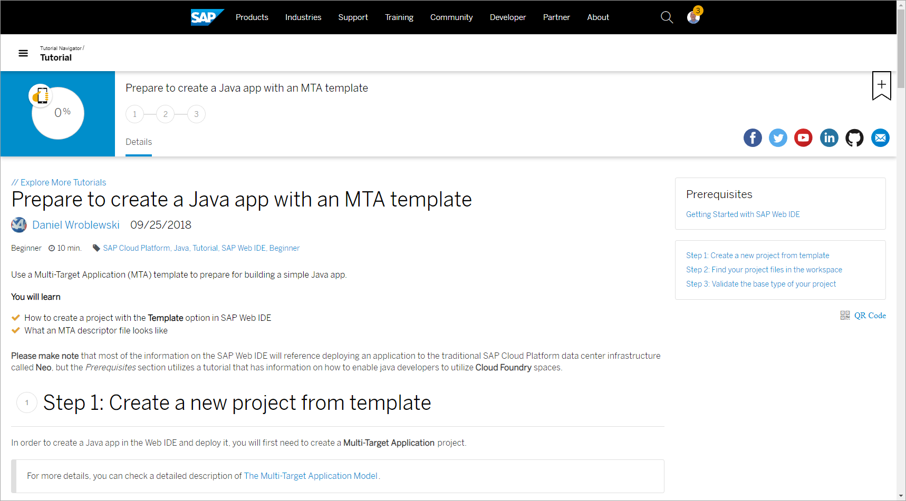
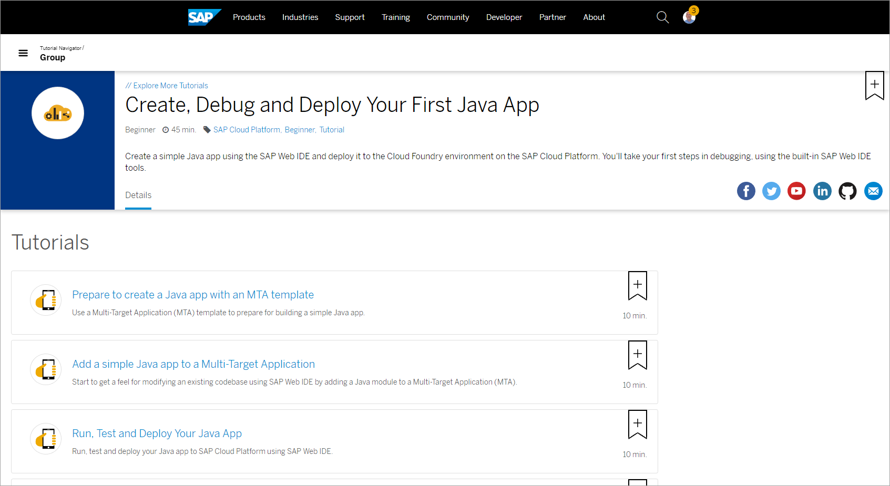
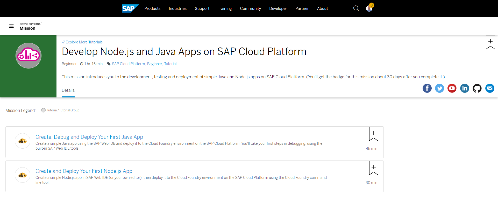
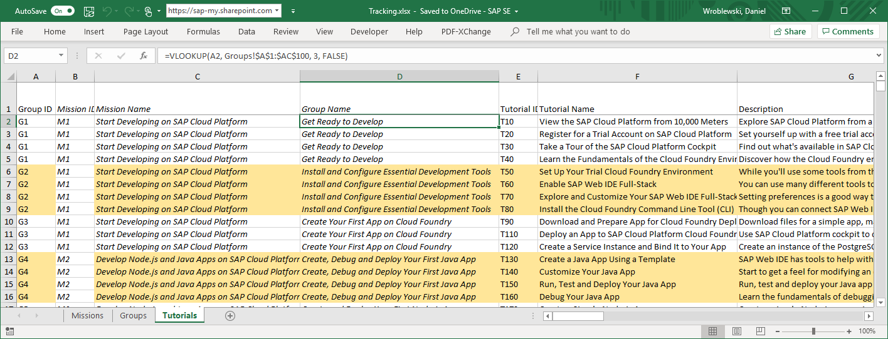
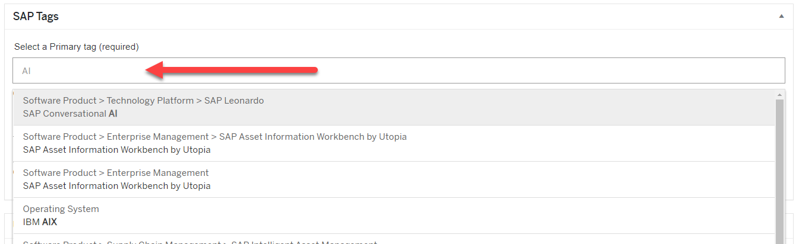
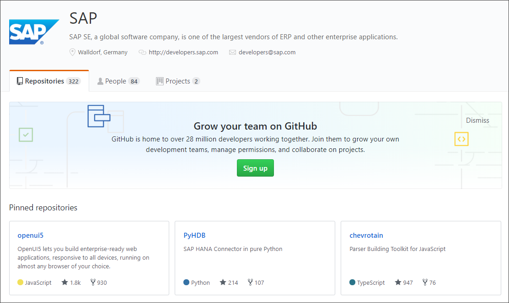

# The Big Picture on Tutorials
<!-- description --> Learn about SAP developer tutorials, groups and missions, how to plan for your tutorials, and the high-level process for creating and publishing them.

## You will learn  
  - The purpose of our tutorials   
  - How tutorials are organized for our customer developers
  - The high-level process for creating and publishing tutorials
  - How to plan your tutorials  
  - **Your responsibilities when creating tutorials**

## Intro
> **IMPORTANT:** Before starting with this tutorial series, please go to our [Jam group](https://go.sap.corp/tutorials).

>If you have any questions, write to <joshua.margo@sap.com>.

This tutorial is the first in the tutorial group [Create Developer Tutorials](https://developers-qa.sap.com/group.docs-tutorial.html) that provides detailed explanations of the tutorial creation process.

---

### What are developer tutorials?

We build tutorials for developers to get a taste of SAP's technologies. Each tutorial is an example of how a developer might use a specific technology.

  - **Tutorials do not replace documentation**.

  - Provide an example project, and tell the developer exactly what to do -- even how to name things. Do not give users (too many) choices.

  - All along the way, add context so the developer learns about what he/she is doing:

    - What did they accomplish
    - What is happening in the backend
    - What are the ramifications of what they just did
    - What might they do in a productive environment

### SAP Tutorial Navigator

Our tutorials are collected in the [SAP Tutorial Navigator](https://developers.sap.com/tutorial-navigator.html).

To find tutorials, users can search for a word (in the title or description) or filter by standard SAP topic or product tags.

### Tutorials, groups, and missions

A single **tutorial** provides a basic, logically complete activity that takes 5 to 20 minutes (e.g., get trial account, enable a service).

A set of tutorials can be combined into a **tutorial group** that outline how to build a simple application or feature. Tutorial groups generally include 3 to 5 tutorials and take around an hour. With a group, a developer should have made some significant achievement in running or building an application.

[View groups](https://developers.sap.com/tutorial-navigator.html?tag=tutorial:type/group)

A set of tutorials or tutorial groups can be combined into a **mission** to provide the basics for learning a skill, for example, building UIs or managing an SAP Cloud Platform account or developing IoT applications. Missions are high-level learning goals that an external developer might have.

Missions are gamified, and you can earn badges as you complete the tutorials (this is a work in progress).

[View missions](https://developers.sap.com/tutorial-navigator.html?tag=tutorial:type/mission)

### Planning

Planning is a key -- and often overlooked -- part of authoring tutorials.

Look ahead at least 6-12 months, and maybe further, to what missions and tutorials you'll want for your topic over the long term. Think of it as building a quick, do-it-yourself openSAP course.

You don't have to build all your missions at once, but should have an idea of what missions and groups you will want.

> #### Some help in planning
>  - Work with a Developer Relations advocate in your product area. The advocate is extremely knowledgeable about SAP technologies and the other published tutorials, and will be responsible for approving all tutorials, so it's key to work together from the beginning.

>      For the most up-to-date list of advocates, see [Developer Advocates](https://jam4.sapjam.com/groups/6Jr8GG1khjmOoSVZPK2GhG/overview_page/mrQBGjGtdnJuvZeT7tRiv5). If you cannot find an advocate for your area, contact [`Tom Jung`](https://people.wdf.sap.corp/profiles/I809764).

>- For ideas on how to construct missions, see the [SAP Cloud Platform missions](https://developers.sap.com/topics/cloud-platform.html#tutorials).

>- Download a [planning Excel](https://jam4.sapjam.com/groups/6Jr8GG1khjmOoSVZPK2GhG/documents/qS7lEZAJnlnbSnEWiVKQoM) to help you organize your tutorials. Before authoring, you should outline the  titles, descriptions, and times for all missions, groups, and tutorials.

>      

Once you have an outline of the tutorials you want to create, send it to your developer advocate and <a href="mailto:daniel.wroblewski@sap.com">Daniel Wroblewski</a>.

### Test, test, test

>__*The first draft of anything is shit.*__
>
>&nbsp; &nbsp; &nbsp;&nbsp;&nbsp;&nbsp;&nbsp;(allegedly) Ernest Hemingway

When creating tutorials:

1. Check how they look on the QA website. Really, look at them.

2. Test them yourself, from beginning to end.

    Test if someone outside of SAP (with trial account) could follow and complete the tasks, and could answer your validations/questions.

3. Have QA test them.

4. Have a developer/UA unfamiliar with your product test them.

    Though QA will generally test for accuracy, a developer/UA will test for usability.

5. Finally, look them over when they are in production.

### Your responsibilities

If you decide to create tutorials, there are several key responsibilities that you need to undertake.

  - **Answer customer issues:** Each tutorial has a **Feedback** link that lets users open an [issue](https://github.com/SAPDocuments/Tutorials/issues), generally either because they cannot complete the tutorial or there is an obvious error in the tutorial.

      Please provide a first response within 2 business days, and preferably the same day you receive a notification.

  - **Keep your content up to date:** Every 3 months, recheck that your tutorials still work. Keep up to date with your product and related products in case text or screenshots need to be updated.

  - **Alert us about new owners:** If you change roles and someone else is now responsible for the tutorials, alert us.  

### Tags
All SAP web content is organized by tags, including our tutorials. When running the Atom wizard for creating a new tutorial, the most common tags are made available. And in the SAP Tutorial Navigator, users can search for tutorials by tag.

>**IMPORTANT:** Tags are maintained by a central group outside Developer Relations not connected to the tutorials. We simply make use of the SAP-wide tagging system.

- If a tag that you know exists does not appear in the Atom wizard, please request that we add it. The best way to see what tags are available is to go to the [Write a Blog](https://blogs.sap.com/wp-admin/post-new.php) page and use the **SAP Tags** fields to search for tags,

    

- If you need to request the creation of a new tag, please create a ticket to the metadata group at <http://dsrequest.wdf.sap.corp:777/request/new?typeId=126&countryId=0&basketId=0>. If it is only for tutorials, mark the request for **Developers** (in the **Additional Info** area). If you also want it for the SAP Community, you can mark it for **Community**.  

### Sample code / projects

There may be times when you don't want developers to start from scratch, but instead download a skeleton project or other executable. You can set this up on [SAP's GitHub account](https://github.com/SAP), but must go through SAP's [Sample Code Publication Process](https://wiki.wdf.sap.corp/wiki/display/ospodocs/Sample+Code).

Don't worry.

I am told that, in most cases, it will take no more than a week to set get approval and set up everything -- as long as you are not exposing any private APIs. The process is essentially:

  - Get permission (couple of days)
  - Put files on SAP account on GitHub (couple of days)

To get started, contact [DL SAP Sample Code Admins](mailto:DL_5E90B3AB0E43648C2A5D04FF@global.corp.sap).

### Tutorial production/workflow

The source of tutorials are located in 2 GitHub repositories:

  - [`Tutorials-Contributions`](https://github.com/SAPDocuments/Tutorials-Contribution) (need authorization): These tutorials (in the `tutorials` folder) are published to the [QA web site](https://developers-qa.sap.com/tutorial-navigator.html).
  - [`Tutorials`](https://github.com/SAPDocuments/Tutorials): These tutorials (in the `tutorials` folder and copied from the `tutorials` folder from `Tutorials-Contribution`) are published to the [production web site](https://developers.sap.com/tutorial-navigator.html).

Tutorials are created as follows:

1. Send tutorial outline to your developer advocates and [Joshua Margo](https://people.wdf.sap.corp/profiles/I811516).

2. Write tutorials as a Markdown file (using Atom editor and the SAP Preview plugin).

    - As you work, you can see a preview of your tutorial.

    - Each tutorial file is in its own folder with the same name. The folder also contains images for your tutorial.

3. Check tutorials for spelling and broken links (using an Atom command).

4. Commit and push the tutorial to SAP's `Tutorials-Contribution` repository on GitHub (using a plugin command).

5. View the tutorial on the [QA website](https://developers-qa.sap.com/index.html) (credentials `20Digital20`/`20Digital20`).

6. Move tutorials to production by copying them to your fork of SAP's [`Tutorials`](https://github.com/SAPDocuments/Tutorials) repository, and making a pull request.

>Anything added to the `tutorials` folder of SAP's `Tutorials-Contribution` repository automatically is published to the QA website. Use the `work-in-progress` folder for initial drafts that are not ready and do not yet pass the validation tests.

>Anything added to the `tutorials` folder of SAP's `Tutorials` repository automatically is published to the production website.

---
