# Get Ready to Write Tutorials
<!-- description --> Set up your environment to write tutorials, including installing all the necessary tools.

## You will learn  
 - How to plan for writing tutorials
 - How to install the necessary tools
 - How to clone the needed repositories   

## Intro
Writing developer tutorials requires a few simple tools, such as for running scripts to help you create and test your tutorials, as well as updating the tutorial GitHub repository with your files.

>Some people have reported issues connecting to GitHub via VPN, though others have no problem working with a VPN.
## What you need to know
To make tutorials, you will need to be familiar with the following:

  - **Markdown**: Markdown is an easy-to-use markup language, similar to wiki markup, for building a structured documents. It is worth 20 minutes to get familiar with Markdown.

    - For newbies, check out this [this reference](http://commonmark.org/help/) and this [10-minute tutorial](http://commonmark.org/help/tutorial/).
    - On GitHub, however, we use `GitHub Flavored Markdown`, which has [differences to traditional Markdown](https://help.github.com/articles/github-flavored-markdown/) like table, code block syntax highlighting, and URL auto linking.
    - If you're already familiar with Markdown but need to refresh your memory, check out the [Markdown Cheat Sheet](https://github.com/adam-p/markdown-here/wiki/Markdown-Cheatsheet).

    >Our [style guide](https://github.com/sap-tutorials/Tutorials-Contribution/blob/master/templates/styleguide.md) provides guidance on the Markdown formatting you'll need for tutorials.

  - **Git**: Git is a widely used source control system, and you will use it to check in and check out your files. It is worth an hour to get familiar with it.

    - [Understanding the `Github flow`](https://guides.github.com/introduction/flow/)
    - [GitHub Hello World](https://guides.github.com/activities/hello-world/)
    - [GitHub Overview & Training Webcasts](https://www.youtube.com/playlist?list=PLg7s6cbtAD15Das5LK9mXt_g59DLWxKUe)

    You won't have to do complex stuff with Git -- and our plugin provides menu options so you can bypass it for the most part. Still, you should be familiar with how Git works -- you will need sometimes to work directly with Git.
## What you need to have
Before you start this tutorial, you will need:

- A [GitHub](https://github.com/) account

- Permission to the [Tutorial-Contributions](https://github.com/sap-tutorials/Tutorials-Contribution) repository in the [sap-tutorials](https://github.com/sap-tutorials) GitHub account. You can get access to the sap-tutorials organization via the [Open Source Portal](https://portal.opensource.tools.sap/).

    >This should have been taken care of when following the instructions at [SAP Tutorial Navigator](https://jam4.sapjam.com/groups/A7NmsKmoG9vVaxizKhdQOk/overview_page/r9dX7mvdcXW5KMmWvG2NYl) Jam site.

- If you encounter any issues, feel free to contact [`Joshua Margo`](https://people.wdf.sap.corp/profiles/I811516).

>If you are given permission manually, you receive an email to join the sap-tutorials organization (and thereby the [Tutorial-Contributions](https://github.com/sap-tutorials/Tutorials-Contribution) repository).

>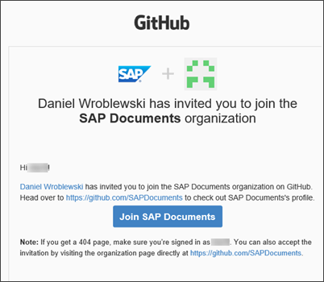  

>If you lose the email, you can always go to your notifications on GitHub by clicking ...

>

>... in the upper right and accept the invitation there.

>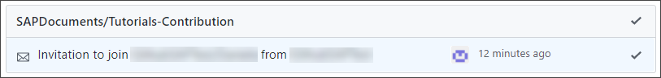  

>Alternatively, you can go to the [sap-tutorials](https://github.com/sap-tutorials) organization on GitHub and accept the invitation there.

---

### Plan your groups/missions

Before writing any tutorials, you need to do some planning with your stakeholders:

  - What high-level missions do you want to create over the next 6 to 12 months?
  - How do you want to break down the content into missions, groups, and tutorials?

>Use this [planning Excel](https://jam4.sapjam.com/groups/6Jr8GG1khjmOoSVZPK2GhG/documents/qS7lEZAJnlnbSnEWiVKQoM) for creating an outline and managing your QA workflow.

Before starting to write, you should have the following information for each mission, group and tutorial:

  - Title
  - Description
  - Estimated time to complete

You'd be surprised, but working just on the titles, descriptions, and time will help you author better tutorials.


### Install software

Install the following open-source tools on your workstation (and afterwards restart your computer):

| Tool                                                 | Description         | Install Notes |
| :--------------------------------------------------  |---------------------|---------------|
| [Git for Windows](http://gitforwindows.org/) or [Git for Mac](https://gist.github.com/derhuerst/1b15ff4652a867391f03#file-mac-md) | Git lets you interact with our GitHub repositories. <div>&nbsp;</div><div> **NOTE: This is different from GitHub Desktop.**</div>    | Run installer with defaults.  |  
| [Atom Editor](https://github.com/atom/atom/releases/tag/v1.55.0) (version 1.55)                     | The Atom editor is designed as an editor for Markdown (`.md`) files, which is the format of tutorial files. <div>&nbsp;</div><div>Version 1.55 is required as later versions break our plugin. Download the version for you -- for me on Windows, I downloaded **`AtomSetup-x64.exe`**.</div><div>&nbsp;</div><div>When you open Atom, make sure to turn off automatic updates under **Help > About Atom**.</div>   | Run installer with defaults <div>&nbsp;</div><div> **NOTE: On Mac, click _Open_ in the installation wizard.**</div> |  

>**IMPORTANT FOR MAC USERS:**

> - Cache your password for Git by following the instructions [here](https://help.github.com/articles/caching-your-github-password-in-git/#platform-mac).

> - When installing Atom on Mac, please read [these instructions](https://flight-manual.atom.io/getting-started/sections/installing-atom/#platform-mac).

>     Make sure shell commands are installed. Run "Window: Install Shell Commands" from the Command Palette, which will prompt you for an administrator password if shell commands were not installed.


Restart your computer, then launch the Atom editor.


### Update GitHub account

Go to [GitHub](https://github.com/), sign in, and open your profile settings.

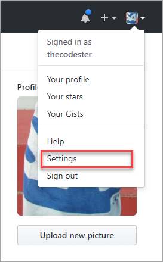

Make sure your name is listed properly, and add a picture. Your GitHub name, and your picture, will appear as the author when you publish tutorials. Also fill in your company.

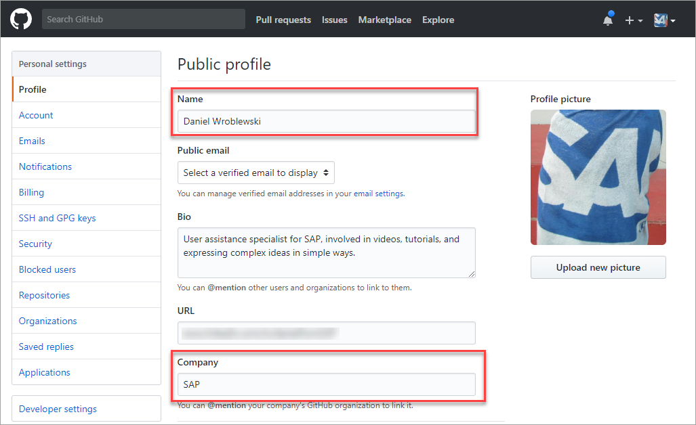

Make sure to verify your email address and set it as your primary email address. This will be the email to identify your commits.

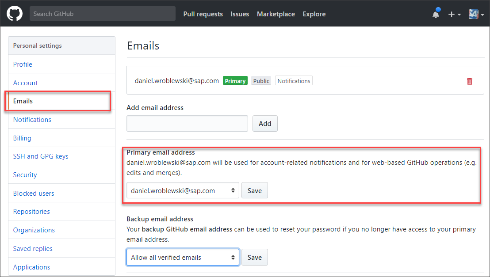


### Set up SSH

To work smoothly with the plugin and to enable 2-factor authentication, it is best to set up the connection between your laptop and GitHub via SSH.

> **IMPORTANT:** Do NOT use a passphrase when setting up SSH.

1. Generate a new SSH key, as described in [Generating a new SSH key](https://help.github.com/en/enterprise/2.16/user/authenticating-to-github/generating-a-new-ssh-key-and-adding-it-to-the-ssh-agent).

    - Open a Bash window -- in the explorer, right-click and select **Git Bash Here**.

    - Run the following command after changing it to use your email address from GitHub:

        ```Bash
        ssh-keygen -t rsa -b 4096 -C "your_email@example.com"
        ```

        Press **Enter** and leave blank both the directory and the passphrase.

    >2 files are generated in the `.ssh` diretcory of your user folder -- `id_rsa` and `id_rsa.pub`, private and public keys. For me, the proper/default directory was the `C:\Users\I031617.GLOBAL\.ssh` folder.

    >If you want to check the SSH keys you have, run the command: `ls -al ~/.ssh`

2. Copy your public SSH key (i.e., `id_rsa.pub`) to your GitHub profile.

    On GitHub, go to **profile icon | Settings | SSH and GPG keys**, and then click **New SSH Key**.

    Enter any title and your public key.


### Install plugin


Our `sap-tutorial-helper` plugin to the Atom editor will let you do all your tasks within the Atom editor, and will hide many of the Git tasks.

>**IMPORTANT:** You need permission to the QA repo (`Tutorials-Contribution`) to download the plugin, and to be logged into GitHub.

>**MAC USERS:** See the troubleshooting section below for Mac users.


1. Click [Atom Plugin for SAP Tutorials](https://jam4.sapjam.com/groups/A7NmsKmoG9vVaxizKhdQOk/documents/hGoQQQEJM6NvzoLSRQbOBI/slide_viewer), and then choose **Download**.

    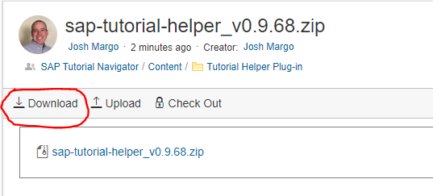

2. Extract the contents (use **Extract Here**), and run the installer in the `install` directory (`win.bat` for Windows, `unix.sh` for Mac via terminal).

    The installation is done when you see **_Press any key to continue..._**.

### Troubleshooting (Proxy)

If you get a proxy error or the process takes too long, you may need to set or unset your proxy.

Open a command prompt, and run the following commands (change the proxy as needed):

```Config
apm config set proxy http://proxy:8080
apm config set https-proxy http://proxy:8080

git config --global http.proxy http://proxy:8080
git config --global https.proxy http://proxy:8080
```

If you need to reset the proxy settings, run these commands:

```Config
apm config rm proxy
apm config rm https-proxy

git config --global --unset http.proxy
git config --global --unset https.proxy
```

>For Mac users, Chris Whealy has created a Bash script for setting and un-setting proxy settings. See <https://github.wdf.sap.corp/I003638/proxy_settings>.

Sometimes people still get proxy issues despite these settings. Sometimes, changing Windows proxy settings can help.

1.  Click **Windows-S** to open Windows search, search for **`proxy`** and select **Change proxy settings**.

    <!-- border -->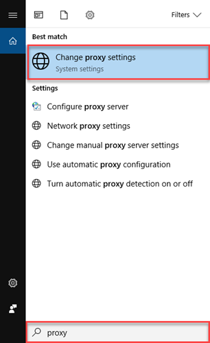

2. Set **Automatically detect settings** to **`On`**.


After installing -- or after any update -- the plugin may not start to work (e.g., executing **New SAP Tutorial** does nothing).

### Troubleshooting (Missing Modules)

If you get an error that the plugin cannot find a module, or for whatever reason dependencies are not loaded, you can load them manually by running these commands:

```Shell (Windows)
cd %USERPROFILE%\.atom\packages\sap-tutorial-helper
apm install
```

```Shell (Mac)
cd ~/.atom/packages/sap-tutorial-helper
apm install
```

### Troubleshooting for Mac

After installing -- or after any update -- the plugin may not start to work (e.g., executing **New SAP Tutorial** does nothing).

1. Check the bottom of the Atom editor for a red bug. Click it.

    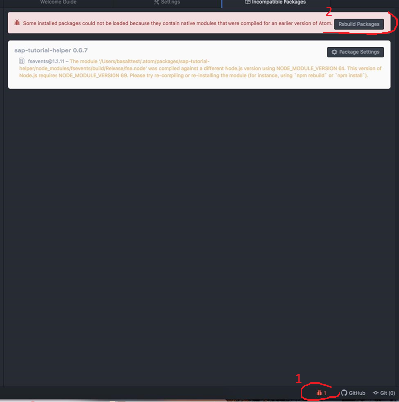

2. You may get the following message: **Some installed packages could not be loaded because they contain native modules**

    If so, click **Rebuild Packages** and restart Atom.

### Clone Tutorials-Contribution repository

To do this step, you must have been granted permission to the `Tutorials-Contribution` repository.

>We recommend to clone to your C drive, in a folder not mirrored on One Drive.

>**For Mac/Linux Users: UNPROTECTED PRIVATE KEY FILE!** If you get this error, see <https://www.howtogeek.com/168119/fixing-warning-unprotected-private-key-file-on-linux/>.

1. Open a command prompt to the folder you want to put the local repository. On my Windows machine, I created a directory `C:\GitHub` where I put all my Git repositories.

    Then I opened a file explorer to this directory, right-clicked, and chose **Git Bash Here**.

    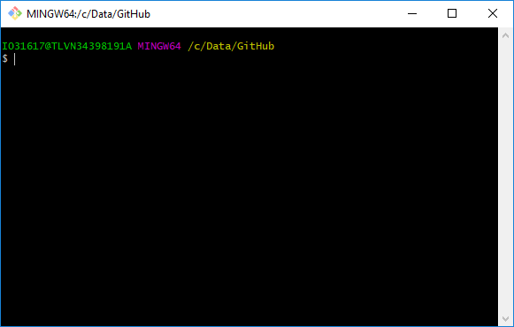

2. In the Git Bash window, issue on of the following command, depending if you are using basic authentication or SSH keys:

    ```SSH
    git clone --depth 1 git@github.com:sap-tutorials/Tutorials-Contribution.git
    ```

    When the cloning finishes (it can take 10-15 minutes), you can check the directory to make sure the repository cloned, something like this:

    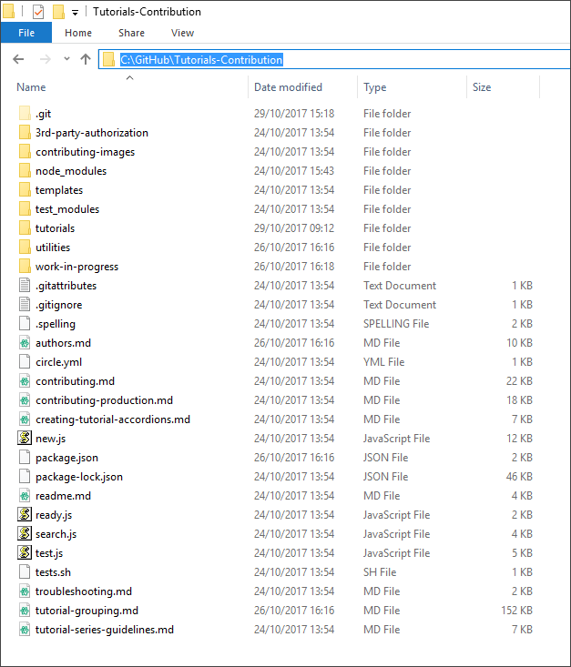

### Fork Tutorials repository

>If you are a Developer Advocate in the Developer Relations group, you can skip this and the next steps, and instead simply clone the [Tutorials](https://github.com/sap-tutorials/Tutorials) repo.

Later, when you publish your tutorial to production, you will need to make a copy (i.e., a fork) of the production tutorial repository, which is called `Tutorials`. The copy will be in your GitHub account, and you will update your copy and then request that your changes be merged into the production repository (in the `sap-tutorials` account).

Don't worry about the whole process. Let's just set up your copy of the production repository.

In GitHub, go to the [`sap-tutorials/Tutorials`](https://github.com/sap-tutorials/Tutorials) repository, and click **Fork**.

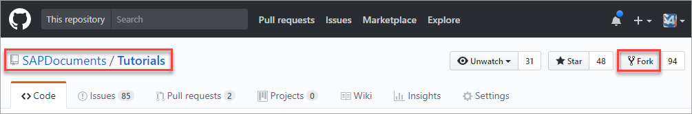

Select your account, and the fork will be created in your account.

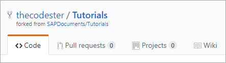


### Clone Tutorials fork

Just as we cloned the `Tutorials-Contributions` repository, we'll clone the `Tutorials` repository.

>**IMPORTANT:** While you cloned the official `Tutorials-Contribution` repository from the `sap-tutorials` account, you'll now clone the `Tutorials` repository from your account.    

Open a command prompt to the folder you want to put the local repository. On my machine, I created a directory `C:\GitHub` where I put all my Git repositories.

Then, issue the following commands (change **`XXX`** to the name of your GitHub account).

```SSH
git clone git@github.com:XXX/Tutorials.git
cd Tutorials
git remote add upstream git@github.com:sap-tutorials/Tutorials.git
```


### Set author name/email in Git

The author listed for a tutorial is the name on the last commit by the author who first committed the tutorial. So you need to set up the name that should appear for your commits.

Generally, setting these in the global settings is enough, but a bug in Atom sometimes requires them to be set in the individual repo you are working in.

1. Open a command prompt ( **Win+X**, then press **A** ), then run the following command, replacing `FIRST_NAME` and `LAST_NAME` with your name, and specifying your email:

    ```Git
    git config --global --replace-all user.name "FIRST_NAME LAST_NAME"
    git config --global --replace-all user.email "myemail@sap.com"
    ```

    To see your current settings, you can run:

    ```GitHub
    git config --list --global
    ```

2. Open a command prompt, and change the directory to the directory with your QA repo (e.g., `C:\GitHub\Tutorials-Contribution`).

    Run the following commands (changing the text to your name and email):

    ```Git
    git config user.name "FIRST_NAME LAST_NAME"
    git config user.email "MY_NAME@example.com"
    ```

3. Open a command prompt, and change the directory to the directory with your QA repo (e.g., `C:\GitHub\Tutorials`).

    Run the same commands as above.

>If ever you need to change the name that appears at the top of a tutorial, add the following metadata at the start of the Markdown file for that tutorial.

```YAML
author_name: Daniel Wroblewski
author_profile: https://github.com/thecodester
```


### Sign CLA

To send pull requests to the production repository (`Tutorials`), you must sign a Contributor License Agreement (CLA). You can do this when you submit a pull request, or you can do it now.

To sign the agreement, go to [https://cla-assistant.io/sap-tutorials/Tutorials](https://cla-assistant.io/sap-tutorials/Tutorials), and press **Sign in with GitHub to agree**. You may need to authorize the CLA assistant to use your GitHub account.

>The CLA is signed for your GitHub account, specifically for the email listed in GitHub for you. If you make commits that have a different email address associated with them, the CLA is not considered signed for those commits.


### Open Atom

1. Open the Atom editor.

    The first time you use the Atom Plugin for SAP Tutorials, you will be asked to specify the folder that contains the QA repository (e.g., on my machine, `C:\GitHub\Tutorials-Contribution`).

    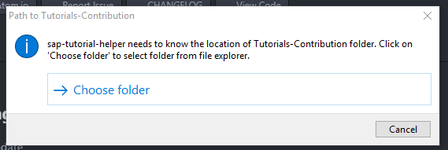

2. Specify the QA repository, and then you will have the QA `tutorials` folder in your **Project** pane.

    

3. Turn off automatic updates under **Help > About Atom**.

### Check your installation

Check your Atom editor and plugin installations by going to **File** | **Settings** | **Packages** (on Mac, **Atom** | **Preferences**), and see that the preview package -- officially `sap-tutorial-helper` -- is installed.

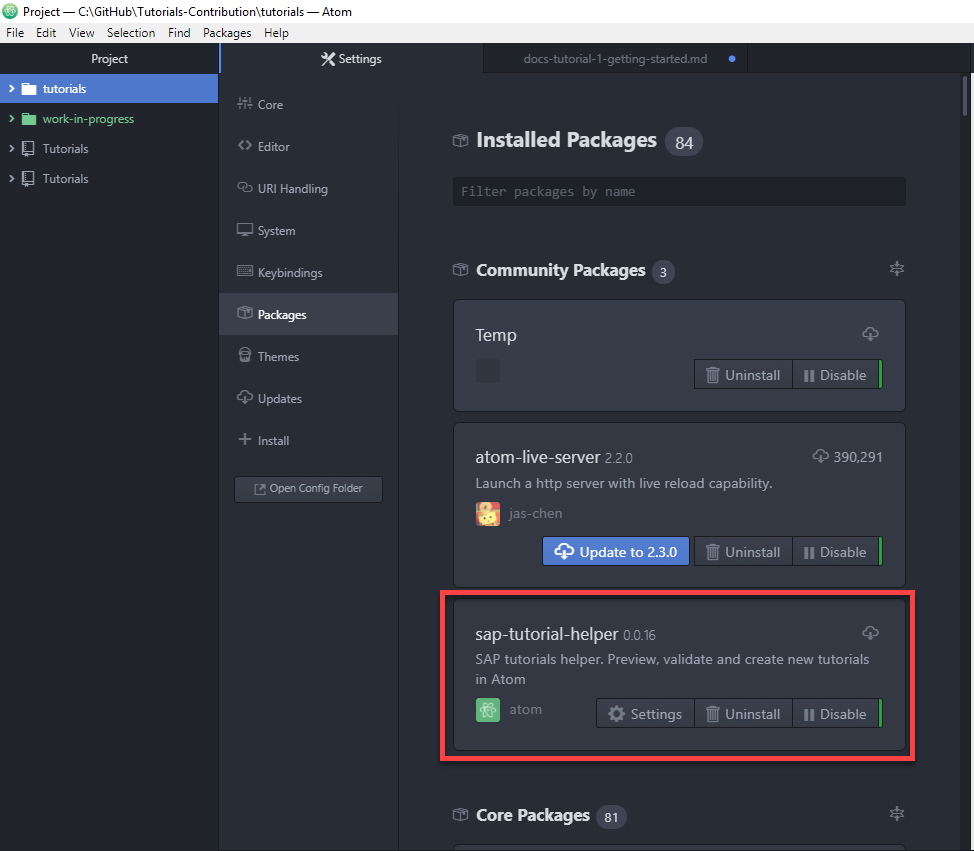

Click **Settings**, and there are a couple of settings you can adjust.

  - **Live Update:** Indicates whether you want the SAP previewer -- this displays an accurate preview of your tutorial -- to refresh as you type. This is a nice feature.
  - **Live Update Delay:** Indicates, in milliseconds, how long to wait after stopping to type in your tutorial file before refreshing the preview (if **Live Update** is turned on). The default is 1000 (1 second), but you might prefer a longer delay. Try 2 to 5 seconds.

  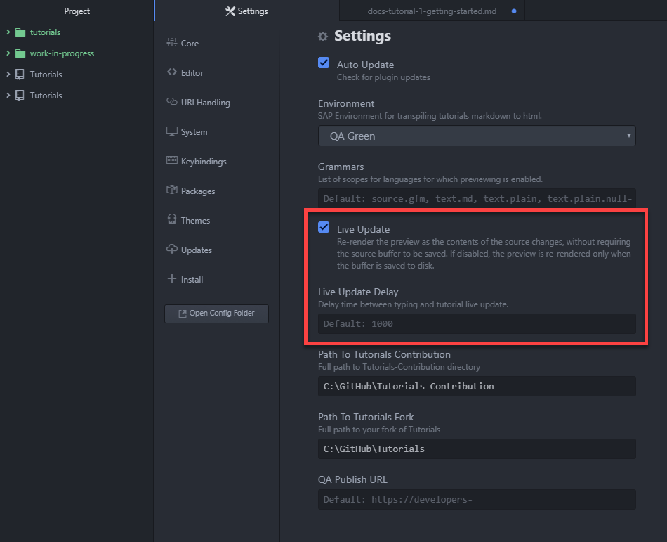

### Atom Tips

  - Adding Project Folders: By default, you should see the `tutorials` folder for the QA repo, `Tutorials-Contribution`. You can add the entire repo or another repo by going to **File** | **Add Project Folder** and selecting the folder.
  - Keyboard shortcuts:
    - **Create Tutorial Wizard** -- **`Alt-Shift-T`**: To start the wizard for creating a new tutorial.
    - **Toggle Preview** -- **`Alt-Shift-Q`**: To open or close the preview for the current tutorial.
    - **Run Checks** -- **`Alt-Shift-V`**: To run validation checks (e.g., spelling and broken links) for the current tutorial.
    - **Find Folder in Tree** -- **`Control-Shift-\`** or **`Control-|`**: If you are editing an MD file, you can find the folder in the tree view (on the left).
    - **Reload Atom** -- **`Control-Shift-F5`**: To check for update of the plugin or for any other reason.

    Keyboard shortcuts are set in the settings for the plugin.


---
