# Create a New Tutorial
<!-- description --> Create a tutorial from scratch, test it, and deploy it to the QA server.

## You will learn  
  - How to create a new tutorial
  - How to preview the tutorial in the Atom editor
  - How to test your tutorial
  - How to move the tutorial to the QA web site   

## Intro
You write your tutorial in Markdown language. To learn how to use Markdown formatting for tutorials, see our very brief [style guide](https://github.com/SAPDocuments/Tutorials-Contribution/blob/master/templates/styleguide.md) and please follow the guidelines.

>To see our [style guide](https://github.com/SAPDocuments/Tutorials-Contribution/blob/master/templates/styleguide.md), you must be logged into GitHub and have permission to the QA repository.

A few writing tips:

  - Speak directly to the developer (if needed, use "you" and not "we" or "I").
  - Be brief, but every step or so add an explanation of what the developer is accomplishing and why.
  - Avoid future tense.
  - Make sure all SAP names (of products and services) conform to branding guidelines. If you're not sure, check with the [Approved names](https://www.sapbrandtools.com/naming-center/#/search/status-search) and with your local User Assistance professional.

---

### Create new tutorial from template

In the Atom editor, right-click the `tutorials` folder of the QA repo and choose **New SAP Tutorial**.

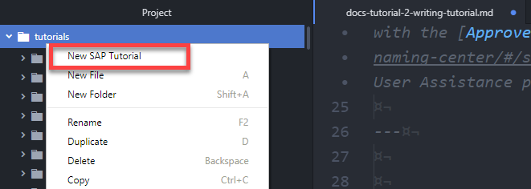

Follow the wizard.

Use the following keys when working with a list of choices, like tags:

  - **TAB** to select an item in a list
  - Semicolon (`;`) to select another item
  - Arrow keys to scroll through a list
  - Enter text to filter the list
  - **RETURN** when done selecting items

Fill out the following fields:

| Field | Description | Example |
|:---------------------------|:--------------------|:--------------------------|
| Tutorial File Name             | Name of tutorial file (plus the extension `.md`), the folder containing the tutorial file, and (eventually) the URL path (plus the extension `.html`) to your tutorial on the QA and production systems.<div>&nbsp;</div><div>Follow these rules for naming tutorials:<ul><li>Up to 6 keywords in all lowercase connected by hyphens, from general to specific </li><li>No underscores</li><li>No buzz or stop words, as described in [`stopwords.md`](https://github.com/SAPDocuments/Tutorials-Contribution/blob/master/templates/stopwords.md)</li><li>Do not use `sap`.</li><li>Less than 50 characters</li><li>No umlauts (replace them with the character plus an e)</li></ul></div>  | `cp-webide-extensions-create` |
| Tutorial Title            | Display title that says what users will build/do. Start with imperative verb, title case, not `ing`, 5-8 words | `Create an SAP Web IDE Extension` |
| Tutorial Description      | Short description under title -- similar to title just expanded to about 20 words | Create an SAP Web IDE extension to implement your own functionality within the IDE. |
| Time               | The time the average developer will need to complete the tutorial. | 20 |
| Level               | Indicates how experienced the user needs to be with the technology. | Beginner |
| Primary Tag                      | Pick the best tag that represents the tutorial's main topic/product. This tag is used to categorize the tutorial in search and on product pages.<div>&nbsp;</div><div>If you want to use a tag not in the wizard, let us know and we will add it</div> | products>sap-cloud-platform |
| Secondary Tags                      | Pick the primary tag again, plus additional tags that relate to the tutorial. </div><div>If the tutorial cannot be done on a trial system -- not recommended -- than add the `tutorial>license` tag.</div> | products>sap-cloud-platform |


When writing the title and description, make them short and to the point, and take note of how they will appear in the search results ...

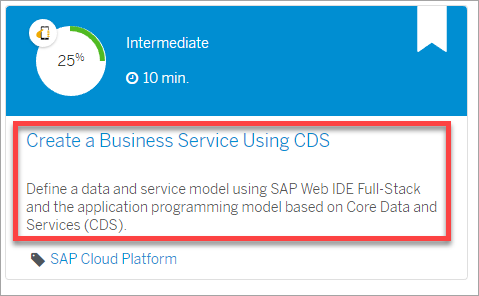

... and at the top of each tutorial.

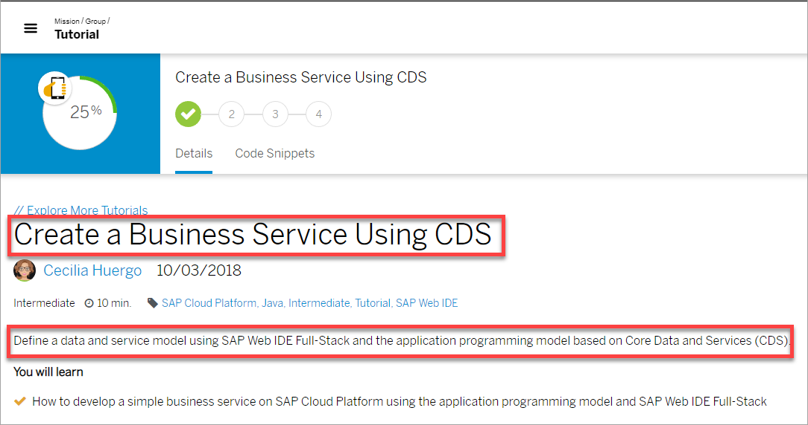

When you are finished, a new tutorial is created and the Markdown file is opened for editing in a new tab.

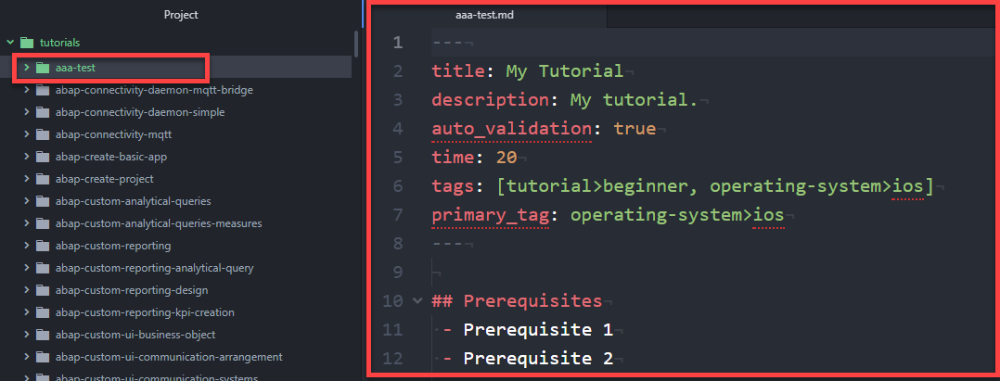

In the same folder a file called **`rules.vr`** is created to hold the data for creating questions for the user to answer to show they understood the material. See Step 4 for more information.

>The title and description cannot contain colons (  **:** ).

### Write your tutorial

Have fun writing your tutorial.

>**IMPORTANT:** Add context and short explanations, so users learn as they do. Add a sentence at the start or end of a step to explain what they will do, why they are doing it, and the result of what they did.

Also:

- Please follow the [style guide](https://github.com/SAPDocuments/Tutorials-Contribution/blob/master/templates/styleguide.md), which also shows you the Markdown for various page elements.

    - The titles of steps are sentence case, 3-4 words, starting with an imperative verb (e.g., 'Create a file'). Keep them short. Generally, remove "the" and "a".

    - To start any text/image on a new line, add a blank line.

- Add validation, as described in [Add Validation to a Tutorial](docs-tutorial-3-adding-validation).

>In published tutorials, the author is the person who first committed the tutorial to GitHub. This is OK in most cases. But when the author leaves and a new author is now responsible, set the author by adding the following metadata at the top of the tutorial:

>    - **`author_name`**: The display name of the author (any text)
>    - **`author_profile`**: A URL to the author's profile, generally on GitHub.

>You must include both metadata if you want to manually set the author.

### Preview tutorial

Right-click your tutorial file in the project tree, and click **Preview as SAP Tutorial** (or with your Markdown file in focus, click **Alt-Shift-Q**).

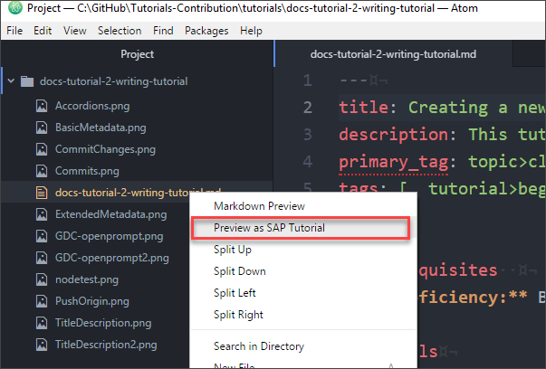

This opens a preview window so you can see how your tutorial will look when it is published online.


>**Quick Tip:** To highlight in the **Project** pane the file you are currently editing, use the keyboard short **Ctrl-Shift-\\**.


### Add validation


Validation is a question or other validation that provides a self-test for the user. Take advantage of these questions to emphasize key ideas.

>Every tutorial must have at least 1 step with a true validation -- though we encourage you to consider more -- with all the other steps with `[DONE]` buttons (which are added automatically by the new tutorial wizard).  

1. Open the `rules.vr` file in your tutorial's folder.

    The file is automatically created when you run the new tutorial wizard. If you need, simply create an new empty `rules.vr` file.

2. Right-click in the file, and select **Validation**, and then select the type of validation you want. For more detailed information on validation types, see [Add Validation to a Tutorial](https://developers-qa.sap.com/tutorials/docs-tutorial-3-adding-validation.html).

    The validation is added within a start and end validation tag, like: `[VALIDATE_1]`

3. Copy the validation tag.

4. Open your Markdown file, go to the step you want to add the validation to, and replace the `[DONE]` tag with the validation tag.

    The end of your tutorial should look something like this (leave a blank line before the tag):

    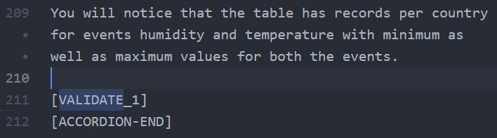


You can put in a validation in any step. Some authors prefer to finish the tutorial and add a step called **Test yourself** where they add the validation.

> **IMPORTANT:** You can only add one validation per step.


### Test tutorial

Right-click your tutorial file in the project tree, and click **Validate SAP Tutorial** (or with your Markdown file in focus, click **Alt-Shift-V**).

If all is OK, you will get the following:

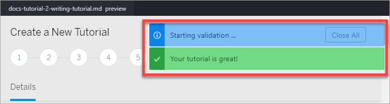

If there are problems, you will get something like this:


For each issue, go to that line and hover over the line number to see the error. You can use the keyboard shortcut **Ctrl-G** to move to a specific line.


>**VERY IMPORTANT:**

>- Fix the errors before pushing to QA.
>
>- If you have words that fail spellchecking but are valid company, product, or technology names, post a message on our [support Jam](https://jam4.sapjam.com/groups/A7NmsKmoG9vVaxizKhdQOk/forums?folder_id=YRmSuOCEf5NfGwyO0Y9SjL) and we will add them. UI elements that don't pass the spellcheck should be put in backticks.

>     But please check that you are spelling the names correctly. It is:

>     `JavaScript` not `javascript`
>
>     `Bash` not `bash`
>
>     `SAP HANA` not `hana`
>
>     `Node.js` not `nodejs`

### Push tutorial to QA


1. Once you have fixed any errors, right-click on your tutorial folder in the **Project** pane, and choose **Push Tutorial to QA**.

    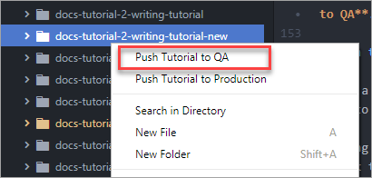

    You can select multiple tutorial folders and push them all to QA at once.

2. Enter a commit message that mentions briefly what change you made to which tutorial(s), and press **RETURN**. For example, **New ABAP tutorial** or **Added validation to cp-workflow-create**.

Pushing will take a few seconds, and when done you will get a link to your tutorial in QA. It will take up to 10 minutes for your tutorial to be published to QA web site and for the link to work.

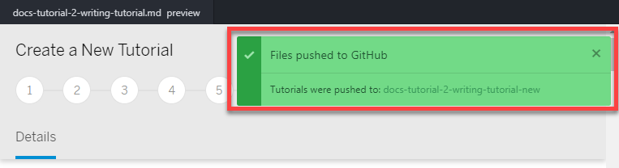

>If someone else worked on the file and there is a conflict, you will get a message like this:
>
>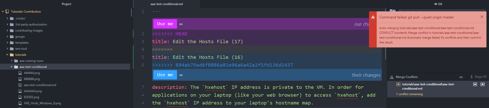
>
> <div>&nbsp;</div>
> Do the following:
>
> 1. Go through the conflicts and choose which version to keep with the **Use** buttons, or make edits in the text.
>
>2. Save the file.
>
>3. In the **Merge Conflicts** area of the **Git** pane on the right, right-click the file and click **Stage**.
>
>4. Add a commit message and click **Commit to master**.
>
>5. Click **Push**.
>
>If while you went through the conflicts, other people committed (unrelated) changes to QA, you may get this message:
>
>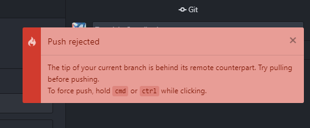
>
><div>&nbsp;</div>
>Right-click the Push button, and select **Pull**. Then click **Push**.


### Check tutorial in QA

Within 10 minutes of pushing your tutorial to QA (i.e., the `tutorials` folder of the `Tutorials-Contribution` repository), you can view your tutorial on the QA website.

Make sure the tutorial looks the way you intended. If not, make changes in the file, re-validate it, and push it again to QA, and check the revised version on the QA website.

>When you pushed the tutorial to QA, Atom gave you a link. If your tutorial is called `mytutorial-get-started`, then the URL would be:

>**`https://developers-qa.sap.com/tutorials/mytutorial-get-started.html`**

Credentials: `20Digital20` / `20Digital20`


### Test tutorial


>__*The first draft of anything is shit.*__
>
>&nbsp; &nbsp; &nbsp;&nbsp;&nbsp;&nbsp;&nbsp;(allegedly) Ernest Hemingway

Don't rush to publish your tutorial. Make sure the tutorial is tested by the following people:

  - You
  - At least one other person (like QA or UA, or better both) who makes sure the tutorial:
      - Actually works for someone using an external trial system.
      - Is simple and easy to do and teaches well about the SAP technology.


---

## Troubleshooting

### Cannot find module

If you get a message like this one:

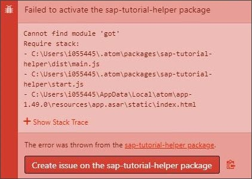

Open a command prompt in .... and run the following command:

```Shell
apm Install
```

### Tutorial not appearing in QA

- **QA is down:** Sometimes QA goes down for half a day to deploy new features. You will receive an email 10 minutes before it goes down, when it goes down, and when it returns.

    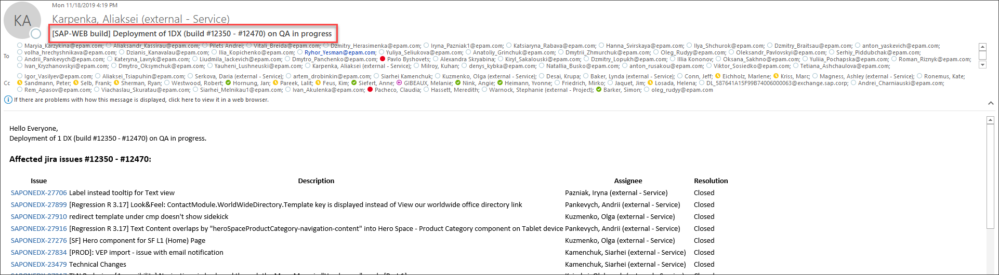

- **Bad primary tag:** If you entered a code for a primary tag that does not exist, your tutorial will not be published.


### Cannot sign in

If you changed users, you may have old credentials cached in your machine. You generally will get a message saying you cannot connect.

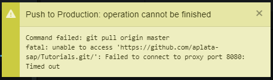

1. In Windows, search for and open **Change proxy settings**, and set **Automatically detect settings** to **On**.

2. In Windows, search for and open **Credential Manager**.

3. Choose **Windows Credentials**.

4. Go to the entry for `git:https://github.com`, and click **Remove**.

    Your old credentials are now removed but you need to enter the new ones.

5. In the Atom editor, click **Fetch**. A login dialog is displayed so you can log in.
