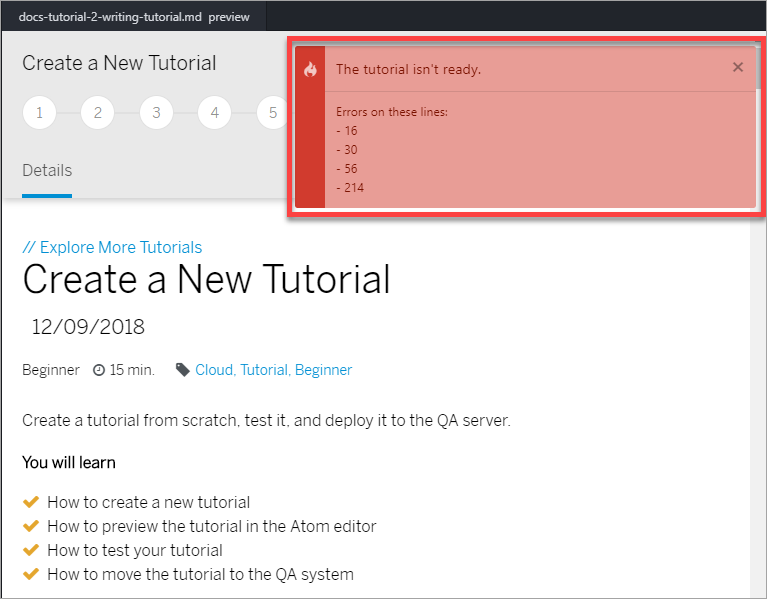

# Update an Existing Tutorial
<!-- description --> Update a tutorial that was already published. This tutorial is for people who only need to update an existing tutorial.

## You will learn  
  - How to update an existing tutorial  

## Intro
To work with tutorials, even to just update them, you must learn Git and Markdown and understand how tutorials are written. Check out [The big picture](https://developers-qa.sap.com/tutorials/docs-tutorial-0-big-picture.html) tutorial to get familiar with the needed technologies.

---

### Set up your environment

Install the needed software, as described in the [Get ready to write tutorials](https://developers-qa.sap.com/tutorials/docs-tutorial-1-getting-started-new.html)

### Open the .md file and make changes

In the Atom editor, open the `tutorials` folder, then the folder for your tutorial, and then double-click the `.md` file.

Make your changes.

Remember to follow the [style guide](https://github.com/SAPDocuments/Tutorials-Contribution/blob/master/templates/styleguide.md).

### Add validation

If the tutorial does not yet have validation, you must add it.

See the tutorial [Add validation to a tutorial](https://developers-qa.sap.com/tutorials/docs-tutorial-3-adding-validation.html).

### Test the tutorial

Right-click your tutorial file in the project tree, and click **Validate SAP Tutorial** (or with your Markdown file in focus, click **Alt-Shift-V**).

If all is OK, you will get the following:

If there are problems, you will get something like this:

For each issue, go to that line and hover over the line number to see the error. You can use the keyboard shortcut **Ctrl-G** to move to a specific line.

>**VERY IMPORTANT:** Fix the errors before pushing to QA.

### Move tutorial to QA

Follow Steps 5 and 6 in [Create a new tutorial](https://developers-qa.sap.com/tutorials/docs-tutorial-2-writing-tutorial-new.html#dfc5946a-aca7-4fd8-9776-099cd51a32d7) tutorial.

After a few minutes your tutorial is published to the QA web site, so you can make sure it looks OK. The URL to the tutorial is in the format **`https://developers-qa.sap.com/tutorials/cp-webide-mytutorial.html`**. Just change `cp-webide-mytutorial` to the name of your tutorial.

### Publish the tutorial

Follow the instructions in the [Publish a tutorial to production](https://developers-qa.sap.com/tutorials/docs-tutorial-4-publishing-production-new.html).

---
