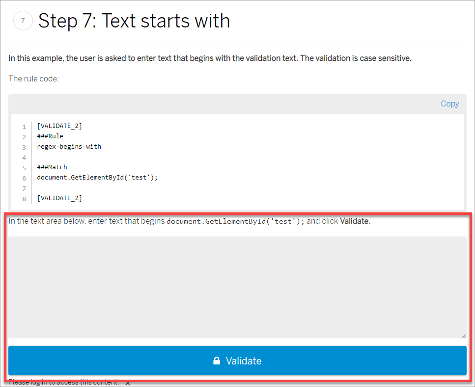
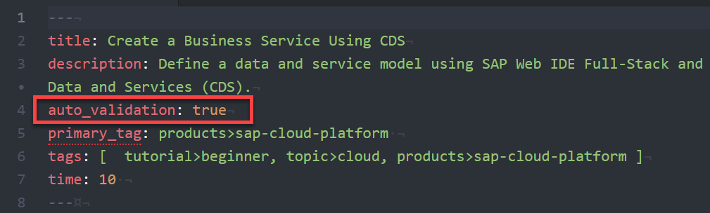

# Add Validation to a Tutorial
<!-- description --> Add validation to your tutorial so developers can show that they've completed it successfully.

## You will learn
  - How to create a rules files with validation steps
  - How to add a validation step to the end of a tutorial step
  - How to turn on validation for a tutorial  

## Intro
Validation allows developers to show that they finished a tutorial successfully, for example, by answering questions or copy-and-pasting the correct code into validation text areas. After passing the validation for all steps, the developer is listed as completing the tutorial.



For examples of validation, see the tutorials in the missions in the [AppSpace](https://developers.sap.com/app-space.html).

> To complete validation, the developer must be logged in.

> **IMPORTANT:** Please use at least one fill-in-the-blank type question, and one multiple-answer question for each mission you create.

The rules are created in a file called `rules.vr`, which you add to your tutorial folder (just like images). The file always is called `rules.vr`, so be careful that you don't confuse rules files for different tutorials.

>**IMPORTANT**: Never commit the `rules.vr` file to the production repository. When checking a user's answer, the 1DX system references the `rules.vr` file in the QA repository. We have added the `rules.vr` file to the `.gitignore` file, Git will ignore it.

Developers can check all the tutorials they've completed by going to the Developer Center [home page](https://developers.sap.com).


---
### Add validation tag


Validation metadata is automatically added to the tutorial metadata when you run the node new script, so for most people there is nothing to do here.



This metadata indicates that you have added validation to your tutorial. If temporarily you need to publish your tutorial to QA without validation -- and without errors being thrown -- you can remove the tag ... temporarily.

> **IMPORTANT:** The value should always be **`true`**.


### Create the rules file


Add a file called `rules.vr` to your tutorial folder (the new tutorial wizard will add one for you). The file is a set of rules, each one separated by a start and end `[VALIDATE_X]` tag (where X is an integer):

```
###Rule
exact-match

###Match
OrderButtonText=Order
OrderDialogTitle=Order Product
OrderDialogMsg=Do you want to order this product now?
OrderDialogSuccessMsg=The product has been ordered

```

Place the name of the rule element (e.g., `###Rule` and `###Match`) on its own line and the text that corresponds to that element on the following line.

How to write each rule type is described in the `RULE` steps below, but you can simply right-click on the rules file, and select **Validation** for a set of available rules.

>**IMPORTANT**: The `rules.vr` file is never committed to the production repository. When validating a tutorial, the 1DX system references the `rules.vr` file in the QA repository. When moving your tutorial to production, make sure the `rules.vr` file is not included.


### Add validation to tutorial steps


At the end of each tutorial step just before the accordion end tag, replace the default **`[DONE]`** tag with the tag (e.g., `[VALIDATE_1]`) for the rule you want for that step.

>You should have at least one step that contains a custom-defined rule. The rest can have the `[DONE]` tag.

>**IMPORTANT**: There must be a blank line before the `[DONE]` or `[VALIDATE_1]` tag, and the tag must not be indented.

```
[ACCORDION-BEGIN [Step 1: ](Exact Match Rule)]

In this example, the user will be asked to validate the exact code that is presented.

Open the `webapp/i18n/i18n.properties` file, and add the following four lines to the bottom:


OrderButtonText=Order
OrderDialogTitle=Order Product
OrderDialogMsg=Do you want to order this product now?
OrderDialogSuccessMsg=The product has been ordered


In the text area below, enter the text you inserted into your project, and then click **Submit Answer**.


[ACCORDION-END ]
```


### Test tutorial

With your tutorial in the `tutorials` folder, commit your validation changes, and then check that the validation works as you expected.

>Once you successfully validate a step, you cannot do the validation again (e.g., to check other input) unless you clear all of your progress.
>&nbsp;
>To clear your progress, go to **[My Progress](https://www.sap.com/developer/progress.html)** and click **Forget Me**. at the bottom of the page.

If something doesn't work properly, update your rules **AND** tutorial file (add an extra space to the Markdown file if you otherwise don't need to make changes), commit and push the changes, and retest.


### RULE: Question, single answer
>**IMPORTANT:** Please make sure that at least one question per mission is NOT this type of question and is fill-in-the-blank type question. Currently, there is no way to avoid "cheating" and quickly discovering the correct answer. Use multiple-answer (even with only 1 correct answer).


**In this example, the user is asked to select the correct answer to a question.**

The rule code:

```RULE
###Rule
single-choice

###Question
Select the correct file which contains the routing instructions:

###Match
[ ] Detail.view.xml
[ ] Component.js
[ ] formatter.js
[x] manifest.json

```


### RULE: Question, multiple answer
**In this example, the user is asked to select the correct answers (more than one) to a question. You can set any number of correct answers.**

The rule code:

```RULE
###Rule
multiple-choice

###Question
Which of the following file(s) must be modified to insert an `i18n` string in an app view?

###Match
[x] Detail.view.xml
[ ] Component.js
[x] i18n.properties
[ ] manifest.json

```


### RULE: Text matches

**In this example, the user is asked to enter text that exactly matches the validation text. The validation is case sensitive.**

>**IMPORTANT:** This validation ignores white spaces and casing.


The rule code:

```RULE
###Rule
exact-match

###Question
Enter code.

###Match
OrderButtonText=Order
OrderDialogTitle=Order Product
OrderDialogMsg=Do you want to order this product now?
OrderDialogSuccessMsg=The product has been ordered

```

In the text area below, enter the following text, and click **Submit Answer**.

```
OrderButtonText=Order
OrderDialogTitle=Order Product
OrderDialogMsg=Do you want to order this product now?
OrderDialogSuccessMsg=The product has been ordered
```


### RULE: Text exactly matches

**In this example, the user is asked to enter text that exactly matches the validation text. The validation is case sensitive.**

>**IMPORTANT:** This validation requires the user to enter the text EXACTLY as it appears in the rules file.


The rule code:

```RULE
###Rule
exact-match-precise

###Question
Enter code.

###Match
OrderButtonText=Order
OrderDialogTitle=Order Product
OrderDialogMsg=Do you want to order this product now?
OrderDialogSuccessMsg=The product has been ordered

```

In the text area below, enter the following text, and click **Submit Answer**.

```
OrderButtonText=Order
OrderDialogTitle=Order Product
OrderDialogMsg=Do you want to order this product now?
OrderDialogSuccessMsg=The product has been ordered
```


### RULE: Text starts with

**In this example, the user is asked to enter text that begins with the validation text. The validation is case sensitive.**

The rule code:

```rules
###Rule
regex-begins-with

###Question
Enter code.

###Match
document.GetElementById('test');

```

In the text area below, enter text that begins `document.GetElementById('test');` and click **Submit Answer**.


### RULE: Text contains

**In this example, the user is asked to enter text that exactly matches the validation text, but can include text before or after. The validation is case sensitive.**

The rule code:

```
###Rule
regex-substring

###Question
Enter code.

###Match
<footer>
   <Bar>
    <contentRight>
      <Button text="{i18n>OrderButtonText}"
                   type="Accept"
                 icon="sap-icon://accept"
                 press="handleOrder" />
    </contentRight>
  </Bar>

```

In the text area below, enter the following text, and click **Submit Answer**.

```
<footer>
   <Bar>
    <contentRight>
      <Button text="{i18n>OrderButtonText}"
                   type="Accept"
                 icon="sap-icon://accept"
                 press="handleOrder" />
    </contentRight>
  </Bar>
</footer>
```


### RULE: Text exactly matches with ID

**In this example, the user is asked to enter text that exactly matches the validation text, but with their ID instead of `[id]`. This validation is NOT case sensitive.**

The rule code:

```RULE
###Rule
regex-with-id-exact-match

###Question
Enter code.

###Match
https://codejam[id]trial.hanatrial.ondemand.com/codejam/mylibrary.xsjs

```

In the validation box below, copy the following URL, but replace the '[id]' with your ID: `https://codejam[id]trial.hanatrial.ondemand.com/codejam/mylibrary.xsjs`

You need to be logged in.


### RULE: HTTP status code

**In this example, the user is asked to enter a URL that returns the status code specified in the rule (such as `200`).**

The rule code:

```
###Rule
http-status-check

###Question
Enter URL.

###Match
200

```

Enter a valid URL, one that returns a status code of 200.


### RULE: Custom Regex

**In this example, the user is asked to enter text that exactly matches a regular expression.**

To construct the regular expression, you may wish to use online parsers, such as <https://regexr.com/>.

>We use the Java implementation of regular expressions. See <https://docs.oracle.com/javase/8/docs/api/java/util/regex/Pattern.html>.

The rule code:

```RULE
###Rule
regex

###Question
Enter code.

###Match
^https:\/\/account.hanatrial.ondemand.com\/cockpit\/.*\/\w\d+trial\/

```

In the text area below, enter the following text, and click **Submit Answer**.

```
https://account.hanatrial.ondemand.com/cockpit/#/acc/i347491trial/accountdashboard
```


### Done button

**This is an example of a step in which the user doesn't need to do anything but click the _Done_ button. Use the `[DONE]` tag instead of a `[VALIDATE_X]` tag (i.e., you do not have to define anything in the rules file).**

>In every tutorial, you should have at least one step that contains a rule that is not a _Done_ button.

The rule code:

```
```

