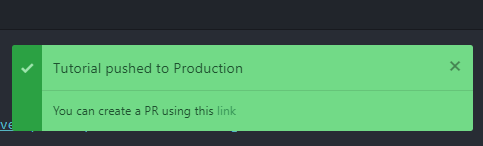
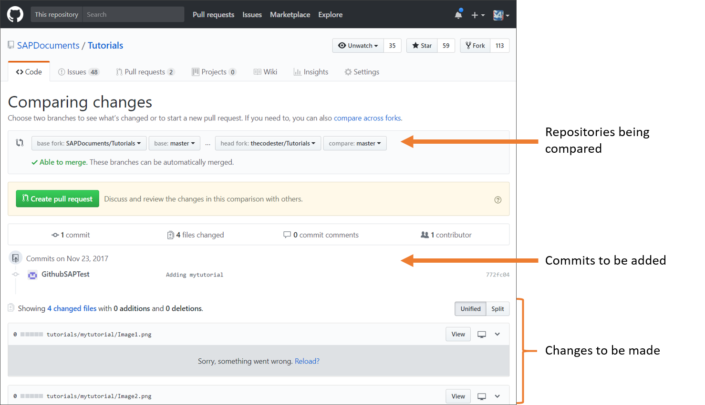
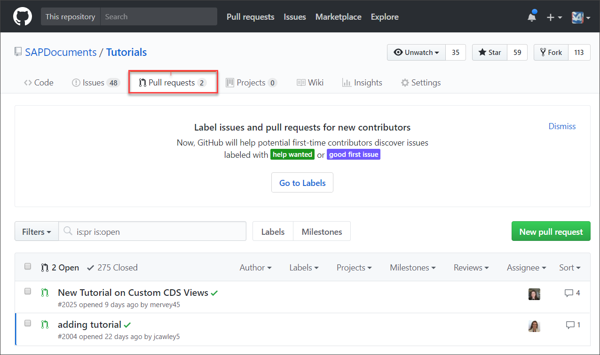

# Publish a Tutorial to Production
<!-- description --> Learn how to publish your tutorial to the live SAP developer's Tutorial Navigator.

## You will learn 
  - How to move your tutorial to your fork   
  - How to request to move your tutorial to production 

## Intro
To publish a tutorial, your finished tutorial is copied from the `Tutorials-Contribution` repository to your fork of the `Tutorials` repository. You must do this because you don't have access to the production `Tutorials` repository in the `SAPDocuments` account.

You then request that the tutorials be merged into the production `Tutorials` repository in the `SAPDocuments` account, by creating a pull request, which asks the `SAPDocuments` account to pull your changes into their repository.

>This is done with the help of the Atom plugin.

Once in the production repository, an automatic process creates the tutorial page in the live [**Tutorial Navigator**](https://developers.sap.com/tutorial-navigator.html), usually within 5 minutes.

>**IMPORTANT!** Only move your tutorial to production once you have checked your tutorial (i.e., proofread, edited, checked the images), and once a local colleague and the evangelist for your area have reviewed and approved the tutorial.

>&nbsp;
>Some things to look out for:
>
> - Can the tutorials be done without any special license?
  - Is all the text formatted OK?
    - Numbering is continuous.
    - Indents and spacing OK.
  - Are the images up-to-date?
  - Do the images show proprietary information (e.g., user IDs, URLs)
  - Are the titles and step titles in the correct format (i.e., start with simple verb, title case for titles, sentence case for steps).
  - Do all SAP names (of products and services) conform to branding guidelines. If you're not sure, check with the [Approved names](https://www.sapbrandtools.com/naming-center/#/search/status-search) and with your local User Assistance professional.

---


### Push to your fork

In the Atom editor, right-click your tutorial folder in the QA repo (or select more than one folder), and choose **Push Tutorial to Production**.

>The first time you push to production, you will be asked to specify the location of your fork on your machine.

This gets your tutorial into your fork, and displays a success message, with a link for creating a pull request.




### Create pull request

>If you previously created a pull request that has not yet been merged or closed, then your new changes are automatically added to the existing pull request and you do not have to create a new pull request (and you can skip this step).


1. Click on the link for creating a pull request in the success message from the previous step.

    This takes you to the GitHub web site, to a page that compares your changes to your fork with the current state of the production repository. You can see what changes you made – and more importantly, the changes you are asking the `SAPDocuments` account to accept.

    

2. Look through the changes and make sure you are only changing your own files, and the changes make sense to you.

3. If everything is OK, click **Create pull request**, enter a name for the pull request, and click **Create pull request**.

You can check your pull request by going to the [list of open pull requests](https://github.com/SAPDocuments/Tutorials/pulls) for the `SAPDocuments/Tutorials` repository. Yours should be listed there.



Someone on the evangelists/tutorial team will review your changes and, if all is OK, merge them into the production repository. Within 10 minutes they will appear on the production website.

---

### Troubleshooting

#### Cannot push to fork

If your fork gets messed up for some reason and you cannot push to production, then reset your fork.

1. Open a command prompt to your local fork repository.

2. Run the following command:

    > **CAUTION:** This will remove any changes in your local copy of your fork, and your remote fork on GitHub. Generally, this is not a problem, since you have everything in QA, but you should know.

    ```Git
    git fetch upstream && git reset --hard upstream/master && git push origin master --force
    ```

3. Try again to select your tutorial folder in QA and choose **Push Tutorial to Production**.

#### Cannot push to production (admins)

If your local clone of the production repository gets messed up for some reason and you cannot push to production, then reset your local repository.

1. Open a command prompt to your local repository.

2. Run the following command:

    > **CAUTION:** This will remove any changes in your local copy of the production database. Generally, this is not a problem, since you have everything in QA, but you should know (and if you have publishing privileges, you should know better).

    ```Git
    git fetch origin && git reset --hard origin/master
    ```

3. Try again to select your tutorial folder in QA and choose **Push Tutorial to Production** (Step 1).
