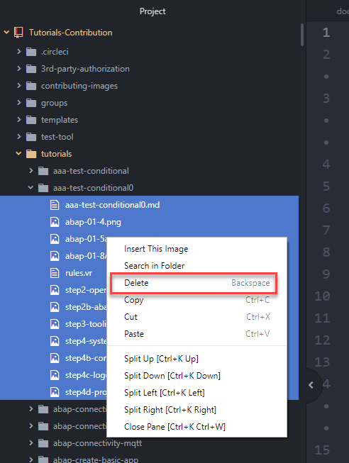
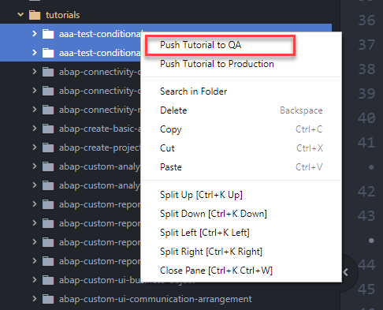
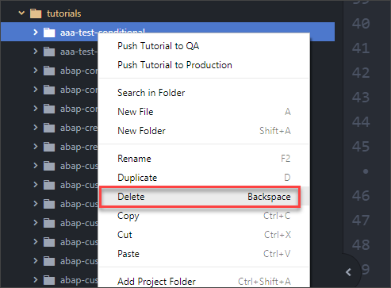

# Delete a Tutorial from QA
<!-- description --> Delete a tutorial from QA that is not yet in production.

## You will learn
  - How to delete a tutorial  
## Important: Avoid deleting tutorials
Tutorials in production are linked to missions and groups, to marketing campaigns, to a list of recommended tutorials, and are linked to from the Help Portal, Learning Journeys, Developer Center pages, Community posts, other tutorials as prerequisites, and other web pages. And, of course, they are indexed by Google.

## Intro
> **Avoid deleting tutorials, if possible. Instead, update them.**

If you have to delete a tutorial, first reach out to [Daniel Wroblewski](mailto:daniel.wroblewski@sap.com). I will check dependencies and delete them for you, including groups and missions, if needed.

This tutorial explains how to delete a tutorial that you have already pushed to QA but not to production.

---

### Delete tutorial files

1. Open the tutorial folder.

2. Select all the files in the folder.

3. Click **Delete**.

### Push to QA

Right-click the tutorial folder, and click **Push to QA**.

You can also select multiple folders, and then click **Push to QA**.

### Delete folders (locally)

The push will not delete the local folders you have in Atom so you need to do this manually.

>These folders do not appear in GitHub.

Right-click the folder(s) and click **Delete**.

---
