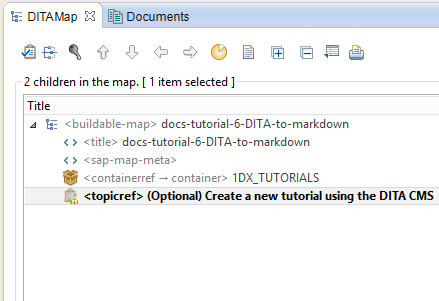
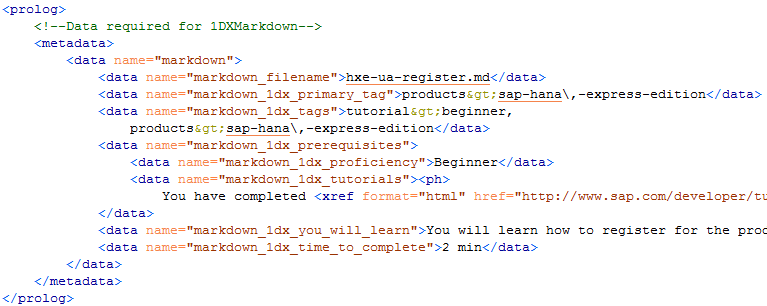
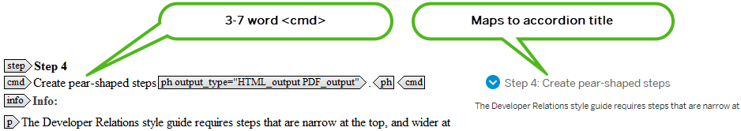
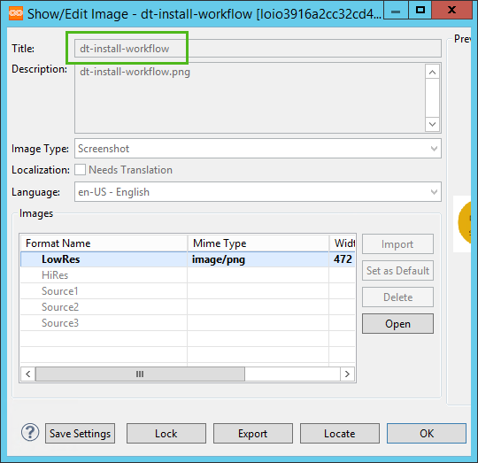
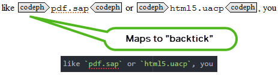

# (Optional) Create a new tutorial using the DITA CMS
<!-- description --> If you are a UA information developer, create a Developer Relations tutorial from scratch using the 1DX markdown output type in the DITA CMS, test it, and deploy it to the QA server.

<!-- loio7cb7299490de415c82a4cd82178a1388 -->

## Prerequisites
 - **Proficiency:** Beginner
 - **Tutorials:**

## You will learn
How to create a tutorial using your CMS.  
## Time to Complete
30 min

---

### Complete all onboarding training

As a UA information developer, you can use the DITA CMS to bypass some steps in the Developer Relations tutorial creation workflow, but certainly not all the steps. You need to be very familiar with the Developer Relations tutorial authoring procedures before you begin. In addition, User Assistance and Developer Relations are different entities – Developer Relations has a unique style guide, and different legal considerations. You are required to complete all mandatory tutorial authoring training before you start authoring your tutorial in DITA.

Read these training materials in sequence. When prompted for a user name and password, use `20Digital20` / `20Digital20`:

|Required Training Resource|Location|
|--------------------------|--------|
|The big picture on tutorials| `https://www-qa.sap.com/developer/tutorials/docs-tutorial-0-big-picture.html` |
|Get ready to write tutorials| `https://www-qa.sap.com/developer/tutorials/docs-tutorial-1-getting-started.html` |
|Create a new tutorial| `https://www-qa.sap.com/developer/tutorials/docs-tutorial-2-writing-tutorial.html` |
|Add validation to a tutorial| `https://www-qa.sap.com/developer/tutorials/docs-tutorial-3-adding-validation.html` |
|Publish a tutorial to production| `https://www-qa.sap.com/developer/tutorials/docs-tutorial-4-publishing-production.html` |
|Create a tutorial group| `https://www-qa.sap.com/developer/tutorials/docs-tutorial-5-create-group.html` |
|Accept guidelines from SAP Legal (Requires GitHub permissions)| `https://github.com/SAPDocuments/Tutorials-Contribution/blob/master/contributing.md` |
|Developer Relations Tutorial Style Guide (Requires GitHub permissions)| `https://github.com/SAPDocuments/Tutorials-Contribution/blob/master/templates/styleguide.md` |

### Create a dedicated buildable map

(This step is for doc leads.) A 1DX markdown tutorial originates in a dedicated buildable map containing a **single** task topic. Create a buildable map and add one task topic. Never add multiple tasks topics. Never add concept or reference topics.

1.  Create a buildable map. It is recommended that the buildable map title matches the GitHub folder name you want for your tutorial. For example: `hxe-ua-starting-the-vm`. Folder naming conventions were provided in your Developer Relations tutorial creation onboarding training.
2.  Create a single task topic child. There are no special restrictions on the task title. (The tutorial title originates in metadata, and not in the task title.)
3.  Do not define relationship tables in the dedicated buildable map.

For more information see [Create a Dedicated Buildable Map](https://help.sap.com/viewer/DRAFT/bba968de69fc4814b97a0da987913be1/1/en-US/fc0fb62906664cfb8b5eddd733fb52e0.html) in the *UA Infrastructure User Guide*.

### Define the metadata block and header

Define `<title>`, `<shortdesc>`, and `<prolog><metadata>` as shown in [Create the Task Topic](https://help.sap.com/viewer/DRAFT/bba968de69fc4814b97a0da987913be1/1/en-US/eb20210afc2a4d61ac4ee2c6e6587d2f.html) in the *UA Infrastructure User Guide*.

The metadata block is critical as it contains mandatory values for your tutorial including tutorial navigator tags, user proficiency level, and time to complete.

### Create pear-shaped steps

The Developer Relations style guide requires steps that are narrow at the top, and wider at the bottom (pear-shaped). Steps in 1DX markdown output become accordions. The `<step><cmd>` tag becomes the accordion title. Accordion titles need to be short – explain in 3 to 7 words what the step is, at a high level. Your `<cmd>` tag must contain no more than 7 words, and must begin with an imperative.

If your step contains images, note that the image title maps to the image file name in your markdown output. Use dashes rather than underscores in image titles (which gives you dashes rather than underscores in image file names).

> Note:
> Make sure the `.PNG` file has an uppercase `.PNG` file extension, and not a lowercase `.png` extension.
>
>

### Anticipate backticks

In step 11, you will test your markdown file using the `test.js` script. The test script has a very sensitive spellchecker that reports uncommon terms as spelling errors. In markdown, authors hide the "false positives" from the spellchecker by surrounding them with single backtick marks. In DITA, certain tags like `<codeph>`, `<keyword>`, `<filepath>` map to "surround with backticks".

To reduce the number of `test.js` errors (caused by uncommon words) you'll encounter in step 11, tag suspect terms **now** so they are surrounded by backticks in markdown output. For example, tag the SAP HANA, express edition default user `hxeadm` with `<codeph>`.

For a list of DITA tags that map to "surround with backticks" see [Supported / Unsupported Features - Markdown 1DX](https://help.sap.com/viewer/DRAFT/bba968de69fc4814b97a0da987913be1/1/en-US/466139ac351c43fd8fc539d4ead007d2.html) in the *UA Infrastructure User Guide*.

### Check tables for compliance

Markdown tables support a limited subset of the features available in DITA tables. Some table functionality available in DITA is not supported by the markdown conversion. Ensure all tables in your task meet the markdown requirements, or you will encounter build errors due to unsupported table functionality.

See [Check Tables for Markdown Compliance](https://help.sap.com/viewer/DRAFT/bba968de69fc4814b97a0da987913be1/1/en-US/2642f2c3dc024c52abb2ba827d89a0f5.html) in the *UA Infrastructure User Guide*.

### (Optional) Profile for reuse

If you are re-using tutorial content in other output types like `pdf.sap` or `html5.uacp`, you may want to suppress markdown-only content in non-markdown outputs. Use the profile `output_type="markdown_output"`.

See [Reuse: Profiling Considerations when your 1DX Markdown Task Topic is Reused in Another Buildable Map](https://help.sap.com/viewer/DRAFT/bba968de69fc4814b97a0da987913be1/1/en-US/11db453e37e744ada179d15d346e546d.html) in the *UA Infrastructure User Guide*.

### Configure the project map

(This step is for doc leads.) Add mandatory rendering properties, and assign the `markdown.sap1dx` output type to the dedicated buildable map. See [Configure 1DX Markdown Output in the Project Map](https://help.sap.com/viewer/DRAFT/bba968de69fc4814b97a0da987913be1/1/en-US/893a939fb5cd46c2ab136117eb12983d.html) in the *UA Infrastructure User Guide*.

### Configure the project

(This step is for doc leads.) Ensure your project map is referenced in an active project.

### Build markdown output

Build your output.

Copy the Zip file for your tutorial from the `dropzone` to a local folder on your machine.

Extract the Zip file and copy the folder (containing the `*.md` file and your `.PNG` files) to your local `Github/Tutorials-Contribution` folder.

### Test markdown output

In GitHub, test your tutorial using `node test.js`.

In Atom Editor, preview the tutorial. See [Test 1DX Markdown Output and Push to GitHub](https://help.sap.com/viewer/DRAFT/bba968de69fc4814b97a0da987913be1/1/en-US/861fb1e4396b467ab98bf1ca8b48c7e3.html) in the *UA Infrastructure User Guide*.

### Push to GitHub

See [Test 1DX Markdown Output and Push to GitHub](https://help.sap.com/viewer/DRAFT/bba968de69fc4814b97a0da987913be1/1/en-US/861fb1e4396b467ab98bf1ca8b48c7e3.html) in the *UA Infrastructure User Guide*.

### Check tutorial on QA website

Go to `https://www-qa.sap.com/developer/tutorials/(tutorial-folder-name).html` and check the tutorial for problems.

When prompted for a user name and password, use `20Digital20` / `20Digital20`

### Publish to production site

(This step is for doc leads.) If you have GitHub Publisher rights, push the tutorial from the `Tutorials-Contribution` repository to the `Tutorials` repository. This will also push the updated tutorial from the QA website to the live website.
