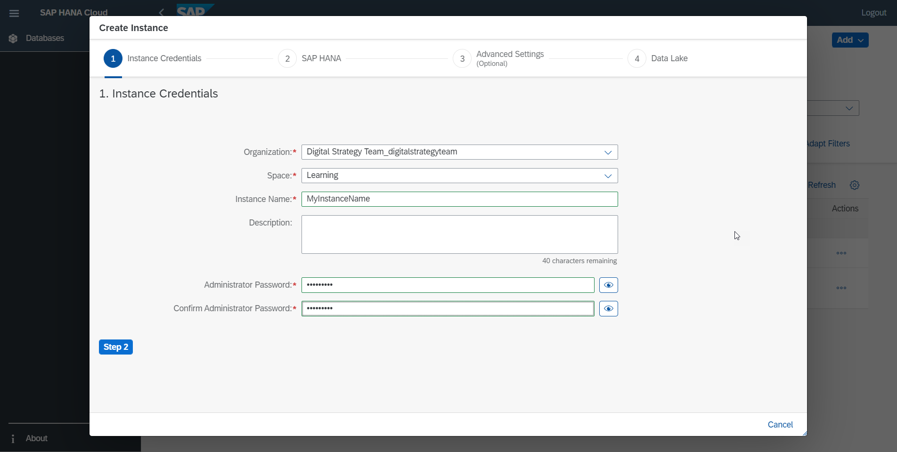
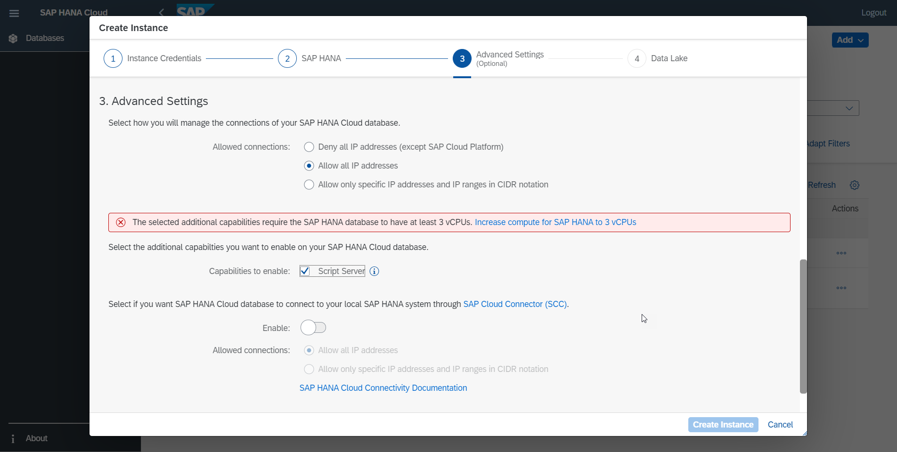
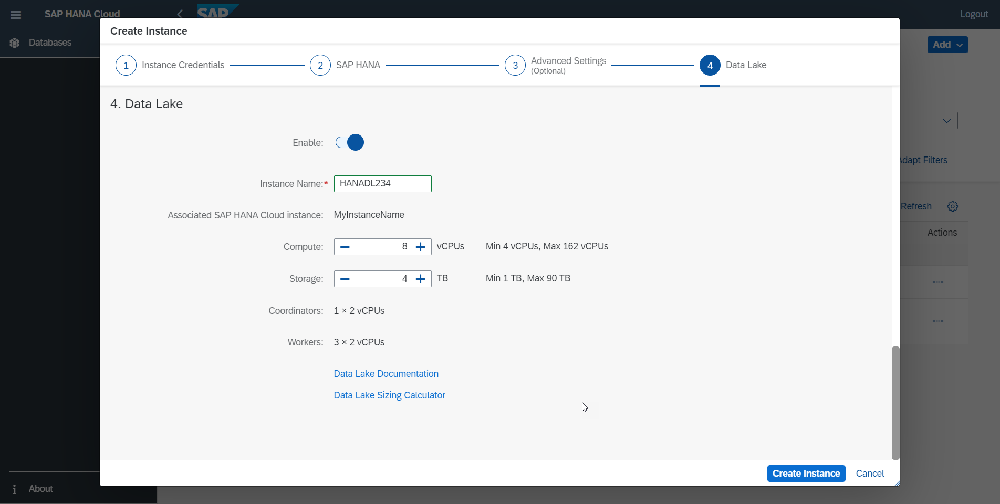
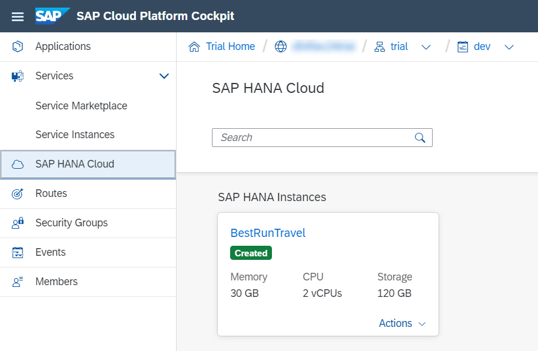
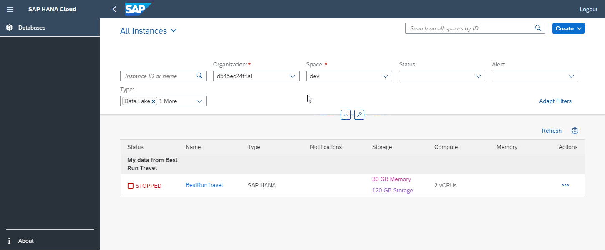

# Provision a Trial Database Instance of SAP HANA Cloud, SAP HANA Database
<!-- description --> Provision your trial instance of SAP HANA Cloud, SAP HANA database and SAP HANA Cloud, Data Lake.

## Prerequisites
 - Register for the [SAP HANA Cloud trial](https://www.sap.com/cmp/td/sap-hana-cloud-trial.html?source=digital-strategy-learning).
 - Log into your SAP Business Technology Platform trial account.

## You will learn
  - How to adapt your trial entitlements if you already have a SAP Business Technology Platform trial account
  - How to provision your SAP HANA Cloud, SAP HANA database and a managed SAP HANA Cloud, data lake trial instance
  - How to restart your SAP HANA Cloud, SAP HANA database trial instance

## Intro
SAP HANA Cloud is the evolution of SAP HANA Service. It's a cloud-native, database as a service that you can start using right now as part of the SAP Business Technology Platform offerings. You can use SAP HANA Cloud as a central access point to all your data -- whether this data is stored in an on-premise system, on other cloud systems, or on SAP HANA Cloud itself.

Currently the SAP HANA Cloud trial allows you to test the SAP HANA database and the data lake components of SAP HANA Cloud. For a complete overview of all SAP HANA Cloud components, please see the [Onboarding Guide](https://saphanajourney.com/hana-cloud/onboarding-guide/).

---

### Check entitlements

If you currently have an active trial account in SAP Business Technology Platform, then you need to enable an entitlement before you can start your SAP HANA Cloud trial. If you are doing HDI development, you should also check if your entitlements for the HDI Containers and HANA schemas are correctly assigned.

1.    In your subaccount, in the left-hand menu, click **Entitlements**.

2.    Make sure you have entitlements for these services (and service plans):

    - SAP HANA Cloud:

        - `hana-cloud-connection`
        - `hana`
        - `relational-data-lake`

    - SAP HANA Schemas & HDI Containers

        - `hdi-shared`
        - `schema`
        - `securestore`

    >**IMPORTANT:** You will see two options in the list related to schemas and HDI containers. Make sure to select the one that **does not say (trial)**, as you can see on the screenshot below.

3.    If you do not have any of the entitlements above, you need to add them to your account.

4.    To do that, click **Configure Entitlements** in the top right, then click **Add Service Plans**.

5.    In the search box, type **HANA**.

6.    Select the missing entitlements by checking the boxes, and then click **Add the X services**.

7.    Back on the main **Entitlements** screen, make sure to click **Save**.

### Provision SAP HANA Cloud, SAP HANA database and data lake trial instances

Now that you have registered for a trial of SAP HANA Cloud, your global account, subaccount, and space are automatically set up.

It's time to provision your SAP HANA Cloud, SAP HANA database instance.

Because you are using a trial account, you will only be able to create one instance with a predefined size. However, the process to create the instance is very similar to what you will see later if you choose to have a production account of SAP HANA Cloud.

Let's get started.

1.    In the SAP BTP cockpit, navigate to your subaccount, then to the space within it.

2.    In the left-hand menu, click **SAP HANA Cloud**.

3.    Click on **Create** at the top right, then select **SAP HANA Database**.

    A new tab opens in which you see the SAP HANA Cloud Central. Follow the steps in the wizard by first inputting a name on the **Instance Name** field. Please note that you should not use any spaces in the name.

    <!-- border -->

    You can insert a description of this instance on the **Description** field. Then insert a password in the **Password** field. Confirm it by typing it again on the **Confirm Password** field. This password will be associated with the automatically generated DBADMIN user, which has full powers within your SAP HANA database, so make sure to not to forget it.

    Once you entered a safe password, the **Step 2** button appears. Click on it.

3.    Step 2 is where, in a production environment, you would be able to scale your instance up or down. Because you are using a trial instance, you can't change your configuration.

    Click on **Step 3**.

    <!-- border -->

4.    Now it's time to configure the **Advanced Settings** of this instance. First, manage the allowed connections for the SAP HANA database instance. That means choosing if you want allow access to the instance from outside of the SAP Business Technology Platform. You can either deny all IP addresses outside of BTP, allow specific IP addresses, or allow all connections from all IP addresses.  

5.    Next you can also enable the **SAP Cloud Connector** in case I want to easily connect the SAP HANA database instance to an SAP HANA on premise database.

6.    Click on **Step 4** to continue.

7.    This is where you can choose to activate the SAP HANA Cloud, data lake. If you active it here, this means this data lake will have maximum compatibility with SAP HANA and a remote connection between your SAP HANA database and the data lake will be created automatically during provisioning. It's what we call a managed data lake. Click on the switch to enable it.

8.    Give a name to the managed data lake instance. When you add a managed data lake, the HDLADMIN user is automatically created and is given the same password as DBADMIN, which you set in the first step.

Now you can manage the allowed connections for your SAP HANA Cloud instance. That means choosing if you allow access to your SAP HANA Cloud instance from outside of SAP Cloud Platform.

    For your trial, choose to allow all connections from all IP addresses.

    >In a production environment, you could choose to enable the [Script Server](https://saphanajourney.com/hana-cloud/learning-article/using-machine-learning-capabilities-with-sap-hana-cloud). The trial instance standard size does not allow the Script Server to run. In this step you could also choose to enable the SAP Cloud Connector, which makes it easier to connect this SAP HANA Cloud instance to a SAP HANA on-premise database.

    Click **Step 4**.

5.    Now it is time to choose if you want to enable the SAP HANA Cloud, data lake. Let's enable the data lake now.

    >In a production environment, this is where you would be able to adjust how much compute and storage space it has. Remember that you can enable or disable the data lake later as well, if you prefer.

    <!-- border -->

7.    Click on **Create Instance** and you are done!

Your first SAP HANA Cloud instance is being created, and you can monitor its status to see when it will be ready for use. This process usually takes a few minutes.

<!-- border -->

### Restart your SAP HANA Cloud trial instance

The final step is learning how to start and stop your instance.

During your trial, your instance is automatically stopped overnight, according to the server region time zone. So you need to start your instance before you start working with your trial every day.

<!-- border -->

1.    To restart the instance, simply click on the **Start** button in the three dots menu next to the SAP HANA Cloud instance line on the SAP HANA Cloud management tool. It takes a few minutes to start and you can follow the progress by clicking on **Refresh**.

2.    Once it's ready to be used, it will show a **Created** status on SAP Cloud Platform, and a **Running** status on the SAP HANA Cloud management tool

3.    To stop an instance, just click on the **Stop** in the three dots menu next to the SAP HANA Cloud instance line on the SAP HANA Cloud management tool. It takes a few minutes.

4.    Once your instance is stopped, the status on the top of the tile on SAP Cloud Platform will remain as **Created** and the status on the SAP HANA Cloud management tool will be updated to **Stopped**. The option in the menu will change to **Start**.

