# Create a Replication Service in SAP HANA Cockpit
<!-- description --> Set up a replication service in SAP HANA cockpit that allows you to replicate privileges, tables, and views from SAP HANA on-premise to an SAP HANA Cloud, SAP HANA database.

## Prerequisites
- A **running** instance of SAP HANA Cloud, SAP HANA database.
-	An SAP HANA on-premise database that contains user privileges, tables, and/or views.
-	The SAP HANA on-premise database should be running on SAP HANA platform edition. Alternatively, you can [download and install the latest SAP HANA express edition](https://www.sap.com/cmp/td/sap-hana-express-edition.html#20) either as binary in Linux or as VM (Virtual Machine) locally or in any cloud provider like Amazon Web Services, Microsoft Azure or Google Cloud Platform.
-	An established [SDI connection between your SAP HANA Cloud, SAP HANA database and SAP HANA on-premise database](hana-cloud-mission-extend-06).

## You will learn
- How to set up a replication service in SAP HANA cockpit
- How to monitor a replication service in SAP HANA cockpit

## Intro
A **replication service** allows you to replicate user privileges, tables, and views from SAP HANA on-premise to SAP HANA Cloud, SAP HANA database via an easy-to-use user interface.

To use a replication service, you need to have a remote source connection between the on-premise database and the SAP HANA Cloud, SAP HANA database with SDI and DP Agent. If you are unsure how to do that, please refer to the [previous tutorial of this group](hana-cloud-mission-extend-06).

With a replication service, you can move a subset of your data and begin using SAP HANA Cloud, SAP HANA database without having to manually recreate the many permissions from your on-premise system. You can read more about the replication service in the [SAP community blog post by Tae-Suk Son here](https://blogs.sap.com/2020/11/10/replication-service-to-easily-setup-replication-from-sap-hana-on-premise-to-sap-hana-cloud./).

---

### Enable the SAP HANA Data Provisioning Server

1.	In the SAP BTP cockpit, navigate to the subaccount and space of the SAP HANA Cloud, SAP HANA database instance that you want to connect to your SAP HANA on-premise system.

2.	On the panel on the left, click on **SAP HANA Cloud**.

3.	In the bottom right corner of on the instance tile, select the option to open the SAP HANA cockpit.

4.	There, navigate to **Services**.

    <!-- border -->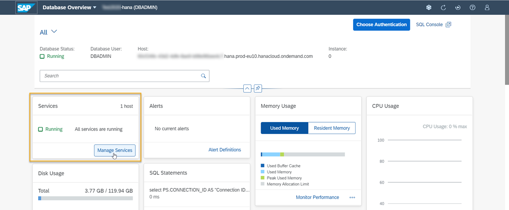

5.	There, make sure the SAP HANA Data Provisioning Server is enabled on your SAP HANA Cloud, SAP HANA database instance. This server is enabled by default when you create the instance.

    <!-- border -->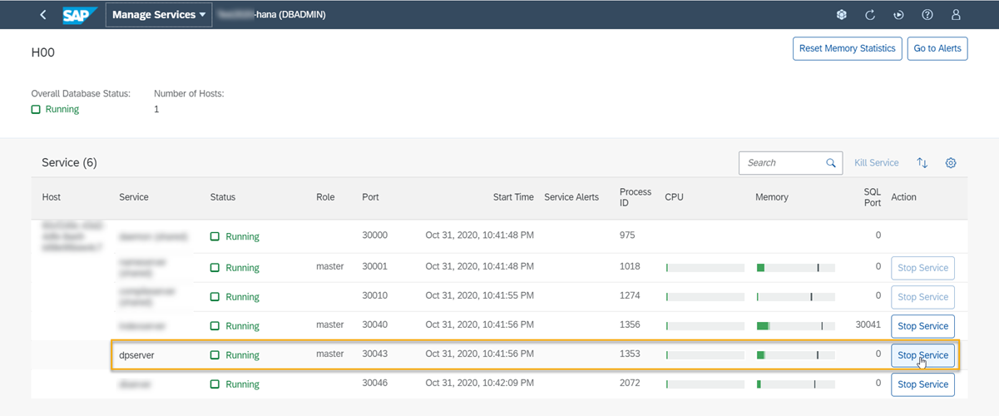

### Create users with the necessary privileges

1.	In your **on-premise system**, create a technical user that has the following privileges:

    -	`CATALOG READ` (so the wizard can list objects for replication)
    -	`SELECT`, `DROP`, or `CREATE ANY` on the schemas of users other than this technical user, which should be replicated
    -	`SELECT`, `DROP`, or `CREATE ANY` on schemas with objects, which should be replicated
    -	`SELECT` on any other objects to be replicated, and `TRIGGER` if these objects need to be replicated in real-time

    > Please note that schemas and tables generated by a `SYSTEM` and `SYS` user will not be able to be replicated, so any other user than these should be the owner of objects you want to replicate.
    >
    > If you are unsure of how to create a user, [please see more detailed information here](hana-cloud-mission-trial-4).

    <!-- border -->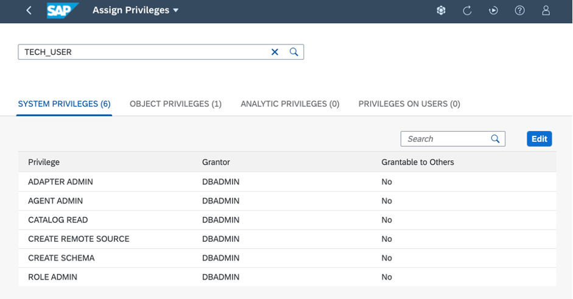

2.	In your SAP HANA Cloud, SAP HANA database instance, create a user with the following privileges:

    -	`CATALOG READ`
    -	`AGENT ADMIN`
    -	`ADAPTER ADMIN`
    -	`CREATE REMOTE SOURCE`
    -	`ROLE ADMIN`
    -	`CREATE SCHEMA`

    > You can also grant the user any other system privileges you want to replicate from users in your on-premise system.
    >
    > If you are unsure of how to create a user, [please see more detailed information here](hana-cloud-mission-trial-4).

Now you are all set to create the replication service.

### Create the replication service in SAP HANA cockpit

> ### IMPORTANT
>
> Your on-premise database should contain objects that can be replicated, e.g., at least one schema with at least one table that includes at least one row of data. Make sure none of the objects you want to replicate are owned by the `SYSTEM` user.

1.	In SAP HANA cockpit, navigate to **All** or **Monitoring**.

    <!-- border -->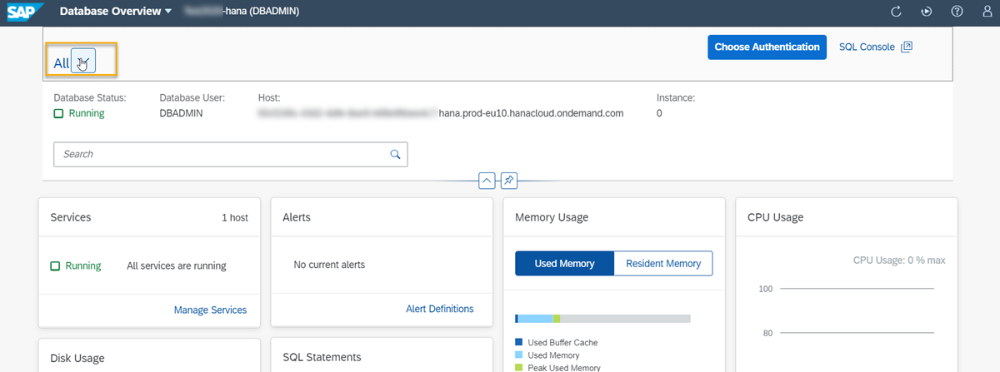

2.	On the card **Connections to SAP HANA Cloud**, click on **Create Replication**.

    <!-- border -->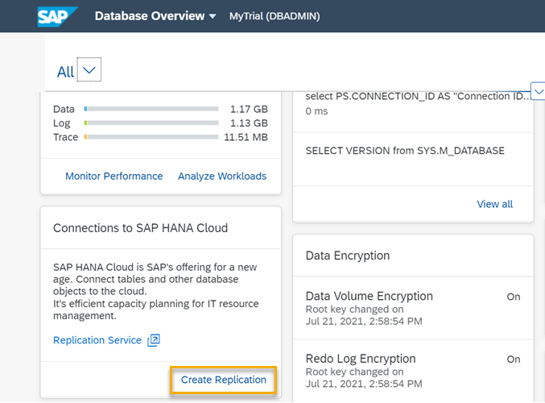

3.	A setup wizard will open. In the first step, click on **Creating New Connection**, then select one of the options depending on your SAP HANA on-premise version. If you already have established a connection, you can also select it in this step. Click on **Step 2**.

    <!-- border -->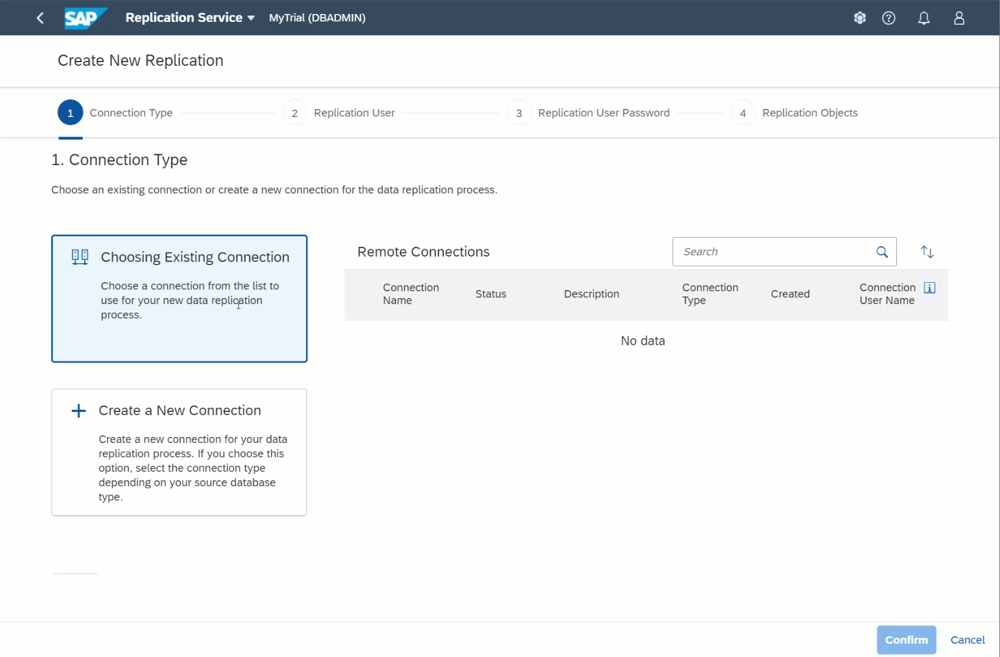

4.	Fill in a name for the connection, optionally add a description. You can select if you would like to use the cloud connector, in which case you can also add a location ID here.

5.	Next, enter the Host and Port number of the database you want to replicate data from. You also have the options to enable SSL encryption and validate server certificates.

6.	Finally in this step, you need to enter the credentials of the remote database.

    > The user you enter here, needs to have the privileges listed in step 2.1

7.	Once you have entered all information in this step, click on **Create Connection**.

8.	In this step, you need to enter the properties for the connection to the source database:

    - In the fields **Host** and **Port number**, enter the host name and port number of the SAP HANA on-premise database you want to connect.

    - In the field **Enable SSL Encryption**, you can select whether SSL encryption should be enabled.

    - In the field **Validate Server Certificate**, you can select whether the server certificate for this connection should be validated. In our example, we disabled both, but for production purposes, we recommend enabling both. Please refer to the [technical documentation on how to configure SSL from the `DPAgent` with SDI here](https://help.sap.com/viewer/7952ef28a6914997abc01745fef1b607/LATEST/en-US/462b5562baed4f6c86406a2dd4b43d0e.html).

    - In the field **User and Password**, enter the credentials of the user, which has the privileges for the on-premise database listed under preparations above (step 6). Click on **Step 4**.

    <!-- border -->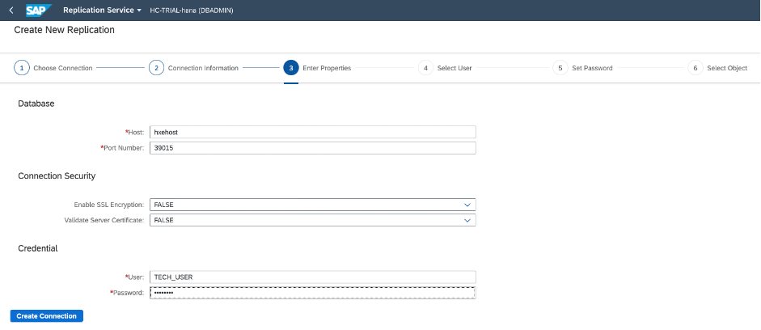

9.	Now, a list of users that was granted to the user you specified will be listed for replication. You can select the user(s) you want to replicate from your on-premise source system to your instance of SAP HANA Cloud, SAP HANA database. For each user you can specify if the privileges should be replicated. The privileges that can be replicated can be of the following types:
    -	`SYSTEM PRIVILEGE` (except `DATA ADMIN`)
    -	`SCHEMA`
    -	`TABLE`
    -	`VIEW`
    -	`PROCEDURE`

    <!-- border -->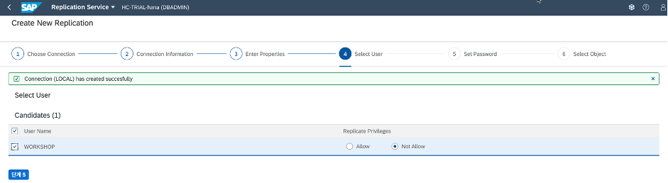

10.	Click on **Step 5** and set a **new password** for each user. Enter it twice.

    <!-- border -->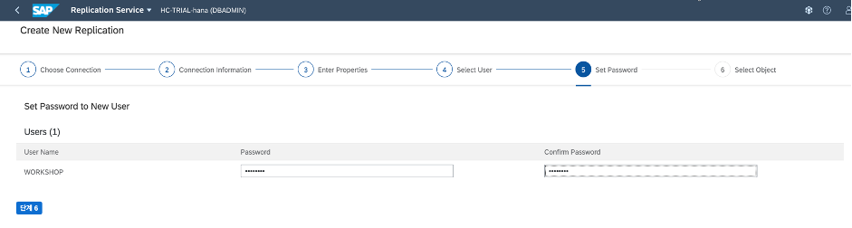

11.	Then, click on **Step 6**. Next, select the database object(s) you want to replicate. For each of the objects, you can set a replication schedule. If you select **None**, your data will not be synchronized after replication. If you select **Real Time**, the data will be synchronized continuously.

    <!-- border -->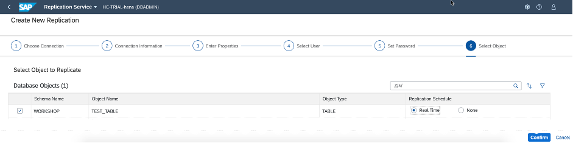

12.	Click on **Confirm** in the bottom right corner and the new replication service will be created.

You are done! Your replication service is now ready and will replicate the selected objects based on your replication schedule.

### Monitor the replication service

On the **monitoring page** for this replication service, you can now display the status of each replicated object. There, you can also complete the following actions:

-	**Pause** and **Resume** the Replication
-	**Add** new replication objects
-	**Delete** objects from the replication service
-	Adjust the **Connection Type** to change the storage location between in-memory and disk storage.
-	Change the **Replication Schedule** for replication objects.
-	View dependencies of replication objects by clicking the **View Dependencies** icon.

<!-- border -->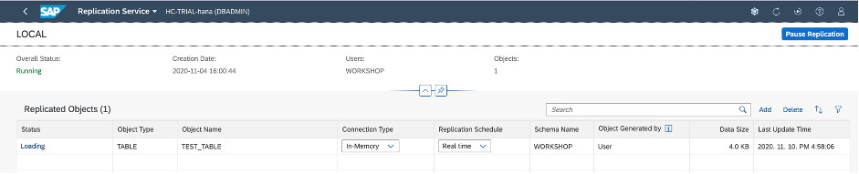

To continue to learn more about replication services, you can take a look at these resources:
-	[Technical documentation on Replication Service](https://help.sap.com/viewer/9630e508caef4578b34db22014998dba/LATEST/en-US/3ca69a28287e436c983b67b5e09376f9.html)
-	[SAP Community Blog Post on Replication Service by Tae-Suk Son](https://blogs.sap.com/2020/11/10/replication-service-to-easily-setup-replication-from-sap-hana-on-premise-to-sap-hana-cloud./)

> **Well done!**
>
> You have completed the fourth tutorial of this group! Now you know how to set up a Replication Service for an established SDI connection, which allows you to replicate tables, privileges, and views from an SAP HANA on-premise database to an SAP HANA Cloud, SAP HANA database instance.   
>
> In the next tutorial you can get to know a different way to set up a connection between SAP HANA on-premise and SAP HANA Cloud, SAP HANA database: Using the cloud connector.

### Test yourself

---
