# Consume Calculation View in SAP Analytics Cloud
<!-- description --> Model a calculation view in SAP HANA Cloud and consume it using Live Connection in SAP Analytics Cloud.

## Prerequisites
 - You have [Set Up a BTP Account for Tutorials](group.btp-setup). Follow the instructions to get an account, and then to set up entitlements and service instances for the following BTP services.
    - **SAP Business Application Studio**
    - **SAP Analytics Cloud trial**

  ## You will learn
- How Data and Analytics facets of BTP work together
- How SAP HANA modeling is performed using SAP Business Application Studio
- Understand the setup of SAP HANA Cloud Live Data Connection in SAP Analytics Cloud
- How to create and use HDI containers
- How to create stories in SAP Analytics Cloud.

## Intro
In this tutorial, you will learn about the creation of a calculation view in SAP HANA Cloud. The created calculation view is later consumed in SAP Analytics Cloud using Live Data Connection to create a story for detailed data analysis.

---

### Start SAP Business Application Studio and create a Dev Space

1.  Login to your BTP trial subaccount, navigate to subscriptions and select SAP Business Application studio.

    <!-- border -->

    This will open the dev spaces.

2.  Click on Create Dev Space.

    <!-- border -->

3.  Select SAP HANA Native Application for the Dev

    Space type and specify a name.

    We have provided the name as HANA Dev Space.

    <!-- border -->

4. Click on create Dev Space button.

    In a minute, the Dev Space will get created. We need to start the Dev Space which will by default be in stopped state.

    <!-- border -->

5. After starting, the state of the Dev Space changes to Running.

    <!-- border -->

### Launch the studio and log into Cloud Foundry

1. Click on the Dev Space name to launch Business Application Studio.

    

    After launching Business Application Studio, we need to login to Cloud Foundry.

2. To login, we can click on View menu, select find command and type CF. From the available options we need to select login to CF.

    <!-- border -->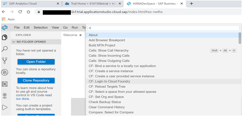

3. Select the Cloud Foundry endpoint.

    <!-- border -->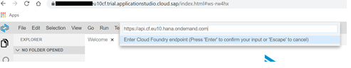

4. Specify your e-mail address.

    <!-- border -->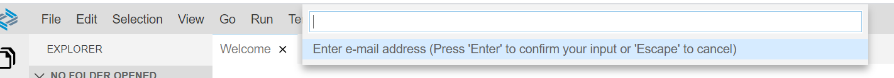

5. Select the space from the CF Subaccount. This will set the CF Organization and Space for the application we are building

    <!-- border -->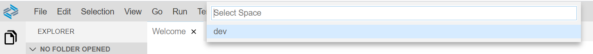

6. A confirmation message will be shown at the bottom of the screen.

    <!-- border -->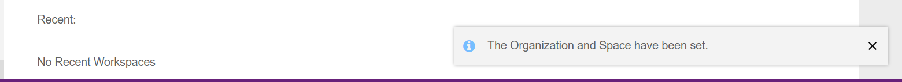

### Create SAP HANA database project

1. We will start the creation of the project now. Select File menu, choose the option project from template this will show the list of available templates to create applications using BAS.

<!-- border -->

2. For this scenario, we will select SAP HANA Database project and then click start.

<!-- border -->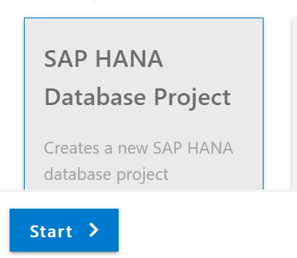

3. Specify a name to the project

<!-- border -->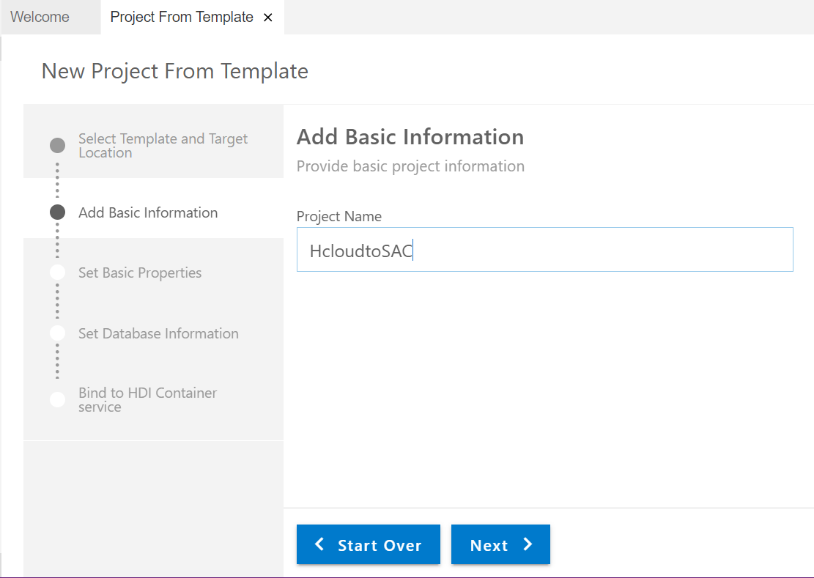

4. Leave the Basic properties as it is ( i.e module name = db).

<!-- border -->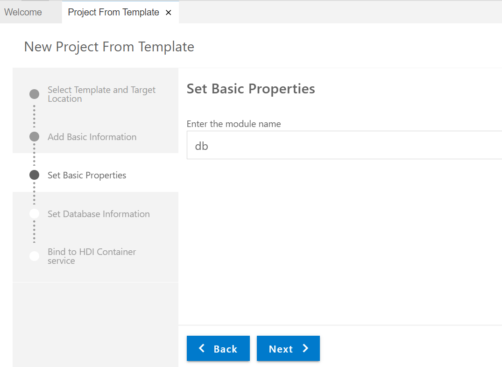

5. Leave the Name space and schema Name fields empty. Have the option 'Yes' checked for Bind the database module to a Cloud Foundry service instance property.

<!-- border -->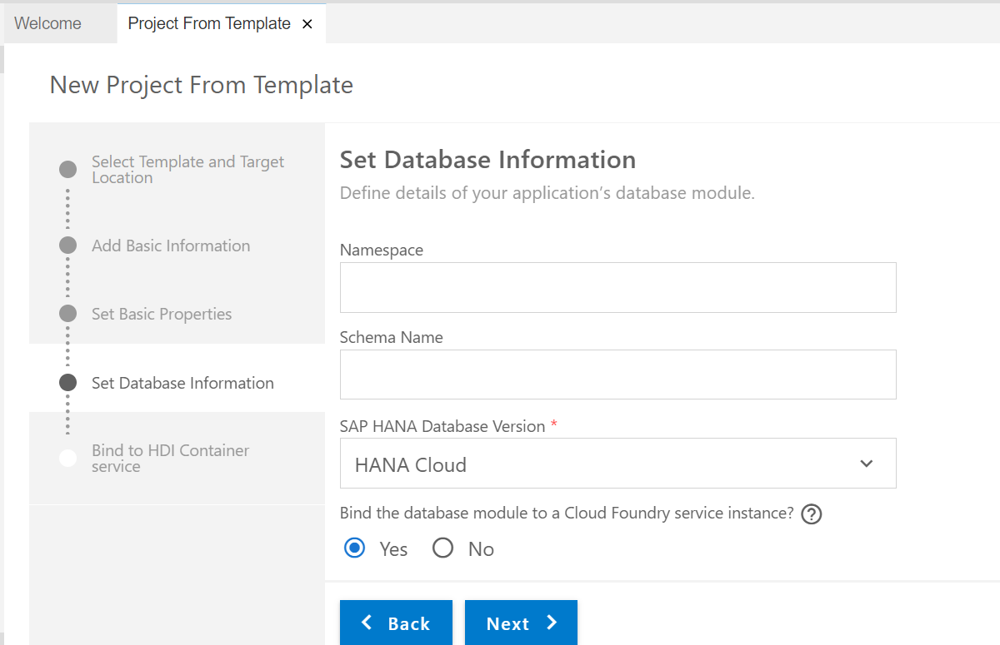

6. Leave default values in Bind to HDI Container service and then click Finish.

<!-- border -->

7. The SAP HANA DB project generation will start.

<!-- border -->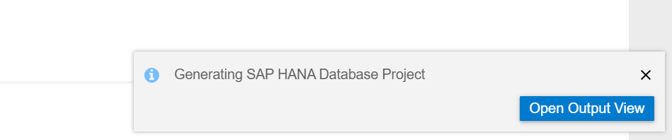

8. Now we will be able to see the project in the Explorer section of Business Application Studio.

<!-- border -->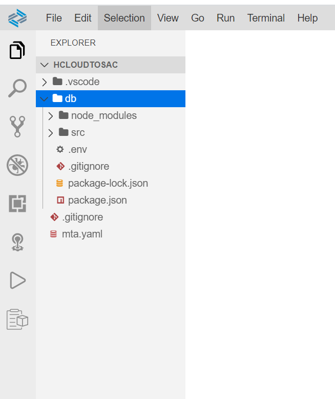

### Create SAP HANA tables

1. We will start creating tables now. Click on View menu, select find command, type HANA and then select the option create SAP HANA Database Artifact.

<!-- border -->

2. Select the source folder in the project to create the artifact and choose the artifact type as HANA database table later after that specify a name to the artifact.

<!-- border -->
Here we are calling the table as customers.

3. Include the below code for the table definition.

    `COLUMN TABLE "customers"(custid integer, custname varchar(40), custcountry varchar(3), custregion varchar(4));`

<!-- border -->
  Click on 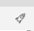 button on the top right corner to deploy the table.
<!-- border -->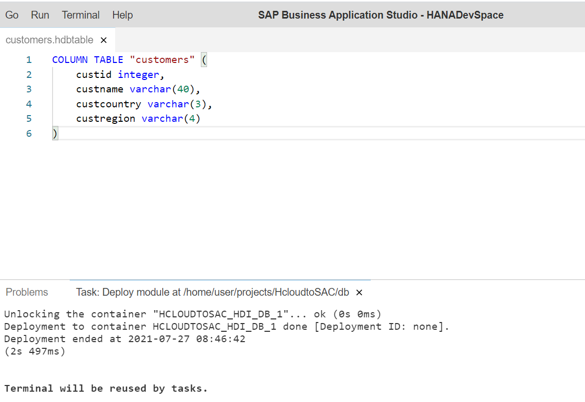
    Similarly, we can create another table called sales by simply right clicking on the source folder and selecting the option new file. Provide a name to this table with the extension HANA database table.

<!-- border -->
Add the below definition to the sales.hdbtable file.

  `COLUMN TABLE "sales" ( sid integer, pid varchar(5), sdate date, samt integer, custid integer )`

  Click on <!-- border -->  button on the top right corner to deploy the sales table.

<!-- border -->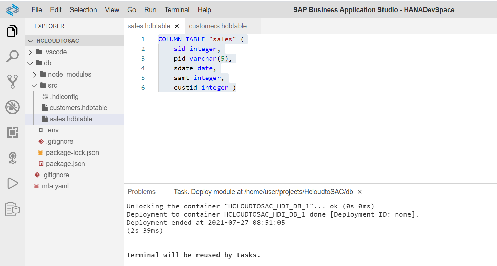

### Insert data into tables

1. Click on the SAP HANA projects in explorer then click on the database explorer  icon as highlighted below

<!-- border -->

2. This will open SAP HANA Database Explorer in a new window where we can see the details of the HDI container.

<!-- border -->

3. Select the tables folder in the HDI Container to see the customers and sales tables that we have created.

<!-- border -->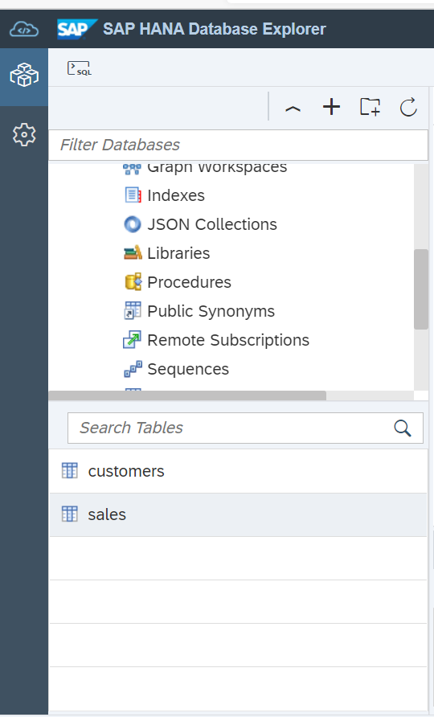

4. Click on the customers table. This will show us the table definition.

<!-- border -->

5. Click on open data and then click    icon to insert a few sample records into the table.

<!-- border -->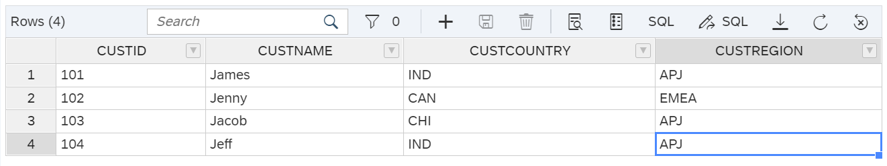

6. Follow similar steps to insert a few sample records into sales table.

<!-- border -->
  Let us go back to our project in Business application studio to create a CUBE calculation view.

### Create calculation view

1. Select the source folder in the project to create the calculation view and choose the artifact type as calculation view, later after that specify a name to the artifact and then click on create. Here we are calling the CV as customer wise sales.

<!-- border -->

2. Open the file customerwisesales.hdbcalculationview. We will observe the below nodes in the CV.

<!-- border -->

3. Add a Join node into the canvas.

<!-- border -->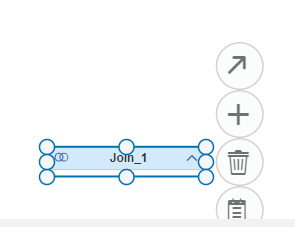

4. Click on the <!-- border -->  icon of the join node to add the tables. Search for customers and sales tables and add them to the join node.

<!-- border -->

5. After adding both the tables, the join node looks like the below.

<!-- border -->

6. Double click on the join node.

<!-- border -->

7. Drag the customer id field of customers table onto the CUSTID field of sales table. This will add a join condition between the tables.

8. Navigate to the mapping tab of the join node and map the fields from both customers and sales into output columns.

<!-- border -->

9. Link the join node to the aggregation node by using the   button on the join node.

<!-- border -->

 10. Double click on the aggregation node. Move all the columns from the join node to the output columns.

<!-- border -->

 11. Double click on semantics node in the calculation view. Select CUSTID and SID fields and mark them as attributes.

<!-- border -->

 12. Maintain all the other semantics as needed.

 13. Click on the <!-- border -->  button to deploy the CV.
<!-- border -->

 15. Navigate to the database explorer. Select the HDI container and choose Column views. This will show the customer wise sales CV.

<!-- border -->

 16. Select the calculation view and click on open data. This will present the data from the CV.

<!-- border -->

 17. We can go to Analysis tab to view the data in the form of graphs, charts etc.
    Here we are seeing country wise sales in a donut chart.

<!-- border -->

### Create connection between SAP HANA Cloud and SAP Analytics Cloud

1. Navigate to SAP BTP trial and select the dev space and then choose the instances. Here we will get to see the application instances.

<!-- border -->

2. Select the application that we deployed in BAS.

<!-- border -->

3. Click on the keys, to see the credentials to be used for establishing live connection in SAP Analytics Cloud.

<!-- border -->
  Using the schema details one can create a generic credentials set (like reporting user) which can later be used in SAP Analytics Cloud.

4. Go to SAP Analytics Cloud trial, click on connections then click on the + icon to create a live data connection setting.
  Select connect to Live data then choose SAP HANA.

<!-- border -->

5. Provide a name to HANA Live connection. Select the connection type as SAP HANA Cloud.

<!-- border -->

6. Provide the hostname, language key, username, password details (The details are obtained from HANA application under deployed instances section of BTP trial) and click OK.

<!-- border -->

7. This creates the HANA Live data connection setting.

<!-- border -->
  Next step is to create a Live data model based on the calculation view we have created.

### Create Live Data Model in SAP Analytics Cloud

1. To create a Live Data Model, navigate to the modeler section in SAP Analytics Cloud. Select Modeler.

<!-- border -->

2. Under the modeler, select the option live data model.

<!-- border -->

3. Select the system type as SAP HANA and the connection that we have created previously.

<!-- border -->

4. Type first three letters of the CV in the data sources section. This will show the calculation view that we have created previously in BAS.

<!-- border -->

5. Select the calculation view and click OK.

<!-- border -->

6. This will show all the measures and attributes that are part of the model.

<!-- border -->

7. Click on SAVE button to save the model. Specify a name to the model and then hit save.

<!-- border -->

### Create story in SAP Analytics Cloud

1. From the home screen of SAC, select stories and click canvas type of stories under create new.

<!-- border -->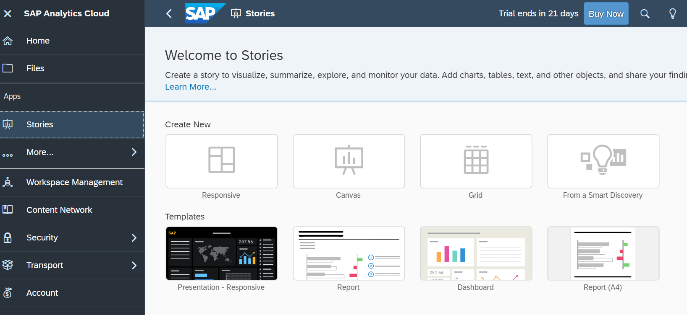

2. This will open the new story. click add data button.

<!-- border -->

3. Select data from a model in the next window, this will navigate us to the list models that are available.

<!-- border -->

4. Select the model that we have created in the previous steps.

<!-- border -->

5. This will bring us to the data analysis section where we can analyze the data from the model.

<!-- border -->

 6. Select the Story tab again and add a numeric point chart to display total sales amount, bar graph to show sales amount variation with respect to the products and a donut chart to show customer wise sales amount. After adding the charts, navigate to the styling section in SAC to add custom styles and colors to the charts and other objects in the story.

<!-- border -->

### Test yourself

---

### Tutorials for further learning

[HANA Academy tutorials](https://www.youtube.com/playlist?list=PLkzo92owKnVzONfsNdQNmpPQvUT54UUAL)

---
