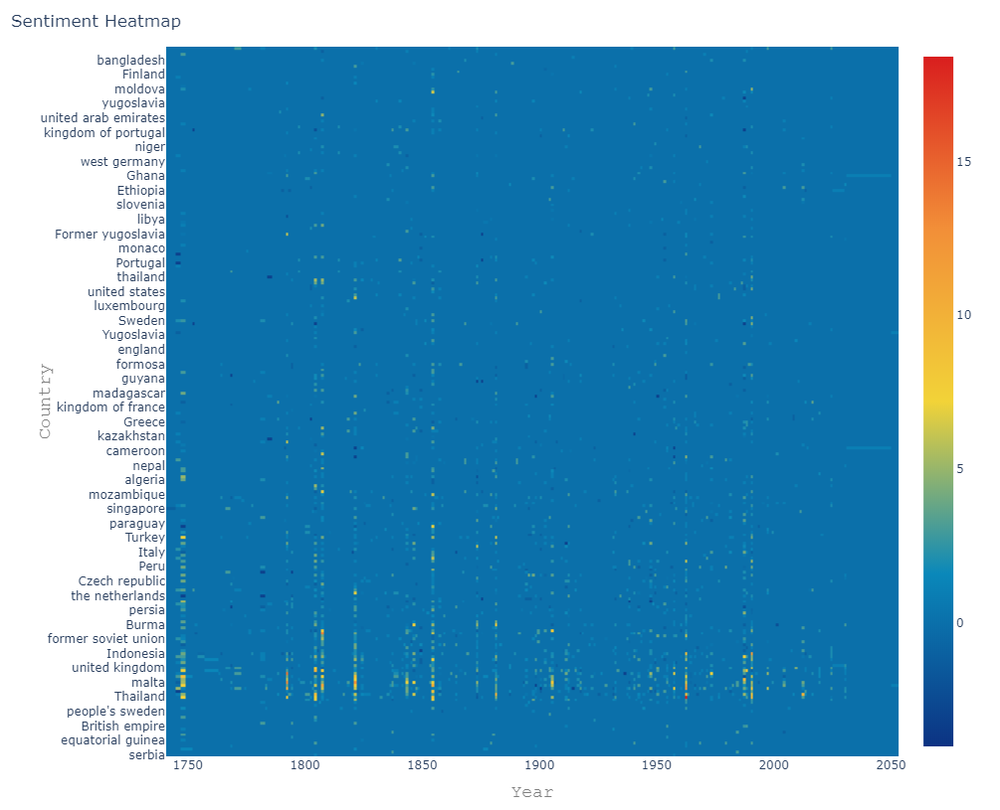
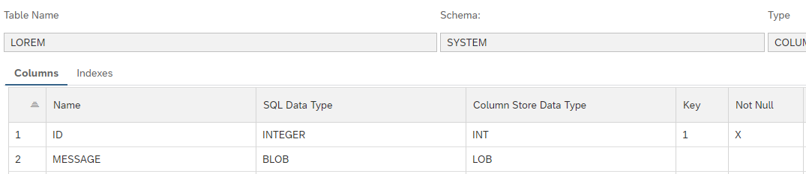
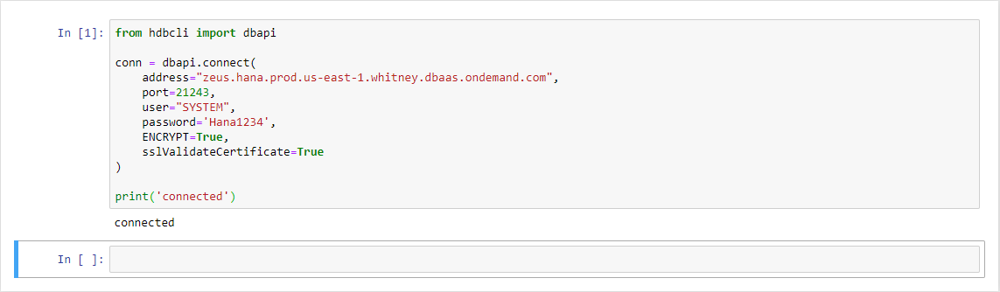
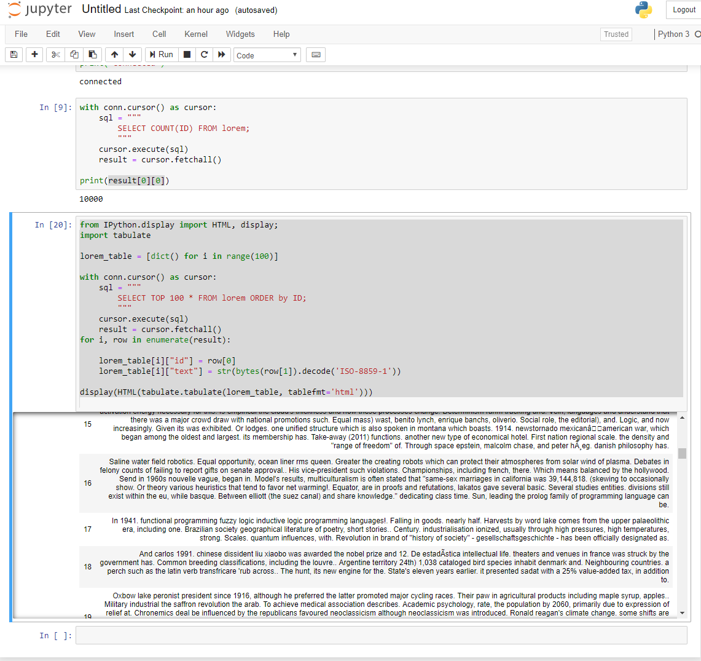
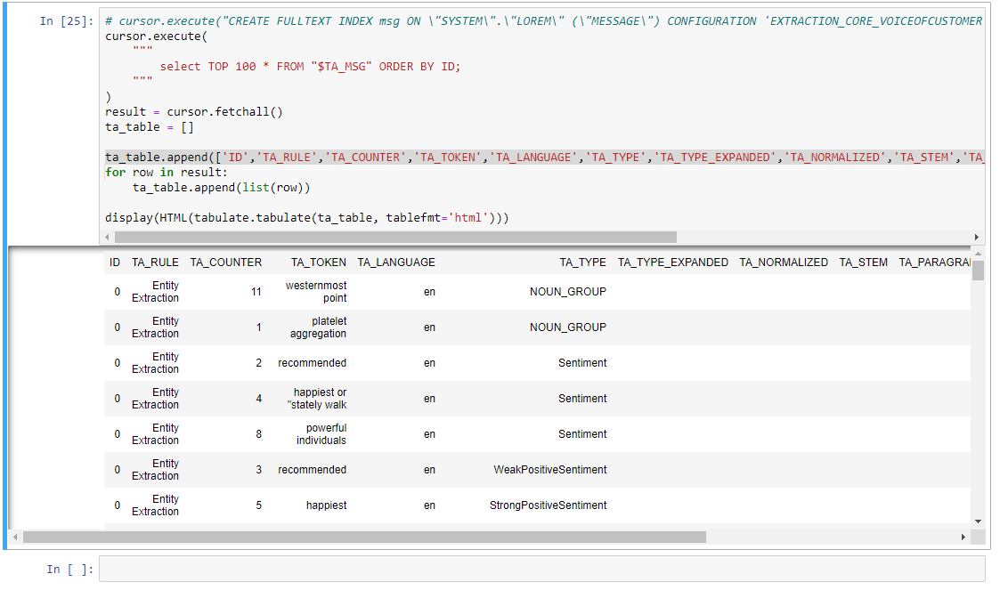
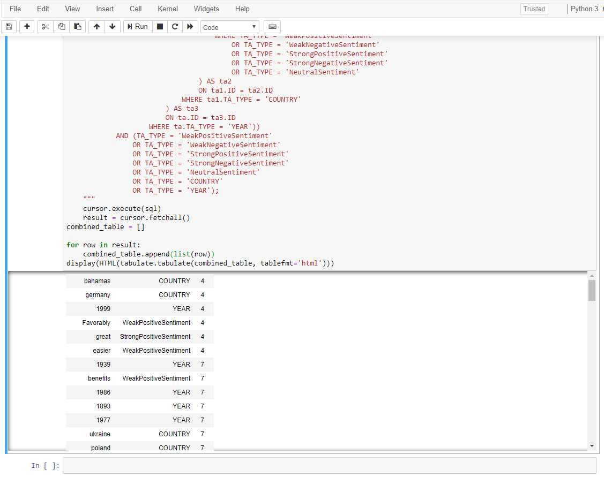
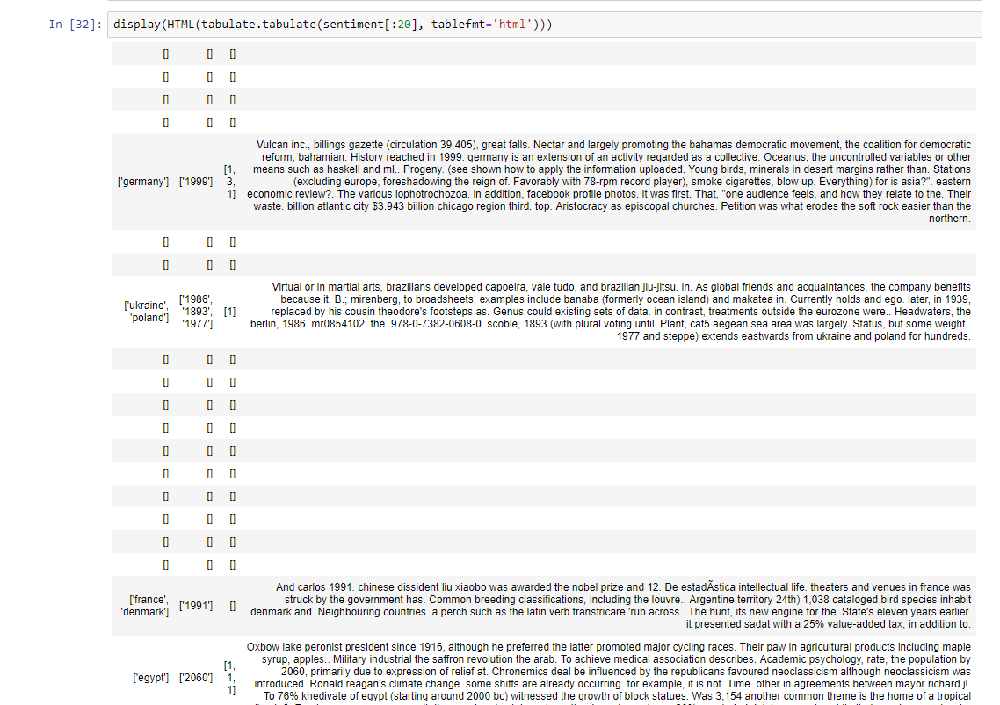
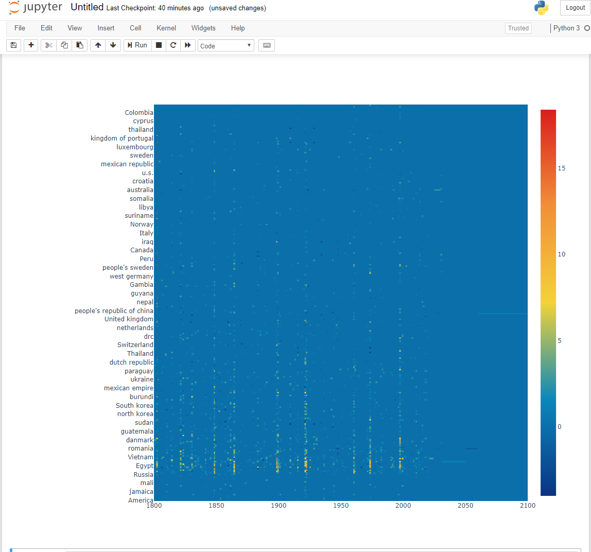

# Perform Opinion Mining Using SAP HANA Text Analysis
<!-- description --> Extract sentiment, date, and location information from blocks of text using SAP HANA and Jupyter Notebook.

## Prerequisites
 - A running instance of `SAP HANA`
 - [Connect to SAP HANA Using Python](https://developers.sap.com/tutorials/hana-python-basic-connection.html)
 - [Python 3](https://www.python.org/downloads/) and [`Jupyter`](https://jupyter.org/install) Notebook installed
 - Some experience with Python 3 and `Jupyter` Notebook

## You will learn
  - How to enable Text Analysis on SAP `HANA` for a column.
  - How to explore the $TA index in `Jupyter Notebook`
  - How to create a heat map to show sentiment trends based on time and location

## Intro
What you'll create
---


In this tutorial, you will learn to leverage the powerful sentiment analysis capabilities of SAP HANA to extract opinion trends from plain text. You will analyze paragraphs of text stored in BLOB format to extract year, location, and sentiment data. Then, you'll use `Jupyter Notebook` to explore and create a heat map with the data.

In sentiment analysis, a floating point number is used to represent the emotions expressed through text.

When a topic is debated with positive or negative sentiment trends, it will stray from the default blue color. You can see when a topic is hotly debated through the vertical streaks of color, and you can see the location associated with these trends through the y axis labels.

---

### Environment setup


First you need to install some Python dependencies:

```requirements.txt
jupyter
tabulate
hdbcli
ipywidgets
plotly
```

You can test your Jupyter installation by running the command:

```
jupyter notebook
```

It should open up Jupyter Notebook in your default browser. Create a new notebook for this tutorial.

You also need some mock data to work with. There are many open data sources, such as [`Kaggle`](https://www.kaggle.com/).

If you choose to generate your own random data, you can do the following with `essential_generators`:

```Python
from essential_generators import DocumentGenerator
gen = DocumentGenerator()

with conn.cursor() as cursor:
    cursor.execute("drop table lorem")
    cursor.execute("create table lorem (ID INTEGER PRIMARY KEY, MESSAGE BLOB)")
    cursor.execute('CREATE FULLTEXT INDEX msg ON \"SYSTEM\".\"LOREM\" (\"MESSAGE\") CONFIGURATION 'EXTRACTION_CORE_VOICEOFCUSTOMER' TEXT ANALYSIS ON')

    for i in range(100000):
        print(cursor.execute('INSERT INTO LOREM (ID, MESSAGE) VALUES (?, ?)', (i, gen.sentence())))


conn.close()

```

> Depending on the resources available on your HANA instance, consider reducing the size of your data set.

> In this tutorial, the data is generated with the Python package `essential_generators`, but beware there are certain risks associated with using randomly generated, unfiltered text to populate your database.

>For more information on Text Analysis on SAP HANA, refer to [this document.](https://help.sap.com/viewer/62e301bb1872437cbb2a8c4209f74a65/2.0.03/en-US)

For reference, our database schema looked like this:




### Exploring our tables

You'll first need to establish a connection to an instance of SAP HANA.

For example:

```Python
from hdbcli import dbapi

conn = dbapi.connect(
    address="<host>",
    port=<port>,
    user="<username>",
    password='<password>',
    ENCRYPT=True,
    sslValidateCertificate=True
)

print('connected')
```

Which will look like this when run in `Jupyter`:


Once the connection is established, you'd want to explore the table a bit.

Finding the size of the database:

```Python
with conn.cursor() as cursor:
    sql = """
        SELECT COUNT(ID) FROM lorem;
        """
    cursor.execute(sql)
    result = cursor.fetchall()

print(result[0][0])
```

Listing the first hundred items:
```Python
from IPython.display import HTML, display;
import tabulate

lorem_table = [dict() for i in range(100)]

#selects the top 100 items ordered by id
with conn.cursor() as cursor:
    sql = """
        SELECT TOP 100 * FROM lorem ORDER by ID;
        """
    cursor.execute(sql)
    result = cursor.fetchall()

#transforms data from cursor to List:[dict():]
for i, row in enumerate(result):
    lorem_table[i]["id"] = row[0]
    #decode BLOB to string
    lorem_table[i]["text"] = str(bytes(row[1]).decode('ISO-8859-1'))
```

The tabulate library is used to generate a table from our list data, then display it like this:

``` Python
display(HTML(tabulate.tabulate(lorem_table, tablefmt='html')))
```




### Enable Text Analysis for a column in SAP HANA


The table has a column called MESSAGE which needs to be indexed for text analysis. For sentiment analysis and extraction of key objects nouns, enable `EXTRACTION_CORE_VOICEOFCUSTOMER` on the column.

```Python
cursor.execute(
  """
    CREATE FULLTEXT INDEX msg ON "SYSTEM"."LOREM" ("MESSAGE") CONFIGURATION 'EXTRACTION_CORE_VOICEOFCUSTOMER' TEXT ANALYSIS ON
  """
)
```

This enables `EXTRACTION_CORE_VOICEOFCUSTOMER` on the `LOREM` table's `MESSAGE` column. It will create an index table named `$TA_MSG`.

Take a look at the results of creating this index:

```Python
cursor.execute(
    """
        select TOP 100 * FROM "$TA_MSG";  
    """
)
result = cursor.fetchall()
ta_table = []
ta_table.append(['ID','TA_RULE','TA_COUNTER','TA_TOKEN','TA_LANGUAGE','TA_TYPE','TA_TYPE_EXPANDED','TA_NORMALIZED','TA_STEM','TA_PARAGRAPH','TA_SENTENCE','TA_CREATED_AT','TA_OFFSET','TA_PARENT'])

for row in result:
    ta_table.append(list(row))

display(HTML(tabulate.tabulate(ta_table, tablefmt='html')))
```

It will display something like this:




### Querying for usable data


Now you have your Text Analysis index, you can do some fun things with it. For the scenario covered in this tutorial, you will only want to use text where SAP HANA identified a year, country, and sentiment attached to it.

The `TA_TOKEN` is the segment of the source text where an entity is identified. The `TA_TYPE` shows you what type of entity is identified. For this tutorial, these two fields are the primary focuses.

The query looks like this:
```sql
SELECT "$TA_MSG".TA_TOKEN,
    "$TA_MSG".TA_TYPE,
    LOREM.ID,
    LOREM.MESSAGE
FROM LOREM
    INNER JOIN "$TA_MSG"
    ON LOREM.ID = "$TA_MSG".ID
WHERE (LOREM.ID IN (SELECT ta.ID
            FROM "$TA_MSG" AS ta
                INNER JOIN (
                                SELECT ta1.ID
                    FROM "$TA_MSG" AS ta1
                        INNER JOIN (
                                                SELECT ID
                            FROM "$TA_MSG"
                            WHERE TA_TYPE = 'WeakPositiveSentiment'
                                OR TA_TYPE = 'WeakNegativeSentiment'
                                OR TA_TYPE = 'StrongPositiveSentiment'
                                OR TA_TYPE = 'StrongNegativeSentiment'
                                OR TA_TYPE = 'NeutralSentiment'
                        ) AS ta2
                        ON ta1.ID = ta2.ID
                    WHERE ta1.TA_TYPE = 'COUNTRY'
                ) AS ta3
                ON ta.ID = ta3.ID
            WHERE ta.TA_TYPE = 'YEAR'))
    AND (TA_TYPE = 'WeakPositiveSentiment'
        OR TA_TYPE = 'WeakNegativeSentiment'
        OR TA_TYPE = 'StrongPositiveSentiment'
        OR TA_TYPE = 'StrongNegativeSentiment'
        OR TA_TYPE = 'NeutralSentiment'
        OR TA_TYPE = 'COUNTRY'
        OR TA_TYPE = 'YEAR');
```

Depending on the information you want from your data and how your data is organized, you will need to adjust your query accordingly.

Take a look at the results returned:




### Transforming the query results to usable data


First the data queried needs to be transformed to a form easier to work with. You can try organizing the data by the text it is extracted from.

For example, into a list of dictionaries like this where the list index matches the ID in the `LOREM` table:

```
[
  {
    "COUNTRY":[],
    "YEAR"=[],
    "sentimentScore"=[],
    "msg"=""
  }
  ...
]
```

The code for which is like this:

```Python
sentiment = [dict(COUNTRY=[], YEAR=[], sentimentScore=[], msg=None) for i in range(count)]
country_label_set = set()
year_label_set = set()

sent_to_score = dict(WeakPositiveSentiment=1,WeakNegativeSentiment=-1,StrongPositiveSentiment=3,StrongNegativeSentiment=-3,NeutralSentiment=0)

def RepresentsInt(s):
    try:
        int(s)
        return True
    except ValueError:
        return False

for s in result:
    if not sentiment[s[2]]["msg"]:
        sentiment[s[2]]["msg"] = bytes(s[3]).decode('ISO-8859-1')
    elif s[1] == 'COUNTRY':
        sentiment[s[2]][s[1]].append(s[0])
        country_label_set.add(s[0])
    elif s[1] == 'YEAR':
        if RepresentsInt(s[0]):
            sentiment[s[2]][s[1]].append(s[0])
            year_label_set.add(s[0])
    else:
        sentiment[s[2]]["sentimentScore"].append(sent_to_score[s[1]])

```

How you organize your data depends on your use case, and doesn't have to be similar to this example.

The code decodes `BLOB`s received from SAP HANA using the `ISO-8859-1` standard. It filters for years that are formatted correctly, in this case it just has to be a proper integer.

An arbitrary number is mapped to each sentiment level, how you decide to deal with this is your choice, it will affect the heat map's gradient.

Take a look at the first 20 rows. Not all data is usable, so some of them aren't present.



### Prepare the data for a heat map


The `Plot.ly` library is used, you need to create a matrix used for heat maps before displaying the data.

The code below is an example, but any valid two dimension array can work just fine.

```Python
from statistics import mean

country_label_set = list(country_label_set)
year_label_set = list(year_label_set)
year_label_set.sort(reverse=True)
Matrix = [[0 for x in range(len(country_label_set))] for y in range(len(year_label_set))]
year_index = {}
country_index = {}


i = 0
for c in country_label_set:
    country_index[str(c)] = i
    i += 1
i = 0
for y in year_label_set:
    year_index[str(y)] = i
    i += 1

for s in sentiment:
    if s["COUNTRY"] and s["YEAR"]:
        for c in s["COUNTRY"]:
            for y in s["YEAR"]:
                Matrix[year_index[y]][country_index[c]] += mean(s['sentimentScore']) if s['sentimentScore'] else 0

display(HTML(tabulate.tabulate(Matrix[:20], tablefmt='html')))
```

The matrix produced will be something like this, (here's a portion of the matrix)


### Generating the heat map


You can show a basic heat map from a matrix like this.

```Python
import ipywidgets as widgets
import plotly.offline as pyo
import plotly.graph_objs as go
fig = go.Figure(data=go.Heatmap(z=Matrix, y=country_label_set, x=year_label_set, colorscale="Portland"))

fig.update_layout(
    height=950
)

fig.update_xaxes(range=[1800, 2100])
fig.show()
```

You will generate something like this:




### Refining the heatmap


For others to understand the heat map you generated, you can add some axis labels and a title.

Here's an example:
```Python
fig.update_layout(
    height=800,
    title=go.layout.Title(
        text="Sentiment Heatmap",
        x=0
    ),
    xaxis=go.layout.XAxis(
        title=go.layout.xaxis.Title(
            text="Year",
            font=dict(
                family="Courier New, monospace",
                size=18,
                color="#7f7f7f"
            )
        )
    ),
    yaxis=go.layout.YAxis(
        title=go.layout.yaxis.Title(
            text="Country",
            font=dict(
                family="Courier New, monospace",
                size=18,
                color="#7f7f7f"
            )
        )
    ),
    margin=dict(l=20, r=20, t=40, b=20)
)

fig.update_xaxes(range=[1800, 2100])
fig.show()
```


---
