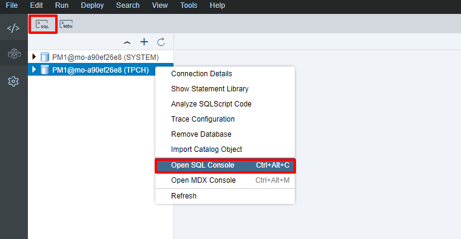
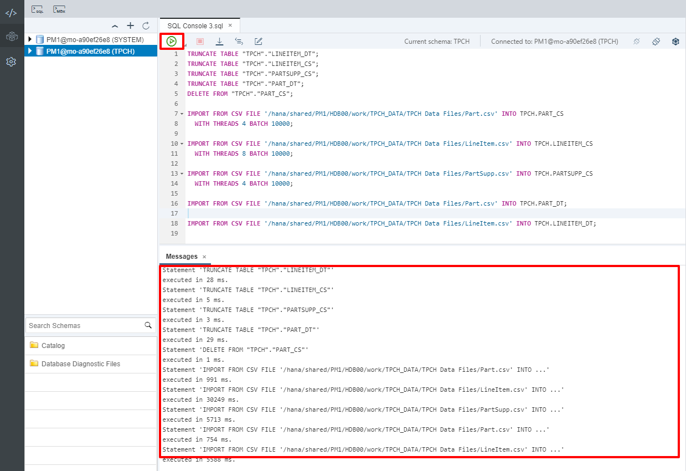
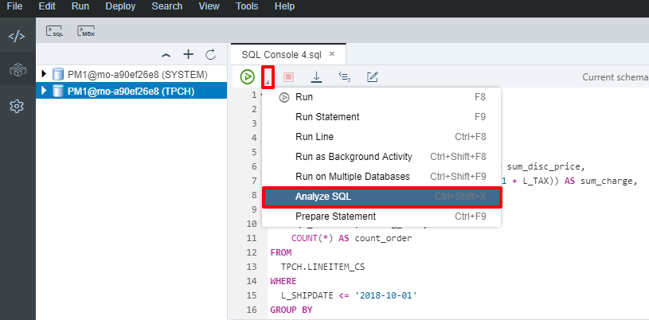
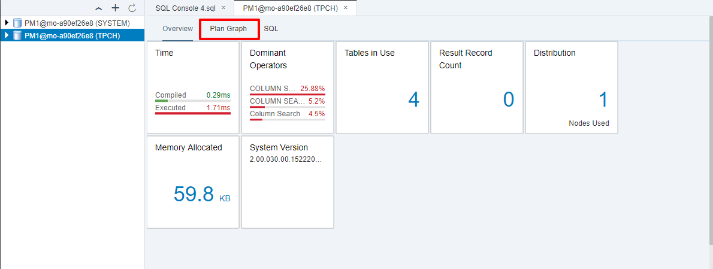
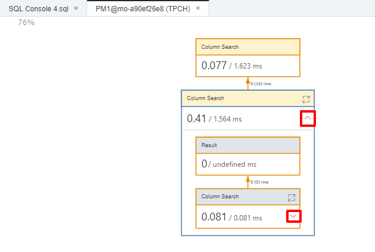
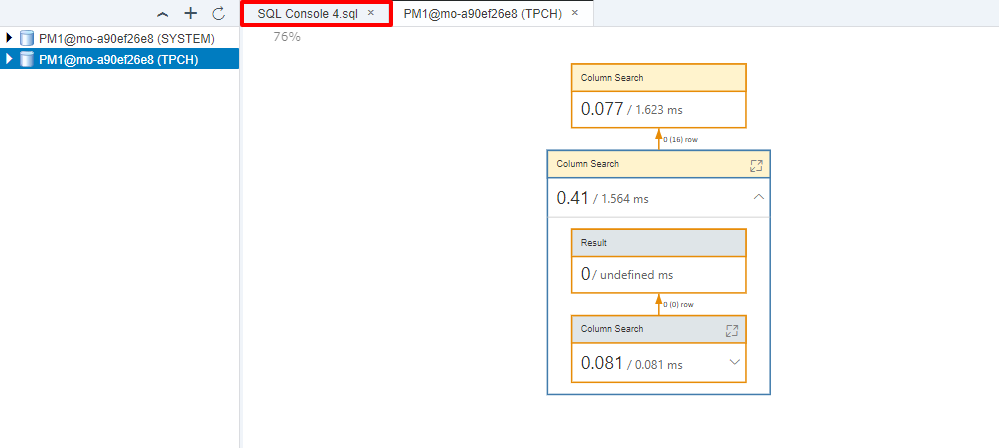
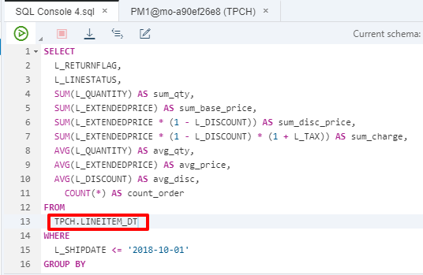
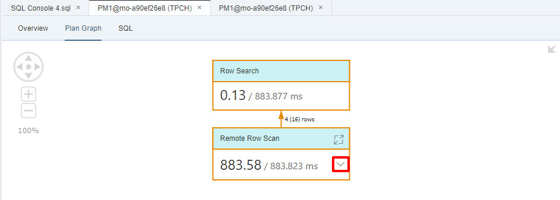

# Visualize a Graphical Query Plan
<!-- description --> Generate and compare query plan for in-memory and extended tables.

## Prerequisites  
 - **Proficiency:** Intermediate
 - **System:** Access to an SAP HANA 2.0 system with the optional SAP HANA Dynamic Tiering component installed. For older systems, please refer to [Dynamic Tiering Quick Start Guide - Lesson 2 - Query Processing in SAP HANA Dynamic Tiering](https://www.sap.com/documents/2016/06/3eb50dbc-757c-0010-82c7-eda71af511fa.html) for instructions.
 - **Integrated Development Environment:** Basic working knowledge of SAP Web IDE. E.g. You should be able to connect to your HANA instance from Web IDE and feel comfortable with executing simple queries.
 - **Tutorials:** [Create Tables and Import Data](https://developers.sap.com/tutorials/dt-create-schema-load-data-part3.html). This includes the `TPCH` user with all the permissions and the created tables with all the sample data loaded.

## Next Steps
 - **Tutorials:** [Compare Prepared and Executed Plan](https://developers.sap.com/tutorials/dt-query-processing-part2.html)

## You will learn  
  - Understanding the outline of query optimization within SAP HANA.
  - Generating an Prepared graphical Query Plan.
## Time to Complete
**20 Min**

---

### Refresh Data

This tutorial assumes that you have completed all the prerequisites tutorials. You should have setup Dynamic Tiering, created a `TPCH` schema, created tables, and imported data into those tables. To ensure that the tutorial steps will run smoothly, we will start by refreshing the data in the tables used in this tutorial

In SAP Web IDE, go to the Database Explorer tab, and open the SQL console for the system you are working with. Either right-click the system and click "Open SQL Console", use the SQL console shortcut button or Ctrl + Alt + C.



Copy and run the script below in the SQL console to refresh the data. Make sure you replace each instance of "`<SID>`" in the script with your system's System Id. Verify everything executed successfully.

``` SQL
TRUNCATE TABLE "TPCH"."LINEITEM_DT";
TRUNCATE TABLE "TPCH"."LINEITEM_CS";
TRUNCATE TABLE "TPCH"."PARTSUPP_CS";
TRUNCATE TABLE "TPCH"."PART_DT";
DELETE FROM "TPCH"."PART_CS";

IMPORT FROM CSV FILE '/hana/shared/<SID>/HDB00/work/TPCH_DATA/Part.csv' INTO TPCH.PART_CS
  WITH THREADS 4 BATCH 10000;

IMPORT FROM CSV FILE '/hana/shared/<SID>/HDB00/work/TPCH_DATA/LineItem.csv' INTO TPCH.LINEITEM_CS
  WITH THREADS 8 BATCH 10000;

IMPORT FROM CSV FILE '/hana/shared/<SID>/HDB00/work/TPCH_DATA/PartSupp.csv' INTO TPCH.PARTSUPP_CS
  WITH THREADS 4 BATCH 10000;

IMPORT FROM CSV FILE '/hana/shared/<SID>/HDB00/work/TPCH_DATA/Part.csv' INTO TPCH.PART_DT;

IMPORT FROM CSV FILE '/hana/shared/<SID>/HDB00/work/TPCH_DATA/LineItem.csv' INTO TPCH.LINEITEM_DT;
```



### Overview of Query optimization

Query optimization within HANA is a multi-layered process. There are multiple query processing engines in HANA which include the Row Store, Column Store, Smart Data Access, and Dynamic Tiering engines. HANA parses the query as submitted and figures out which query processing engine to assign it to. Assuming a mix of Column Store and Dynamic Tiering tables, the query will be passed to the Column Store engine for further processing.

When Dynamic Tiering tables are identified, the portions of the query that involve the extended tables will be handed to the data federation layer. The data federation layer is shared between Smart Data Access and Dynamic Tiering. Smart Data Access is a HANA technology which enables remote tables to be accessed as if they are local tables in SAP HANA without copying the data into SAP HANA. Since Dynamic Tiering is an integrated component of SAP HANA, the data federation layer is able to implement specific optimization paths for queries against tables in the Dynamic Tiering store.

The federation layer generates SQL queries and ships them to the Dynamic Tiering engine to process the Dynamic Tiering portions of the query. The Dynamic Tiering engine parses the received SQL statements, optimizes the query, executes the generated plan and finally returns the results back to the core HANA node. It is important for the Dynamic Tiering engine to perform its own optimization as it understands the on disk structures that are used by the Dynamic Tiering engine within the HANA system.

>These results of Query Optimization are based on SAP HANA Dynamic Tiering 2.0 SPS00 Rev 00. You may see changes in the query plans with different versions of HANA and/or Dynamic Tiering.


### Visualize Query for In-Memory Table

We will now start by generating a query plan for an in-memory column store table. Delete everything in the SQL console, then paste in the script below.

``` SQL
SELECT
  L_RETURNFLAG,
  L_LINESTATUS,
  SUM(L_QUANTITY) AS sum_qty,
  SUM(L_EXTENDEDPRICE) AS sum_base_price,
  SUM(L_EXTENDEDPRICE * (1 - L_DISCOUNT)) AS sum_disc_price,
  SUM(L_EXTENDEDPRICE * (1 - L_DISCOUNT) * (1 + L_TAX)) AS sum_charge,
  AVG(L_QUANTITY) AS avg_qty,
  AVG(L_EXTENDEDPRICE) AS avg_price,
  AVG(L_DISCOUNT) AS avg_disc,
	COUNT(*) AS count_order
FROM
  TPCH.LINEITEM_CS
WHERE
  L_SHIPDATE <= '2018-10-01'
GROUP BY
  L_RETURNFLAG,
  L_LINESTATUS
ORDER BY
  L_RETURNFLAG,
  L_LINESTATUS;
```
Click the drop-down beside the execute button, and select **Analyze SQL**.
> Since we are querying against the `LINEITEM_CS` table which was created as an in-memory column store table, we will also be generating a plan which is for an in-memory table.



A new tab should open, giving an overview of the query including compile and execution time, operations, tables used, memory allocated, etc. Within this tab, click the **Plan Graph** tab at the top to view a graphical query plan.



A root plan will be shown. You can expand and view the entire prepared plan by clicking the dropdown within each operator.



### Visualize Query for Extended Table

Now generate a query plan for an extended storage column store table. To do so, go back to the SQL console window you opened in the pervious section by clicking on the tab.



Change "**`TPCH.LINEITEM_CS`**" in the script to "**`TPCH.LINEITEM_DT`**". This changes the query to run against the extended table instead of the in-memory instance of the `LINEITEM` table.



As done with the in-memory table, click the drop-down beside the execute button, and select **Analyze SQL**.

Again, a new tab should open, giving an overview of the query including compile and execution time, operations, tables used, memory allocated, etc. Within this tab, click the **Plan Graph** tab at the top to view a graphical query plan.


A root plan will be shown for the extended table query - hence the "Row" operations. You can expand and view the entire prepared plan by clicking the dropdown within each operator.



