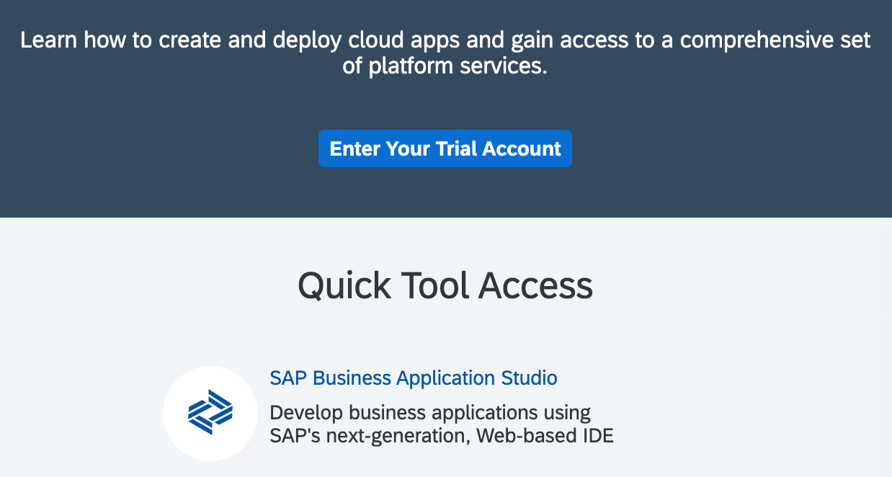
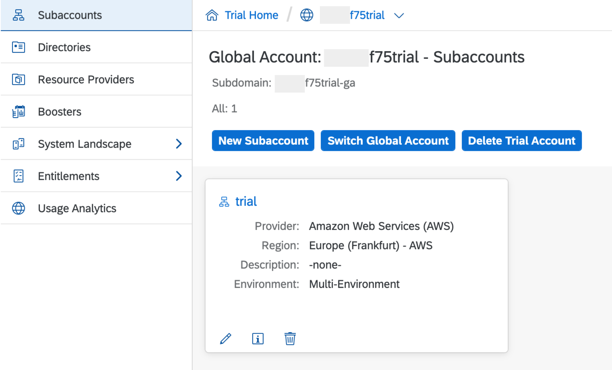
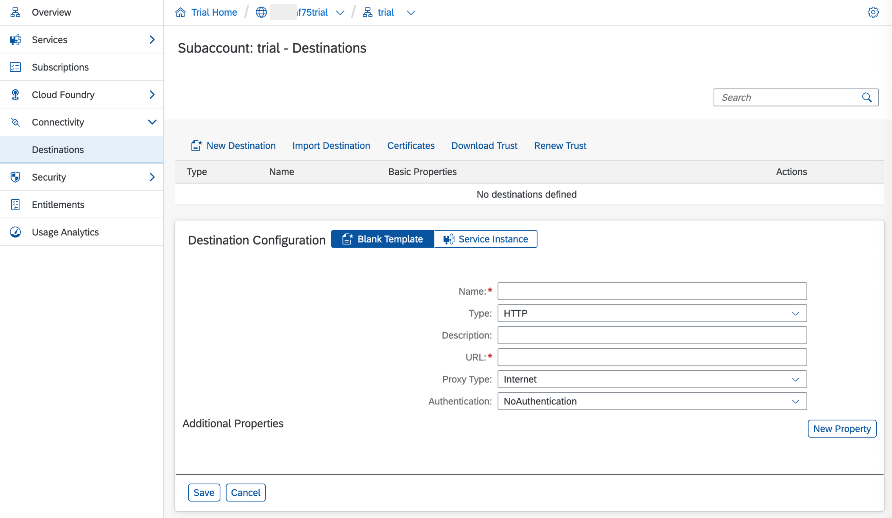

# Create a Destination for the Northwind OData Services
<!-- description --> Create a destination within the SAP Connectivity service to allow access to the Northwind OData services.

## You will learn
- How to configure a basic destination on SAP Business Technology Platform (BTP)
- That you can specify additional properties for a destination
- How to specify the IDE usage property to denote a generic OData service

## Intro
Destinations are key building blocks in the SAP Connectivity service, and are used to define connections for outbound communication from your application to remote systems. These remote systems can be on-premises or in the cloud.

A destination has a name, a URL, authentication details, and some other configuration details.

The destination you will define here is for the set of [OData](http://www.odata.org) services known as the "Northwind" services, which are publicly available and hosted by OASIS at <https://services.odata.org>.

The Northwind OData services comes in several versions.  The tutorials currently use either V2 (<https://services.odata.org/V2/Northwind/Northwind.svc/>) or V4 (<https://services.odata.org/V4/Northwind/Northwind.svc/>).  To support both versions, and other versions that may be added later, you will create a generic connection to the Northwind service.  The exact path - and exact version - will be configured in later tutorials.

---

### Go to your SAP BTP cockpit

Go to <https://account.hanatrial.ondemand.com>, log on and enter the cockpit to get to your account.

### Select your trial subaccount

Within your global account display, select your trial subaccount by selecting the large tile named "trial".

<!-- border -->

### Create new destination

In the navigation menu on the side, select the **Destinations** item, and then choose **New Destination** to open a new destination configuration form, ensuring that the configuration is set to start from a blank template, as shown in the screenshot.

<!-- border -->

### Complete the configuration

Enter and confirm all fields in the destination configuration section using the information below.

Field Name     | Value
:------------- | :-------------
Name           | `Northwind`
Type           | `HTTP`
Description    | `Northwind OData services`
URL            | `https://services.odata.org`
Proxy Type     | `Internet`
Authentication | `NoAuthentication`

> Do **not** use the entire path for the URL.  The URL should only be `https://services.odata.org`. This is to afford us a choice of endpoints when using this destination.

When you specify a URL with the HTTPS scheme, a checkbox **Use default JDK truststore** will appear. Ensure that this is checked.

### Specify additional properties

Add three **Additional Properties** by clicking on the **New Property** button once for each property.

Property       | Value
:--------------- | :-------------
`WebIDEEnabled`  | `true`
`WebIDESystem`   | `Northwind_Data`
`WebIDEUsage`    | `odata_gen`

> These properties were initially created in the context of the SAP Web IDE, but they're also supported by the SAP Business Application Studio.

Values for the `WebIDEUsage` property determine how an SAP development environment interprets the destination definition & presents it to you for connection and consumption. The value `odata_gen` here signifies that the destination represents generic OData services (as opposed to OData services that are hosted on an SAP Gateway system, for example) and that the full, specific OData service URL specification is to be provided in the course of consuming this destination definition in the respective development environment.

Find out more about the possible values for the `WebIDEUsage` property in the SAP Help Portal, in the [Connect to ABAP Systems](https://help.sap.com/viewer/825270ffffe74d9f988a0f0066ad59f0/Cloud/en-US/5c3debce758a470e8342161457fd6f70.html) section.

When you're done, finish by saving the destination with **`Save`**.

### Check the connection

Use the `Check Connection` facility (either immediately after saving, or in the destination list) to make a basic test of the connection.

