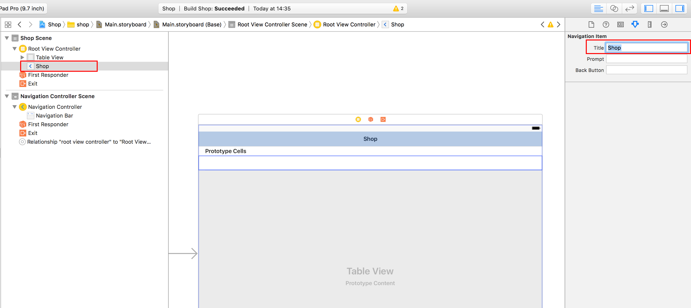
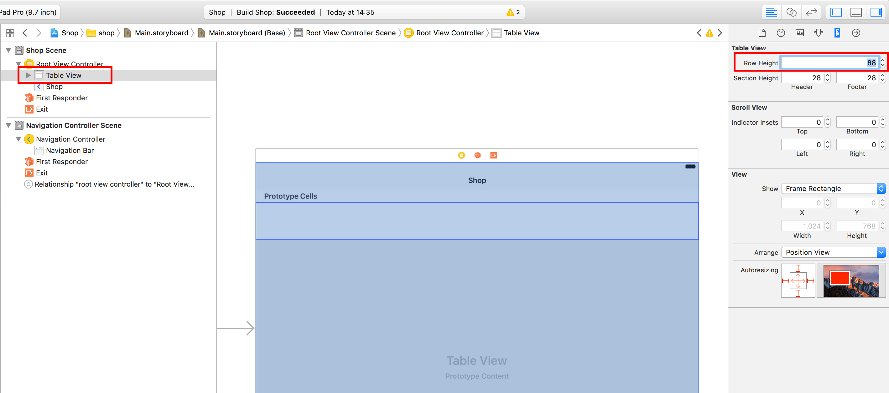
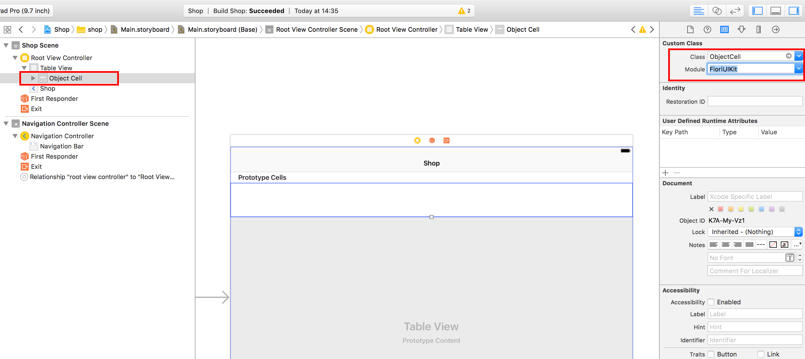

# Create an Xcode project for the shopping app
<!-- description --> Prepare an iOS project with a navigation bar and a table to display a list of products

## Prerequisites  
 - **Proficiency:** Beginner

## Next Steps
 - Load product data from SAP Cloud Platform

## You will learn  
The goal of this tutorial is to prepare the project with a navigation bar and a table to display a list of products.

## Intro
This project will give you a first look at an SAP Fiori for iOS App, and later tutorials will build on top of it.
## Time to Complete
**10 Min**.

---

### Clear the Storyboard


In the **Project Navigator**, select `Main.storyboard` and select the existing navigation controller and the view controller. Delete both so that the storyboard is empty.

### Set up Navigation Controller 


Drag and drop a new **Navigation Controller** from the **Object Library**. Select the **Navigation Controller** and set **`Is Initial View Controller`** in the **Attributes Inspector**.


### Change the Title 


Select the **`RootViewController`**, then select the **Navigation Item** to change its title in the **Attribute Inspector** to `Shop`.



### Change the Row Height 


Select the `TableView` in the **`Shop` Scene** and change the **row height** to `88`.



### Set Custom Class


Select the **Table View Cell** in the **`Shop` Scene** and switch to the **Identity Inspector**. Set the **custom class** to `ObjectCell` and the module to `FioriUIKit` for prototype cell.



### Add the Skin


After preparing the `TableView` to use a custom cell from `FioriUIKit`, we want to skin the **Navigation Bar** like an SAP Fiori for iOS App.

Open `AppDelegate.swift` and add import statements for `FioriUIKit` and `HCPFoundation` libraries. Now add the following lines of code to the existing function.

```swift
 func application(_ application: UIApplication, didFinishLaunchingWithOptions launchOptions: [UIApplicationLaunchOptionsKey: Any]?) -> Bool {

        Logger.root.logLevel = .debug

        UINavigationBar.appearance().tintColor = UIColor.preferredFioriColor(forStyle: .tintColorLight)
        UINavigationBar.appearance().titleTextAttributes = [NSForegroundColorAttributeName: UIColor.white]
        UINavigationBar.appearance().barTintColor = UIColor.preferredFioriColor(forStyle: .backgroundGradientTop)
        UINavigationBar.appearance().isTranslucent = false
        UINavigationBar.appearance().barStyle = .black
        UINavigationBar.appearance().setBackgroundImage(UIImage(), for: .default)
        UINavigationBar.appearance().shadowImage = UIImage()

        UIApplication.shared.statusBarStyle = .lightContent

        window?.tintColor = UIColor.preferredFioriColor(forStyle: .tintColorLight)

        return true
    }
```

### Run the Application


Now simply run the application.


