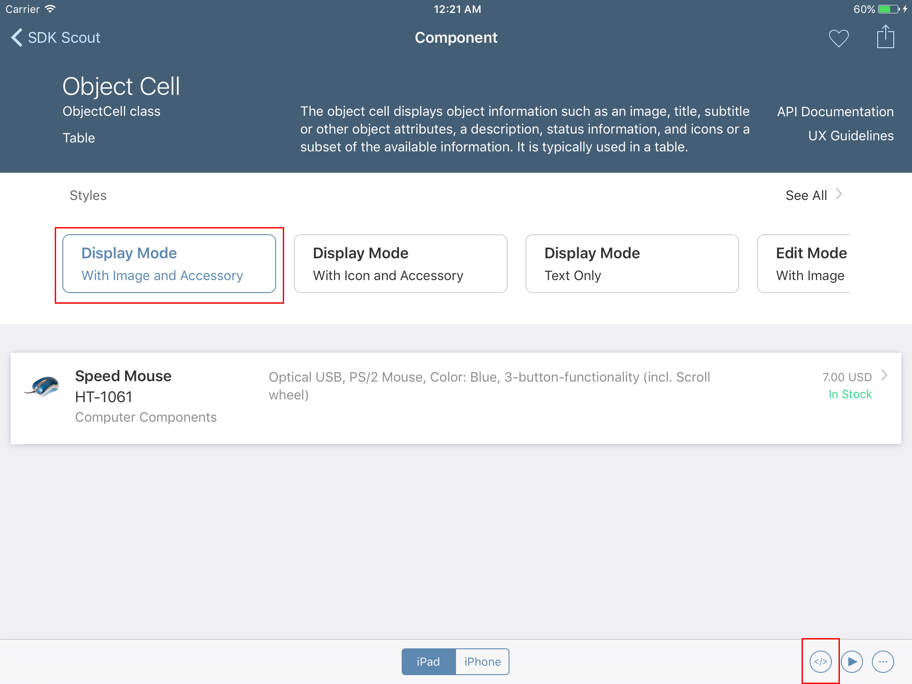

# Load product data from SAP Cloud Platform
<!-- description --> Load product data via SAP Cloud Platform

## Prerequisites  
 - **Proficiency:** Beginner
 - **Tutorials:** [Create an Xcode project for the shopping app]

## Next Steps
 - [Displaying the product details]

## You will learn  
After your Xcode project setup has been completed, you will modify the project to load the product list data from SAP Cloud Platform and present it in a table view:
## Time to Complete
**10 Min**.

---

[ACCORDION-BEGIN [Step 1: ]( )]

Select `ViewController.swift` in the **Project Navigator** and rename the file to `ProductListViewController.swift`


[ACCORDION-END]

[ACCORDION-BEGIN [Step 2: ]( )]

Open the **`SDK Scout App`** on your mobile device and select `Object Cell` from the **components** list. This will give you an overview of the `Object Cell` and how it looks. Select the first style to get a preview of `Object Cell`.


[ACCORDION-END]


[ACCORDION-BEGIN [Step 3: ]( )]

Show the code snippet for the cell by tapping the button in the toolbar.




[ACCORDION-END]

[ACCORDION-BEGIN [Step 4: ]( )]

Copy the code snippet from your mobile device to your Mac.


[ACCORDION-END]

[ACCORDION-BEGIN [Step 5: ]( )]

Once you received the code snippet on your Mac, replace the content in `ProductListViewController.swift` completely with the code snippet from the `SDK Scout`. Rename the class name to `ProductListViewController`.


[ACCORDION-END]

[ACCORDION-BEGIN [Step 6: ]( )]

Select `Main.storyboard` in the **Project Navigator** and select the `Shop` view. Now set the custom class in the **Identity Inspector** to `ProductListViewController`. Press **Return** and the **Module** should be set automatically to **`Current - Shop`**.


[ACCORDION-END]

[ACCORDION-BEGIN [Step 7: ]( )]

Select `ProductListViewController.swift` in the **Project Navigator**. Add the code snippet below to add:

 - Required import statements for the next steps
 - A logger for the controller
 - A local variable which will be used to save the loaded product list

```swift
import UIKit
import FioriUIKit
import FioriBetaToolKit
import HCPOData
import HCPFoundation

/** Provide the number of products to be shown in the table
    TableView-Controller used to show the product list
 */
 class ProductListViewController: UITableViewController {
 let logger = Logger.shared(withName: "ProductListViewController")
 private var products = [Product] ()  

  ...
```


[ACCORDION-END]

[ACCORDION-BEGIN [Step 8: ]( )]

Change the protocol function `numberOfRowsInSection` which you received with the code snippet to return the correct number of products.

 ```swift
 /**
    Provide the number of products to be shown in the table

    - Parameters:
        - tableView: Table View
        - section: Section

    - Returns: The number of products
 */

    override func tableView(_ tableView: UITableView, numberOfRowsInSection section: Int) -> Int {
        return self.products.count
     }
 ```


[ACCORDION-END]


[ACCORDION-BEGIN [Step 9: ]( )]

In the function `cellForRowAt` load a single product item from the local products array and assign the values to the cells' properties:

Cell Property     | Product Property   |  Comment
:---------------- | :----------------  | :------------
`headlineText`    | `name`             |
`subheadlineText` | `id`               |
`footnoteText`    | `mainCategoryName` |
`descriptionText` | `description`      |
`detailImage.accessibilityIdentifier`  | `name`      |
`statusText`      | `formattedPrice()` | convenience function on the `Product` class
`substatusText` 	 | `stockAvailability()` | 	convenience function on the `Product` class
`detailImage`	    | `FioriAssets.placeholder` | Set a placeholder image
`accessoryType`  | `disclosureIndicator` |


[ACCORDION-END]


[ACCORDION-BEGIN [Step 10: ]( )]

Additionally, you need to load the product image from SAP Cloud Platform. Add the following code snippet after the assignment of the cell values and before the function returns the cell.

```swift
// load image asynchronously
productItem.loadImage { image, error in
    if let error = error {
        self.logger.warn("Error while loading image.", error: error)
    }

    if let image = image {
        if let delayedUpdatedCell = tableView.cellForRow(at: indexPath) as? ObjectCell {
                    delayedUpdatedCell.detailImage = image
        }
    }
}
```


[ACCORDION-END]


[ACCORDION-BEGIN [Step 11: ]( )]

To make the stock availability of the product visually more appealing, you can change the `textColor` on the `substatusLabel` of the cell based on the products `stockQuantity` property.


[ACCORDION-END]


[ACCORDION-BEGIN [Step 12: ]( )]

With the table to display the list of products for each cell you can now add the code to load the data from SAP Cloud Platform.

You have already prepared the first function `loadProducts()`in `Shop.swift`. Add a call to `loadProducts()` in `viewDidLoad()` of `ProductListViewController.swift`.


```swift
/// Loads the products, initializes the counter and prepares the notification to update the shopping cart item-counter.
    override func viewDidLoad() {
        super.viewDidLoad()

        Shop.shared.loadProducts { loadedProducts, error in

            if let loadedProducts = loadedProducts {
                self.products = loadedProducts
            } else {
                self.products = []
                self.logger.error("Error loading products.", error: error)
            }

            self.tableView.reloadData()
        }
    }
```


[ACCORDION-END]


[ACCORDION-BEGIN [Step 13: ]( )]

Run the application.


[ACCORDION-END]

