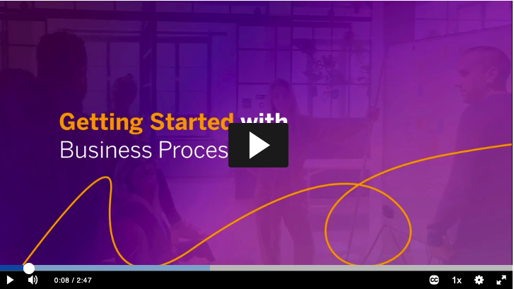
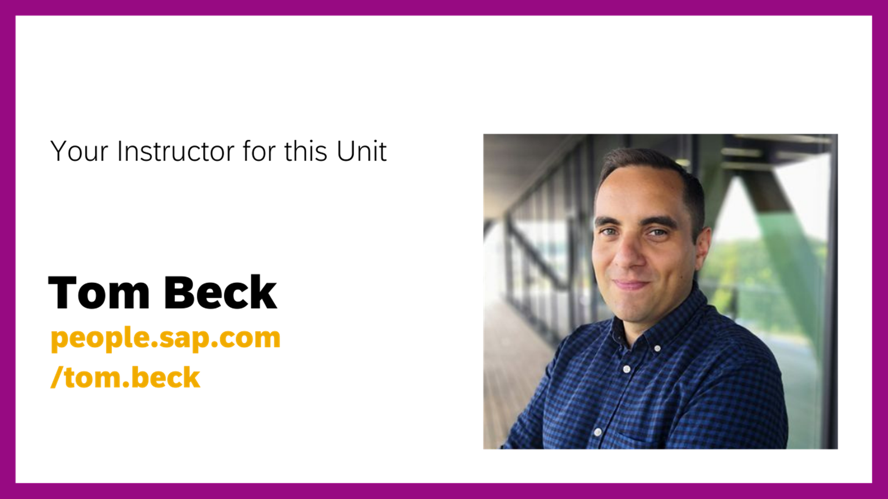

# Low-Code / No-Code Applications

## Prerequisites

- SAP solution knowledge
- General expertise in specific business rules and processes for your domain or line of business

## You will learn

- How to get started with business processes

## Getting Started with Business Processes

### Introduction

&nbsp;

Welcome to your learning journey: "Low-Code / No-Code Applications and Automations for Citizen Developers". This is the first unit in this course, the Business Process Primer for Citizen Developers. Your instructor for this unit is Tom Beck, who is a Senior User Assistance Lead for SAP in Germany. As a citizen developer himself, Tom will guide you through the most important information you should know about business processes. Tom’s always open to feedback, suggestions, or to answer your questions, so feel free to follow him on the [SAP Community](https://people.sap.com/tom.beck).

### The Case for Business Processes and Their Management

You might be wondering why we started this course about Low-Code / No-Code Applications and Automations for Citizen Developers with a primer on business processes. The reason is that business processes, and the optimization of business processes, are a vital part of a winning company with happy employees.

The visibility, efficiency, and effectiveness of business processes ensure that organizations achieve, and even exceed, their goals and allow companies to differentiate themselves in highly competitive markets. Well-defined and managed processes supported by low-code / no-code technologies empower businesspeople to take direct ownership of their work and improve it, without having to defer to the IT department for every new idea.

You, as a citizen developer, can become more effective and amplify your impact by understanding business processes and their management, and then determining what parts of your daily work are suitable for you to automate and support with applications.

### Unit Preview

In this unit, there are 10 short Lessons. Each lesson contains videos, followed by text and diagrams that cover similar content, so that you can learn by watching, reading, or both. In the following lessons for this unit, we'll cover the following topics:

- What is a business process and the key steps involved?
- Why are business processes so important?
- How do I identify key roles in a business process?
- What is business process management and its software?
- How to understand the maturity of process automation in your business?
- What are the benefits and challenges of implementing automation?
- What is the new field of hyperautomation about?

This unit will ensure that you understand the fundamentals of business processes, so that you can grow from that foundation to become an excellent citizen developer and build your own applications and automations for your company. We are excited to start this journey with you, and we hope you have fun!
