# Low-Code / No-Code Applications

## Prerequisites

- SAP solution knowledge
- General expertise in specific business rules and processes for your domain or line of business

## You will learn

- How to explain business processes

### Introduction

&nbsp;

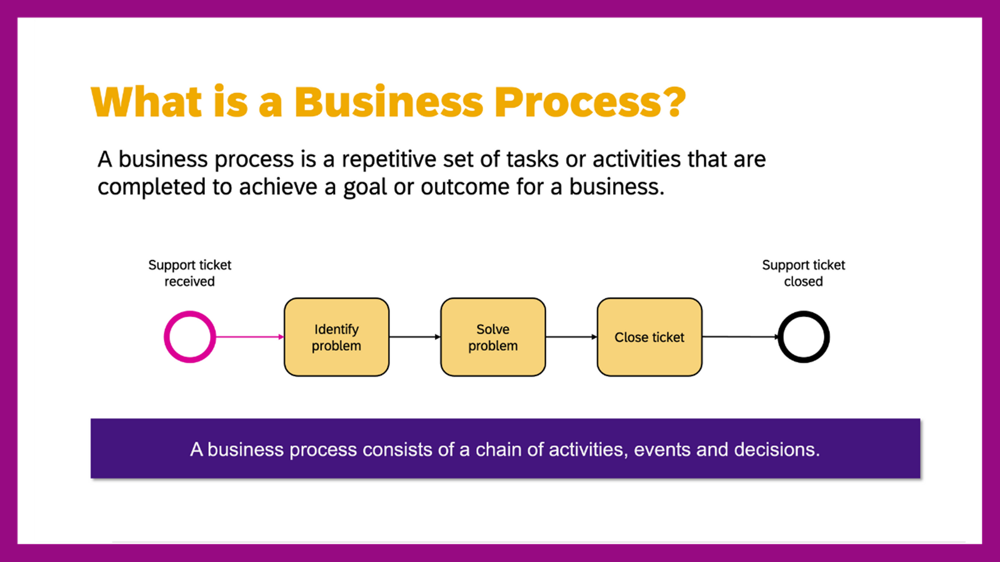

Let’s start with the basics. A business process is a repetitive set of tasks or activities that are completed to achieve a goal or outcome for a business.

The steps in a process can either be performed by an individual or a group, and they can be manually undertaken or supported by technology.

That’s a high-level look at a business process, so let’s look at in more detail. There are two major forms of businesses processes, known as micro and macro.

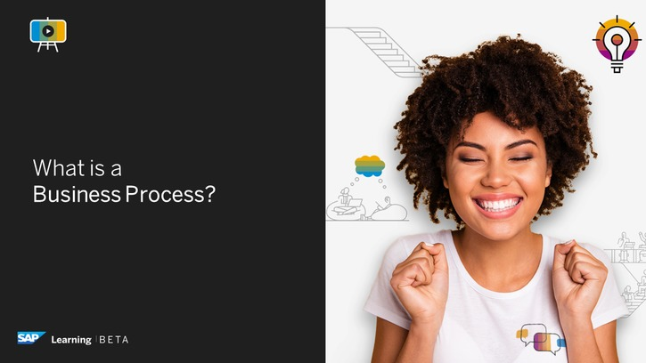

&nbsp;

### The Difference Between Micro and Macro Processes

&nbsp;

Micro processes are short, completed in a limited number of steps, and help to achieve a single outcome. A good example of a micro process is creating an IT request at work. Here, you ask your IT team a question, someone will help you, and then the request is closed.

You then have macro processes. These have a broader goal, such as employee onboarding, that can be achieved with several smaller, related processes. If you remember your first day at a new job, your onboarding included steps such as collecting your employee ID, receiving your IT equipment, and completing a security training. These may be micro processes in themselves, but they are combined to achieve the overall goal of helping you settle into your new job.

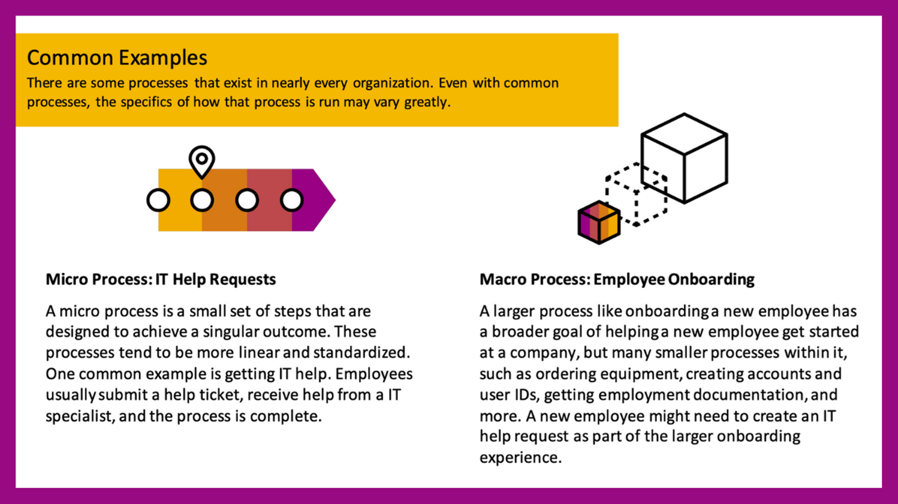

### Long Tail Processes – A Great Focus for Citizen Development

&nbsp;

From there, we have a third term that is used to describe micro processes. These are what we call the "long tail" processes. We're all involved in a number of common business processes, whether requesting time off from work or placing an order online. However, variants of these processes are customized to our individual situations, departments, or organizations. There is no definitive template for a process and, even within the same business, you'll often find multiple ways that the same process is completed. What’s more, some may be undocumented or heavily reliant on manual steps, making it difficult for a company to change them.

These so-called long tail processes are a great focus for citizen development.

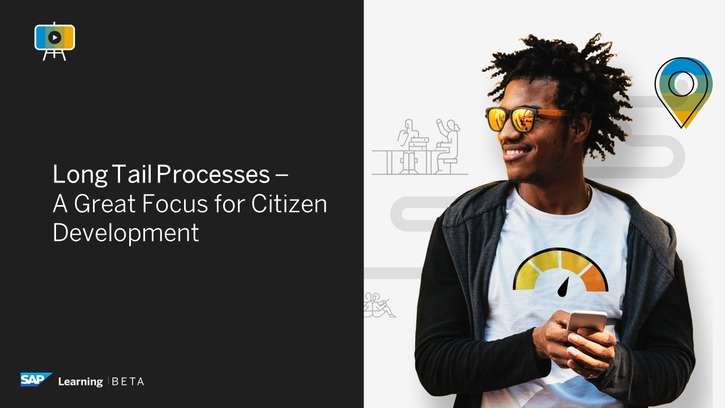

Consider a situation where you need to gather information from customers who are attending an event. The obvious tool to use is a form. You create the form to capture the data required and distribute the form to the customers that accepted your invitation, or perhaps to the salesperson responsible for that customer account. You might need to send a few reminders, but, eventually, all the forms will be emailed to you, and you'll have the information you need.

Then, you enter the data into a spreadsheet and give access to those who need it. The following. month there is another event, and it requires slightly different inputs. You make a second form, another spreadsheet, and exchange more emails. The month after that, a third event that requires customization again, and so on.

These are long tail processes.

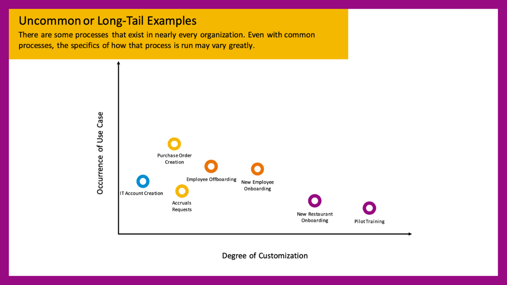

They are variations on the same process, using the same tools, but in a way that is disconnected from your core systems like the customer relationship management (CRM) software and databases. Much of the information you need for the form exists in the CRM already but a big IT project to connect every form to the CRM would be expensive and time-consuming. So, you keep asking your customers to provide data you have already collected from them, and you distribute that data to other departments. This approach means that everyone is doing repetitive work and managing many different spreadsheets.

What’s the solution? New low-code / no-code technology makes it possible for citizen developers like you to build forms that are already connected to core systems. Your CRM data could easily be pulled in, so that the form is pre-populated, and the customer or salesperson only needs to provide you with data that is missing from your company systems. You can automate the process to send reminders, and build the new database and distribute the information to your colleagues. You can build all of this yourself with low-code / no-code tools drag-and-drop features. This means that you no longer need to wait for IT support to build the tools you need.

### Dissecting a Business Process into Steps

&nbsp;

We’ve covered some of the basics here, but there’s still more we should talk about.

The next topic is the typical steps in a business process, and, in our opinion, there are six of them. They are the initiation step, the data collection step, the routing step, the decision step, the human task step, and the new data management step.

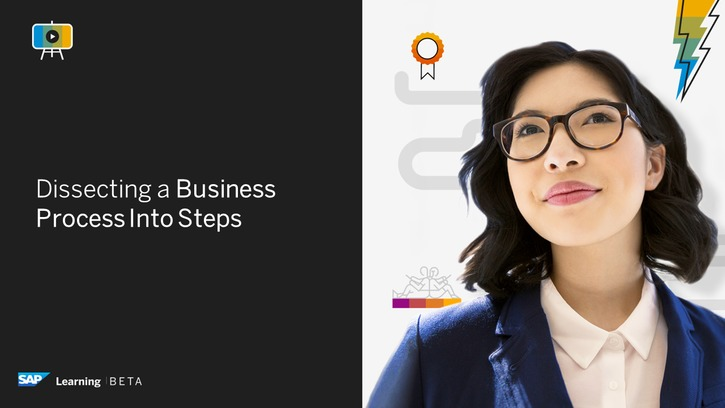

### The Initiation Step

&nbsp;

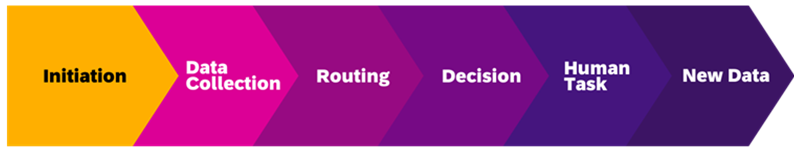

The first step is when the process is started based on a need or trigger from within an organization. Again, let’s look at our employee onboarding example. When an employee’s contract is signed, and their start date agreed, the onboarding process is initiated or started. This initiation could be done by the human resource (HR) team or by the hiring manager. It could be automated and based on a system status change or created when a team member submits a form. While the individual details may change from team to team or department to department, the onboarding process needs to be started by someone or something when the new employee joins.

### The Data Collection Step

&nbsp;

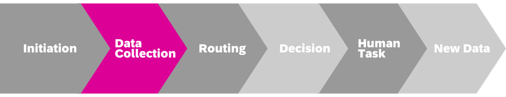

Once the process has started, the next step is the data collection step. This details from where and which information is gathered in a process to provide the necessary details and context for other process participants. This can be in the form of structured or open information fields, it could be text based or attached documents, and it could be automatically pre-populated or manually entered. With a new employee, this could be information such as their name, address, role, reporting manager, salary, and benefits, and so on.

### The Routing Step (Business Rules)

&nbsp;

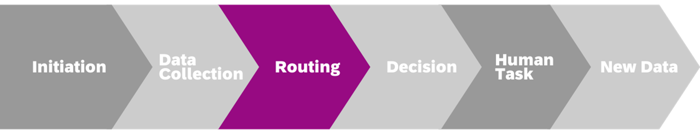

Next is the routing step, which defines when the process should move forward and to whom it should go to next. Once an employee’s contract has been signed, who should be informed next? Once the hiring manager has submitted a request for a new laptop for their employee, who needs to respond to that? With process routing, this can be automatic or manual, it can be to individuals or specified departments. It can be conditional, based on certain factors such as budget threshold, or pre-routed to always go to the same person. The process can also be routed in a singular direction or split into multiple different paths.

To recap, we have learned about the initiating step, the data collection step, and which direction the process needs to move once tasks are completed.

### The Decision Step

&nbsp;

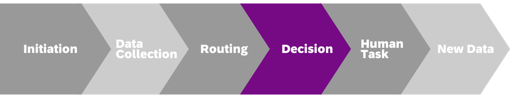

From there, we have the decision step, where a decision needs to be made about if and or how to proceed with a process instance. For this to happen, the data collection step is often vital too. Does the person or system making the decision have enough information and in the right context for a decision to be made? In the case of our employee onboarding, does the financial approver know who the laptop order is for and what their role is to be able to approve the purchase order? Decisions, like all process steps, can vary depending on the circumstances. Some decisions are made by individuals, others need multiple approvals, and sometimes the decision maker needs further information to proceed.

### The Human Task Step

&nbsp;

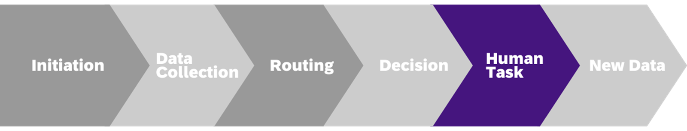

You then have the human task step, if required. This involves one or more human tasks to be completed for the process to move forward. These tasks are usually goal orientated, can be online and in a system, such as security training, or offline and in person, such as a new employee being given a tour of their new office on the first day. Again, the specifics differ from process to process and company to company. Some tasks may be for individuals, others for groups, and they may be carried out in different ways.

### The New Data Management Step

&nbsp;

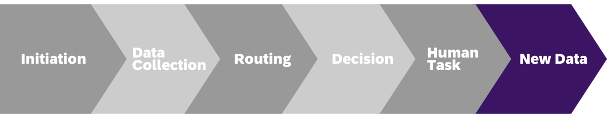

Finally, and it’s worth pointing out that these steps don’t necessarily have to be in sequential order, you have the new data created during a process. This is information that wasn’t available when the process was initiated but is now relevant. This includes system data, such as temporary passwords, purchase order details, total costs of equipment, and so on. This data is often generated because of earlier steps or information provided, and is specific to the individual process.

While each business process can be customized, there are normally six main steps or stages involved in them. The initiation, the data collection, the process routing, the decisions needed, the human tasks involved, and any new data generated during the process. When mapping out your own processes that you want to digitize, considering each of these stages, and who is involved in them, is a good starting point as a citizen developer.

### Summary: What are Business Processes?

&nbsp;

Let’s review the key takeaways from this lesson:

- A business process is a repetitive set of tasks or activities that are completed to achieve a goal or outcome for a business.
- Processes come in two major forms, micro and macro, depending on the goal they are designed around.
- Long tail processes are micro processes that are less frequently used and have a lot of variation. These are a great first focus area for citizen development.
- The steps in a business process include initiation, data collection, routing, decision-making, human tasks, and the management of new data.

Next in this unit is a lesson about the importance of business processes. We’ve covered the stages you’ll find in them, but why should we focus so much on them at all? Hopefully we’ll be able to answer that for you in the next lesson.
