# Use SAP Cloud SDK to Integrate SAP SuccessFactors into App
<!-- description --> Access an SAP SuccessFactors OData service from the SAP API Business Hub by generating Java code from a metadata file.

## Prerequisites
 - We assume you have completed the tutorial [Create a sample application on Cloud Foundry using SAP Cloud SDK](s4sdk-cloud-foundry-sample-application)
 - You have an SCP account, which is able to deploy simple Java web applications.
 - Java, Maven and an IDE of your choice are installed and up-to-date.
 - Cloud Foundry command line interface is installed, such that you can run cf version without an error.
 - Elevated user to an instance of SAP SuccessFactors, such you can access the API

## You will learn
  - How to use the Time Off OData service from SAP SuccessFactors
  - Use up-to-date data to manage absences such as vacation, sick leave, and paid time off for employees.

  This tutorial uses the _Time Off_ OData service of SAP SuccessFactors to access time accounts of a specific user.
  You may know and compare the data from the familiar "Time Information" overview screen, coming from the "People Profile" page.

  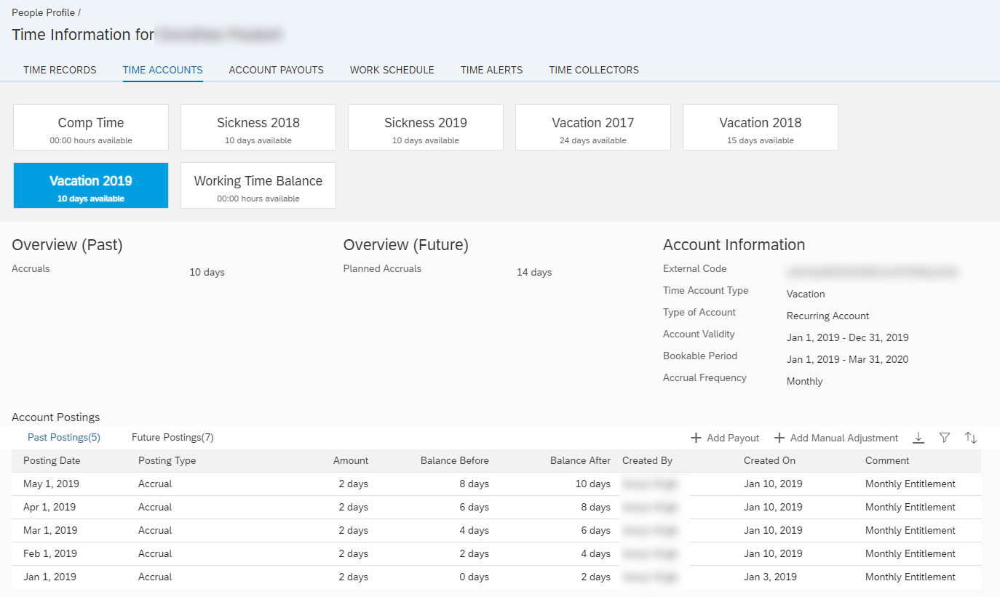
---

### Choose a service and download the OData metadata file

In the beginning it is important to make sure the web service, which will be consumed, is actually offering an OData interface file.

We need an _EDMX_ file, as a formal metadata specification of the OData API.
For this guide we assume the [`Time Off`](https://api.sap.com/api/ECTimeOff/resource) service as target API.

#### Excursus: Explore an OData Service on SAP API Business Hub

We will now browse and download an _EDMX_ metadata file for `Time Off`.

1. **Visit the [SAP API Business Hub](https://api.sap.com/).**

    

    Filter for SAP SuccessFactors and click on [SAP SuccessFactors Employee Central](https://api.sap.com/package/SuccessFactorsEmployeeCentral?section=Artifacts).

2. **Open the "SAP SuccessFactors Employee Central"**

    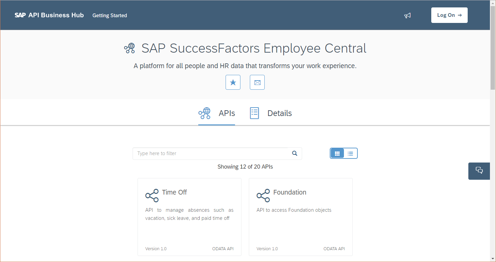

    You will find OData API services there.

    If you are interested in [REST](https://blogs.sap.com/2019/03/25/integrate-sap-s4hana-cloud-sdk-with-open-api/) and [SOAP](https://blogs.sap.com/2018/09/13/deep-dive-17-with-sap-s4hana-cloud-sdk-convenient-consumption-of-sap-s4hana-soap-apis/), please take a look at what the _SAP Cloud SDK_ can provide as additional functionality.

3. **Click on the Time Off item**

    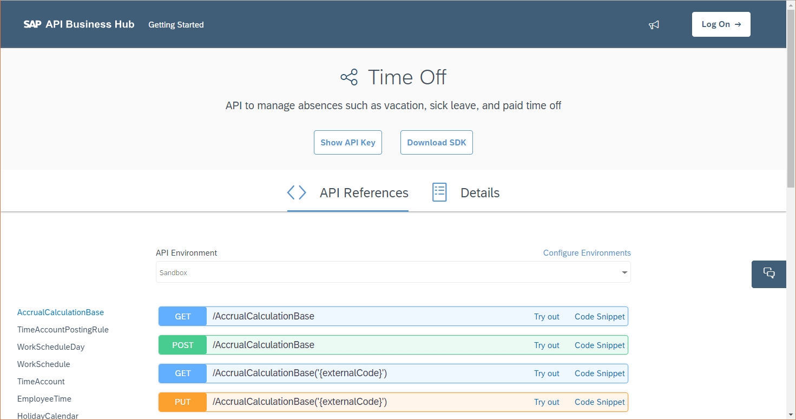

    On this API reference, you can find a documentation of multiple interactive endpoints.

    By exploring the colored fields, you can test the API and investigate request parameters and expected response bodies.

    With this _Swagger UI_ -like interface you can test API calls against a sandbox system.

4. **Change to the "Details" page.**

    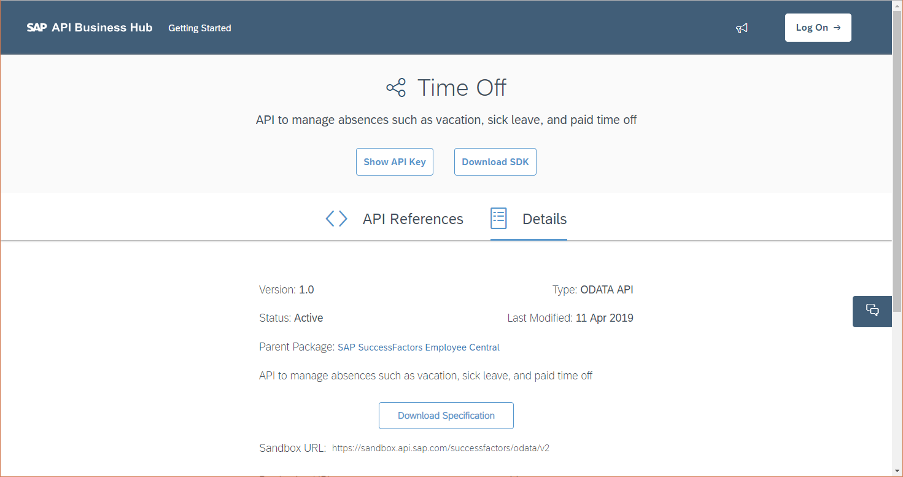

    Here you can find meta information about an API, as well as available URLs of the API.

    Details about authentication and links to in-depth documentation are referenced on this page.

    For example you can find the [Reference Guide to the Employee Central](https://help.sap.com/viewer/b2b06831c2cb4d5facd1dfde49a7aab5/1902/en-US/596e2dc8045b4d5d80e5fe69aafe59d2.html), as well as a list of [API objects](https://help.sap.com/viewer/b2b06831c2cb4d5facd1dfde49a7aab5/1902/en-US/4819bbbbc8e54ef18e7fc4cde0ab9546.html) of the `Time Off` OData service.

    Furthermore you may explore the documentation to our upcoming target entity collection, [`TimeAccount`](https://help.sap.com/viewer/b2b06831c2cb4d5facd1dfde49a7aab5/1902/en-US/b369a037c9ff436cb855a62ebe57aa27.html).

5. **Click the "Download Specification" button**

    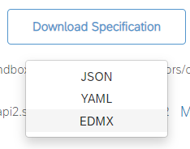

    This will trigger the download of the metadata file to this OData API.

    The specification can be saved as JSON, YAML or EDMX.

    All three of them could be parsed later by the code generator.

    Since JSON and YAML are only recommended for REST APIs, we choose **EDMX** for the most beneficial feature set for OData.


### Create a new Spring application


In order to quickly get started with a new web application project, let's use the Spring Boot archetype prepared by _SAP Cloud SDK_.

Open the command line and run the following Maven command to create a convenient multi-module project at the current directory:

```Shell
mvn archetype:generate -DarchetypeGroupId=com.sap.cloud.s4hana.archetypes -DarchetypeArtifactId=scp-cf-spring -DarchetypeVersion=2.15.0
```

**Note:**
Please change the version reference at the end of the command to your preferred version of SAP Cloud SDK.

This tutorial uses `org.example.sfsf` as base package.

A project based on the Spring Boot archetype is generated, containing the following elements:
* ./
  * application/
  * cx-server/
  * integration-tests/
  * uni-tests/
  * pom.xml


If you are further interested in the details of the project structure, please find the [related tutorial](https://blogs.sap.com/2017/05/19/step-3-with-sap-s4hana-cloud-sdk-helloworld-on-scp-cloudfoundry/) with in-depth information on the similar `TomEE` archetype.


### Enable OData VDM code generation


1. To enable the automatic VDM code generation with SAP Cloud SDK, please move the previously downloaded EDMX file into the folder, renaming it to _TimeOff.edmx_:
    ```
    ./application/src/main/resources/api/TimeOff.edmx

    ```

2. Open the `./application/pom.xml` file and add the following `<plugin>` next to the other declared plugins.

    ```XML
    <plugins>
        ...
        <plugin>
            <groupId>com.sap.cloud.s4hana.datamodel</groupId>
            <artifactId>odata-generator-maven-plugin</artifactId>
            <version>2.15.0</version>
            <executions>
                <execution>
                    <id>generate-consumption</id>
                    <phase>generate-sources</phase>
                    <goals>
                        <goal>generate</goal>
                    </goals>
                    <configuration>
                        <inputDirectory>${project.basedir}/src/main/resources/api</inputDirectory>
                        <outputDirectory>${project.build.directory}/generated-sources/sfsf-lombok</outputDirectory>
                        <deleteOutputDirectory>true</deleteOutputDirectory>
                        <defaultBasePath>odata/</defaultBasePath>
                        <packageName>org.example.sfsf</packageName>
                        <serviceNameMappingFile>${project.basedir}/serviceNameMapppings.properties</serviceNameMappingFile>
                    </configuration>
                </execution>
            </executions>
        </plugin>

    </plugins>

    ```
    **Note:**
    Please make sure the plugin version is identical to the version of SAP Cloud SDK, which you used in _Step 2_ while generating the project from the Spring archetype.

    By using this plugin configuration, we tell the generator to generate classes into the folder _./application/target/generated-sources/sfsf-lombok/_

3. In the same `./application/pom.xml` file add the next `<plugin>` definition:

    ```XML
    <plugins>
        ...
        <plugin>
            <groupId>com.sap.cloud.s4hana.datamodel</groupId>
            <artifactId>odata-generator-maven-plugin</artifactId>
            <version>2.15.0</version>
            <executions>
                <execution>
                    <id>generate-consumption</id>
                    <phase>generate-sources</phase>
                    <goals>
                        <goal>generate</goal>
                    </goals>
                    <configuration>
                        <inputDirectory>${project.basedir}/src/main/resources/api</inputDirectory>
                        <outputDirectory>${project.build.directory}/generated-sources/sfsf-lombok</outputDirectory>
                        <deleteOutputDirectory>true</deleteOutputDirectory>
                        <defaultBasePath>odata/</defaultBasePath>
                        <packageName>org.example.sfsf</packageName>
                        <serviceNameMappingFile>${project.basedir}/serviceNameMapppings.properties</serviceNameMappingFile>
                    </configuration>
                </execution>
            </executions>
        </plugin>

    </plugins>

    ```

    This will ensure that the generated classes will be compilable even when no _Lombok_ dependency is provided for reducing boilerplate code. The enriched classes will be written to `target/generated-sources/sfsf/` and added to the class-path for packaging.

4. For later compilation of the generated code, an additional dependency needs to be declared in the same `./application/pom.xml` file.

The dependency version does not need to be specified, as it will be automatically derived from the Maven `dependencyManagement` with SAP Cloud SDK declared parent `pom.xml`.

    ```XML
    <dependencies>
        ...
        <!-- due to OData VDM code -->
        <dependency>
            <groupId>com.sap.cloud.s4hana.datamodel</groupId>
            <artifactId>odata-core</artifactId>
        </dependency>
    </dependencies>

    ```

Once the modifications are done, we are ready to start the code generation.


### Run the code generation


1. Use the command line again, to execute the following Maven command:

    ```Shell
    mvn clean install

    ```

    ```Java
    package org.example.sfsf;

    ```

    The operations _clean_ and _install_ will traverse the project module hierarchy and eventually starts the code generator in _application_ with phase _generate-sources_.

2. Once the Maven process finishes, you can find the generated code in the `target` directory of the `application` module:

    ```
    ./application/target/generated-sources/sfsf/

    ```

    Inside the default package, there are "services" and "namespaces".

    This mirrors the common separation of service code from data classes as used in the SAP Cloud SDK.

    **Note:** Make sure that your IDE identifies the files as _generated sources_, such that the classes can be resolved from your editors classpath.

Your application module will now have generated sources:

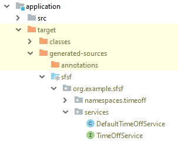

Take a look into the Java files of the generated sub packages:

 * `services` contains the service classes, in this case only for `Time Off`.

    The dedicated interface file enables the usage of Beans in Servlet and Spring frameworks. Given the interface, each API features the respective _OData operations_ as service methods.

 * `namespace.timeoff` holds static classes for API querying, e.g. fluent helper enabling a type-safe API reference. Inside are further packages to map fields, links and selectors of entities as well as  batch helper classes.

    ```Java
    package org.example.sfsf;

    ```


### Setup the application


1. **Prepare a dedicated Destination type**

    Create a new java class `SuccessFactorsDestination.java` to serve as placeholder for the destination identifier.

    ```Java
    package org.example.sfsf;

    import com.sap.cloud.sdk.cloudplatform.connectivity.DestinationDeclarator;

    public class SuccessFactorsDestination extends DestinationDeclarator {
        public final static String DESTINATION_NAME = "SFSF";

        public SuccessFactorsDestination() {
            super(DESTINATION_NAME);
        }
    }

    ```

    With this class we can manage a central the destination identifier for the OData use case.

2. **Prepare the custom Exception type**

    Create a new java class `SuccessFactorsException.java` to handle custom errors when operating SAP SuccessFactors.

    ```Java
    package org.example.sfsf;

    public class SuccessFactorsException extends Exception
    {
        public SuccessFactorsException( final String msg )
        {
            super(msg);
        }

        public SuccessFactorsException( final String msg, Throwable e )
        {
            super(msg, e);
        }
    }

    ```

    When having a dedicated exception type, we can manage specific error handling.

3. **Prepare the Application clock**

    Open the existing java class `Application.java` and add the following method to the class. This will register a default Bean implementation for `Clock`.

    ```Java
    @org.springframework.context.annotation.Bean
    public java.time.Clock clock()
    {
        return java.time.Clock.systemDefaultZone();
    }

    ```

    We will later use the _Clock_ to handle current date resolution. This is especially useful when working with integration tests, which expect a certain date as _current_ date.

4. **Implement the `GetEntitlementsCommand`**

    Create a new class `GetEntitlementsCommand.java` to serve the actual OData requests with SAP SuccessFactors.

    For a given `userId` and date span, it resolves the available days of the current user time account. It ensures tenant and user isolated caching.

    ```Java
    package org.example.sfsf;

    import com.google.common.cache.Cache;
    import com.google.common.cache.CacheBuilder;
    import com.sap.cloud.sdk.cloudplatform.cache.CacheKey;
    import com.sap.cloud.sdk.frameworks.hystrix.HystrixUtil;
    import com.sap.cloud.sdk.odatav2.connectivity.ODataException;
    import com.sap.cloud.sdk.s4hana.connectivity.CachingErpCommand;
    import com.sap.cloud.sdk.s4hana.connectivity.ErpConfigContext;
    import org.apache.commons.lang.StringUtils;
    import org.example.sfsf.namespaces.timeoff.TimeAccount;
    import org.example.sfsf.namespaces.timeoff.TimeAccountDetail;
    import org.example.sfsf.services.TimeOffService;

    import javax.annotation.Nonnull;
    import java.time.LocalDateTime;
    import java.util.List;
    import java.util.concurrent.TimeUnit;
    import java.util.stream.Collectors;

    public class GetEntitlementsCommand extends CachingErpCommand<List<TimeAccountDetail>>
    {
        private static final Cache<CacheKey, List<TimeAccountDetail>> cache =
            CacheBuilder.newBuilder().maximumSize(50).expireAfterWrite(7, TimeUnit.DAYS).build();
        private static final String ACCOUNT_TYPE_VACATION = "TAT_VAC_REC";

        private final TimeOffService service;
        private final String userId;
        private final LocalDateTime startDate;
        private final LocalDateTime endDate;

        public GetEntitlementsCommand(
            @Nonnull final TimeOffService service,
            @Nonnull final String userId,
            @Nonnull final LocalDateTime startDate,
            @Nonnull final LocalDateTime endDate )
        {
            super(
                HystrixUtil.getDefaultErpCommandSetter(
                    GetEntitlementsCommand.class,
                    HystrixUtil
                        .getDefaultErpCommandProperties()
                        .withExecutionTimeoutInMilliseconds(10000)
                        .withFallbackEnabled(false)),
                new ErpConfigContext(SuccessFactorsDestination.DESTINATION_NAME));

            this.service = service;
            this.userId = userId;
            this.startDate = startDate;
            this.endDate = endDate;
        }

        @Nonnull
        @Override
        protected Cache<CacheKey, List<TimeAccountDetail>> getCache()
        {
            return cache;
        }

        @Nonnull
        @Override
        protected CacheKey getCommandCacheKey()
        {
            return super.getCommandCacheKey().append(userId, startDate, endDate);
        }

        @Override
        @Nonnull
        protected List<TimeAccountDetail> runCacheable()
            throws ODataException,
                SuccessFactorsException
        {
            final List<TimeAccount> timeAccountList =
                service
                    .withServicePath("odata/v2")
                    .getAllTimeAccount()
                    .filter(
                        TimeAccount.USER_ID
                            .eq(userId)
                            .and(TimeAccount.START_DATE.le(endDate))
                            .and(TimeAccount.END_DATE.ge(startDate))
                            .and(TimeAccount.ACCOUNT_TYPE.eq(ACCOUNT_TYPE_VACATION))
                            .and(TimeAccount.ACCOUNT_CLOSED.eq(false)))
                    .select(
                        TimeAccount.TO_TIME_ACCOUNT_DETAILS.select(
                            TimeAccountDetail.ACCRUAL_PERIOD_ID,
                            TimeAccountDetail.BOOKING_AMOUNT,
                            TimeAccountDetail.BOOKING_TYPE,
                            TimeAccountDetail.BOOKING_DATE,
                            TimeAccountDetail.BOOKING_UNIT,
                            TimeAccountDetail.CREATED_DATE))
                    .execute(getConfigContext());

            if( timeAccountList.isEmpty() ) {
                throw new SuccessFactorsException("No time account found for user " + userId);
            }
            if( timeAccountList.size() > 1 ) {
                throw new SuccessFactorsException("More than one time account found for user " + userId);
            }

            return timeAccountList
                .get(0)
                .getTimeAccountDetailsIfPresent()
                .orElseThrow(() -> new SuccessFactorsException("Failed to resolve time account items for user " + userId))
                .stream()
                .filter(d -> !StringUtils.equalsIgnoreCase("ACCRUAL", d.getBookingType()) || checkDate(d.getBookingDate()))
                .collect(Collectors.toList());
        }

        private boolean checkDate( final LocalDateTime t )
        {
            return t != null
                && (startDate.isBefore(t) || startDate.isEqual(t))
                && (endDate.isAfter(t) || endDate.isEqual(t));
        }
    }

    ```

    Please notice the VDM fluent API usage, when accessing the `TimeOffService service` instance. You can find filtering on the _TimeAccount_ collection and selection of expanded fields for _TimeAccountDetail_.

    **Note:**
    Items of _TimeAccount_ must be within date range, when they are of type _ACCRUAL_, i.e. continuously generated by the system.

    Depending on your server instance of SAP SuccessFactors, you may want to adapt the `withServicePath(...)` declaration.

5. **Implement a simple controller response model**

    Create a new class `models/AvailableDaysResponse.java` to hold the numeric value prepared by the controller.

    ```Java
    package org.example.sfsf.models;

    import com.fasterxml.jackson.annotation.JsonProperty;
    import javax.annotation.Nonnull;
    import java.math.BigDecimal;

    public class AvailableDaysResponse
    {
        @JsonProperty( "availableDays" )
        private final BigDecimal days;

        public AvailableDaysResponse( @Nonnull final BigDecimal days ) {
            this.days = days;
        }
    }

    ```

6. **Implement a service controller**

    Create a new class `controllers/EntitlementsController.java` to listen on requests to our application. Depending on the request this controller evaluates items from the time account of a user. Either the result is computed on the current date (`/entitlements/[USERID]/timeaccount`), or the on a given specific year (`/entitlements/[USERID]/timeaccount/[YEAR]`). For easy processing, the intermediate list of `TimeAccountDetail` is filtered for values of type "DAYS" and accumulated. As a result, the numeric sum is wrapped into our own model class `AvailableDaysResponse`. You can later choose your own algorithm to manipulate the list of `accountDetails`, and maybe use a different response model for further data processing.

    ```Java
    package org.example.sfsf.controllers;

    import com.netflix.hystrix.exception.HystrixRuntimeException;
    import com.sap.cloud.sdk.cloudplatform.logging.CloudLoggerFactory;
    import org.example.sfsf.GetEntitlementsCommand;
    import org.example.sfsf.models.AvailableDaysResponse;
    import org.example.sfsf.namespaces.timeoff.TimeAccountDetail;
    import org.example.sfsf.services.TimeOffService;
    import org.slf4j.Logger;
    import org.springframework.http.HttpStatus;
    import org.springframework.http.ResponseEntity;
    import org.springframework.web.bind.annotation.ExceptionHandler;
    import org.springframework.web.bind.annotation.PathVariable;
    import org.springframework.web.bind.annotation.RequestMapping;
    import org.springframework.web.bind.annotation.RequestMethod;
    import org.springframework.web.bind.annotation.RestController;
    import org.springframework.web.context.request.WebRequest;

    import javax.annotation.Nonnull;
    import java.math.BigDecimal;
    import java.time.Clock;
    import java.time.LocalDate;
    import java.time.LocalDateTime;
    import java.time.LocalTime;
    import java.util.List;

    import static java.time.temporal.TemporalAdjusters.lastDayOfYear;

    @RestController
    @RequestMapping( "/entitlements" )
    public class EntitlementsController
    {
        private static final Logger logger = CloudLoggerFactory.getLogger(EntitlementsController.class);

        private final TimeOffService service;
        private final Clock clock;

        public EntitlementsController( @Nonnull final TimeOffService service, @Nonnull final Clock clock ) {
            this.service = service;
            this.clock = clock;
        }

        @RequestMapping( value = "/{userId}/timeaccount", method = RequestMethod.GET, produces = "application/json" )
        public AvailableDaysResponse getDaysAvailableInCurrentYear( @PathVariable( "userId" ) final String userId )
        {
            final LocalDateTime now = LocalDateTime.now(clock);
            final LocalDateTime startDate = now.toLocalDate().withDayOfYear(1).atStartOfDay();

            final List<TimeAccountDetail> accountDetails =
                new GetEntitlementsCommand(service, userId, startDate, now).execute();

            final BigDecimal availableDays =
                accountDetails
                    .stream()
                    .filter(d -> d.getBookingUnit() != null && d.getBookingUnit().equalsIgnoreCase("DAYS"))
                    .map(TimeAccountDetail::getBookingAmount)
                    .reduce(BigDecimal.ZERO, BigDecimal::add);

            return new AvailableDaysResponse(availableDays);
        }

        @RequestMapping( value = "/{userId}/timeaccount/{year}", method = RequestMethod.GET, produces = "application/json" )
        public AvailableDaysResponse getDaysAvailableInSpecificYear(
            @PathVariable( "userId" ) final String userId,
            @PathVariable( "year" ) final int year )
        {
            final LocalDateTime startDate = LocalDate.ofYearDay(year, 1).atStartOfDay();
            final LocalDateTime endDate = startDate.toLocalDate().with(lastDayOfYear()).atTime(LocalTime.MAX);

            final List<TimeAccountDetail> accountDetails =
                new GetEntitlementsCommand(service, userId, startDate, endDate).execute();

            final BigDecimal availableDays =
                accountDetails
                    .stream()
                    .filter(d -> d.getBookingUnit() != null && d.getBookingUnit().equalsIgnoreCase("DAYS"))
                    .map(TimeAccountDetail::getBookingAmount)
                    .reduce(BigDecimal.ZERO, BigDecimal::add);

            return new AvailableDaysResponse(availableDays);
        }

        @ExceptionHandler( HystrixRuntimeException.class )
        public ResponseEntity<Object> handleAccessDeniedException( final Exception e, final WebRequest request )
        {
            logger.debug(
                "Failed to interact with SuccessFactors: \"{}\" due to request: {}",
                e.getCause().getMessage(),
                request,
                e);
            return new ResponseEntity<>("Failed to load data from SuccessFactors", HttpStatus.BAD_REQUEST);
        }
    }

    ```

    As you see, our  controller is listening for a `GET /entitlements` request. Either only _userId_ is provided or _userId_ and _year_.

    If an exception occurs, e.g. when a connected service is not available, a `HystrixRuntimeException` will be thrown. In this case the error will be handled gracefully, without exposing application internal data to the response.

    This controller has a constructor which expects `TimeOffService service` and `Clock clock`. Both references are Beans and will be automatically injected by the Spring framework.


Your overall application structure will look like this.

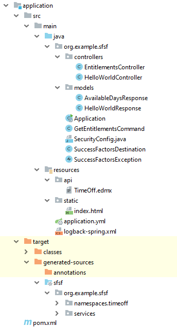


### Setup and run a mock server test

It's time to verify the newly created code with an elaborate mock server test. We are now working in the `integration-tests` module.

1. **Create a new resource file**

    ```
    ./integration-tests/src/test/resources/mocked_timeaccount_2019.json

    ```

    The following JSON payload is going to be used as mocked server response.

    ```json
    {
      "d": {
        "results": [
          {
            "startDate": "/Date(1546300800000)/",
            "accountClosed": false,
            "endDate": "/Date(1577750400000)/",
            "userId": "testuser",
            "createdDate": "/Date(1546527324000)/",
            "createdDateTime": "/Date(1546545324000+0000)/",
            "bookingEndDate": "/Date(1585612800000)/",
            "accountType": "TAT_VAC_REC",
            "bookingStartDate": "/Date(1546300800000)/",
            "timeAccountDetails": {
              "results": [
                {
                  "bookingUnit": "DAYS",
                  "bookingType": "ACCRUAL",
                  "createdDate": "/Date(1546527352000)/",
                  "bookingDate": "/Date(1546300800000)/",
                  "accrualPeriodId": "2019-1",
                  "bookingAmount": "2.0000000000"
                },
                {
                  "bookingUnit": "DAYS",
                  "bookingType": "ACCRUAL",
                  "createdDate": "/Date(1547151245000)/",
                  "bookingDate": "/Date(1548979200000)/",
                  "accrualPeriodId": "2019-2",
                  "bookingAmount": "2.0000000000"
                },
                {
                  "bookingUnit": "DAYS",
                  "bookingType": "ACCRUAL",
                  "createdDate": "/Date(1547151269000)/",
                  "bookingDate": "/Date(1551398400000)/",
                  "accrualPeriodId": "2019-3",
                  "bookingAmount": "2.0000000000"
                },
                {
                  "bookingUnit": "DAYS",
                  "bookingType": "ACCRUAL",
                  "createdDate": "/Date(1547151292000)/",
                  "bookingDate": "/Date(1554076800000)/",
                  "accrualPeriodId": "2019-4",
                  "bookingAmount": "2.0000000000"
                },
                {
                  "bookingUnit": "DAYS",
                  "bookingType": "ACCRUAL",
                  "createdDate": "/Date(1547151325000)/",
                  "bookingDate": "/Date(1556668800000)/",
                  "accrualPeriodId": "2019-5",
                  "bookingAmount": "2.0000000000"
                },
                {
                  "bookingUnit": "DAYS",
                  "bookingType": "ACCRUAL",
                  "createdDate": "/Date(1547151349000)/",
                  "bookingDate": "/Date(1559347200000)/",
                  "accrualPeriodId": "2019-6",
                  "bookingAmount": "2.0000000000"
                },
                {
                  "bookingUnit": "DAYS",
                  "bookingType": "ACCRUAL",
                  "createdDate": "/Date(1547151373000)/",
                  "bookingDate": "/Date(1561939200000)/",
                  "accrualPeriodId": "2019-7",
                  "bookingAmount": "2.0000000000"
                },
                {
                  "bookingUnit": "DAYS",
                  "bookingType": "ACCRUAL",
                  "createdDate": "/Date(1547151399000)/",
                  "bookingDate": "/Date(1564617600000)/",
                  "accrualPeriodId": "2019-8",
                  "bookingAmount": "2.0000000000"
                },
                {
                  "bookingUnit": "DAYS",
                  "bookingType": "ACCRUAL",
                  "createdDate": "/Date(1547151429000)/",
                  "bookingDate": "/Date(1567296000000)/",
                  "accrualPeriodId": "2019-9",
                  "bookingAmount": "2.0000000000"
                },
                {
                  "bookingUnit": "DAYS",
                  "bookingType": "ACCRUAL",
                  "createdDate": "/Date(1547151455000)/",
                  "bookingDate": "/Date(1569888000000)/",
                  "accrualPeriodId": "2019-10",
                  "bookingAmount": "2.0000000000"
                },
                {
                  "bookingUnit": "DAYS",
                  "bookingType": "ACCRUAL",
                  "createdDate": "/Date(1547151499000)/",
                  "bookingDate": "/Date(1572566400000)/",
                  "accrualPeriodId": "2019-11",
                  "bookingAmount": "2.0000000000"
                },
                {
                  "bookingUnit": "DAYS",
                  "bookingType": "ACCRUAL",
                  "createdDate": "/Date(1547151545000)/",
                  "bookingDate": "/Date(1575158400000)/",
                  "accrualPeriodId": "2019-12",
                  "bookingAmount": "2.0000000000"
                },
                {
                  "bookingUnit": "DAYS",
                  "bookingType": "EMPLOYEE_TIME",
                  "createdDate": "/Date(1546422245000)/",
                  "bookingDate": "/Date(1553558400000)/",
                  "accrualPeriodId": null,
                  "bookingAmount": "-1"
                }
              ]
            }
          }
        ]
      }
    }

    ```

    This mocked service response only contains the fields required for the upcoming test assertions. In contrast, a realistic service response actually features many more fields.

    Please notice the complete set for time account entitlements for user "testuser", i.e. 2 days per month as added via "ACCRUAL". In addition this response contains an employee entry, reserving a single day in March 2019.

2. **Create a new test class**

    ```
    ./integration-tests/src/test/java/[...]/EntitlementsControllerTest.java

    ```

    The following test class currently contains a test, whether the time account items are correctly accumulated and forwarded by our controller.

    ```Java
    package org.example.sfsf;

    import com.github.tomakehurst.wiremock.junit.WireMockRule;
    import com.google.common.io.Resources;
    import com.sap.cloud.sdk.cloudplatform.servlet.RequestContextExecutor;
    import com.sap.cloud.sdk.testutil.MockUtil;
    import com.sap.cloud.sdk.testutil.TestConfigurationError;
    import org.junit.Before;
    import org.junit.BeforeClass;
    import org.junit.Rule;
    import org.junit.Test;
    import org.junit.runner.RunWith;
    import org.springframework.beans.factory.annotation.Autowired;
    import org.springframework.boot.test.autoconfigure.web.servlet.WebMvcTest;
    import org.springframework.boot.test.mock.mockito.MockBean;
    import org.springframework.test.context.junit4.SpringRunner;
    import org.springframework.test.web.servlet.MockMvc;
    import org.springframework.test.web.servlet.request.MockMvcRequestBuilders;

    import java.io.IOException;
    import java.nio.charset.StandardCharsets;
    import java.time.Clock;
    import java.time.LocalDate;
    import java.time.ZoneId;

    import static com.github.tomakehurst.wiremock.client.WireMock.*;
    import static org.mockito.Mockito.doReturn;
    import static org.springframework.test.web.servlet.result.MockMvcResultMatchers.content;
    import static org.springframework.test.web.servlet.result.MockMvcResultMatchers.status;

    @RunWith( SpringRunner.class )
    @WebMvcTest
    public class EntitlementsControllerTest
    {
        private static final MockUtil mockUtil = new MockUtil();
        private static final String ODATA_ENDPOINT_URL = "/odata/v2";
        private static final String ODATA_METADATA_URL = ODATA_ENDPOINT_URL + "/$metadata";

        private static final String RESPONSE_2019 = readResourceFile("mocked_timeaccount_2019.json");

        @Rule
        public final WireMockRule erpServer = mockUtil.mockErpServer(SuccessFactorsDestination.DESTINATION_NAME, null, null);

        @Autowired
        private MockMvc mvc;

        @MockBean
        private Clock clock;

        @BeforeClass
        public static void beforeClass()
        {
            mockUtil.mockDefaults();
        }

        @Before
        public void setupMock()
        {
            // Add default routes for mock server
            stubFor(head(urlEqualTo(ODATA_ENDPOINT_URL)).willReturn(ok()));
            stubFor(get(urlEqualTo(ODATA_METADATA_URL)).willReturn(okXml(readResourceFile("api/TimeOff.edmx"))));

            // Override the current clock for resolving dates during the test
            final ZoneId zoneId = ZoneId.systemDefault();
            final Clock fixedClock = Clock.fixed(LocalDate.of(2019, 5, 2).atStartOfDay(zoneId).toInstant(), zoneId);
            doReturn(fixedClock.instant()).when(clock).instant();
            doReturn(fixedClock.getZone()).when(clock).getZone();
        }

        @Test
        public void testCurrentYear()
            throws Exception
        {
            stubFor(get(urlPathEqualTo(ODATA_ENDPOINT_URL + "/TimeAccount")).willReturn(ok().withBody(RESPONSE_2019)));

            new RequestContextExecutor().execute(
                () -> mvc
                    .perform(MockMvcRequestBuilders.get("/entitlements/testuser/timeaccount"))
                    .andExpect(status().isOk())
                    .andExpect(content().json("{\"availableDays\":9.0000000000}")));
        }

        private static String readResourceFile( final String s )
        {
            try {
                return Resources.toString(Resources.getResource(s), StandardCharsets.UTF_8);
            }
            catch( final IOException e ) {
                throw new TestConfigurationError(e);
            }
        }
    }

    ```

    **Note:** You can easily modify the chain of `.andExpect(...)` statements to improve test assertions.

    During the test the following things happen:

    * Since the test is run with `SpringRunner` and annotated with `@WebMvcTest` we can use the autowired `MockMvc` instance to directly call our controller.
    * The current date is set to early May, in order to synchronize with the test assertion.
    * Our controller makes an HTTP request to the mock server with

        ```
        GET /odata/v2/entitlements/testuser/timeaccount

        ```
    * The controller response is checked for an HTTP status 200 and the correct JSON content.
    * For the sake of simplicity we omit authorization checks at the current stage.
    * Also we skip the similar test case for a dedicated year as part of the request.

    Run the test.

Your integration-test module now contains a mock server test:

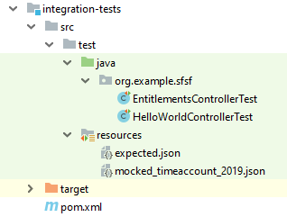


### Prepare configuration on SCP Cloud Foundry


Open the SCP Cockpit and navigate to your **Cloud Foundry** account.

1. Ensure service bindings

    Open the current account _space_, which your application is going to be uploaded to. Here, in the navigation on the left, under _Services_, click on _Service Instances_. Make sure you have an instance running for both services, `xsuaa` and `destination`. For the sake of this guide, let's assume the `xsuaa` service instance is called "`myxsuaa`" and the `destination` service instance is called "`mydestination`".

    In case you are missing a service instance, go to _Service Marketplace_ and setup it up. For `xsuaa`, the recommended service plan is _application_. For `destination` it is _lite_.

2. Add the destination

    Leave the _space_, back to your **Cloud Foundry** account. In the navigation, under _Connectivity_ click _Destination_. Click the button _New Destination_. Enter the Monitoring service destination values:

    * Name: `SFSF`

      Just like described in your Java application, as field `SuccessFactorsDestination.DESTINATION_NAME`

   * Type: `HTTP`

   * URL: `https://example.successfactors.com`

      You can find a list of supported URLs on the [Service API page](https://api.sap.com/api/ECTimeOff/overview).

   * Proxy Type: `Internet`

   * Authentication: `BasicAuthentication`

      **Note:** Do not use basic authentication in production code.

   * User: `Admin@Company`

      Please replace the "Admin" user with a technical user you have for the SuccessFactors instance. Also replace "Company" with the company id, which your technical user is connected to. Leave the `@` sign as separator.

   * Password: _(Password of the technical user)_

    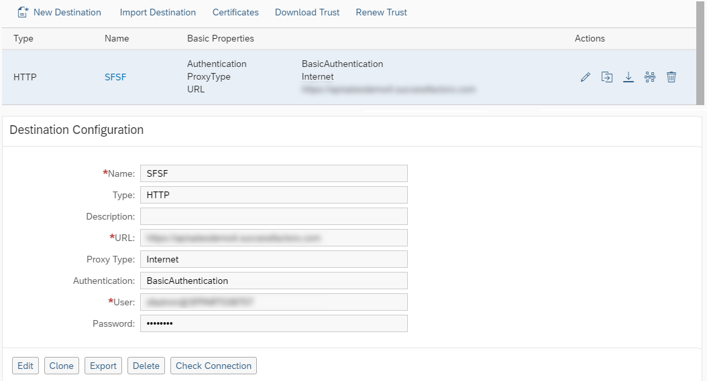

You are done with the setup on SCP Cloud Foundry.


### Deploy application


1. Run a complete Maven build with your project:

    ```Shell
    mvn clean install

    ```

    All tests will be executed to make sure your application is working as expected.

2. Open the `manifest.yml`

    Change the YAML such that XSUAA and destination services instance are bound upon application initialization. Also a mocked authorization header is required, until the application is fully secured, see [Secure your Application on SAP Cloud Platform](https://blogs.sap.com/2017/07/18/step-7-with-sap-s4hana-cloud-sdk-secure-your-application-on-sap-cloud-platform-cloudfoundry/).

    Add the following entries to the list of services:

    ```yaml
    env:
        ...
        ALLOW_MOCKED_AUTH_HEADER: true
    services:
        - myxsuaa
        - mydestination

    ```

    **Note:** This may differ from your file, in case the service instances were named differently.

3. In the command prompt run the following statement with the Cloud Foundry command-line interface:

   For information on how to use the `cf` tool, please find the starter [tutorial for applications on Cloud Foundry](https://blogs.sap.com/2017/05/19/step-3-with-sap-s4hana-cloud-sdk-helloworld-on-scp-cloudfoundry/) with the _SAP Cloud SDK_.

    ```Shell
    cf push

    ```

    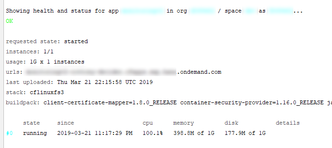

    Note down the logged entry in `urls` above.


### Test


1. Open the application URL.

    You will be greeted with the default landing page.

    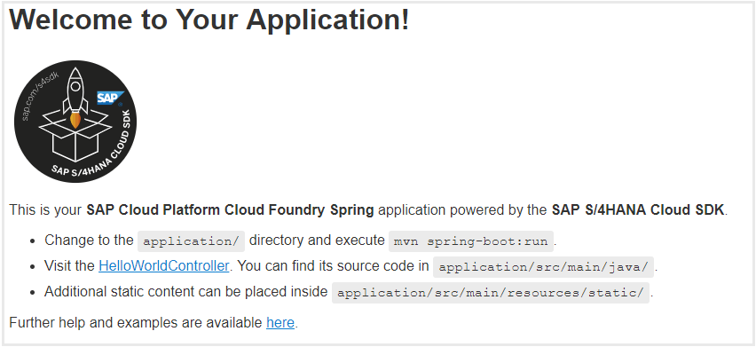

    Enter the following path.

    ```
    /entitlements/USERID/timeaccount

    ```

    For `USERID` enter the SAP SuccessFactors userid for which the available days of current year need to be showed.

    You should see the successful response from your application.

    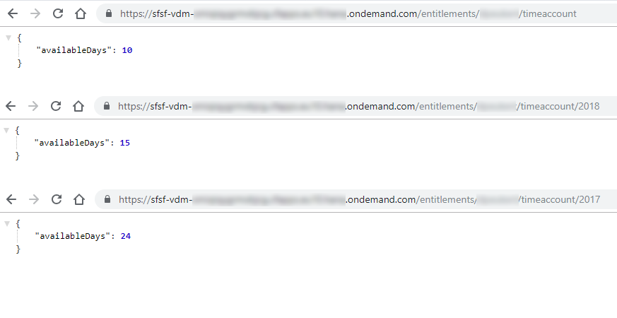

Congratulation!

You successfully consumed a **service API from SAP SuccessFactors** with an **application on SCP Cloud Foundry**, with the help of the **SAP Cloud SDK** and the included VDM code generator.


### Test yourself


### Test yourself


---
