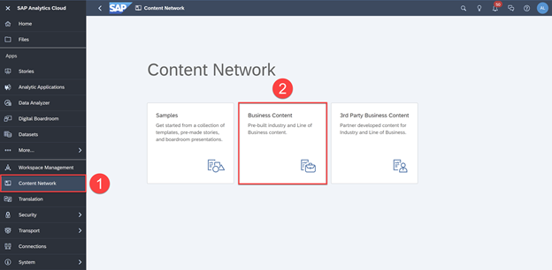
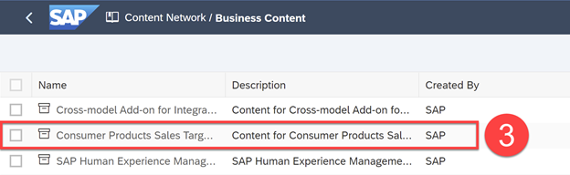
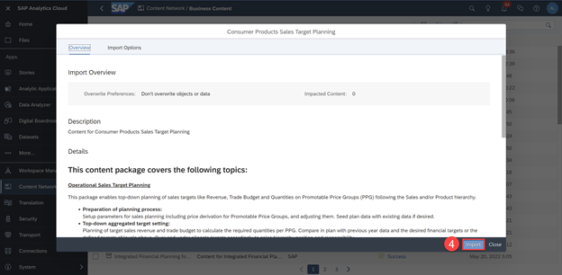
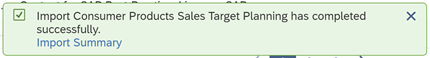
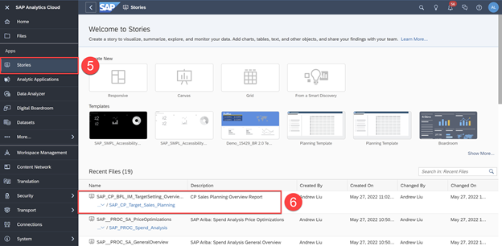
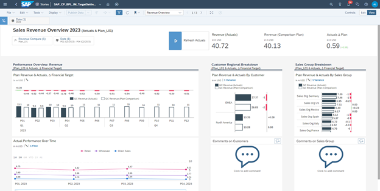
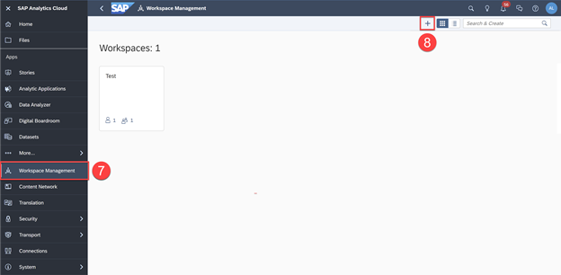
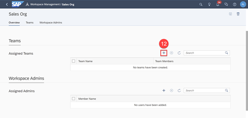
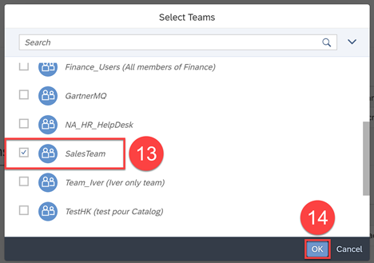

# Manage Content Administration
<!-- description --> Learn how to import business content packages and configure workspaces for your organization

## You will learn
  - How to import business content from Content Network
  - How to configure workspaces and add teams to the workspace

---

### Get Business Content from the Content Network

In SAP Analytics Cloud, you can use sample content and business content provided in the Content Network.

You can browse content and choose packages to add to your system from within the application. You can find more information about business content in the [Release Information guide](https://help.sap.com/viewer/21868089d6ae4c5ab55f599c691726be/release/en-US) and the [Content Package User guide](https://help.sap.com/viewer/42093f14b43c485fbe3adbbe81eff6c8/release/en-US).

**1.** In the Side Navigation panel, select **Content Network**

**2.** Click **Business Network**

> **Samples**: A collection of technical samples for stories and SAP Digital Boardroom presentations  

> **Business Content**: Industry and line of business content created by SAP

> **3rd Party Content**: End-to-end business scenarios for various industries and lines of business, created by SAP partners.

When you import a package from the Content Network, you become the owner of it. However, you must have read permissions on the relevant object types to access the package content.

For this exercise, let's import the `SAP Ariba package` to analyze the spending of a company.

**3.**	Click `SAP Ariba: Spend Analysis`

The Overview page provides a summary on the content package. The Import Options page allows you to choose a sub folder where you want to import the package contents.

**4.**	Click **Import**

Once the content package has imported, you will see a notification on the bottom of your screen indicating that the import has completed successfully.

**5.** In the Side Navigation panel, select **Stories**
**6.** Click **`SAP Ariba`: Spend Analysis General Overview**

Great! You've now imported and opened a Business Content story!

> Because imported content in your system can be deleted and replaced if the package is imported again with certain Overwrite Preferences, you'll want to consider how to maintain the content. This is particularly important if you're using business content in a production system. See [Maintain Business Content](https://help.sap.com/docs/SAP_ANALYTICS_CLOUD/00f68c2e08b941f081002fd3691d86a7/10166387fe034cf2840372ca1c9332ff.html?) for details.

Click [here](https://help.sap.com/docs/SAP_ANALYTICS_CLOUD/00f68c2e08b941f081002fd3691d86a7/078868f57f3346a98c3233207bd211c7.html) to learn more.

### Configure Workspaces

With SAP Analytics Cloud, you can create virtual workspaces that mimic any organizational setup. You can assign teams and workspace administrators to separate groups, giving you greater content management capabilities. Benefits include:

- Managing a large amount of content and users

- Creating workspaces for different departments

- Setting up workspaces for different lines of businesses

- Creating and deleting workspaces for short-term projects whose team members are temporary

**7.** In the Side Navigation panel, select **Workspace Management**

**8.** Click the **+** icon

Let's create a workspace for the Sales Organization in your company.

**9.** Input **Sales Org** as the Name

**10.**	Enter a description

**11.**	Click **Save**

Now that you've created a new workspace, you can assign teams and workspace administrators. To manage your existing workspaces, you can visit the Workspace Management area at any time.

Let's assign the sales team you created in the previous tutorial to the workspace you just created.

**12.**	Click the **+** icon

**13.**	Select `SalesTeam`

**14.**	Click **OK**

> To add users to a workspace; the users must already be assigned to a team, and the team must be assigned to the workspace.

Click [here](https://help.sap.com/docs/SAP_ANALYTICS_CLOUD/00f68c2e08b941f081002fd3691d86a7/aa613f0fc51f401ab1a2cdf47708c0d9.html) to learn more.

### Test Yourself

---
