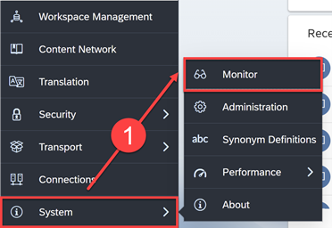
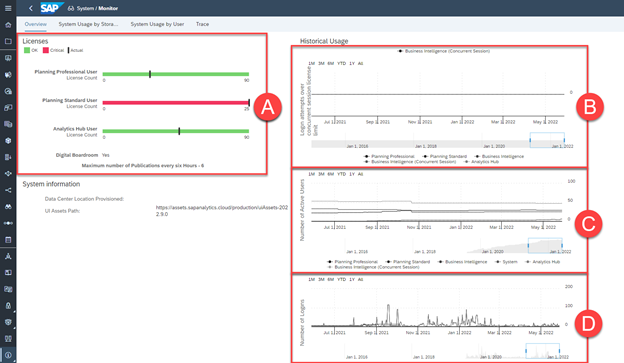
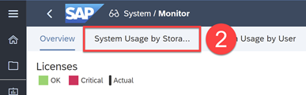
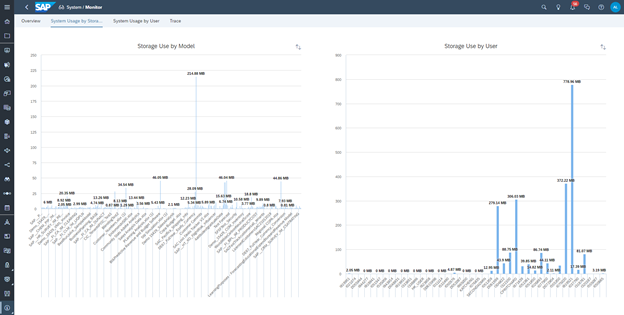
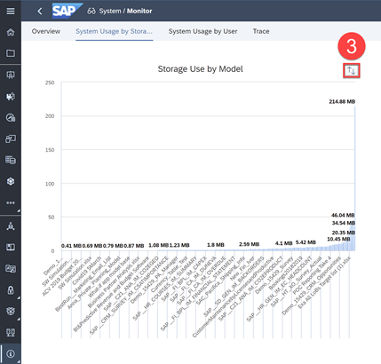
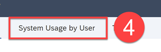
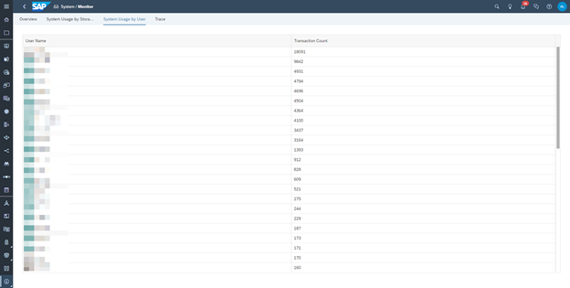
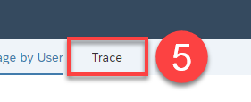
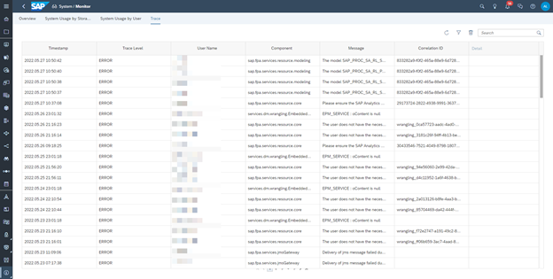

# Monitor Performance of your Tenant
<!-- description --> Use the monitor tool to assess the current health of your SAP Analytics Cloud service, identify problems, and plan for the future needs of your organization.

## You will learn
  - How to monitor tenant system usage

## Intro
Monitoring lets you as an administrator answer the important question How is our tenant being used? Knowing what your capacities are, such as the number of licenses in use or the amount of storage space consumed, is essential to making informed decisions on how to allocate resources.

---

### Get an Overview of System Usage

**1.** In the Side Navigation panel, select **System > Monitor**

### Overview

The Overview page keeps track of your purchased licenses, with historical charts on how those licenses are being used during logged in sessions.

**A.** The **Licenses** chart shows you a count of how many licenses are currently assigned for each license type in your tenant. You can see the maximum allowed licenses, and whether you are over or under this maximum.

**B.** The **Login attempts over concurrent session license limit** chart is a historical graph showing the number of login attempts made when all concurrent sessions were in-use.

**C.** The **Number of Consumed Licenses** chart is a historical graph showing the number of named user licenses assigned or concurrent licenses actively logged in. This chart is a historical view of the **Licenses** chart.

**D.** The **Number of Logins** chart is a historical total count of logins that shows you the login trend over time.

### Get to know System Usage by Storage and User

**2.** Go to the **System Usage by Storage** page

### System Usage by Storage

This page displays two charts showing storage use in MB: **Storage Use by Model** and **Storage Use by User**.

Use these charts to review the distribution of used disk space. If you subscribe to a private option for your SAP Analytics Cloud service, you can see at a glance what is taking up the largest amount of your allocated disk space.

**3.** To sort the data in the graphs, click the **Sort** button

### System Usage by User

**4.** Go to the **System Usage by User** page

This page displays the total number of transactions by each user and can help you see which accounts use your system heavily.

### Trace your Message Logs

**5.** Go to the **Trace** page

### Trace

The **Trace** tab contains a table of the trace log messages that are recorded for your service.

You can view the trace logs to help with troubleshooting errors and provide SAP with important information when you need to create an incident and get SAP support.

> The **Search** feature operates on the **User Name**, **Component**, and **Message** columns and filters the items listed on screen to those that include a match with the search string you type. The **Filter** feature allows you to enter a date range to select only log entries within a fixed period. Additionally, most columns of the display are sortable using a **Sort Descending** or **Sort Ascending** feature in the column headers.

Click [here](https://help.sap.com/docs/SAP_ANALYTICS_CLOUD/00f68c2e08b941f081002fd3691d86a7/58ae68146c6d4ba19105ed89a63b0189.html) to learn more.

Now that you have an understanding of how to monitor usage, you may also be interested in reviewing performance metrics for your SAP Analytics Cloud service. For example, comparing how expensive different models and stories are, and their impact on overall service performance. To get started, check out the [SAP Analytics Cloud Performance Analysis Tool](https://blogs.sap.com/2021/01/08/sap-analytics-cloud-performance-analysis-tool/).

You can also get monitor system usage, and get more detailed information using the Administration Cockpit tool. For more information, see [Use the Administration Cockpit](https://help.sap.com/docs/SAP_ANALYTICS_CLOUD/00f68c2e08b941f081002fd3691d86a7/82ebd71cf1064064b8df82797f4a259d.html?).

### Test Yourself

---
