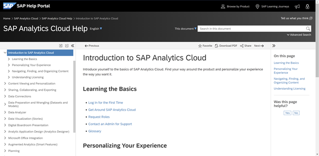
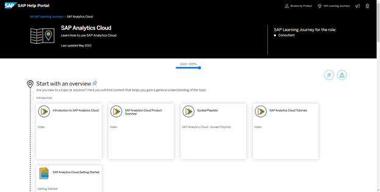
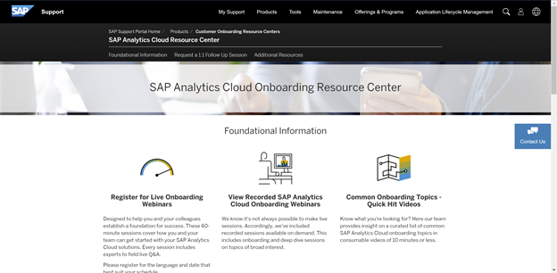
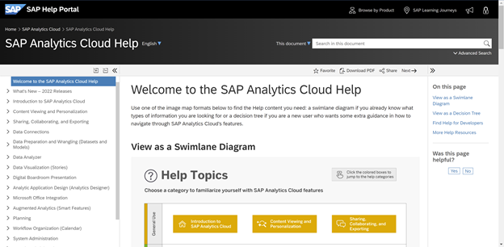
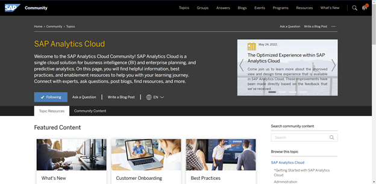
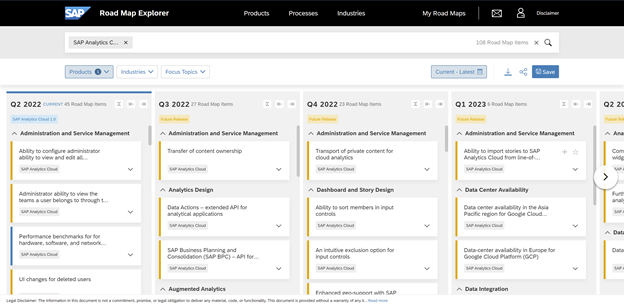
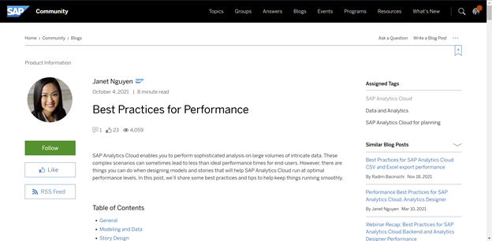
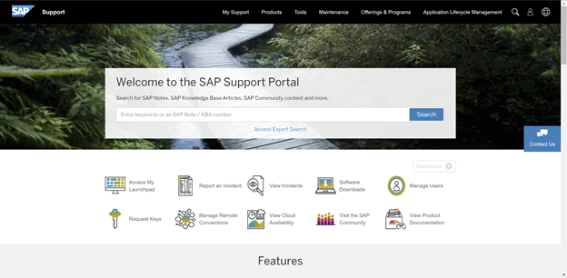
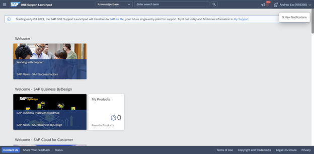

# Stay Connected with SAP Analytics Cloud Resources
<!-- description --> Learn where to receive onboarding support, guidance and enablement resources, and product expert help.

## You will learn
  - How to receive Onboarding support
  - Where to find Guidance and Enablement Resources
  - Where to get SAP expert support

---

### Learn from Onboarding Resources

### Getting Started Help Portal

[Get started](https://help.sap.com/docs/SAP_ANALYTICS_CLOUD/00f68c2e08b941f081002fd3691d86a7/6ea0ee725a624eebbd0012a267e7b7f9.html) by creating your first story and customizing your SAP Analytics Cloud experience.

### Learning Journey

A [detailed guide](https://help.sap.com/learning-journeys/500292207a261014b467ddb396b66331) to help you with your SAP learning path.

### Onboarding Resource Center

[Register](https://support.sap.com/en/product/onboarding-resource-center/sac.html#panel-section_810737555-accordion_copy-accordionitem_637626148-body) for live onboarding webinars, view recorded SAP Analytics Cloud Onboarding webinars, and learn from common onboarding videos.

### Learn from Guidance and Enablement Resources

### Help Guide

A [library of resources](https://help.sap.com/docs/SAP_ANALYTICS_CLOUD/00f68c2e08b941f081002fd3691d86a7/1fb1f4ce92f44fc983debc25ac1f2cc9.html) to answer all your questions about SAP Analytics Cloud.

### SAP Analytics Cloud Community

Explore [featured content, expert content pages, blog posts, and other curated resources](https://community.sap.com/topics/cloud-analytics).

### Road Maps Explorer

Learn about [future releases and product innovations with the road maps explorer tool](https://roadmaps.sap.com/board?PRODUCT=67838200100800006884&range=CURRENT-LAST#Q2%202022).

### Performance Best Practices

A [blog](https://blogs.sap.com/2021/10/04/best-practices-for-performance/) on best practices and how to run SAP Analytics Cloud at optimal performance level.

### Receive SAP Expert Support

### SAP Support Portal

[Search for SAP Notes, SAP Knowledge Base Articles, SAP Community content and more](https://support.sap.com/en/index.html).

### SAP ONE Support Launchpad

[Report incidents and get real-time support with an expert](https://launchpad.support.sap.com/).

### SAP Product Support

Contact [SAP Product Support](https://support.sap.com/en/my-support/product-support.html) by scheduling a 30-minute live call with an expert or get your issues resolved during a live support session.

### Test Yourself

---
