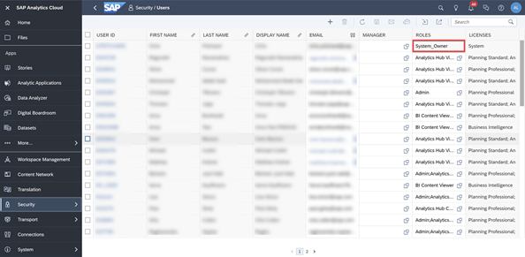
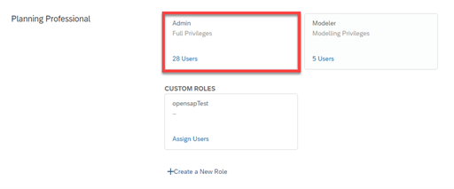
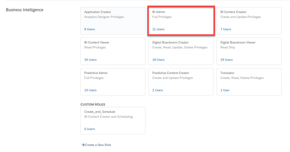
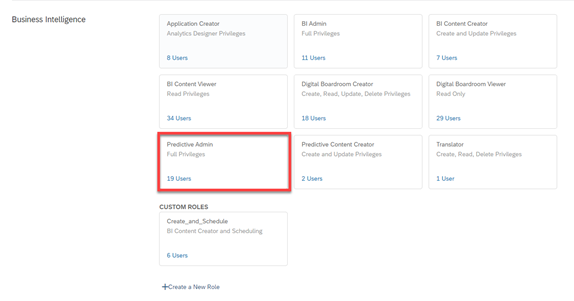

# Introduction to SAP Analytics Cloud Administration
<!-- description --> Get an overview of the responsibilities of SAP Analytics Cloud administrative roles and understand the process of setting up and managing your tenant.

## Prerequisites
 - You have access to an SAP Analytics Cloud administrator account

## You will learn
  - The responsibilities of an SAP Analytics Cloud Administrator
  - The different administrative roles within SAP Analytics Cloud and their permissions
  - The process of setting up and managing your tenant

---

### Overview of an SAP Analytics Cloud Administrator

As an SAP Analytics Cloud administrator your role is to:

- Set up and manage the tenant  

- Ensure security and authentication of user management

- Leverage the best practices for monitoring, auditing, and content management of the system

However, there are a few roles within administration that differentiate a main system owner from delegated administrators.  

As a system owner, you have:

- Full user privileges and is considered the owner, main administrator, and contact person of the overall tenant.

- Unrestricted access to all areas of the application, create users and assign them to roles, carry out maintenance tasks related to users and roles, and monitor activities and data.

> Only one user in the system can be assigned to this role, and it must always be assigned to a user

### Administrative roles and their responsibilities

Other than the system owner, SAP Analytics Cloud is delivered with several standard default delegated administrative roles. The roles you see will depend on the licenses included in your subscription. These roles include:

***Admin***

- Has all task authorizations available in SAP Analytics Cloud, including planning

- Usually assigned to the system administrator to set up users and roles and to perform system transports

***BI Admin***

- Has all task authorizations including predictive. It excludes task authorizations related to planning

- Usually assigned to the BI system administrator

> Users with this role have access to content even if Data Access Control settings have been applied to that content.

***Predictive Admin***

- Has all task authorizations available in SAP Analytics Cloud including all authorizations to create, update, delete, and view predictive scenarios in the **Predictive Scenarios** area

> You need this role to add and configure Data Repositories.

Click [here](https://help.sap.com/docs/SAP_ANALYTICS_CLOUD/00f68c2e08b941f081002fd3691d86a7/e61ce06c6bb2428eb649fb6ccba73c79.html) to learn more.

### The Essentials to Set Up and Manage your Tenant

The first steps as an administrator for your organization comes down to two essentials: **setting up** and **managing** your tenant.

***Setting up your Tenant***

To set up your tenant, you must:

1.	Log into and set up your SAP Analytics Cloud tenant  

2.	Manage users, roles, and teams to set up your organization for success  

3.	Manage data connections in SAP Analytics Cloud

4.	Manage product features to customize your system's experience for your users

***Managing your Tenant***

After setting up your tenant for your team, you must maintain the tenant by:

1. Managing your tenant's content through:

- Importing Business Content through Content Network

- Configuring Workspaces

2. Managing Performance through:

- Monitoring reports to assess the current health of your SAP Analytics Cloud service, identify problems, and plan for future needs of your organization

In the rest of the tutorials in this group, you will learn how to set up your tenant. Then, you will learn how to manage the tenant in the next group.

### Test Yourself

---
