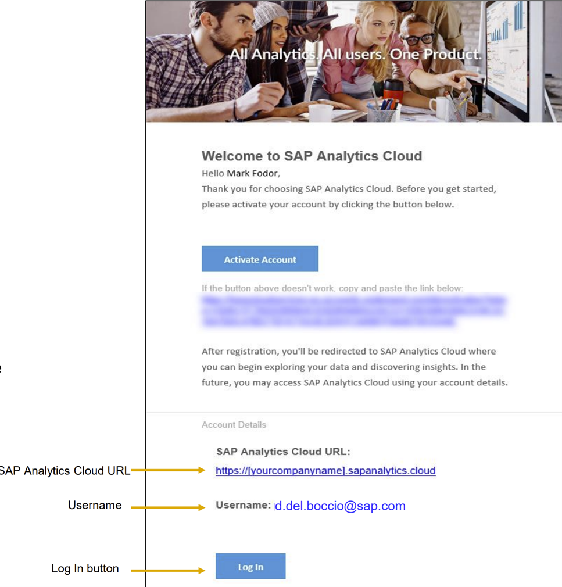
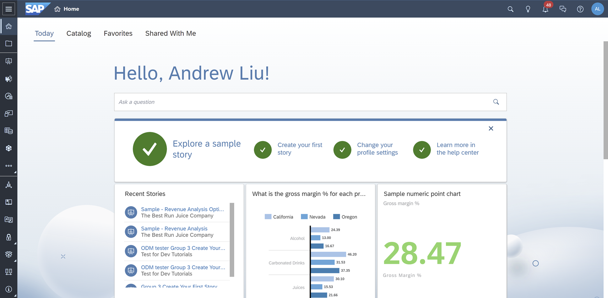
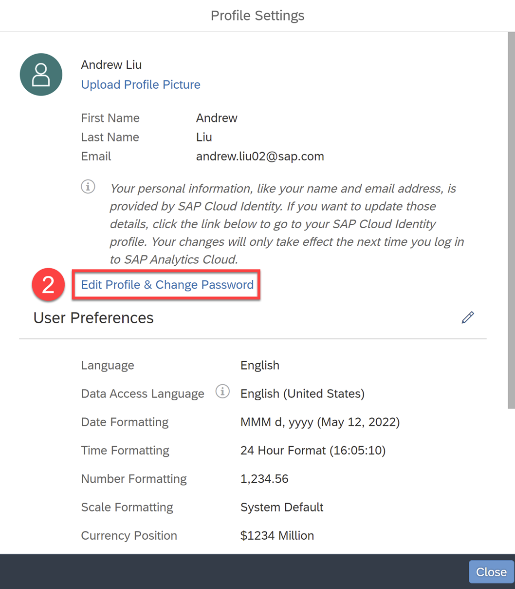
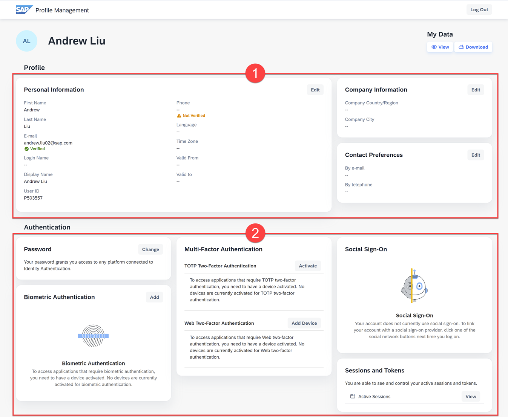

# Log in and Set Up your SAP Analytics Cloud tenant
<!-- description --> Activate and set up your SAP Analytics Cloud tenant and profile

## You will learn
  - How to activate your tenant as a System Owner
  - How to set up your profile

---

### Activate your Tenant

The initial login to the SAP Analytics Cloud system is sent to the System Owner. Please verify that the email was sent out to the System Owner.

As shown below, Access to your tenant will be through the **SAP Analytics Cloud URL**.

> Bookmark the **SAP Analytics Cloud URL** link for easy access in the future

If you need to transfer the System Owner to another person, please follow this [step-by-step approach](https://help.sap.com/docs/SAP_ANALYTICS_CLOUD/00f68c2e08b941f081002fd3691d86a7/c9dcb659df6a40a4b5964036e7ded5bd.html) from the help guide.

If you are the system owner and can't find this email, please [contact us](SAP_BTP_Onboarding@sap.com).

### Set Up your Profile

Once you're logged into your SAP Analytics Cloud tenant, you can start performing some administrative tasks.

Let's start with setting up user specific settings available through the profile settings on the top right of your tenant.

Within this tab, you can:

1.	Personalize your profile with profile pictures, user preferences, and password changes  

2.	Manage your home screen settings such as backgrounds and home screen tiles  

3.	Request roles from your manager  

4.	Add notes to your home screen  

5.	Sign out of your SAP Analytics Cloud tenant

Let's further customize your profile. Go ahead and click **(1) Profile Settings**.

Within Profile Settings, you can upload a profile picture and see the default user preferences. To further set up your profile, click **(2) Edit Profile & Change Password**.

Within Profile Management, you can further customize:

1. Profile

    1. Edit Profile Information

    2. Edit Company Information

    3. Edit Contact Preferences  

2. Authentication

    1. Change your Password  

    2. Add Biometric Authentication  

    3. Enable Multi-Factor Authentication

    4. Use Social Sign-On

    5. See and control Active Sessions and Tokens

Now that you've logged into your tenant and set up your profile, the next thing to do is to create users and assign them to teams. We'll tackle this in the next tutorial!

### Test Yourself

---
