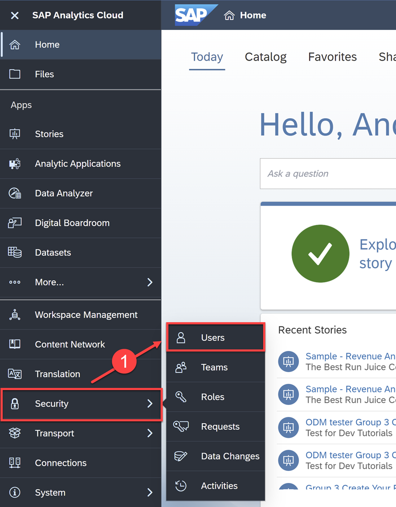
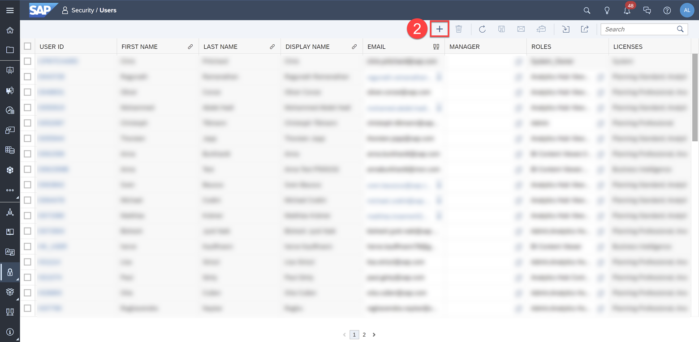
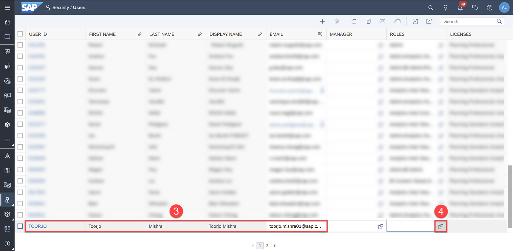
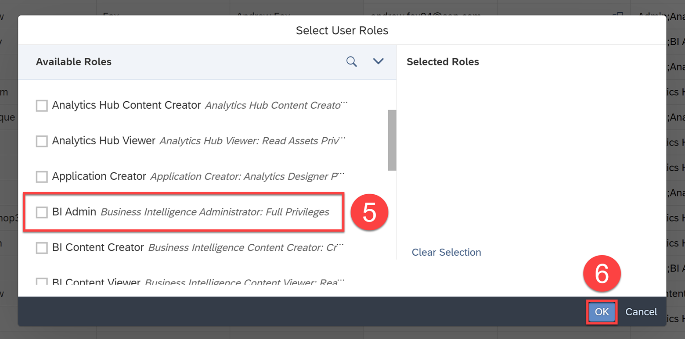
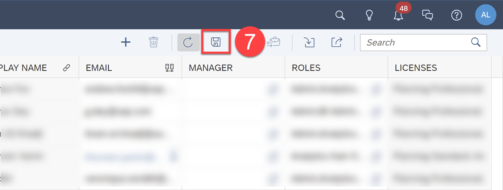
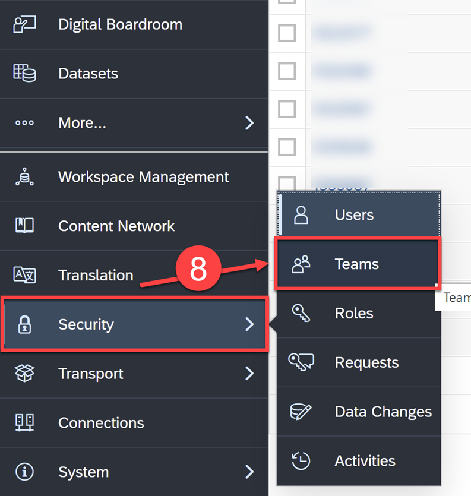
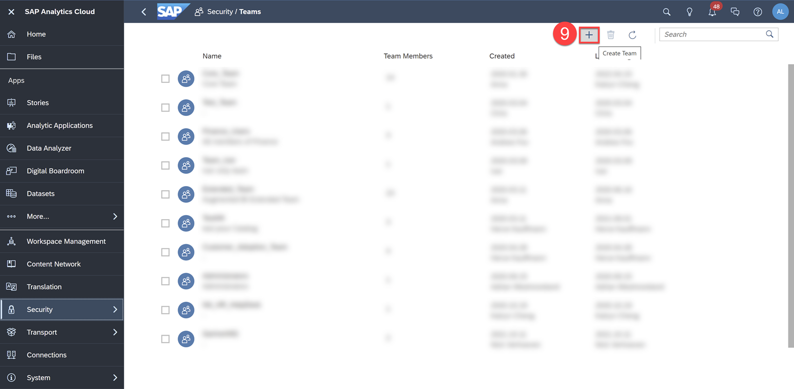
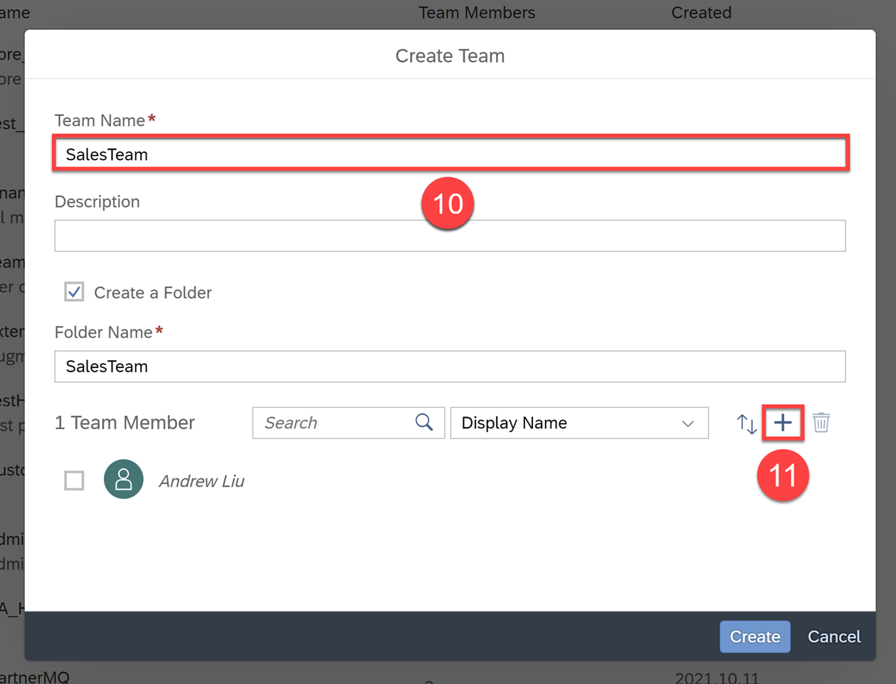
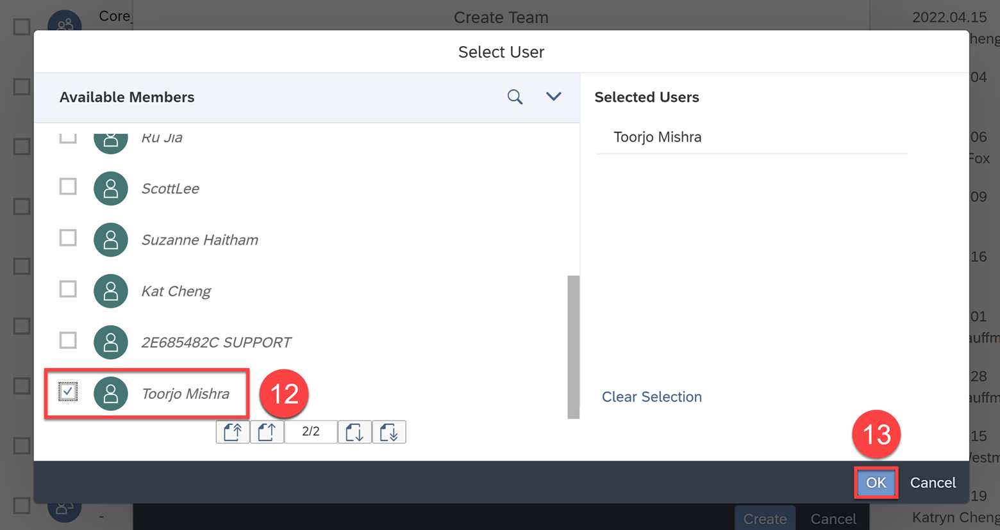
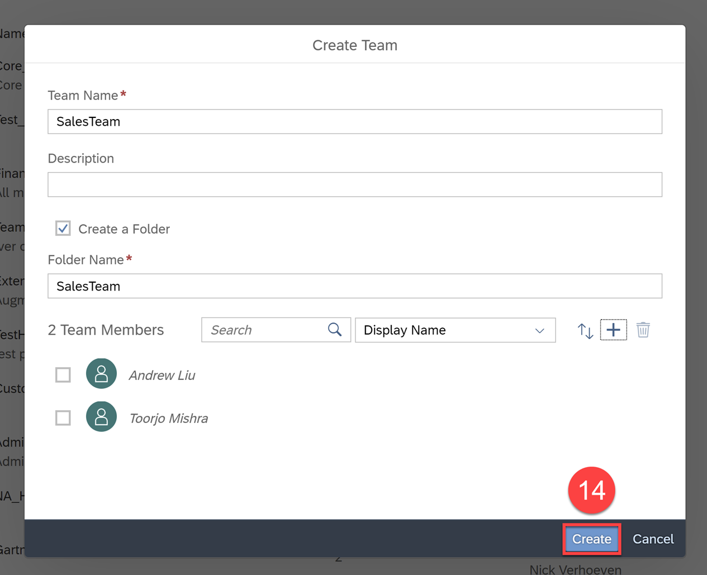

# Manage Users, Roles, and Teams
<!-- description --> Create a new user and assign the new user to a role and team

## You will learn
  - How to create a new user
  - How to assign a user to a role
  - How to create a team and assign users to the team

## Intro
The first action you want to do after logging in and setting up your tenant is to create a second admin user. This is because you want to ensure that there is a safety net in place, in case one of you are unavailable, the other will still be able to access all of the admin level privileges.

---

### Create a new User

Let's create a new user and assign the admin role to that user.

**1.** In the side navigation bar, select **Security > Users**

**2.** Click the **+** icon to add a new user

A new row will be created for you to input the user ID, first name, last name, display name, and email fields with the information of your team member. The User ID field is just a unique identifier for the user within the tenant, so we'll make it the sample person's name for consistency's sake. Finally, the new user needs to be assigned the BI Admin role.

**3.** Input the fields to add a new user (add your own team member here)

**4.** From the **ROLES** column, click the pop-up icon to open the role selection window

**5.** Select the `BI_Admin` role  

**6.** Click **OK**

**7.** Click the **Save** icon. This is an important step and the new user won't be created until it is saved.

> The user must have a valid email and will receive an activation link to be able to access the SAP Analytics Cloud tenant.

Click [here](https://help.sap.com/docs/SAP_ANALYTICS_CLOUD/00f68c2e08b941f081002fd3691d86a7/b385d1af93444e9fbc6439d2c6b3c1a7.html) to learn more.

### Create a Team

The next thing after creating users will be to create teams. Teams are groups of users that may collaborate on the same stories and share access to folders or objects in SAP Analytics Cloud.

**8.** In the Side Navigation bar, click **Security > Teams**

**9.** Click the **+** icon to create a new team

**10.**	Input `SalesTeam` as the Team Name (or another team within your company)

**11.**	Click the **+** icon to add members to this team

**12.**	Select the newly added User, in this case, it would be `Toorjo Mishra`

**13.**	Click **OK**

> Select **Create a Folder** to add a folder for team files under the **System** folder.

**14.**	Click **Create** to finish creating the team

Click [here](https://help.sap.com/docs/SAP_ANALYTICS_CLOUD/00f68c2e08b941f081002fd3691d86a7/77eaf049d6dd4b79965981117eedd905.html) to learn more.

Now that you have set up your tenant, added users, and created teams, you can start building content! But before you build any content, you must add Data to SAP Analytics Cloud. We will tackle this in the next tutorial.

### Test Yourself

---
