# Manage Data Connections in SAP Analytics Cloud
<!-- description --> Import, wrangle, and model your dataset

## Prerequisites
 - Download this [sample dataset](https://d.dam.sap.com/a/fAJmXck?rc=10) that details the products, sales, and Geo codes for a fashion retail store.

## You will learn
  - How to import and wrangle a dataset
  - How to geo enrich and create hierarchies in a dataset

## Intro
Connecting to your data is the first step in getting a clear picture of your enterprise; resulting in streamlined processes and data driven decision making.

There are two types of data connections: [live data](https://help.sap.com/docs/SAP_ANALYTICS_CLOUD/00f68c2e08b941f081002fd3691d86a7/5b4dad4d97664c41ae63bf1153e5e91e.html) and [import data](https://help.sap.com/docs/SAP_ANALYTICS_CLOUD/00f68c2e08b941f081002fd3691d86a7/5339a2395ccd4befb047c625a15f8481.html) connections.

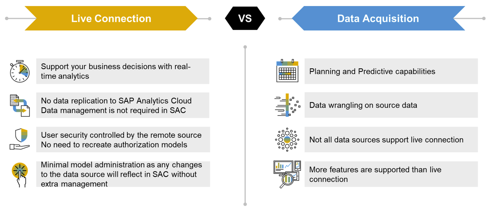

Click [here](https://d.dam.sap.com/a/aEBKQNd/SAP_BTP-SAC_Connectivity_Customer_02-11.pdf) to learn more.

---

### Create a Model

Data modelling in SAP Analytics Cloud is a way to enhance your data and prepare it for analysis. You can bulk edit your data, define categories, set hierarchical relationships, and create custom formulas.  

In this tutorial, you will create a model from an imported dataset and prepare the model for story creation.

**1.** In the side navigation bar, select **Modeler**

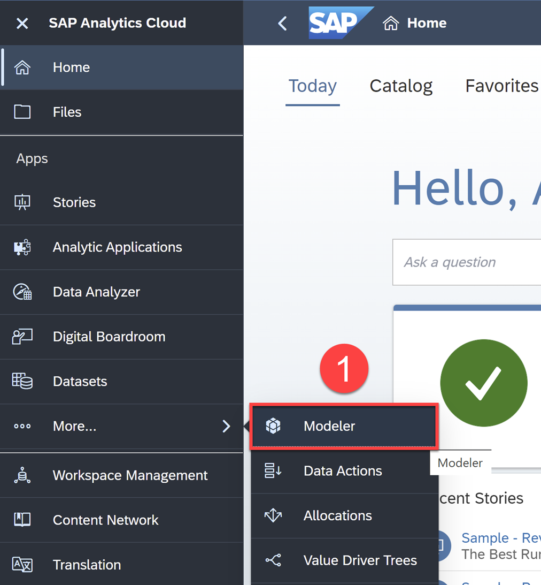

**2.** Select the option **From a CSV** or **Excel File**

 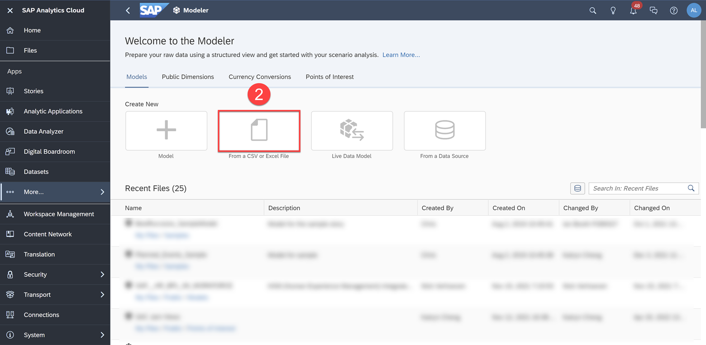

 **3.**	Select the downloaded dataset from the prerequisites section above as the source file

 **4.**	Click **Import**

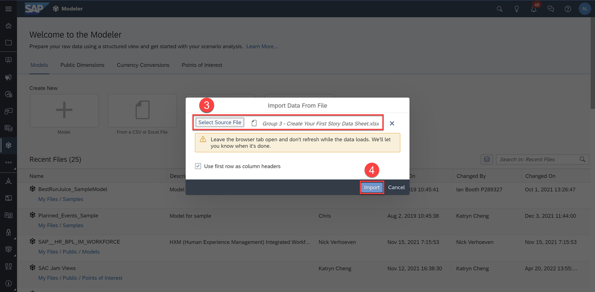

### Explore the Model

Once you open the model, you'll see a message saying that the data uploaded is too big, and a sample model with 2000 rows has been created.

> Any work done on the sample data will be applied to the full data during model creation.

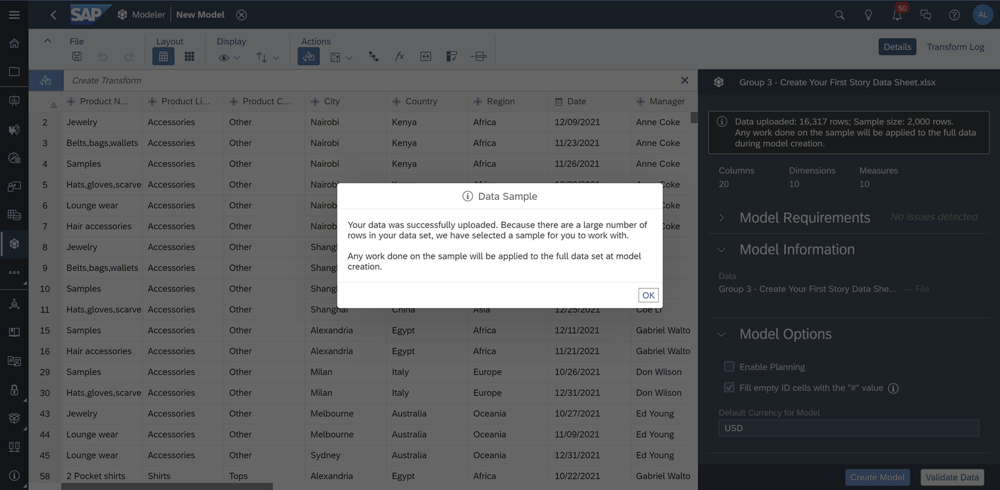

Models are the foundation for which stories and presentations are built. It's here where you prepare your data for analysis by wrangling, defining your measures and dimensions, and enhancing your data.

On the Dataset Overview panel on the right, you will see that the measures and dimensions are automatically identified from the imported dataset. SAP Analytics Cloud automatically identifies whether a column is a measure or a dimension. However, it is always good practice to review the data to ensure the measures and dimensions are correctly identified.

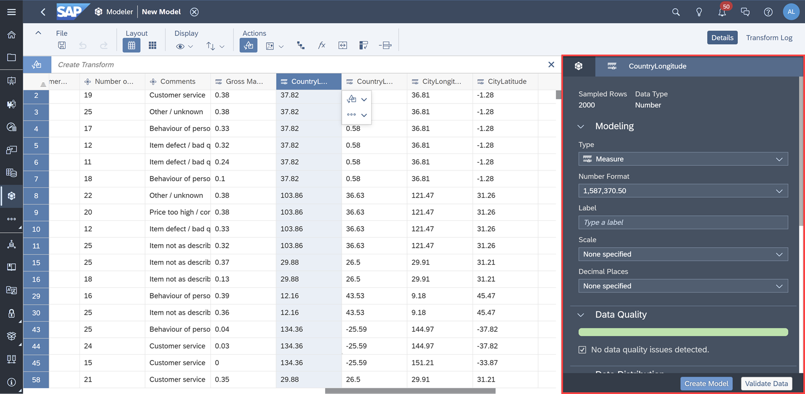

### Geo Enrich the Model

To be able to visualize the latitude and longitude data in the model, you must first adjust them from measures to dimensions, and geo enrich the coordinates so that SAP Analytics Cloud can process the information.

**5.** Select the `CountryLongitude` column and switch the Type from Measure to a **Generic** Dimension

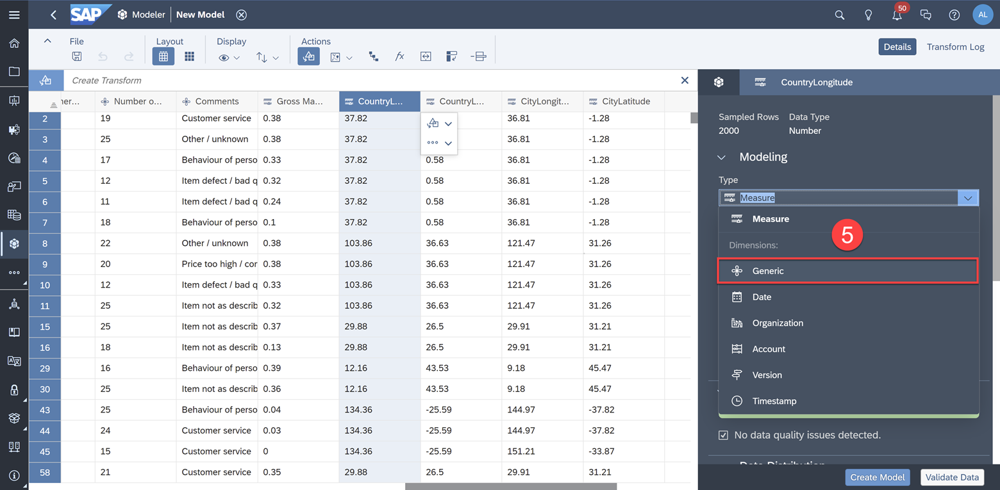

**6.** Do the same for `CountryLatitude`, `CityLongitude`, and `CityLatitude`

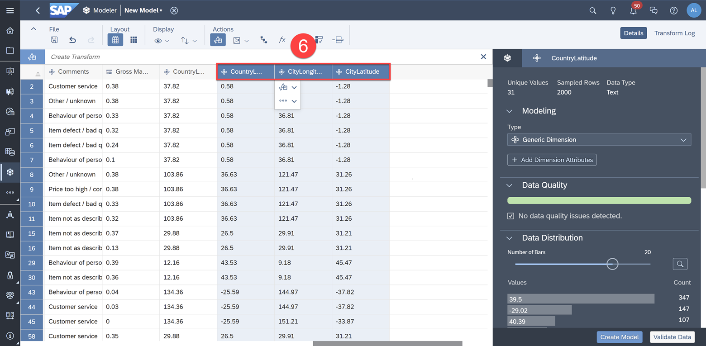

Now that the coordinates are dimensions, we can [geo enrich](https://help.sap.com/viewer/00f68c2e08b941f081002fd3691d86a7/release/en-US/b396a6eb42e3491aac1791e2d10de68f.html) them. Geo enriching is the process of turning raw coordinate data into identifiable geographies so that SAP Analytics Cloud can visualize the data in a geo map.

Let's enrich and turn the Country and City coordinates into location dimensions.

**7.** Select the `CountryLongitude` column then click the **Geo Enrich By** icon > **Coordinates**

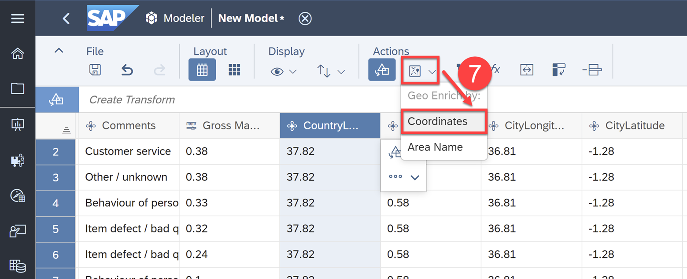

**8.** Change the Dimension Name to `Country_Location`

**9.** Select ``CountryLatitude`` as the Latitude and `CountryLongitude` as the Longitude

**10.** Click **Create**

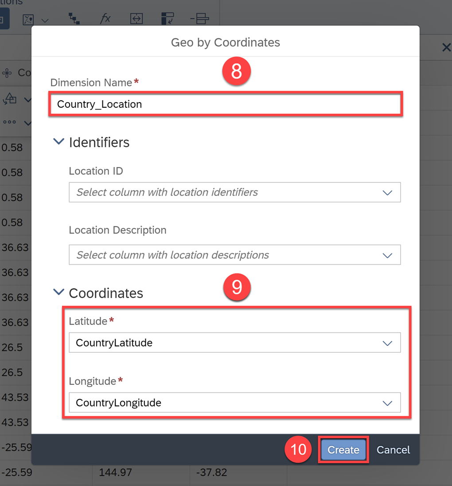

After enriching the Country coordinate, you will see a new column added with both the Country Longitude and Latitude as one dimension.

**11.**	Repeat the same process for the City coordinates and call the Dimension name `City_Location`

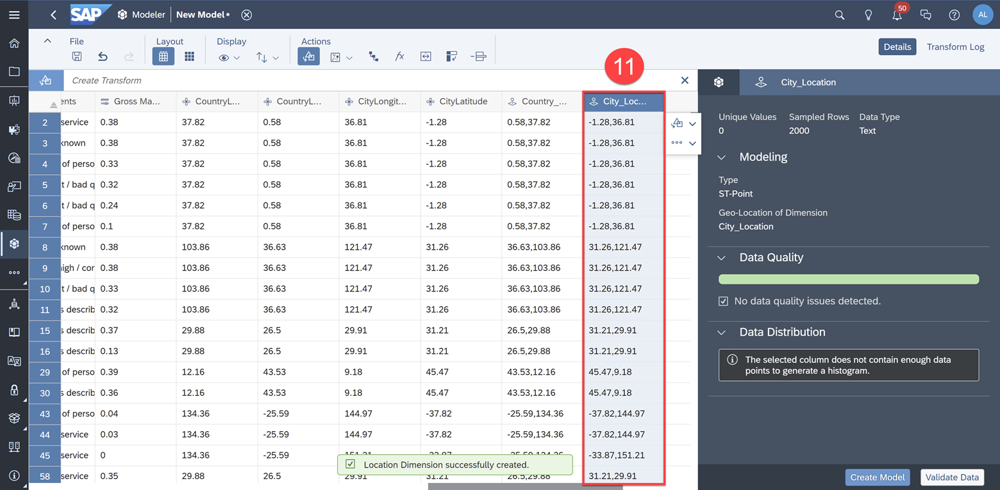

Lastly, let's create a product hierarchy to enable users to drill up and down between product categories within the data.

**12.** In the toolbar, select the **Hierarchy Builder** icon

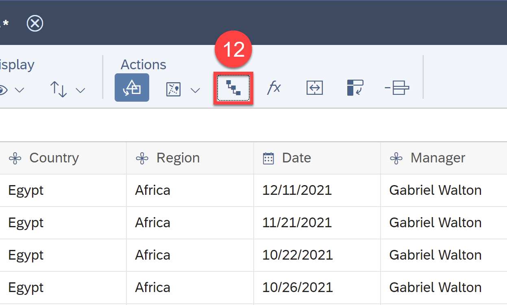

**13.**	Input `Product_Hierarchy` as the Hierarchy Name

**14.**	In the Hierarchy Builder, select **Product Category** as the first level, **Product Line** as the second, and **Product Name** as the third

**15.**	Click **OK**

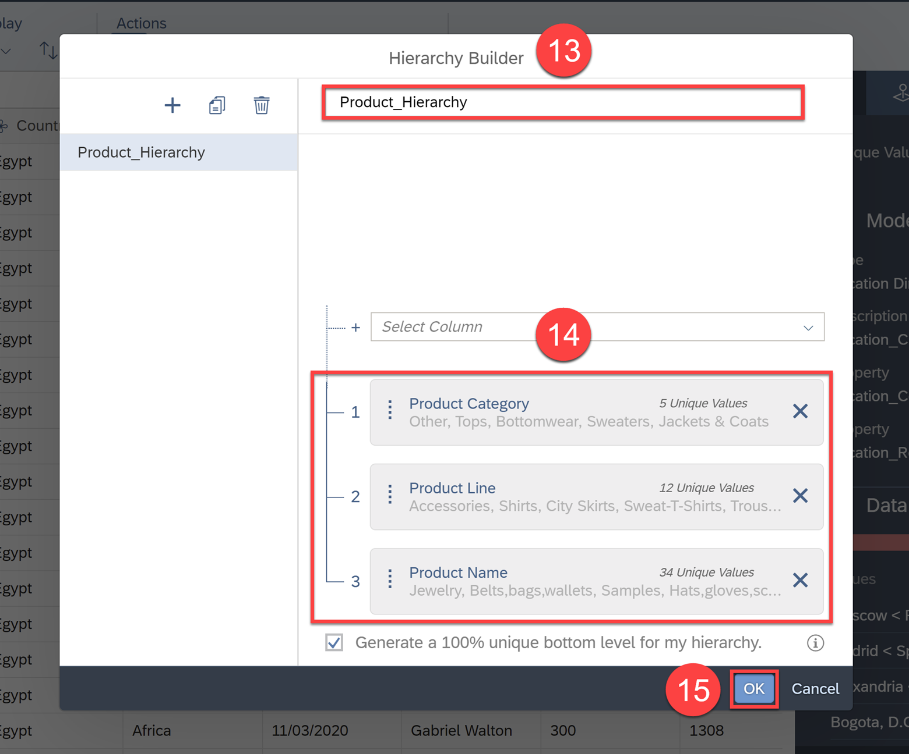

SAP Analytics Cloud then recognizes this hierarchy and allows you to drill up and down between Product Categories, Product Lines, and Product Names within charts.

Click here to learn more.

Now, the model is ready to be created.

**16.**	Click **Create Model**

**17.**	Click **Create**

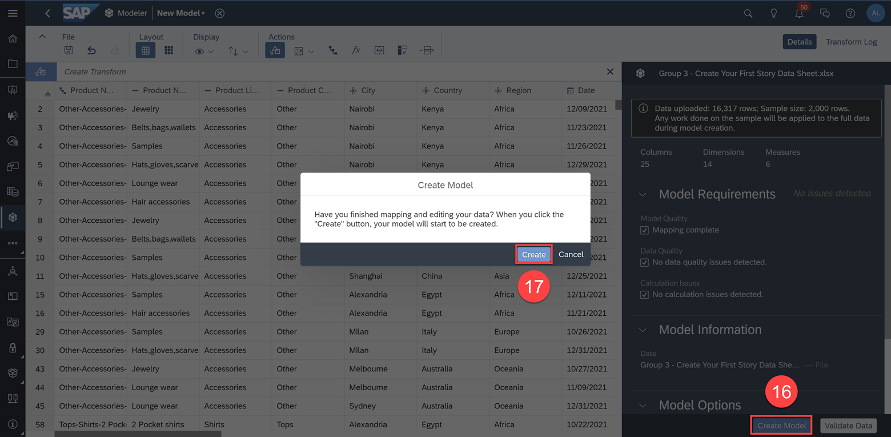

**18.**	Save the model in a location of your choice and name the model "Manage Data Connections Tutorial – Model"

**19.**	Click **OK** to save the model

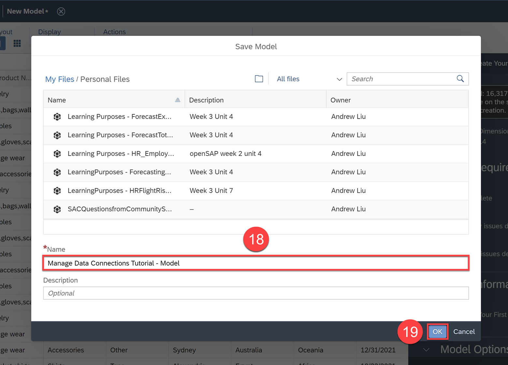

### Create a Story

Stories are where your data comes to life with powerful data visualizations. Charts, graphs, tables, and other visual elements are arranged to tell the story of your business or organization and help you discover insights hidden within your data.

To create a story from the model you just created, follow the [Create your First Story](group.create-first-sac-story) tutorial group.

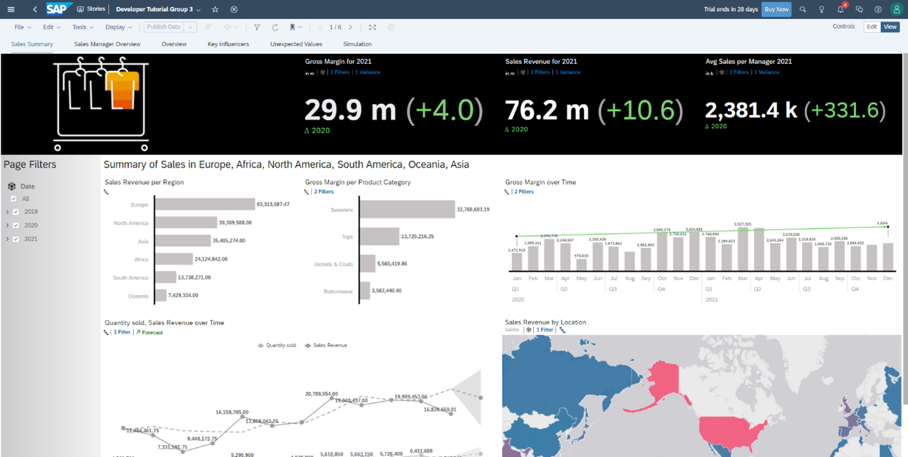

> Since you've already created a model in this tutorial, you can select your model as a data source when creating your story in the Create your First Story tutorial group.

### Test Yourself

---
