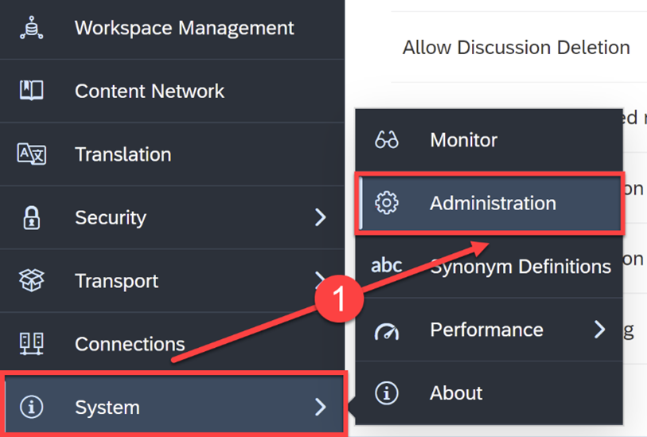
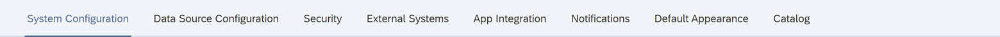
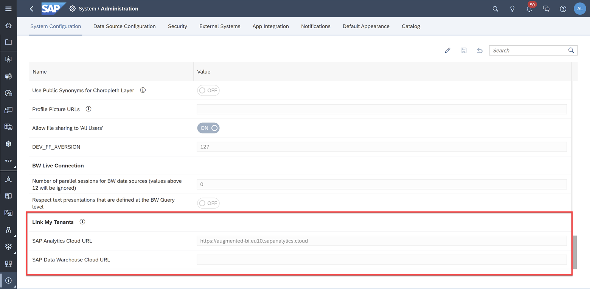
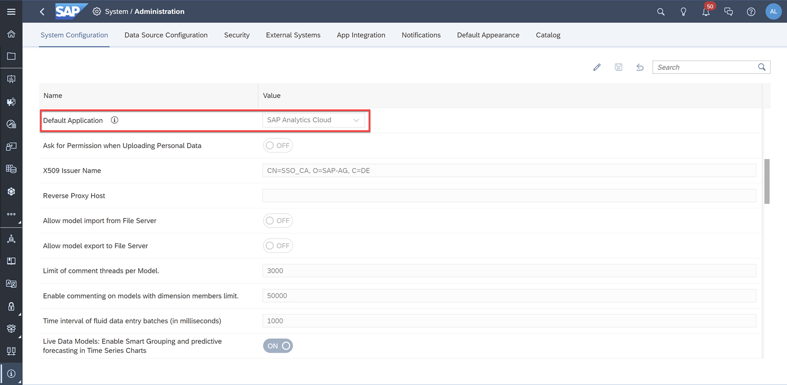
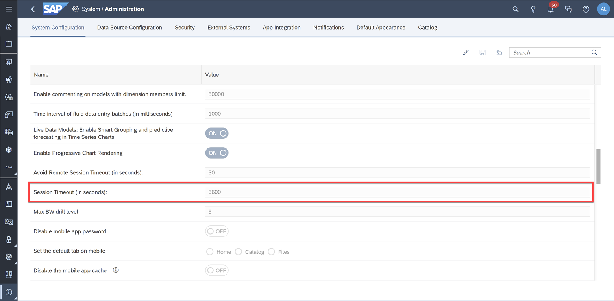
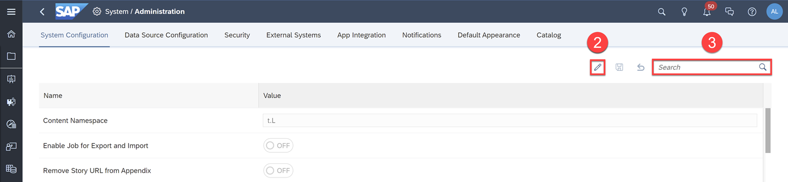
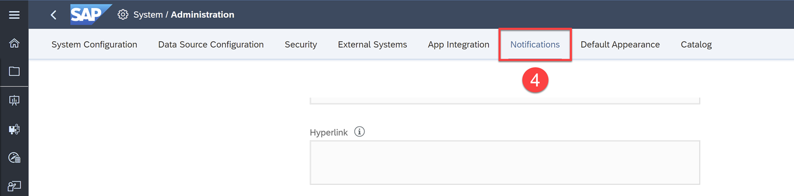
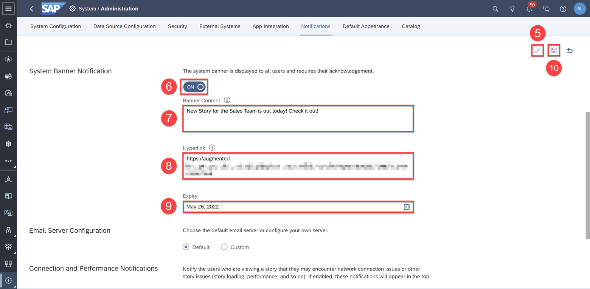

# Manage Product Features
<!-- description --> Get an overview of the different system administration features available in SAP Analytics Cloud

## You will learn
  - The different administration features to enhance your system's experience
  - How to configure your system's settings
  - How to customize the system notification banner

## Intro
After you've set up your tenant, added users, imported data connections, and created stories, you should centrally customize and optimize elements of your system's features to enhance your system's experience for your users. In this tutorial, we'll go over these product features.

---

### System Administration Overview

In SAP Analytics Cloud, system administration features are provided to set general parameters for the application and to set up connectivity to external systems that interface with SAP Analytics Cloud.

**1.** In the side navigation panel, select **System** > **Administration**

Within System Administration, there are 8 features available for configuring and managing your tenant.

|  Feature                       | Description
|  :-------------                | :-------------
|  System Configuration          | Centrally customize and optimize default elements of your system's experience for your users
|  Data Source Configuration     | Manage information needed to connect to remote systems
|  Security                      | Configure authentication methods used by SAP Analytics Cloud such as SAP Cloud Identity or SAML Single Sign-On
|  External Systems              | Configure Connection settings to an external R environment
|  App Integration               | Manage third-party application access by using OAuth clients and trusted identity providers
|  Notifications                 | Choose the users you want to deliver system event notifications to
|  Default Appearance            | Customize the default homepage logo and background color for all users
|  Catalog                       | Configure settings to view published content in one central location

### Configure your System

Within the System Configuration tab, you can centrally customize and optimize elements of your system's features. Let's go over a few of these functionalities and backend administration customizations.

### Link My Tenants

This setting allows to you connect to and link an SAP Data Warehouse Cloud tenant to your SAP Analytics Cloud tenant. Once configured, your users can then quickly navigate between the two tenants using the **Product Switch** menu in the top shell bar.

### Default Application

This setting sets the landing page displayed when users access the SAP Analytics Cloud URL. By default, this is set to SAP Analytics Cloud.

> Changes will take effect within 8 hours. This default only applies to users who have not yet set their own default application.

### Session Timeout (in seconds)

This setting allows you to set the amount of time before a user session expires if the user doesn't interact with the system. The minimum value is 300 seconds, and the maximum value is 43200 seconds. By default, the session timeout is set to **3600** seconds (1 hour).

To change these settings, simply:

**2.** Click the **Edit** icon  

**3.** Search for the setting you want to configure in the search box

Click [here](https://help.sap.com/docs/SAP_ANALYTICS_CLOUD/00f68c2e08b941f081002fd3691d86a7/ca67817bec1c4f6582126d5d9dab68bb.html?state=DRAFT) to learn more.

### Customize the System Notification Banner

You can use the system notification banner to send custom banner messages to your SAP Analytics Cloud users. A custom banner message can be any message that you want your users to see and acknowledge.

**4.** Click the **Notifications** tab

A good example of using the system notification banner would be to communicate the roll out of a new story or model, or updates to existing analytics content that you want to raise awareness to your end users.

**5.** Click the **Edit** icon

**6.** Click the **OFF** toggle and change it to **ON**

**7** Write your banner message in the **Banner Content** field (140 characters limit)

**8.** Optionally, include a hyperlink for users to click on in the banner

**9.** Select an expiry date

**10.** Click the **Save** icon to commit your changes

Once the custom banner has been created, all users will be able to see the banner message at the top of their page when they sign into your tenant. Below is an example of a custom banner:

<!-- Click [here](https://help.sap.com/docs/SAP_ANALYTICS_CLOUD/00f68c2e08b941f081002fd3691d86a7/c6043109a6b8494a81a47abf275b3fce.html?state=DRAFT) to learn more.

Here are more resources for the other administrative features offered within System settings:

- [Customize the Default Appearance of the Interface](https://help.sap.com/docs/SAP_ANALYTICS_CLOUD/00f68c2e08b941f081002fd3691d86a7/90c7a11d17b14859b61d1b991b17e911.html?state=DRAFT)

- [Manage OAuth Clients](https://help.sap.com/docs/SAP_ANALYTICS_CLOUD/00f68c2e08b941f081002fd3691d86a7/4f43b54398fc4acaa5efa32badfe3df6.html?state=DRAFT)

- [Connect to an R Environment](https://help.sap.com/docs/SAP_ANALYTICS_CLOUD/00f68c2e08b941f081002fd3691d86a7/da0970e27ed44ebb8f684d1f1b0002ca.html?state=DRAFT)

- [Configure Custom SMTP Server](https://help.sap.com/docs/SAP_ANALYTICS_CLOUD/00f68c2e08b941f081002fd3691d86a7/12cb1ee8d84f4e32b7f60a728002706e.html?state=DRAFT)

- [Notify All Users about Network Connection Issues](https://help.sap.com/docs/SAP_ANALYTICS_CLOUD/00f68c2e08b941f081002fd3691d86a7/06924756f3fa42ce9020f47e8d2f0111.html?state=DRAFT) -->

### Test Yourself

---
